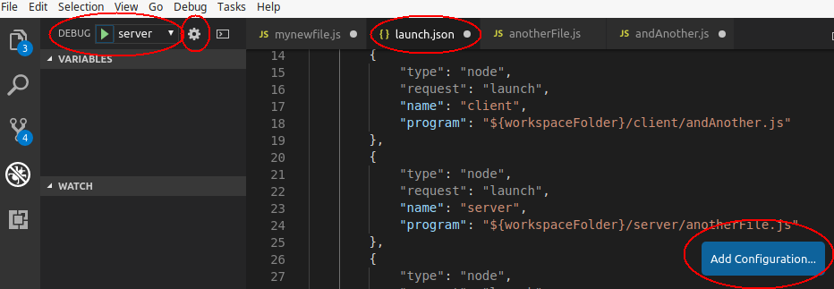

# TODO!! How to use VSC

The project is conducted in pairs of students. Here we provide an overview of how VSC can help you to efficiently work in pairs. It is beyond the scope of this course to introduce `git` (a very popular and today's standard version control system to file changes) in detail. Instead, we restrict ourselves to describe how you can use the functionality of `git` from within VSC.

In the last part, you find information on how to make use of VSC's debugging functionalities.

_Note: this information is provided to help you work in pairs efficiently during the project. This is not exam material (i.e. we will not ask you questions about `git` or VSC or debugging.)_


## Synchronization in VSC with Git and Github

### Git
`git` is a version control system, so it records the changes made to a file or a set of files in a repository. This is specially useful when several people is working on the same files, as you can see who made those changes, revert them to a previous state, compare changes, or decide what to do in case of conflict (e.g. two people modifies the same piece of code).

Version control systems can be centralized, with the repository located in single server, or distributed like `git`, where every collaborator has a local copy of the repository with the whole history of changes. 

You can download and install git from [here](https://git-scm.com/downloads). Then you can run `git` commands directly from the terminal, or you can use VSC to run the `git` commands on your project.

In any case you need to install `git` (at least version 2.0.0) and then configure it by providing a user name and an email by executing the following commands from the terminal:

```
git config --global user.name "myUserName"
git config --global user.email "myEmail"
```

### GitHub
GitHub is a web-based hosting service for git repositories. That way collaborators can push and pull changes to the repository located at Github, and synchronize it with their local copies.

In order to work with GitHub first all the members of a group must create an account at [Github](https://github.com) if you don't have one already. Then one of you will create a new repository for the project by clicking on 'New repository'. It can be public, so everyone can see it, or private, so you can share it only with your partners.

Now you can add your partners to the repository, so all of you can work together. To that end just go to the main page of the new repository and click the tab 'Settings': 
 
<p align="center">
  
</p><br>

Then you will see a menu at the left, click on 'Collaborators' and add your partners.


### All together in VSC

You can clone the remote Github repository from VSC following [these instructions](https://code.visualstudio.com/docs/editor/versioncontrol#_cloning-a-repository).

_Note: after adding the URL of the remote repository and after indicating the folder where the local repository will be created, you will be asked for the Github user name and password in the Command Palette, at the top of the screen._

When you edit your project, the icon 'Source Project' at the left will indicate the number of files modified. You can record a set of changes in the local repository by clicking on "Commit All". Remember to add a meaningful message so it can be useful to follow the status of the project. You can see how to use other git commands [here](https://git-scm.com/docs).

<p align="center">
  
</p><br>

Once your changes are registered in local, you can synchronize with the remote repository. In order to do that, just click in the synchronization icon at the bottom of the page, as shown in the figure below. You will be asked again for the Github user name and password in the "Command Palette" at the top of the window. You will be notified if there are conflicts so you can see them and take the appropriate decisions. 

<p align="center">
  
</p><br>

_Note: if you don't have previous experience with git, it is recommended that you keep a backup of the project, specially when there are synchronization conflicts._

## Synchronization in VSC with Live Share functionality

Alternatively, for small projects where you may not need to track changes, you can effectively work together as a team remotely with the VS Live Share extension. 

<p align="center">
  
</p><br> 

After installing the extension in VSC from the "Extensions" window, reload it and you will see a "share" icon at the bottom. The first time you click on it you will be asked to sign in to VSC with Microsoft or Github, so others can be sure about who you are when you share or join shared sessions.

<p align="center">
  
</p><br> 

After signing in, you will see in your VSC the URL you can send to your project partners. Once a partner clicks the link, her local instance of VSC will open displaying the project shared. Host and partners can then edit the files and see any changes made by their partners in real time. You can even debug collaboratively: when the host starts debugging, partners can not only see the debugging window, but they can also use debugging options (step into, step over, add breakpoints, write expressions to evaluate, etc.). 

**Bear in mind that only the project own by the host is actually modified. That also means that once the host closes the VSC (or the collaborative session), their partners can no longer collaborate until it is open again.**


You can find [here](https://marketplace.visualstudio.com/items?itemName=MS-vsliveshare.vsliveshare) more information about VS Live Share.

## Debugging node.js scripts in VSC

Using the debugging functionalities in VSC is easy and they will help you find bugs in the code. You can go to the debugging window just by clicking in the "Debug" icon in the menu located at the left. From this window you can run the code in debug mode by clicking on the play button at the top.

The execution will stop at each breakpoint you have defined. Once the execution stops, in the column at the left you will be able to watch the values of the variables, the values of expressions you define, and the call stack. From here you can continue or execute the next lines of code step by step (see the options in the floating tool menu that appeared at the top-center, or click on the menu "Debug" at the top: Step Over, Step Into, etc.). 

You can define inline breakpoints by clicking F9 in the lines of code, or by clicking on the left of the line. In both cases you will see a red point indicating the breakpoint. You can also define breakpoints from the menu "Debug" by clicking on "New Breakpoint". In that case you can create Logpoints, where a message is displayed in the debug console when the execution reaches that point, and Conditional Breakpoints, where the execution will stop after a number of hits, or when an expression is true.

<p align="center">
  
</p><br> 

You can see more information about debugging in VSC [here](https://code.visualstudio.com/docs/editor/debugging).

### Multiple Entry Points

You can configure the debugger to start the execution in different files, for example those corresponding to the server side and those corresponding to the client side. In order to do so, click the configuration icon at the top to display the configuration file (`launch.json`). Click on "Add configuration", select "Launch Program" and write the name of the new configuration (property "name") and the file to be executed (property "program"). Now you can select the specific configuration before starting debugging.

<p align="center">
  
</p><br> 

You can debug easily the app by debugging in VSC the client side, while debugging in the browser (see Web Developer::Web Console in Firefox, or More Tools::Developer Tools in Chrome) the client side.

