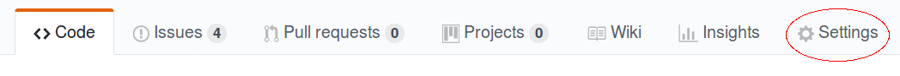
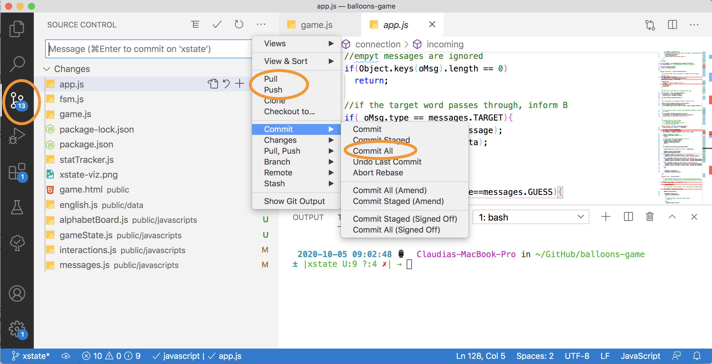
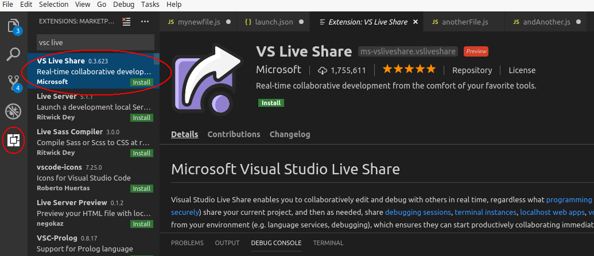
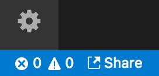
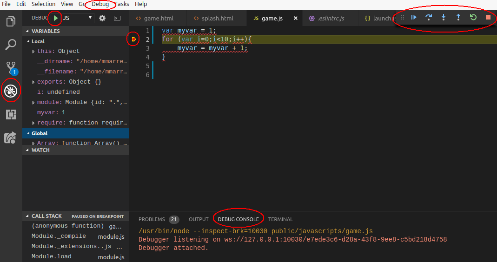

Table of Contents
==

- [How to use VSC](#how-to-use-vsc)
    - [Collaborating via Git+GitHub](#collaborating-via-gitgithub)
        - [Git](#git)
        - [GitHub](#github)
        - [Local vs. remote repository](#local-vs-remote-repository)
        - [VSC ...](#vsc)
    - [Live Share](#live-share)
    - [Debugging Node.js scripts](#debugging-nodejs-scripts)

# How to use VSC

The project is conducted in pairs of students. Here we provide an overview of how VSC can help you to work **efficiently** in pairs. You have two options:

- You familiarize yourself with the basics of `git`, a very popular and today's standard version control system to file changes. The source code resides in a public or private code repository hosted on GitHub or another platform. VSC supports `git` and you can collaboratively code within VSC. Advantage: `git` is used by most developers today, it is a a tool/protocol that you will need to learn at some point (later courses go into much more detail). Disadvantage: if something goes wrong (e.g. a *merge conflict* occurs) you need to know a few details in order to get back on track or get help from our TAs.
- You use VSC's new Live Share capability: the source code resides on a single machine and both team members can collaboratively work in the same shared code session in real-time. Advantage: easy, no knowledge of source control mechanisms is required. Disadvantage: the code resides on a local machine, there is no backup in the cloud (although that can be done separately of course).

_Note: this information is provided to help you work in pairs efficiently during the web assignments. This is not exam material (i.e. we will not ask you questions about `git`, Live Share, VSC or debugging.)_

We now introduce both options and finish the tutorial with a quick look at VSC's debugging abilities.

## Collaborating via Git+GitHub

### Git

`git` is a version control system created by [Linus Torvalds in 2005](https://www.linuxfoundation.org/blog/2015/04/10-years-of-git-an-interview-with-git-creator-linus-torvalds/), originally intended for the Linux kernel community. It has now become the de-facto standard for distributed version control. It records the changes made to a file or a set of files in a **repository** (a specific storage location). This is particularly useful when several people are working on the same code: you can see who made what changes, revert the changes back to a previous state, compare changes, or decide what to do in case of conflict (e.g. the same piece of code was modified concurrently by different people).

Version control systems can be centralized, with the repository located on single server, or distributed like `git`, where every collaborator has a local copy of the repository with the whole history of changes.

You can download and install git from [here](https://git-scm.com/downloads). Then you can run `git` commands directly from the terminal (you probably do **not** want to do this, if you have never used `git` before), or you can use VSC to run the `git` commands on your behalf.

In any case you need to install `git` (at least version 2.0.0) and then configure it by providing a user name and an email by executing the following commands onthe terminal:

```console
git config --global user.name myUserName
git config --global user.email myEmail
```

### GitHub

[GitHub](https://github.com/) is a web-based hosting service for `git` repositories. That way collaborators can push and pull changes to the repository located at GitHub, and synchronize it with their local copies.

In order to work with GitHub, all group members must have a [GitHub account](https://github.com) - if you do not yet have one, create one. One project member will then create a new repository for the project by clicking on 'New repository'. It can be public, so everyone can see it (but only if they know the repository name), or private, where you control who can see and access it.

Now you can add your partners to the repository, so all of you can work together. To that end just go to the main page of the new repository and click the tab *Settings*:



The menu that appears on the left has an entry *Collaborators*: click on it and add your partners.

### Local vs. remote repository

The repository created on GitHub is considered as the **remote repository** - all team members contribute code to this remote repository. Every team member also has a **local repository**, the repository residing on a team member's physical machine. When a team member makes code changes, these are first recorded in the **local repository** and then in a second step recorded in the **remote repository**.

### VSC ...

You can clone the GitHub repository from VSC following [these instructions](https://code.visualstudio.com/docs/editor/versioncontrol#_cloning-a-repository).

_Note: after adding the URL of the remote repository and after indicating the folder where the local repository will be created, you will be asked for the GitHub user name and password in the Command Palette, at the top of the screen._

When you edit your project, the icon *Source Project* at the left will indicate the number of files modified. You can record a set of changes in your local repository by clicking on *Commit All*. Remember to add a meaningful message so it can be useful to follow the status of the project. You can see how to use other git commands [here](https://git-scm.com/docs).



Once your changes are registered in your local repository, you synchronize with the remote repository, so that your changes make it to the shared repository on GitHub. In order to do that, just click in the synchronization icon at the bottom of the page, as shown in the figure below. You will be asked again for the GitHub user name and password in the *Command Palette* at the top of the window. You will be notified if there are conflicts so you can see them and take the appropriate decisions.


If you want to give this setup a try, we suggest you start setting things up early and get help from the TAs if you get stuck. All TAs are familiar with `git`, GitHub and VSC!

## Live Share

If you do not yet care about `git`, use the Live Share option instead. For small projects (like the one in this class) where you may not need to track changes, you can effectively work together as a team with the VS Live Share extension.



After installing the extension in VSC from the *Extensions* window, reload it and you will see a *share* icon at the bottom. The first time you click on it you will be asked to sign in to VSC with Microsoft or GitHub, so others can be sure about who you are when you share or join shared sessions.



After signing in, you will see in your VSC the URL you can send to your project partners. Once a partner clicks the link, her local instance of VSC will display the shared project. Host and partners can then edit the files and see any changes made by their partners in real time. You can even debug collaboratively: when the host starts debugging, partners can not only see the debugging window, but they can also use debugging options (step into, step over, add breakpoints, write expressions to evaluate, etc.).

**Bear in mind that only the project owned by the host is actually modified. That also means that once the host closes VSC (or the collaborative session), their partners can no longer collaborate until it is open again. It also means that the non-hosting partner has no access to the code, unless it is shared via another channel.**

You can find [here](https://marketplace.visualstudio.com/items?itemName=MS-vsliveshare.vsliveshare) more information about VS Live Share.

## Debugging Node.js scripts

Using the debugging functionalities in VSC is easy and they will help you find bugs in your code. You can go to the debugging window by clicking in the *Debug* icon in the menu located at the left. From this window you can run the code in debug mode by clicking on the play button at the top.

The execution will stop at each breakpoint you have defined. Once the execution stops, in the column at the left you will be able to watch the values of the variables, the values of expressions you define, and the call stack. From here you can continue or execute the next lines of code step by step (see the options in the floating tool menu that appeared at the top-center, or click on the menu *Debug* at the top: Step Over, Step Into, etc.).

You can define inline breakpoints by clicking F9 in the lines of code, or by clicking to the left of the line. In both cases you will see a red point indicating the breakpoint. You can also define breakpoints from the menu *Debug* by clicking on *New Breakpoint*. In that case you can create Logpoints, where a message is displayed in the debug console when the execution reaches that point, and Conditional Breakpoints, where the execution will stop after a number of hits, or when an expression is true.



You can find more information about debugging in VSC [here](https://code.visualstudio.com/docs/editor/debugging).
