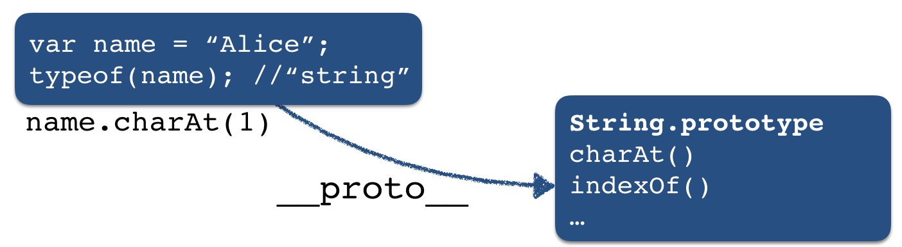

# JavaScript: the language of browser interactions

*This is the densest Web lecture of this course. Learning how to code takes time. Take a look at the [exercises](nodeschool-exercises.md) that are relevant for this lecture.*

Preview: in today's lecture we look at JavaScript as the language of browser interactions. In the next lecture we will look at node.js, a server-side JavaScript runtime. 

## Learning goals

- Employ JavaScript objects.
- Employ the principle of callbacks.
- Write interactive Web applications based on click, mouse and keystroke events.
- Explain and use `jQuery` (the library introduced in the course book).

## Take-aways of book chapter 4

If you have already read Chapter 4 of the course book, you should know:
- the basics of JavaScript, 
- how to include Javascript in your Web application, 
- how to declare variables and functions and so on.

You should have also learnt about `jQuery` - a cross-platform JavaScript library designed to simplify the client-side scripting of HTML. It provides a lower-level API to simplify working with the DOM across browsers. `jQuery` is still one of the most popular JavaScript libraries in use today (despite the rise of alternatives, newer frameworks that incorporate a lot of `jQuery` functionality), with more than half of the most trafficked Web sites in the world relying on a variant of `jQuery`. Its strength is its ability to simplify tedious tasks.

In this lecture we built upon chapter 4 and cover a number of important JavaScript design patterns.

## JavaScript's reputation

Until fairly recently JavaScript was considered more of a toy language. Today though, it is the most important language of the modern Web stack. On GitHub, one of the most popular social coding platforms world-wide, [JavaScript has taken the number 1 language spot in 2017](https://octoverse.github.com/). Over the past decade, the tooling, frameworks and libraries that have become available for JavaScript (browser built-in dev tools, build tools, testing frameworks, UI frameworks, ...) have vastly improved. In addition, the **JavaScript runtime environments** are highly efficient and a number of them co-exist: [V8](https://developers.google.com/v8/) is Google's JavaScript engine, [SpiderMonkey](https://developer.mozilla.org/en-US/docs/Mozilla/Projects/SpiderMonkey) is Mozilla's engine (used in Firefox) and [Chakra](https://github.com/Microsoft/ChakraCore) is Microsoft's JavaScript runtime.

JavaScript tracks ECMAScript, the scripting-language specification standardized by Ecma International. While JavaScript is the most popular implementation of the standard, other implementations (or dialects) exist as well, e.g. ActionScript.

JavaScript is a language in flux.

One of the confusing aspects about JavaScript today are the naming conventions, you may come across terms such as **ES6**, **ES7**, **ES2015**, **EcmaScript 2017**, etc. These names refer to different version of EcmaScript (ES for short) which is currently in continuous development. Most often, you are likely to encounter **ES6** (also referred to as **ES2015**) which added a host of new features to the standard required a long-standing effort: "the completion of the sixth edition is the culmination of a fifteen year effort" ([source](https://tc39.github.io/ecma262/)). Starting with **ES2016** (also known as **ES7**), ECMAScript is updated in a yearly cycle.

Similar to HTML5, after a number of years with hardly any development, we are currently in a phase of continous updates and changes.

In this course we do include very few **ES6** features, as we have only a few lectures to cover the material. If you want to dive into the depth of JavaScript, check out the free [You Don't Know JS](https://github.com/getify/You-Dont-Know-JS) series!

In this course we cover *plain JavaScript*, but it is also worthwhile to know that [MANY](https://github.com/jashkenas/coffeescript/wiki/list-of-languages-that-compile-to-js) languages compile into JavaScript.
The three most well-known of such languages are [CoffeeScript](https://coffeescript.org/), [TypeScript](https://www.typescriptlang.org/) and [Dart](https://www.dartlang.org/), all three fill one or more gaps of the original JavaScript language. Once you work on complex projects in collaboration, these higher-level languages can make a differences, especially when it comes to debugging.

Here is one example of what TypeScript (the 11th most popular language on GitHub as of [2017](https://octoverse.github.com/)) offers: JavaScript is a **dynamic languages**, this means that you have no way of enforcing a certain type on a variable. Instead, a variable can hold any type, a String, a Number, an Array ... but of course often you know what you want the type to be (for instance function parameters), so it is good to give this knowledge to the compiler to avoid errors. TypeScript (as the name suggests, TypeScript enables static type checking) allows you to do that, so you can catch errors early on!

## Scripting overview

### Server-side vs. client-side scripting

**Server-side scripting** refers to scripts that run on the **Web server** (in contrast to the client). Executing the scripts on the server means they are **private** and only the result of the script execution is returned to the client (usually an HTML document). The client thus has to trust the server. Server-side scripts can access **additional resources** (most often databases) and they can use **non-standard language features** (when you run a server you know which type of software runs on it and what type of language features it supports). At the same time, as all computations are conducted on the server, with many clients sending HTTP requests, this can quickly increase the server's load. As the client often only receives an HTML document as result of the computation, the app developer does not have to worry about clients' device capabilities - any modern browser can render HTML. 

**Client-side scripting** on the other hand does not return the result of a computation to the client, but instead sends the script (and if necessary the data) to the client which enables the user to dig through the code (and [this](https://twitter.com/atoker/status/796176641600974851) may happen). Having the clients execute the scripts **reduces the load on the Web server**, though all data necessary for the script (which could be megabytes of data) need to be downloaded and processed by the client. 

### `<script>`

The placement of the `<script>` tag is an often discussed issue (100+ upvotes for [this question](https://stackoverflow.com/questions/436411/where-should-i-put-script-tags-in-html-markup) on Stack Overflow ...). We go with the course book argument in this course:

*"We place the `<script>` tags in the `<body>` element: the browser displays the page in a **top-down fashion**, **creating the DOM elements as it comes across them**.
By placing the `<script>` tags at the end, the JavaScript files will be one of the last things the page loads. Because JavaScript files often take time to load, we do that last so that the user will get visual feedback from the other elements as fast as possible."* (p. 98)

Once more: interactivity based on the DOM should only start **after** the DOM has been fully loaded; if you decide to place your script's elsewhere, [`jQuery`'s `document.ready` function is your friend](http://learn.jquery.com/using-jquery-core/document-ready/).

### !Activity!

Based on chapter 4 of the course book, you should be able to answer the following two questions.

1. Executing this JavaScript code snippet yields what output?
```javascript
function giveMe(x){
    return function(y){ 
      return x*y;
    }
}
var giveMe5 = giveMe(5);

console.log( giveMe5(10) );
```

2. Executing this JavaScript code snippet yields what output?
```javascript
function toPrint(x){
    console.log(x);
}

function my_func(x,y){
    y(x);
}

my_func(5, toPrint);
```

## JavaScript design patterns

*"Design patterns are reusable solutions to commonly occurring problems in software design."* This quote is on the first page of Addy Osmani's [book on JavaScript design pattners](https://addyosmani.com/resources/essentialjsdesignpatterns/book/) (available under CC). A basic example of a reusable solution is one for object creation. Instead of everyone of us trying to figure out how to create objects, we use well-known recipes (a.k.a. design patterns) that were developed over time and apply them. 
There are many different design patterns, some are known to work across languages and some are specific to just a small subset of programming languages. What we cover in this lecture is mostly specific to JavaScript. Maybe also worth knowing that besides **design patterns**, there exist also **anti-patterns**, that are programming recipes which are popular but ineffictive at tackling a recurring problem.

### JavaScript objects

The Web course book focuses on what JavaScript to place where, it does not emphasise object principles. We do this here. One vital notion in JavaScript is the fact that **functions are first-class citizens** of the language. What does that mean? Well, it means that **functions can be passed as parameters**, they can be **returned from functions** and they can be **assigned to a variable**. 

The object-oriented programming paradigm is based on a set of cooperating objects (each one able to send/receive "messages" and process data) instead of a collections of functions or a set of commands. The goal of OOP is to assign every object a distinct role, in order to improve code maintainability.

In JavaScript, **functions are also objects**. Apart from functions, JavaScript also comes with a number of built-in objects: Strings, arrays and objects specific to the fact that JavaScript was developed to add interaction to HTML. One example is the `document` object, which only makes sense in the context of an HTML page. Note, that the `document` object is not part of core JavaScript (the language is defined independent of the browser context), however when we discuss client-side scripting we do mean JavaScript in the browser. The browser is the host application in this case and provides the `document` object.

In JavaScript objects can be created in different ways. This is very much unlike Java where where there is essentially only one: you have a class, write a constructor and then use  the `new` keyword to create an object. We will not consider all the manners of creating JavaScript objects here, you should remember though that there are different ways (especially when you look at other developers' code).

### Object creation with `new`

Let's start with the creation of objects. Here you see one way of creating objects in JavaScript:

```javascript
var game = new Object();
game["id"] = 1;
game["player1"] = "Alice";
game.player2 = "Bob";
console.log( game["player2"] ); //prints out "Bob"
console.log( game.player1 ); //prints out "Alice"

game["won lost"] = "1 12";

game.printID = function(){ 
    console.log( this.id ); 
}
game["printID"](); // prints out "1"
game.printID(); //prints out "1"
```
 We first create an empty object with the `new` notation that we can then assign name/value pairs. Here, `id`, `player` and so on are the object's **properties** and their name must be a valid JavaScript identifier (basically a string that does not start with a number). Note, that `printID` is also an object property, although it is often also referred to as a method (because we define a function here). As you see here, Javascript makes it easy to add methods, by assigning a function to the property of an object.

 Here you also see the use of `this` for the first time. You should be familiar with it from Java, this refers to the current object. Although ... as with many things in JavaScript, it is not quite as simple. If you take a look at the very successful [You Don't Know JS](https://github.com/getify/You-Dont-Know-JS) book series, you will find half a book dedicated to `this` in JavaScript. 
 
We have two ways to set and access an object's properties: either through the bracket notation (`[name]`) or the dot notation (`.name`). It usually does not matter which notation to use, the exception here being property names with whitespaces. Property names that contain whitespaces must be set and accessed through the bracket notation (as in the example above for `game["won lost"]`, the alternative `game.won lost` or `game."won lost"` will lead to a `SyntaxError`).

### Object literals

There is a second way to create objects and that is via **object literals**. An object literal is a list of zero or more pairs of property names and associated values of an object, enclosed in curly braces (`{}`).

```javascript
var game = {
    id: 1,
    player1: "Alice",
    player2: "Bob",
    "won lost": "1 12",
    printID: function(){
        console.log(this.id);
    }
};
```
This time, `"won lost"` is a valid property name, but only if enclosed in quotation marks. Instead of remembering when whitespaces are allowed, it is best to avoid them at all when assigning property names.

Object literals can be complex, they can contain objects themselves:

```javascript
var paramModule = {
    /* parameter literal */
    Param : {
        minGames: 1,
        maxGames: 100,
        maxGameLength: 30
    },
    printParams : function(){
        console.table(this.Param);
    }
};
```

The function `console.table` is an alternative for `console.log`, especially for objects and arrays, as it [displays tabular data as a table](https://developer.mozilla.org/en-US/docs/Web/API/Console/table). Although `console.log` is slowing loosely in popularity in its use (due to the ever improving browser developer tools available) it is still one of the most commonly used debugging techniques. Another worthwhile function to know about is [`console.assert`](https://developer.mozilla.org/en-US/docs/Web/API/console/assert) which prints an error if an assertion is false. If you have for instance a function that should always be called with a single argument that is a string, there is nothing you can do to enforce this - JavaScript is a dynamic language. However, if you know that any valid function call must have a single string argument, you can use assertions (one to check the number of arguments provided and one to check whether the argument is of type string) to - at least at runtime - observe the assertion failure in case the function is used in an unintended manner.

Back to object literals ... what happens if we need 1000 objects of this kind? What happens if a method needs to be added to all objects? Clearly, copy and paste is not the way to go.


### Design pattnern I: Basic constructor

First, let's quickly recap what classes in Java offer us:
- we can encapsulate private members, i.e. members of the class that are not accessible externally;
- we define constructors that define how to initialise a new object;
- we define methods (public, protected, private). 

Here is a **Java** example:
```java
public class Game {
    private int id; /* encapsulate private members */

    /* constructor: a special method to initialize a new object */
    public Game(int id){
        this.id = id; /* this: reference to the current object */
    }

    public int getID(){
        return this.id;
    }

    public void setID(int id){
        this.id = id;
    }
}
```

And here is how we do the same in JavaScript:

```javascript
function Game( id){
    this.id = id;

    this.getID = function(){ return this.id; };

    this.setID = function(id){ this.id = id; };
}
```

We use functions as **constructors** and rely on `this`. We rely on the keyword `new` to initialize a new object similar to what you hae already seen before:

```javascript
var g1 = new Game(1);
g1.getID();
g1.setID(2);

var g2 = new Game(3);
```

An object constructor in JavaScript is just a **normal function**. When the `new` keyword appears the JavaScript runtime executes two steps:
1. A new anonymous empty object is created and used as `this`.
2. The new object is **returned** at the end of the function.

A common error is to forget the `new` keyword. The JavaScript runtime will not alert you to this mistake, in fact, the JavaScript runtime will simply execute the function as-is. Let's take a look at what happens when you copy and paste the following code into your browser's [Web Console](https://developer.mozilla.org/en-US/docs/Tools/Web_Console) (the link points to Firefox's dev tools, feel free to use any major browser though):

```javascript
function Game( id){
    this.id = id;

    this.getID = function(){ return this.id; };

    this.setID = function(id){ this.id = id; };
}

var g1 = new Game("ONE"); //remember: dynamic language, we cannot enforce a parameter type
var id = g1.getID();
console.log(id); //prints out "ONE"
g1.setID(2);

var g2 = Game("TWO"); //what does "this" refer to now?
```

In this code snippet we created a new object assigned to variable `g1`, but for `g2` we forgot the keyword `new` and thus no object was created or assigned to `g2`. If you check what was assigned to `g2` you will find it to be `undefined` (the variable was declared but not defined). So, what happened to the line `this.id = id`? What did `this` refer to in this case? It turns out that without an object, in the browser context, `this` refers to the global `window` object (which represents the window in which the script is running). If you type `window.id` you will in fact find the property to exist and be `TWO`. Of course, this is not desired as you may accidentally overwrite important properties of the `window` object.

Lesson here: be sure to know when to use `new` and what `this` refers to when.

Another interesting feature of JavaScript is the possibility to add new properties and methods **on the fly**, after object creation. In Java, once we have written our class and instantiated objects from the class, we cannot rewrite the class blueprint to affect the already created objects. JavaScript is a **prototype-based language** and here we can actually change our objects on the fly.

Here is an example:

```javascript
function Game( id){
    this.id = id;

    this.getID = function(){ return this.id; };

    this.setID = function(id){ this.id = id; };
}

var g1 = new Game("1");
g1.player1 = "Alice";

var g2 = new Game("2");
g2.player1 = "Bob";

g1.printPlayer = function(){ console.log(this.player1); } //we add a method!
g1.printPlayer(); //prints out "Alice"

g2.printPlayer(); //TypeError: g2.printPlayer is not a function

g1.hasOwnProperty("printPlayer"); //true
g2.hasOwnProperty("printPlayer"); //false

g1.toString(); //"[object Object]" (we never defined it, but it is there)
```

The last line of this code snippet is also of interest: objects come with **default methods**, and so the natural question should be, where do these methods come from? The answer is **prototype chaining** .

Before looking at prototype-based constructors, here is a quick summary of the basic constructor:
- Advantage: very easy to use
- Issues:
    - Not obvious how to use **inheritance**;
    - Objects **do not share** functions (`g2` did not have a `printPlayer` method, but `g1` had);
    - All members are **public** and **any piece of code can be accessed/changed/deleted** (which makes for less than great code maintainability).

The latter point may not be very obvious, but imagine you are using a particular JavaScript library; if you are not aware of the library' internals, you may inadvertantly overwrite important parts of the code (without ever being informed about it, because that is not how the JavaScript runtime works). There must be something else out there, and there is indeed. Let's move on to the next design pattern.

### Design pattern 2: Prototype-based constructor

The key to understand JavaScript is to understand **prototype chaining**. Objects have a **secret pointer** to another object - the object's prototype. And thus, when creating for instance an object with a basic constructor as seen before, the properties of the constructor's prototype are also accessible in the new object. If a property is not defined in the object, the **prototype chain** is followed:



Here, `name.__proto__` points to the object that is next in the lookup chain to resolve property names. As always though, things are not quite as simple and over time JavaScript runtimes have evolved in their implementation of [__proto__](http://2ality.com/2015/09/proto-es6.html). Normally, it is not necessary to manually "walk up" the prototype chain, instead the JavaScript runtime does the work for you.

So, why is this important and how can you make use of this knowledge? Recall, that one of the issues in the basic constructor is that *objects do not share functions*. Clearly, often we want objects to share functions and if a function changes that change should be reflected in all objects that have this property/method.

This is what the prototype-based constructor provides. Let's first look at an example:

```javascript
function Game( id){
    this.id = id;
}

/* new member functions are defined once in the prototype */
Game.prototype.getID = function(){ return this.id; };
Game.prototype.setID = function(id){ this.id = id; };

//using it
var g1 = new Game("1");
g1.setID("2"); //works

var g2 = new Game("2");
g2.setID(3); //works

//what happens now?
g1["setID"] = function(id){
    console.assert(typeof(id)=="number", "Expecting a number");
    this.id = id;
}
```
All we have to do to make properties available to all objects is to use the `.prototype` property to walk up the prototype chain and assign a property to `Game.prototype`. 
When the two game objects are crated and `setID()` is called, the JavaScript runtime walks up the prototype chain and "finds" the **first** property that matches the desired property name.

This explanation should also answer the last question posed in the code snippet: what happens if a property is also defined as property of the object **as well as** as property of the prototype? The JavaScript runtime stops at the first part of the chain where the property is found and this means that `g1.setID` and `g2.setID` now refer to different pieces of code.

Changes made to the prototype are also reflected in existing objects:

```javascript
function Game( id){
    this.id = id;
}

/* new member functions are defined once in the prototype */
Game.prototype.getID = function(){ return this.id; };
Game.prototype.setID = function(id){ this.id = id; };

//using it
var g1 = new Game("1");
g1.setID("2"); //works
console.log( g1.getID() ); //prints out "2"

Game.prototype.setID = function(id){
    console.assert(typeof(id)=="number", "Expecting a number");
    this.id = id;
}

g1.setID("3");//leads to "Assertion failed: Expecting a number"
```

The prototype chaining allows us to set up **inheritance through prototyping**. This requires two steps:
1. Create a new constructor.
2. Redirect the prototype.

Lets assume we want to inherit from `Game` to create a more specialied variant: `TwoPlayerGame`:

```javascript
function Game(id){
    this.id = id;
}

/* new member functions are defined once in the prototype */
Game.prototype.getID = function(){ return this.id; };
Game.prototype.setID = function(id){ this.id = id; };

/* constructor */
function TwoPlayerGame(id, p1, p2){
    /*
     * call(...) calls a function with a given this value and arguments.
     * More information here: https://developer.mozilla.org/en-US/docs/Web/JavaScript/Reference/Global_Objects/Function/call
     */ 
    Game.call(this, id);
    this.p1 = p1;
    this.p2 = p2;
}

/* redirect prototype */
TwoPlayerGame.prototype = Object.create(Game.prototype);
TwoPlayerGame.prototype.constructor = TwoPlayerGame;

/* use it */
var TPGame = new TwoPlayerGame(1, "Alice", "Bob");
console.log( TPGame.getID() ); //prints out "1"
console.log( TPGame.p1 ); //prints out "Alice"
```

Why do we need to redirect the prototype? Remember the prototype chain ... when we make the call to `TPGame.getID()` the JavaScript runtime finds `getID()` to not be a method `TPGame`. So it attempts to walk up the prototype chain and in order to make `Game` part of the `TPGame` prototype chain we have to manually set it.

Why do we have to also set the `constructor` property? You will see if you run this piece of code (*note: [Quokka.js](https://marketplace.visualstudio.com/items?itemName=WallabyJs.quokka-vscode) is a good extension for VSC to try out these kind of snippets*) and remove the line:

```javascript
TwoPlayerGame.prototype.constructor = TwoPlayerGame;
```

the code still works as expected.

## Self-check

Here are a few questions you should be able to answer after having followed the lecture and having worked through the required readings:
