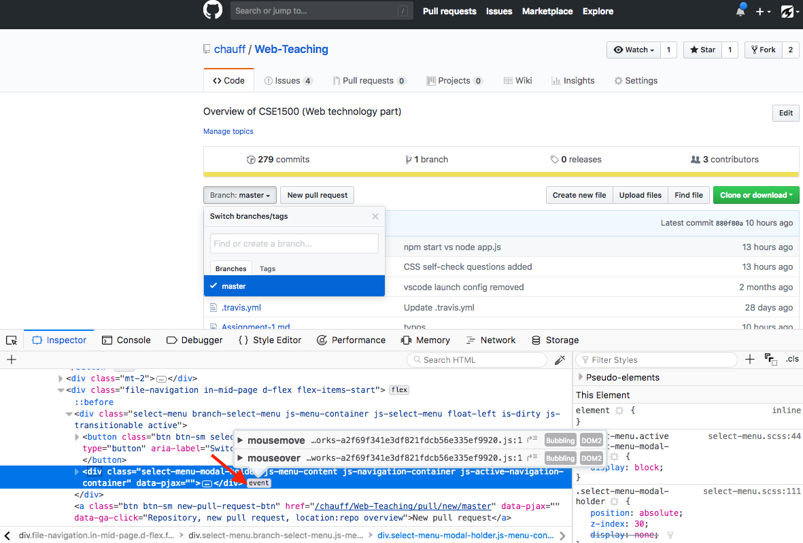

Table of Content
==
- [JavaScript: the language of browser interactions](#javascript-the-language-of-browser-interactions)
    - [Learning goals](#learning-goals)
    - [Take-aways of book chapter 4](#take-aways-of-book-chapter-4)
    - [Examples throughout the lectures](#examples-throughout-the-lectures)
    - [JavaScript's reputation](#javascripts-reputation)
    - [Scripting overview](#scripting-overview)
        - [Server-side vs. client-side scripting](#server-side-vs-client-side-scripting)
        - [`<script>`](#script)
        - [Activity](#activity)
    - [JavaScript design patterns](#javascript-design-patterns)
        - [JavaScript objects](#javascript-objects)
        - [Object creation with `new`](#object-creation-with-new)
        - [Object literals](#object-literals)
        - [Design pattern I: Basic constructor](#design-pattern-i-basic-constructor)
        - [Design pattern 2: Prototype-based constructor](#design-pattern-2-prototype-based-constructor)
        - [Design pattern 3: Module](#design-pattern-3-module)
            - [Scoping](#scoping)
            - [Hoisting](#hoisting)
            - [Finally](#finally)
    - [Events and the DOM](#events-and-the-dom)
        - [Document Object Model](#document-object-model)
            - [Example 1: document.getElementById](#example-1-documentgetelementbyid)
            - [Example 2: creating new nodes](#example-2-creating-new-nodes)
            - [Example 3: `this`](#example-3-this)
            - [Example 4: mouse events](#example-4-mouse-events)
            - [Example 5: a crowdsourcing interface](#example-5-a-crowdsourcing-interface)
            - [Example 6: a typing game](#example-6-a-typing-game)
    - [Self-check](#self-check)

# JavaScript: the language of browser interactions

*This is the densest web lecture of this course. Learning how to code takes time. Take a look at the [exercises](nodeschool-exercises.md) that are relevant for this lecture.*

Preview: in today's lecture we look at JavaScript as the language of browser interactions. In the next lecture we will look at Node.js, a server-side JavaScript runtime.

## Learning goals

- Employ JavaScript objects.
- Employ the principle of callbacks.
- Write interactive web applications based on click, mouse and keystroke events.
- Explain and use `jQuery` (the library introduced in the course book).

## Take-aways of book chapter 4

If you have already read Chapter 4 of the course book, you should know:

- the basics of JavaScript,
- how to include JavaScript in your web application,
- how to declare variables and functions, etc.,
- what the [strict mode](https://developer.mozilla.org/en-US/docs/Web/JavaScript/Reference/Strict_mode) is.

You should have also learned about `jQuery` - a cross-platform JavaScript library designed to simplify the client-side scripting of HTML. It provides a lower-level API to simplify working with the DOM across browsers. `jQuery` is still one of the most popular JavaScript libraries in use today (despite the rise of alternatives, newer frameworks that incorporate a lot of `jQuery` functionality), with more than half of the most trafficked web sites in the world relying on a variant of `jQuery`. Its strength is its ability to simplify tedious tasks.

In this lecture we built upon chapter 4 and cover a number of important JavaScript design patterns.

## Examples throughout the lectures

A bit of context: the code examples throughout this course materials belong to one of three example applications:

- A todo application.
- A habbit tracker.
- A two-player game.

## JavaScript's reputation

Until fairly recently JavaScript was considered more of a toy language. Today though, it is the most important language of the modern web stack. On GitHub, one of the most popular social coding platforms world-wide, [JavaScript has taken the number 1 language spot in 2017](https://octoverse.github.com/). Over the past decade, the tooling, frameworks and libraries that have become available for JavaScript (browser built-in dev tools, build tools, testing frameworks, UI frameworks, ...) have vastly improved. In addition, the **JavaScript runtime environments** are highly efficient and a number of them co-exist: [V8](https://developers.google.com/v8/) is Google's JavaScript engine, [SpiderMonkey](https://developer.mozilla.org/en-US/docs/Mozilla/Projects/SpiderMonkey) is Mozilla's engine (used in Firefox) and [Chakra](https://github.com/Microsoft/ChakraCore) is Microsoft's JavaScript runtime.

JavaScript tracks ECMAScript, the scripting-language specification standardized by Ecma International. While JavaScript is the most popular implementation of the standard, other implementations (or dialects) exist as well, e.g. ActionScript.

JavaScript is a language in flux.

One of the confusing aspects about JavaScript today are the naming conventions, you may come across terms such as **ES6**, **ES7**, **ES2015**, **ECMAScript 2017**, etc. These names refer to different version of ECMAScript (ES for short) which is currently in continuous development. Most often, you are likely to encounter **ES6** (also referred to as **ES2015**) which added a host of new features to the standard required a long-standing effort: "the completion of the sixth edition is the culmination of a fifteen year effort" ([source](https://tc39.github.io/ecma262/)). Starting with **ES2016** (also known as **ES7**), ECMAScript is updated in a yearly cycle.

Similar to HTML5, after a number of years with hardly any development, we are currently in a phase of continuous updates and changes.

In this course we do include very few **ES6** features, as we have only a few lectures to cover the material. If you want to dive into the depth of JavaScript, check out the free [You Don't Know JS](https://github.com/getify/You-Dont-Know-JS) series!

In this course we cover *plain JavaScript*, but it is also worthwhile to know that [MANY](https://github.com/jashkenas/coffeescript/wiki/list-of-languages-that-compile-to-js) languages compile into JavaScript.
The three most well-known of such languages are [CoffeeScript](https://coffeescript.org/), [TypeScript](https://www.typescriptlang.org/) and [Dart](https://www.dartlang.org/), all three fill one or more gaps of the original JavaScript language. Once you work on complex projects in collaboration, these higher-level languages can make a difference, especially when it comes to debugging.

Here is one example of what TypeScript (the 11th most popular language on GitHub as of [2017](https://octoverse.github.com/)) offers: JavaScript is a **dynamic language**, this means that you have no way of enforcing a certain type on a variable. Instead, a variable can hold any type, a String, a Number, an Array ... but of course often you know what you want the type to be (for instance function parameters), so it is good to give this knowledge to the compiler to avoid errors. TypeScript (as the name suggests, TypeScript enables static type checking) allows you to do that, so you can catch errors early on!

## Scripting overview

### Server-side vs. client-side scripting

**Server-side scripting** refers to scripts that run on the **web server** (in contrast to the client). Executing the scripts on the server means they are **private** and only the result of the script execution is returned to the client (usually an HTML document). The client thus has to trust the server. Server-side scripts can access **additional resources** (most often databases) and they can use **non-standard language features** (when you run a server you know which type of software runs on it and what type of language features it supports). At the same time, as all computations are conducted on the server, with many clients sending HTTP requests, this can quickly increase the server's load. As the client often only receives an HTML document as result of the computation, the app developer does not have to worry about clients' device capabilities - any modern browser can render HTML.

**Client-side scripting** on the other hand does not return the result of a computation to the client, but instead sends the script (and if necessary the data) to the client which enables the user to dig through the code (and [this](https://twitter.com/atoker/status/796176641600974851) may happen). Having the clients execute the scripts **reduces the load on the web server**, though all data necessary for the script (which could be megabytes of data) need to be downloaded and processed by the client.

### `<script>`

The placement of the `<script>` tag is an often discussed issue (100+ upvotes for [this question](https://stackoverflow.com/questions/436411/where-should-i-put-script-tags-in-html-markup) on Stack Overflow ...). We go with the course book argument in this course:

*"We place the `<script>` tags in the `<body>` element: the browser displays the page in a **top-down fashion**, **creating the DOM elements as it comes across them**.
By placing the `<script>` tags at the end, the JavaScript files will be one of the last things the page loads. Because JavaScript files often take time to load, we do that last so that the user will get visual feedback from the other elements as fast as possible."* (p. 98)

Once more: interactivity based on the DOM should only start **after** the DOM has been fully loaded; if you decide to place your script's elsewhere, [`jQuery`'s `document.ready` function is your friend](http://learn.jquery.com/using-jquery-core/document-ready/).

### Activity

Based on chapter 4 of the course book, you should be able to answer the following two questions.

1. Executing this JavaScript code snippet yields what output?

```javascript
function giveMe(x){
    return function(y){
      return x*y;
    }
}
var giveMe5 = giveMe(5);

console.log( giveMe5(10) );
```

2. Executing this JavaScript code snippet yields what output?

```javascript
function toPrint(x){
    console.log(x);
}

function my_func(x,y){
    y(x);
}

my_func(5, toPrint);
```

## JavaScript design patterns

*"Design patterns are reusable solutions to commonly occurring problems in software design."* This quote is on the first page of Addy Osmani's [book on JavaScript design patterns](https://addyosmani.com/resources/essentialjsdesignpatterns/book/) (available under CC). A basic example of a reusable solution is one for object creation. Instead of everyone of us trying to figure out how to create objects, we use well-known recipes (a.k.a. design patterns) that were developed over time and apply them.
There are many different design patterns, some are known to work across languages and some are specific to just a small subset of programming languages. What we cover in this lecture is mostly specific to JavaScript. Maybe also worth knowing that besides **design patterns**, there exist also **anti-patterns**, that are programming recipes which are popular but ineffective at tackling a recurring problem.

### JavaScript objects

The web course book focuses on what JavaScript to place where, it does not emphasize object principles. We do this here. One vital notion in JavaScript is the fact that **functions are first-class citizens** of the language. What does that mean? Well, it means that **functions can be passed as parameters**, they can be **returned from functions** and they can be **assigned to a variable**.

The object-oriented programming paradigm is based on a set of cooperating objects (each one able to send/receive "messages" and process data) instead of a collections of functions or a set of commands. The goal of OOP is to assign every object a distinct role, in order to improve code maintainability.

In JavaScript, **functions are also objects**. Apart from functions, JavaScript also comes with a number of built-in objects: Strings, arrays and objects specific to the fact that JavaScript was developed to add interaction to HTML. One example is the `document` object, which only makes sense in the context of an HTML page. Note, that the `document` object is not part of core JavaScript (the language is defined independently of the browser context), however when we discuss client-side scripting we do mean JavaScript in the browser. The browser is the host application in this case and provides the `document` object.

JavaScript objects can be created in different ways. This is very much unlike Java where there is essentially only one: you have a class, write a constructor and then use  the `new` keyword to create an object. We will not consider all the manners of creating JavaScript objects here, you should remember though that there are different ways (especially when you look at other developers' code).

### Object creation with `new`

Let's start with the creation of objects. Here you see one way of creating objects in JavaScript:

```javascript
var game = new Object();
game["id"] = 1;
game["player1"] = "Alice";
game.player2 = "Bob";
console.log( game["player2"] ); //prints out "Bob"
console.log( game.player1 ); //prints out "Alice"

game["won lost"] = "1 12";

game.printID = function(){
    console.log( this.id );
}
game["printID"](); // prints out "1"
game.printID(); //prints out "1"
```

 We first create an empty object with the `new` notation that we can then assign name/value pairs. Here, `id`, `player` and so on are the object's **properties** and their name must be a valid JavaScript identifier (basically a string that does not start with a number). Note, that `printID` is also an object property, although it is often also referred to as a method (because we define a function here). As you see here, JavaScript makes it easy to add methods, by assigning a function to the property of an object.

 Here you also see the use of `this` for the first time. You should be familiar with it from Java, this refers to the current object. Although ... as with many things in JavaScript, it is not quite as simple. If you take a look at the very successful [You Don't Know JS](https://github.com/getify/You-Dont-Know-JS) book series, you will find half a book dedicated to `this` in JavaScript.

We have two ways to set and access an object's properties: either through the bracket notation (`[name]`) or the dot notation (`.name`). It usually does not matter which notation to use, the exception here being property names with whitespaces. Property names that contain whitespaces must be set and accessed through the bracket notation (as in the example above for `game["won lost"]`, the alternative `game.won lost` or `game."won lost"` will lead to a `SyntaxError`).

### Object literals

There is a second way to create objects and that is via **object literals**. An object literal is a list of zero or more pairs of property names and associated values of an object, enclosed in curly braces (`{}`).

```javascript
var game = {
    id: 1,
    player1: "Alice",
    player2: "Bob",
    "won lost": "1 12",
    printID: function(){
        console.log(this.id);
    }
};
```

This time, `"won lost"` is a valid property name, but only if enclosed in quotation marks. Instead of remembering when whitespaces are allowed, it is best to avoid them at all when assigning property names.

Object literals can be complex, they can contain objects themselves:

```javascript
var paramModule = {
    /* parameter literal */
    Param : {
        minGames: 1,
        maxGames: 100,
        maxGameLength: 30
    },
    printParams : function(){
        console.table(this.Param);
    }
};
```

The function `console.table` is an alternative for `console.log`, especially for objects and arrays, as it [displays tabular data as a table](https://developer.mozilla.org/en-US/docs/Web/API/Console/table). Although `console.log` is slowing loosely in popularity in its use (due to the ever improving browser developer tools available) it is still one of the most commonly used debugging techniques. Another worthwhile function to know about is [`console.assert`](https://developer.mozilla.org/en-US/docs/Web/API/console/assert) which prints an error if an assertion is false. If you have for instance a function that should always be called with a single argument that is a string, there is nothing you can do to enforce this - JavaScript is a dynamic language. However, if you know that any valid function call must have a single string argument, you can use assertions (one to check the number of arguments provided and one to check whether the argument is of type string) to - at least at runtime - observe the assertion failure in case the function is used in an unintended manner.

Back to object literals ... what happens if we need 1000 objects of this kind? What happens if a method needs to be added to all objects? Clearly, copy and paste is not the way to go.

### Design pattern I: Basic constructor

First, let's quickly recap what classes in Java offer us:

- we can encapsulate private members, i.e. members of the class that are not accessible externally;
- we define constructors that define how to initialize a new object;
- we define methods (public, protected, private).

Here is a **Java** example:

```java
public class Game {
    private int id; /* encapsulate private members */

    /* constructor: a special method to initialize a new object */
    public Game(int id){
        this.id = id; /* this: reference to the current object */
    }

    public int getID(){
        return this.id;
    }

    public void setID(int id){
        this.id = id;
    }
}
```

And here is how we do the same in JavaScript:

```javascript
function Game( id){
    this.id = id;

    this.getID = function(){ return this.id; };

    this.setID = function(id){ this.id = id; };
}
```

We use functions as **constructors** and rely on `this`. We rely on the keyword `new` to initialize a new object similar to what you have already seen before:

```javascript
var g1 = new Game(1);
g1.getID();
g1.setID(2);

var g2 = new Game(3);
```

An object constructor in JavaScript is just a **normal function**. When the `new` keyword appears the JavaScript runtime executes two steps:

1. A new anonymous empty object is created and used as `this`.
2. The new object is **returned** at the end of the function.

A common error is to forget the `new` keyword. The JavaScript runtime will not alert you to this mistake, in fact, the JavaScript runtime will simply execute the function as-is. Let's take a look at what happens when you copy and paste the following code into your browser's [Web Console](https://developer.mozilla.org/en-US/docs/Tools/Web_Console) (the link points to Firefox's dev tools, feel free to use any major browser though):

```javascript
function Game( id){
    this.id = id;

    this.getID = function(){ return this.id; };

    this.setID = function(id){ this.id = id; };
}

var g1 = new Game("ONE"); //remember: dynamic language, we cannot enforce a parameter type
var id = g1.getID();
console.log(id); //prints out "ONE"
g1.setID(2);

var g2 = Game("TWO"); //what does "this" refer to now?
```

In this code snippet we created a new object assigned to variable `g1`, but for `g2` we forgot the keyword `new` and thus no object was created or assigned to `g2`. If you check what was assigned to `g2` you will find it to be `undefined` (the variable was declared but not defined). So, what happened to the line `this.id = id`? What did `this` refer to in this case? It turns out that without an object, in the browser context, `this` refers to the global `window` object (which represents the window in which the script is running). If you type `window.id` you will in fact find the property to exist and be `TWO`. Of course, this is not desired as you may accidentally overwrite important properties of the `window` object.

Lesson here: be sure to know when to use `new` and what `this` refers to when.

Another interesting feature of JavaScript is the possibility to add new properties and methods **on the fly**, after object creation. In Java, once we have written our class and instantiated objects from the class, we cannot rewrite the class blueprint to affect the already created objects. JavaScript is a **prototype-based language** and here we can actually change our objects on the fly.

Here is an example:

```javascript
function Game( id){
    this.id = id;

    this.getID = function(){ return this.id; };

    this.setID = function(id){ this.id = id; };
}

var g1 = new Game("1");
g1.player1 = "Alice";

var g2 = new Game("2");
g2.player1 = "Bob";

g1.printPlayer = function(){ console.log(this.player1); } //we add a method!
g1.printPlayer(); //prints out "Alice"

g2.printPlayer(); //TypeError: g2.printPlayer is not a function

g1.hasOwnProperty("printPlayer"); //true
g2.hasOwnProperty("printPlayer"); //false

g1.toString(); //"[object Object]" (we never defined it, but it is there)
```

The last line of this code snippet is also of interest: objects come with **default methods**, and so the natural question should be, where do these methods come from? The answer is **prototype chaining** .

Before looking at prototype-based constructors, here is a quick summary of the basic constructor:

- Advantage: very easy to use
- Issues:
  - Not obvious how to use **inheritance**;
  - Objects **do not share** functions (`g2` did not have a `printPlayer` method, but `g1` had);
  - All members are **public** and **any piece of code can be accessed/changed/deleted** (which makes for less than great code maintainability).

The latter point may not be very obvious, but imagine you are using a particular JavaScript library; if you are not aware of the library' internals, you may inadvertently overwrite important parts of the code (without ever being informed about it, because that is not how the JavaScript runtime works). There must be something else out there, and there is indeed. Let's move on to the next design pattern.

### Design pattern 2: Prototype-based constructor

The key to understand JavaScript is to understand **prototype chaining**. Objects have a **secret pointer** to another object - the object's prototype. And thus, when creating for instance an object with a basic constructor as seen before, the properties of the constructor's prototype are also accessible in the new object. If a property is not defined in the object, the **prototype chain** is followed:


Here, `name.__proto__` points to the object that is next in the lookup chain to resolve property names. As always though, things are not quite as simple and over time JavaScript runtimes have evolved in their implementation of [__proto__](http://2ality.com/2015/09/proto-es6.html). Normally, it is not necessary to manually "walk up" the prototype chain, instead the JavaScript runtime does the work for you.

So, why is this important and how can you make use of this knowledge? Recall, that one of the issues in the basic constructor is that *objects do not share functions*. Clearly, often we want objects to share functions and if a function changes that change should be reflected in all objects that have this property/method.

This is what the prototype-based constructor provides. Let's first look at an example:

```javascript
function Game( id){
    this.id = id;
}

/* new member functions are defined once in the prototype */
Game.prototype.getID = function(){ return this.id; };
Game.prototype.setID = function(id){ this.id = id; };

//using it
var g1 = new Game("1");
g1.setID("2"); //works

var g2 = new Game("2");
g2.setID(3); //works

//what happens now?
g1["setID"] = function(id){
    console.assert(typeof(id)=="number", "Expecting a number");
    this.id = id;
}
```

All we have to do to make properties available to all objects is to use the `.prototype` property to walk up the prototype chain and assign a property to `Game.prototype`.
When the two game objects are crated and `setID()` is called, the JavaScript runtime walks up the prototype chain and "finds" the **first** property that matches the desired property name.

This explanation should also answer the last question posed in the code snippet: what happens if a property is also defined as property of the object **as well as** as property of the prototype? The JavaScript runtime stops at the first part of the chain where the property is found and this means that `g1.setID` and `g2.setID` now refer to different pieces of code.

Changes made to the prototype are also reflected in existing objects:

```javascript
function Game( id){
    this.id = id;
}

/* new member functions are defined once in the prototype */
Game.prototype.getID = function(){ return this.id; };
Game.prototype.setID = function(id){ this.id = id; };

//using it
var g1 = new Game("1");
g1.setID("2"); //works
console.log( g1.getID() ); //prints out "2"

Game.prototype.setID = function(id){
    console.assert(typeof(id)=="number", "Expecting a number");
    this.id = id;
}

g1.setID("3");//leads to "Assertion failed: Expecting a number"
```

The prototype chaining allows us to set up **inheritance through prototyping**. This requires two steps:

1. Create a new constructor.
2. Redirect the prototype.

Lets assume we want to inherit from `Game` to create a more specialized variant: `TwoPlayerGame`:

```javascript
function Game(id){
    this.id = id;
}

/* new member functions are defined once in the prototype */
Game.prototype.getID = function(){ return this.id; };
Game.prototype.setID = function(id){ this.id = id; };

/* constructor */
function TwoPlayerGame(id, p1, p2){
    /*
     * call(...) calls a function with a given this value and arguments.
     * More information here: https://developer.mozilla.org/en-US/docs/Web/JavaScript/Reference/Global_Objects/Function/call
     */
    Game.call(this, id);
    this.p1 = p1;
    this.p2 = p2;
}

/* redirect prototype */
TwoPlayerGame.prototype = Object.create(Game.prototype);
TwoPlayerGame.prototype.constructor = TwoPlayerGame;

/* use it */
var TPGame = new TwoPlayerGame(1, "Alice", "Bob");
console.log( TPGame.getID() ); //prints out "1"
console.log( TPGame.p1 ); //prints out "Alice"
```

Why do we need to redirect the prototype? Remember the prototype chain ... when we make the call to `TPGame.getID()` the JavaScript runtime finds `getID()` to not be a method `TPGame`. So it attempts to walk up the prototype chain and in order to make `Game` part of the `TPGame` prototype chain we have to manually set it.

Why do we have to also set the `constructor` property? You will see if you run this piece of code (*note: [Quokka.js](https://marketplace.visualstudio.com/items?itemName=WallabyJs.quokka-vscode) is a good extension for VSC to try out these kind of snippets*) and remove the line:

```javascript
TwoPlayerGame.prototype.constructor = TwoPlayerGame;
```

the code still works as expected. Why do we even add this line? If we do not add this line, then the `constructor` of `TwoPlayerGame.prototype` will be `Game` (check it out for yourself). With this extra line of code we "hand-wire" the correct constructor (which for `TwoPlayerGame.prototype` should be `TwoPlayerGame`). You can think of this as making sure the wiring is correct, even if your code does not rely on this wiring.

Here is one example where it does indeed matter whether whether this wiring is correct:

```javascript
function Game() {};
function TwoPlayerGame() {}

TwoPlayerGame.prototype = Object.create(Game.prototype);

TwoPlayerGame.prototype.create = function create() {
  return new this.constructor();
}

var o = new TwoPlayerGame().create();
console.log( o instanceof TwoPlayerGame ); //prints out "false" as long as the constructor is not set to TwoPlayerGame
```

As a rule of thumb: when using prototypical inheritance, always set up both the `prototype` and `prototype.constructor`; in this manner the wiring is correct, no matter how you will use the inheritance chain later on.

To finish off, here is a quick summary of the prototype-based constructor:

- Advantages:
  - **Inheritance is easy** to achieve;
  - **Objects share functions**;
- Issue:
  - All members are **public** and **any piece of code can be accessed/changed/deleted** (which makes for less than great code maintainability).

### Design pattern 3:  Module

#### Scoping

In order to tackle this last remaining issue above, we need to talk about **scoping** (i.e. the context in which values and expressions are visible) in JavaScript. In contrast to other languages, JavaScript has very **limited** scoping:

- `var` declared within a function: **local** scope;
- `var` declared outside of a function: **global** scope;
- no `var`: **global scope** (no matter where declared);
- `let` was introduced in **ES6**: **block** scope;
- `const` was introduced in **ES6**: **block** scope, no reassignment or redeclaration (but the originally assigned element can change).

Before **ES6** there was no **block scope**, we only had two scopes available: local and global. That this leads to unintuitive behavior can be seen in the following code snippets.

Imagine we want to print out the numbers 1 to 10. This is easy to achieve, e.g.:

```javascript
for (var i = 1; i <= 10; i++) {
    console.log(i);
}
```

Lets now imagine that the print outs should happen each after a delay of one second. Once you know that `setTimeout(fn, delay)` initiates a timer that calls the specified function (below: an **anonymous function**) after a delay (specified in milliseconds) you might expect the following piece of code to print out the numbers 1 to 10 with each number appearing after roughly a second ([JavaScript timers are not overly precise due to JavaScript's single-thread nature](https://johnresig.com/blog/how-javascript-timers-work/)):

```javascript
for (var i = 1; i <= 10; i++) {
    setTimeout(function() {
        console.log(i);
    }, 1000);
}
```

When you run this code you will actually find it to behave very differently: after around one second delay, you will see ten print outs of the number `11`. Make sure to try this out for yourself! Why is this? Well, first of all, what happens here is that `setTimeout` is executed ten times without delay - defined within `setTimeout` is a **callback**, i.e. the function to execute when the condition (the delay) is met. After the tenth time, the `for` loop executes `i++` (and then breaks as the `i<=10` condition is no longer fulfilled) which means `i` is `11` at the end of the `for` loop. As `i` has global scope, every single callback refers to the same variable. After a bit more time passes (reaching ~1 second) each of the function calls within `setTimeout` is now being executed. Every single function just prints out `i` to console. Since `i` is `11` and all  we will get ten print outs of `11`.

Lets fix the two issues (printing 11s instead of 1...10 and waiting a ~second between print outs one by one). In the code above, `var i` has **global** scope, but we actually need it to be of **local scope** such that every function has its own local copy of it. In addition, we increment the delay with each increment of `i`. Before **ES6** this was the established solution (you will find this construct in all kinds of older pieces of code):

```javascript
function fn(i) {
    setTimeout(function() {
        console.log(i);
    }, 1000 * i);
}
  
for (var i = 1; i <= 10; i++)
    fn(i);
```

We first define a function `fn` with one parameter and then use `setTimeout` within `fn`. JavaScript passes the value of a variable in a function; if the variable refers to an array or object, the value is the **reference** to the object. Here, `i` is a `number` and thus every call to `fn` has its own local copy of `i`.

With the introduction of **ES6** and `let`, we no longer need this additional function construct (though again, a lot of code still uses those constructs) as `let` has block scope and thus every `i` referred to within `setTimeout` is a different variable. This now works as expected:

```javascript
for (let i = 1; i <= 10; i++)
    setTimeout( function() {
        console.log(i)
    }, 1000 * i)
```

Scoping is also important when it comes to larger programming projects: imagine that you are working on some complicated project which makes use of a dozen or more JavaScript libraries. If all of these libraries would fill up the global namespace, inevitably at some point or another your code would stop working. Here is a very simple `jQuery` to showcase this issue:

```html
<!DOCTYPE html>
<html>
<head>
<script src="https://ajax.googleapis.com/ajax/libs/jquery/3.3.1/jquery.min.js"></script>
<script>
$(document).ready(function(){
    //$ = "overwriting";
    $("#b").click(function(){
        $("#b").hide();
    });
});
</script>
</head>
<body>

<h1>Hide this button</h1>

<button id="b">Hide me forever</button>

</body>
</html>
```

This code does exactly what we expect (hiding a button once we click it)). You should also be familiar with the `jQuery` syntax and know that `$(..)` is an alias for the function [`jQuery(..)`](http://api.jquery.com/jQuery/). But what happens if we overwrite `$`? Find out by uncommenting the `$ = "overwriting` line of code. The code is broken and we end up with the error: `TypeError: $ is not a function`.

Luckily, `jQuery` and other libraries have very few variables ending up in global scope in order to **reduce potential conflicts** with other JavaScript libraries. In addition, the **public API is minimized** in order to avoid unintentional side-effects (incorrect usage of the library by end users) as much as possible.

How is that achieved? Through the module pattern, which we come to very soon. It has the following goals:

- **Do not declare any global variables** or functions unless required.
- Emulate **private/public** membership.
- Expose only the **necessary** members to the public.

#### Hoisting

Hoisting is best explained with a concrete example. Consider this JavaScript code snippet. What kind of console output do you expect after executing this snippet?

```javascript
var x = six();

//function declaration
function six(){
    return 6;
}

var y = seven();

//function expression
var seven = function(){
    return 7;
}

console.log(x+" - "+y);
```

In both cases we seem to be executing a function before it is defined. You may either believe that the JavaScript runtime does not care about this and the output will be `6 - 7` or you may believe that the JavaScript runtime does indeed care and the output will be a `TypeError: six is not a function` and abort. Unfortunately, neither of these two options are true (verify for yourself in the browser!), the output will be `TypeError: seven is not a function`. This means that while `var x = six();` works, `var y = seven()`;` does not.

The difference lies in how we went about defining our `six` and `seven` functions: `var seven = function(){...}` is a **function expression** and is only defined when that line of code is reached. `function six(){...}` on the other hand is a **function declaration** and is defined as soon as its surrounding fucntion or script is executed due to the **hoisting principle**: declarations are processed before any code is executed.

In our example, the JavaScript runtime *hoists* the declaration of `six` is processed before the remaining code is executed.

Once more:

- Declarations are hoisted to the top.
- Expressions are not hoisted.

This is not only the case for functions, also variable declarations are hoisted. Consider this example:

```javascript
function f(){
    x = 5;
    y = 3;
    console.log("writing from an IIFE");
    var x;
};
f();
console.log(x);
console.log(y);
```

Variables `x` and `y` have global scope as they are not prefixed by `var` or `let` or `const`. And so the console output will be `5` and `3`.

But what happens in this slightly changed piece of code?

```javascript
function f(){
    a = 5;
    b = 3;
    console.log("writing from an IIFE");
    var a, b;
};
f();
console.log(a);
console.log(b);
```

Now we will end up with a `ReferenceError: a is not defined` as the `var a` statement at the end of function `f` is **hoisted** to the top of the function - as `var a` is a declaration.

#### Finally

Ok, after this interlude of scoping and hoisting, let's finally come to our module pattern.

Here is how the **module pattern** looks like:

```javascript
/* creating a module */
var gameStatModule = ( function() {

    /* private members */
    var gamesStarted = 0;
    var gamesCompleted = 0;
    var gamesAbolished = 0;

    /* public members: return accessible object */
    return {
        incrGamesStarted : function(){
            gamesStarted++;
        },
        getNumGamesStarted : function(){
            return gamesStarted;
        }
    }
})();

/* using the module */
gameStatModule.incrGamesStarted();
console.log( gameStatModule.getNumGamesStarted() ); //prints out "1"
console.log( gameStatModule.gamesStarted ); //prints out "undefined"
```

In this code snippet, we are defining a variable `gameStatModule` which is assigned a `function` expression that is immediately invoked (also known as [IIFE](https://developer.mozilla.org/en-US/docs/Glossary/IIFE) ). An IIFE itself is also a design pattern, it looks as follows:

```javascript
(function () {
    //statements
})();
```

Here, the function is **anonymous** (it does not have a name - it does not need a name, as it is immediately invoked) and the final pair of brackets `()` leads to it immediate execution (the brackets surrounding the function are not strictly necessary, but they are commonly used).

Going back to our `gameStatModule`, we immediately execute the function. What does this function contain? It contains a number of variables with function scope (`gamesStarted` and so on) as well as a return statement. This return statement contains the result of the function invocation. In this case, an *object literal* is returned and this object literal has two methods `incrGamesStarted()` and `getNumGamesStarted()`. Outside of this module, we cannot directly access `gamesStarted` or any of the other "private" variables, all we will get is an `undefined` as the returned object does not contain those properties (though the returned object has access to them through JavaScript's concept of [closures](https://developer.mozilla.org/en-US/docs/Web/JavaScript/Closures)). *A closure is the combination of a function and the lexical environment within which that function was declared* (as defined by MDN); in our case the lexical environment includes the emulated private variables.

The encapsulating function can also contain parameters (here: arguments `1, 1, 1`):

```javascript
/* creating a module */
var gameStatModule =  function(s, c, a) {

    /* private members */
    var gamesStarted = s;
    var gamesCompleted = c;
    var gamesAbolished = a;

    /* public members: return accessible object */
    return {
        incrGamesStarted : function(){
            gamesStarted++;
        },
        getNumGamesStarted : function(){
            return gamesStarted;
        }
    }
}(1, 1, 1);

/* using the module */
gameStatModule.incrGamesStarted();
console.log( gameStatModule.getNumGamesStarted() ); //prints out 2

//can be defined on the fly, but ...
gameStatModule.decrGamesStarted = function(){
    gamesStarted--;
}

/*
 * once this method is called, it leads to an error:
 * ReferenceError: gamesStarted is not defined;
 * methods added on-the-fly cannot access 'private' variables
 */
gameStatModule.decrGamesStarted();
```

Summarizing the module pattern:

- Advantages:
  - Encapsulation is achieved;
  - Object members are either public or private;
- Issues:
  - Changing the type of membership (public/private) takes effort (unlike in Java where a 'private' simply becomes 'public').
  - Methods added on the fly later cannot access 'private' members (as seen in the last code snippet).

Once again, things are not as easy as they seem, in the [You Don't Know JS](https://github.com/getify/You-Dont-Know-JS/blob/master/scope%20&%20closures/README.md#you-dont-know-js-scope--closures) series, a whole book is dedicated to scopes and closures.

## Events and the DOM

Having read chapter 4 of the course book, you should be familiar with code such as this:

```javascript
var main = function () {
  "use strict";
  $(".comment-input button").on("click", function (event) {
    var $new_comment = $("<p>"),
    comment_text = $(".comment-input input").val();
    $new_comment.text(comment_text);
    $(".comments").append($new_comment);
  });
};
$(document).ready(main);
```

The course book makes extensive use of `jQuery` (a big time saver in practice). With `jQuery` it does not matter if you are after a `class` or `id`, the access pattern is always the same: `$()`. This is in contrast to plain JavaScript where we deal with `document` (the web page object and our entry point to the DOM) which comes with a number of manners to select groups or single DOM elements:

- `document.getElementById`
- `document.getElementsByClassName`
- `document.getElementsByTagName`
- `document.querySelector` (returns the first element within the DOM tree that matches the selector)
- `document.querySelectorAll` (returns all elements that match)

The code snippet above also shows off the **callback principle**, which you come across in all of JavaScript: we define here what hapens *when* an event fires (in this case the event is the click on a button).

The course book walks you through several examples of making a responsive UI control. Here is a short step-by-step guide:

1. Pick a control, e.g. a `button`.
2. Pick an event, e.g. a `click`.
3. Write a JavaScript function: what should happen when the event occurs, e.g. an `alert` message may appear.
4. Attach the function to the event **on** the control.

If you want to examine how existing web applications make use of events, the browser developer tools will help you once more. On Firefox, the HTML panel allows you to explore which events are attached to which controls and with a click on the event itself, you can dig into the callback function as seen here:

 **[TODO: fix link]**

### Document Object Model

The DOM is our entry point to interactive web applications. It allows use to:

- **Extract an element's state**
  - Is the checkbox checked?
  - Is the button disabled?
  - Is a `<h1>` appearing on the page?
- **Change an element's state**
  - Check a checkbox
  - Disable a button
  - Create an `<h1>` element on a page if none exists
- **Change an element's style** (material for a later lecture)
  - Change the color of a button
  - Change the size of a paragraph
  - Change the background color of a web application

In the remainder of this lecture, you will see a number of simple event-based examples that add an interactive element to a web page.
These examples are simple and self-contained. This means that all necessary code is contained within a single code snippet (even though by now you are aware that in a real coding project there should be a strict separation between HTML, JavaScript and CSS, the latter will be introduced in a later lecture).

#### Example 1: document.getElementById

Example 1 is as simple as possible: a page with two elements, a button and a text box. A click on the button will show `Hello World!` in the text box. We can include all necessary code in a single HTML file:

```html
<!DOCTYPE html>
<html>
    <head>
        <title>Example 1</title>
    </head>
    <body>
        <button onclick="
            var tb = document.getElementById('out');
            tb.value = 'Hello World!'
        ">Say Hello World</button>
        <input id="out" type="text">
    </body>
</html>
```

This is of course not ideal as we are writting JavaScript code in the middle of HTML elements, a slight refactoring gets us to this improved version:

```html
<!DOCTYPE html>
<html>
    <head>
        <title>Example 1</title>
        <script>
            /* we define the function */
            function sayHello() {
              var tb = document.getElementById("out");
              tb.value = 'Hello World';
            };

            /* we attach a function to a button's click event
             * after the DOM finished loading
             */
            window.onload = function() {
                document.getElementById("b").onclick = sayHello;
            };
        </script>
    </head>

    <body>
        <button id="b">Say Hello World</button>
        <input id="out" type="text">
    </body>
</html>
```

Better! Although everything is still in a single file, we have now moved all JavaScript code within `<script>` tags. Be sure to check out what happens if the snippet

```javascript
window.onload = function() {
    document.getElementById("b").onclick = sayHello;
};
```

is replaced just by:

```javascript
document.getElementById("b").onclick = sayHello;
```

As another exercise, add a second `<input>` element with the **same id** and see what happens. And lastly, try for yourself to replace `<input>` with a `<span>` element. You can no longer use `.value` but instead need to rely on a different property ([hint](https://developer.mozilla.org/en-US/docs/Web/API/Element/innerHTML)).

#### Example 2: creating new nodes

HTML tags and content can be added dynamically in two steps:

1. Create a DOM node.
2. Add the new node to the document as a **child of an existing node**.

To achieve step two, a number of methods are available to every DOM element:

| Name                   | Description                                                              |
|------------------------|--------------------------------------------------------------------------|
| `appendChild(new)`       |  places the new node at the end of this node's child list                |
| `insertBefore(new, old)` |  places the new node in this node's child list just before the old child |
| `removeChild(node)`      |  removes the given node from this node's child list                      |
| `replaceChild(new, old)` | replaces the old node with the new one                                   |

Lets look at how this works in practice:

```html
<!DOCTYPE html>
<html>
    <head>
        <title>Example 2</title>
        <script>
            window.onload = function() {
              document.getElementById("b").onclick = addElement;
            };

            function addElement() {
              var ul = document.getElementById('u');
              var li = document.createElement('li');
              li.innerHTML = 'List element ' + (ul.childElementCount+1) +' ';
              ul.appendChild(li);
            };

        </script>
    </head>

    <body>
        <button id="b">Add List Element</button>
        <ul id="u"></ul>
    </body>
</html>
```

Note here, that the HTML part initally contains an empty `<ul>` element. Instead of directly adding `<li>` elements, we could have also added a single child `<ul>` to the `<body>` node and then starting adding children to it.

We can of course also remove elements:

```html
<!DOCTYPE html>
<html>
    <head>
        <title>Example 2</title>
        <script>
          /* JavaScript */
          window.onload = function() {
            document.getElementById("bRemoveF").onclick = removeFirstChild;
            document.getElementById("bRemoveL").onclick = removeLastChild;
          };

          function removeLastChild() {
            var ul = document.getElementById('u');
            ul.removeChild(ul.lastElementChild);
          };

          function removeFirstChild() {
            var ul = document.getElementById('u');
            ul.removeChild(ul.firstElementChild);  
          }
        </script>
    </head>

    <body>
        <button id="bRemoveF">Remove first child</button>
        <button id="bRemoveL">Remove last child</button>
        <ul id="u">
          <li>Item 1</li>
          <li>Item 2</li>
          <li>Item 3</li>
          <li>Item 4</li>
          <li>Item 5</li>
        </ul>
    </body>
</html>
```

Important to note here is that there are often methods available for DOM elements which look similar, but are leading to quite different behaviour. Case in point: in the above example we used `ul.firstElementChild` and `ul.lastElementChild`. Instead, we could have also used `ul.firstChild` and `ul.lastChild`. And this will work to - at least with every second click, as those methods also keep track of a node's children that are comments or text nodes, instead of just `li` nodes as we intend with our code.

#### Example 3: `this`

We have already discussed `this` to some extent, it refers to the current object. Event handlers are bound to the attached element's objects and the handler function "knows" which element it is listening to (`this`). This simplifies programming as a function can serve different objects.

Imagine you want to create a simple multiplication app that has one text input box and three buttons. A click on a button multiplies the number found in the input with a fixed number (unique per button).

We can of course write three different functions and then separately attach each of them to the correct button:

```javascript
document.getElementById("button10").onclick = computeTimes10;
document.getElementById("button23").onclick = computeTimes23;
document.getElementById("button76").onclick = computeTimes76;
```

This is tedious, error prone and not maintainable (what if you need a hundred buttons next). We could also be tempted to use the following construct:

```javascript
document.getElementById("button10").onclick = computeTimes(10);
document.getElementById("button23").onclick = computeTimes(23);
document.getElementById("button76").onclick = computeTimes(76);
```

but this will not work either, as in this case the execution of each line of code will immediately execute the `computeTimes` function instead of attaching it to the click event.

The best option is to use `this`:

```html
<!DOCTYPE html>
<html>
    <head>
        <title>Example 3</title>
        <script>
          /* JavaScript */
          window.onload = function() {
            document.getElementById("button10").onclick = computeTimes;
            document.getElementById("button23").onclick = computeTimes;
            document.getElementById("button76").onclick = computeTimes;
          };

          function computeTimes() {
            var times = parseInt(this.innerHTML);
            var input = parseFloat(document.getElementById("input").value);
            var res = times * input;
            alert("The result is " + res);
          }
        </script>
    </head>

    <body>
        <input type="text" id="input">
        <button id="button10">10 times</button>
        <button id="button23">23 times</button>
        <button id="button76">76 times</button>
    </body>
</html>
```

Depending on which button was clicked, `this` refers to the corresponding DOM tree element and [`.innerHTML`](https://developer.mozilla.org/en-US/docs/Web/API/Element/innerHTML) allows us to examine the label text. [`parseInt`](https://developer.mozilla.org/en-US/docs/Web/JavaScript/Reference/Global_Objects/parseInt) is here a lazy way of stripping out the "times" text, forcing a conversion to type `number`.

Note that in global code or regular functions (not bound to an object), `this` refers to the global `window` object.

#### Example 4: mouse events

A number of different mouse events exist (`mouseup`, `mousedown`, `mousemove`, ...) and some are defined as a series of simpler mouse events, e.g.

- A click of the mouse button in-place consists of:
    1. `mousedown`
    2. `mouseup`
    3. `click`
- A click of the mouse button while moving the mouse ("dragging") consists of:
    1. `mousedown`
    2. `mousemove`
    3. ...
    n-1. `mousemove`
    n. `mouseup`

Here is an example of `mouseover` and `mouseout`: a timer starts as long as the mouse hovers over an element and it resets when the mouse leaves the element. Each of the three buttons has a different timer speed:

```html
<!DOCTYPE html>
<html>
    <head>
        <title>Example 4</title>
        <script>
          window.onload = function() {
            document.getElementById("b1").onmouseover = mouseover;
            document.getElementById("b1").onmouseout = mouseout;

            document.getElementById("b10").onmouseover = mouseover;
            document.getElementById("b10").onmouseout = mouseout;

            document.getElementById("b100").onmouseover = mouseover;
            document.getElementById("b100").onmouseout = mouseout;
          };

          var intervals = {};

          function updateNum(button){
            var num = parseInt(button.innerHTML);
            num = num + 1;
            button.innerHTML = num;
          }

          function mouseover() {
            var incr = parseInt(this.id.substr(1));
            intervals[this.id] = setInterval(updateNum, 1000/incr, this);
          };

          function mouseout()
          {
            clearInterval(intervals[this.id]);
            this.innerHTML = "0";
          }
        </script>
    </head>

    <body>
      <button style="width:500px" id="b1">0</button>
      <button style="width:500px" id="b10">0</button>
      <button style="width:500px" id="b100">0</button>
    </body>
</html>
```

Mouse events can be tricky, the more complex ones are not consistently implemented across browsers.

#### Example 5: a crowdsourcing interface

Here is another event that can be useful, especially for text-heavy interfaces: `onselect`. We here have an interface with a read-only text that the user can select passages in. If enough passages have been selected, the user can submit the answers.

```html
<!DOCTYPE html>
<html>
    <head>
        <title>Example 5</title>
        <script>
          window.onload = function() {
            document.getElementById("ta").onselect = updateNuggets;
          };

          function updateNuggets() {
            var n1 = document.getElementById('n1').value;
            var n2 = document.getElementById('n2').value;
            var n3 = document.getElementById('n3').value;

            var selected = null;
            var myTextArea = document.getElementById('ta');
            if (myTextArea.selectionStart != undefined)
            {
              var p1 = myTextArea.selectionStart;
              var p2 = myTextArea.selectionEnd;
              selected = myTextArea.value.substring(p1, p2);
            }

            //if the selected phrase is already in a nugget, remove it
            if(selected==n1) {document.getElementById('n1').value = "";}
            else if(selected==n2){document.getElementById('n2').value = "";}
            else if(selected==n3){document.getElementById('n3').value = "";}
            //if the first nugget is empty, add it
            else if(n1.length==0){document.getElementById('n1').value = selected;}
            //if the second nugget is empty, add it
            else if(n2.length==0){document.getElementById('n2').value = selected;}
            //third nugget is treated differently, as now the button becomes unhidden
            else if(n3.length==0)
            {
              document.getElementById('n3').value = selected;
              document.getElementById('b').hidden = false;
            }
            else {
              alert('You have selected three information nuggets. Either unselect one or manually empty text box.');
            }
          }
        </script>
    </head>

    <body>
      <form>
          <p><em>Task: Write or mark the 3 most important information nuggets</em>
            <br>

            <textarea id="ta" cols="50" rows="5" readonly>"Hobey Baker (1892-1918) was an American amateur athlete of the early twentieth century, widely regarded by his contemporaries as one of the best athletes of his time."
            </textarea>
            <br>

            <label>Nugget 1: <input type="text" id="n1" autocomplete="off"></label>
            <br>
            <label>Nugget 2: <input type="text" id="n2" autocomplete="off"></label><br>
            <label>Nugget 3: <input type="text" id="n3" autocomplete="off"></label><br>
            <button hidden="hidden" id="b">Submit Answers</button><br>
        </form>
    </body>
</html>
```

#### Example 6: a typing game

The last example is a typing game: given a piece of text, type it correctly as fast as possible. The interface records how many seconds it took to type and alerts the user to mistyping. In this example we make use of the `keypress` event type. We start the timer with `setInterval` (incrementing once per second), which returns a handle that we can later pass to `clearInterval` to stop the associated callback from executing (thus stopping the clock).

In this example we do do make slight use of CSS (to flash a red background and alter the color of the timer in the end), you can recognize those line on the `.style` properties.

```html
<!DOCTYPE html>
<html>
    <head>
        <title>Example 5</title>
        <script>
          window.onload = function() {
            document.getElementById("typed").onkeypress = checkTextAtKeyPress;
          };

          var currentPos = 0;
          var givenText = "given";
          var typedText = "typed";
          var timerLog = "timer";
          var intervals = {};

          //e refers to the event (we need it to extradt the char typed)
          function checkTextAtKeyPress(e) {

            var textToType = document.getElementById(givenText).value;

            //we reached the end, do nothing
            if(currentPos >= textToType.length) {return;}

            var nextChar = textToType.charAt(currentPos);

            var keyPressed = String.fromCharCode(e.which);
            console.log("Key pressed: "+keyPressed+", charCode: "+e.which);

            //correct key was pressed
            if(nextChar==keyPressed) {
              //CSS is used here to "style" the text box
              document.getElementById(typedText).style.backgroundColor="rgb(255,255,255)";
              document.getElementById(typedText).value = textToType.substring(0,currentPos+1);

              currentPos++;

              //first time key was pressed, start counter
              if(currentPos==1) {
                intervals[this.id]=setInterval(function(){
                    var t = parseInt(document.getElementById(timerLog).innerHTML);
                    t = t + 1;
                    document.getElementById(timerLog).innerHTML = t +" seconds";
                ;}, 1000);

              }

              //we reached the end
              if(currentPos==textToType.length) {
                clearInterval(intervals[this.id]);
                //CSS is used here to "style" the text box
                document.getElementById(timerLog).style.color="orange";
              }
            }
            //incorrect key
            else {
              //CSS is used here to "style" the text box
              document.getElementById(typedText).style.backgroundColor="rgb(255,100,100)";
            }
          }
        </script>
    </head>

    <body>
      <form id="f">
          <p>
            <em>Task: Type out the following text correctly:</em>
            <br>

            <textarea id="given" cols="50" rows="5" readonly="" autocomplete="off">H. Baker was an American amateur athlete of the 20th century.</textarea>
            <br>

            <textarea id="typed" cols="50" rows="5" readonly="" autocomplete="off"></textarea>
            <br>

            <span id="timer">0 seconds</span>
          </p>
      </form>
    </body>
</html>
```

To conclude this lecture, here is an overview of important keyboard and text events:

| Event    | Description                                                                           |
|----------|---------------------------------------------------------------------------------------|
| blur     | element loses keyboard focus                                                          |
| focus    | element gains keyboard focus                                                          |
| keydown  |   user presses key while element has keyboard focus                                   |
| keypress |  user presses and releases key while element has keyboard focus (a problematic event) |
| keyup    |  user releases key while element has keyboard focus                                   |
| select   | user selects text in an element                                                       |

## Self-check

Here are a few questions you should be able to answer after having followed the lecture and having worked through the required readings:

1. After executing the JavaScript code snippet below in the browser, what is the output on the console?

```javascript
var f = ( function myfunc1(a){
    var c = 2 * a;
    return function myfunc2(b){
        return 3 * c;
    }
})(5);

console.log(f(4));
```

2. After executing the JavaScript code snippet below in the browser, how many of `a`, `b`, `c` and `d` have global scope (they become a property of the `window` object)?

```javascript
var a = 5;
b = 10;

function outer(a){
    c = 0;
    d = 1;

    function inner(d){
        c = 12;
    }
    inner(5);
    var c, d;
}
outer(6);
```

3. After executing the JavaScript code snippet below in the browser, what is the output on the console?

```javascript
function Habit(habit){
    this.habit = habit;
}

function WeeklyHabit(habit, timesPerWeek){
    Habit.call(this, habit);
    this.timesPerWeek = timesPerWeek;
}

WeeklyHabit.prototype = Object.create( Habit.prototype );
WeeklyHabit.prototype.constructor = WeeklyHabit;

Habit.prototype.updateFreq = function(f){ this.freq = f; }
WeeklyHabit.prototype.updateFreq = function(f){ this.freq = f + " times"; }

var h1 = new Habit("Go swimming");
var h2 = new WeeklyHabit("Eat healthily", "5");

h1.updateFreq(1);
h2.updateFreq(2);
console.log(h1.freq);
console.log(h2.freq);

```

4. What is the output on the web console when running the following piece of JavaScript in the browser?

```javascript
function A(x){
    var y = x * 2;
    return function(y){
        var z = y * 3;
        return function(z){
            return x + y + z;
        }
    }
}
console.log( A(3)(4)(5) );
```

5. Which of the following statements about the basic constructor in JavaScript is **wrong**?
- Objects share functions.
- All members are public.
- An object constructor looks like a normal function.
- Prexing a call to a function with the keyword `new` indicates to the JavaScript runtime that the function should behave like a constructor.

6. What is the output on the web console when running the following piece of JavaScript in the browser?

```javascript
var todoModule = ( function() {
    var numTodos = 0;

    return {
        incrNumTodos: function(){
            numTodos++;
        },
        decrNumTodos: function(){
            if(numTodos>0){
                numTodos--;
            }
        },
        printTodos: function(){
            console.log(numTodos);
        }
    };
});

for(let i=0; i<5; i++){
    todoModule.incrNumTodos();
}
todoModule.printTodos();
```

7. After executing the JavaScript code snippet below in the browser what will be the console output?

```javascript
var message = "Toy kitchen";
var price = "89.90";

var deal1 = {
    message: "Peppa Pig",
    details: {
        price: "29.95",
        getPrice: function(){
            console.log(this.price);
        }
    }
}

var a = deal1.details.getPrice;
a();
```

8. After executing the JavaScript code snippet below in the browser what will be the console output?

```javascript
var message = "Toy kitchen";
var price = "89.90";

var deal1 = {
    message: "Peppa Pig",
    details: {
        price: "29.95",
        getPrice: function(){
            console.log(this.price);
        }
    }
}

deal1.details.getPrice();
```

9. In a prototype version of one of our applications, we want to implement functionality in JavaScript that retrieves details of local deals from the server when a user clicks on a deal. The code below contains a first implementation of this functionality. What is the main issue of this code?
- Reloading the web page *n* times will lead to *n* listeners being attached to the same list item.
- No event listeners will be attached to click events on list items.
- The JavaScript code will be executed before teh DOM tree is loaded, the event listeners will be attached to the `window` object instead of the list items.
- The method `document.getElementsByTagName()` does not exist leading to an error in the script.

```html
<!DOCTYPE html>
<html>
    <head>
        <title>Local Deals Finder</title>
        <script src="https://ajax.googleapis.com/ajax/libs/jquery/3.3.1/jquery.min.js"></script>
        <script>
            var main = function(){
                var list = document.getElementsByTagName("li");
                for(var i = 0; i<list.length; i++){
                    document.getElementsByTagName("li")[i].onclick = showDetails();
                }
            }
            $(document).ready(main);

            function showDetails(){
                /* implementation of show details functionality */
                console.log("Showing some details ...");
            }
        </script>
    </head>
    <body>
        <div id="deals">
            <ul>
                <li id="i1" data-id="122" data-latitude="12.43" data-longitude="44.31" data-price="29.90">Toy car</li>
                <li id="i2" data-id="342" data-latitude="13.01" data-longitude="43.21" data-price="14.55">Perfume</li>
            </ul>
        </div>
    </body>
</html>
```
