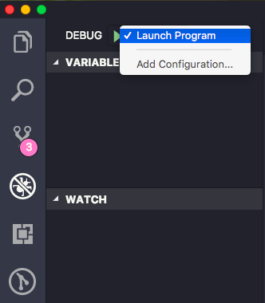
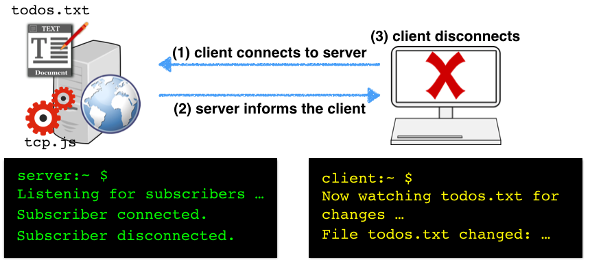
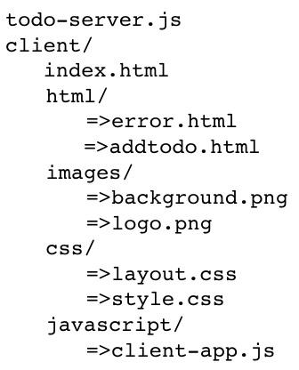
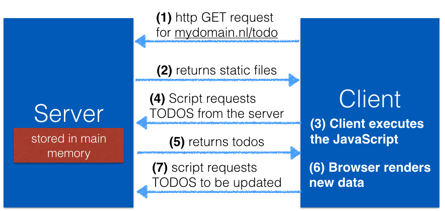
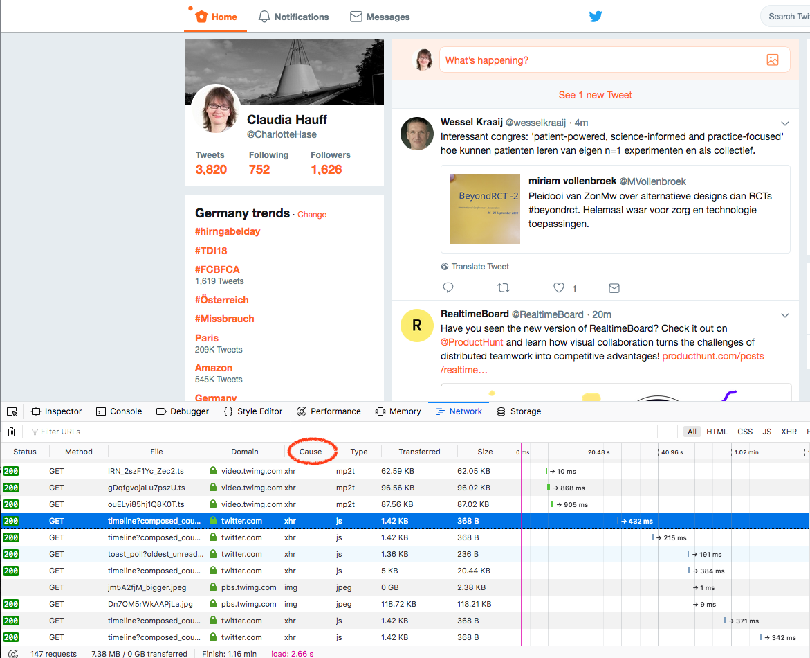
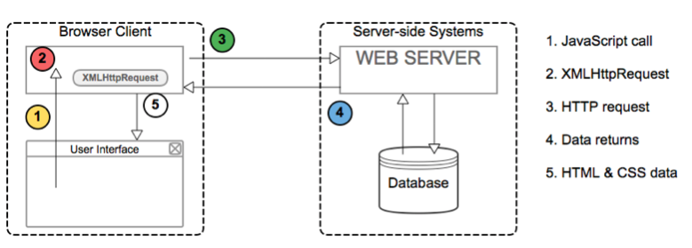
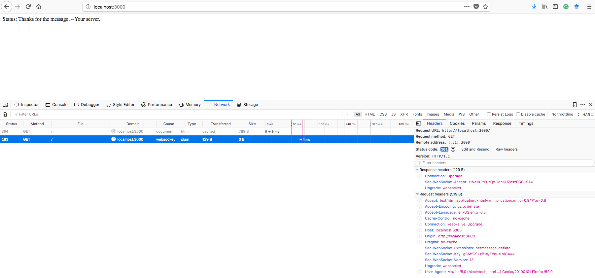

# Node.js: JavaScript on the server <!-- omit in toc -->

:point_right: [Overview of all Lecture 4 materials](README.md#lecture-4)

*At times we use :point_up: and :point_down: to make it clear whether an explanation belongs to the code snippet above or below the text. The :bangbang: sign is added to code examples you should run yourself.*

## Table of Contents <!-- omit in toc -->
- [Learning goals](#learning-goals)
- [Introduction to Node.js](#introduction-to-nodejs)
    - [Node.js vs. client-side JavaScript](#nodejs-vs-client-side-javascript)
    - [Event-driven and non-blocking](#event-driven-and-non-blocking)
- [Node.js in examples](#nodejs-in-examples)
    - [:bangbang: Watching a file for changes](#bangbang-watching-a-file-for-changes)
    - [:bangbang: Low-level networking with Node.js](#bangbang-low-level-networking-with-nodejs)
    - [:bangbang: Creating a Hello World! web server with Node.js](#bangbang-creating-a-hello-world-web-server-with-nodejs)
- [Express](#express)
    - [:bangbang: Greetings Express](#bangbang-greetings-express)
    - [:bangbang: A complete web application](#bangbang-a-complete-web-application)
- [JSON: exchanging data between the client and server](#json-exchanging-data-between-the-client-and-server)
- [Ajax: dynamic updating on the client](#ajax-dynamic-updating-on-the-client)
- [WebSockets](#websockets)
    - [:bangbang: A first WebSocket example](#bangbang-a-first-websocket-example)
    - [WebSockets for multi-player games](#websockets-for-multi-player-games)
- [Self-check](#self-check)

## Learning goals

- Explain the main ideas behind Node.js.
- Implement basic network functionality with Node.js.
- Explain the difference between Node.js, npm & Express.
- Create a fully working web application that has client- and server-side interactivity.
- Implement client/server bidirectional communication through WebSockets.

## Introduction to Node.js

Node.js (or *Node* for short) in its own words:

```console
“Node.js is a platform built on Google Chrome's JavaScript runtime for easily building fast,
scalable network applications. Node.js uses an event-driven, non-blocking  I/O model that
makes it lightweight and efficient, perfect for data-intensive real-time applications that
run across distributed devices."
```

The most important keywords in this description are **scalable**, **event-driven** and **non-blocking**. While we are not concerned with scalability in this course, we will return to the other two keywords shortly.

Node.js is by now a well-established platform; the most important milestones between 2008 and 2018 are:

- 2008: Google's JavaScript execution engine (**V8**) is open-sourced (if you are interested what happened in the 10 years since then, [check out this blog post from the V8 team](https://v8project.blogspot.com/2018/09/10-years.html)).
- 2009: Node.js is released. It builds on V8.
- 2011: Node.js' package manager (npm) is released.
- December 2014: Node.js developers are unhappy with the stewardship of the project and fork io.js.
- May 2015: io.js merges back with Node.js. The [Node.js Foundation](https://foundation.nodejs.org/) is set up. It has been steering Node's development ever since.
- 2017: Node becomes a **first-class citizen of V8**. This means that no V8 code change is allowed to break Node.

Node.js is widely used today, in [Stack Overflow's 2017 developer survey](https://insights.stackoverflow.com/survey/2017) Node.js was the most popular framework in the *Frameworks, Libraries, and Other Technologies* section. If you want to know more about how the V8 engine and Node.js fit together, watch [this keynote by Franziska Hinkelmann](https://www.youtube.com/watch?v=PsDqH_RKvyc), a prominent Googler working on the V8 engine.

### Node.js vs. client-side JavaScript

[Mariko Kosaka](https://twitter.com/kosamari), another Googler, shared this image to compare client-side JavaScript and Node.js on Twitter:

<blockquote class="twitter-tweet" data-lang="en"><p lang="en" dir="ltr">What IS Node.js 🤔❓❓<br><br>(Proposal to stop calling server side JavaScript✨) <a href="https://t.co/IhPt8UHnPN">pic.twitter.com/IhPt8UHnPN</a></p>&mdash; Mariko Kosaka (@kosamari) March 3, 2017</blockquote>


### Event-driven and non-blocking

One of the core concepts of Node is the **event loop**. Node.js is a single-threaded application that executes **callbacks** in response to an occurring event. Developers write those callbacks. The event loop waits for events to enter the **event queue** and once they have, the events are processed in their order of arrival, i.e. their respective callbacks are executed.

Take a look at this event loop example:


Here, despite the **single-threaded nature** of Node.js, several things are seemingly going on in parallel: a file is read from disk, a database is queried while at the same time an HTTP request from a client comes in. The reason for this is the **asynchronous** nature of file reads, network requests and so on (basically: I/O requests). While the event loop is executed in a single thread, Node maintains a *pool of threads* in order to process I/O requests in parallel. So, it is more correct to say that Node's event loop is single-threaded. To make this concrete, let's look at how local files are read in Node. Here is an example taken from the [Node documentation](https://nodejs.org/api/fs.html#fs_fs_readfile_path_options_callback) :point_down::

```javascript
fs.readFile('/etc/passwd', function(err, data) {
    if(err) throw err;
    console.log(data);
})
```

<sup>In the documentation it does not actually say `function(err, data)` but `(err, data) =>` instead; this is just a syntactic shortcut called an [arrow function](https://developer.mozilla.org/en-US/docs/Web/JavaScript/Reference/Functions/Arrow_functions) introduced in ES6.</sup>

:point_up: The method `readFile` takes two parameters: the path of the file to read and a **callback function**: the function to execute when the file reading operation has completed. The callback function has two parameters: an error object and a data object. If the file reading operation failed for some reason, we throw the error, otherwise we print out the data to the console. Once the Node runtime encounters this code snippet, it will execute `fs.readFile(....)` and return immediately to execute the next line of code (this is called **non-blocking**). What happens to the file read operation? The Node runtime has access to a pool of I/O threads and once a thread has completed the file reading operation, an event is entered into the event loop to then execute the callback (in our case printing out the contents to the console).

The Node runtime can also read file contents from disk in a **blocking** manner :point_down::

```javascript
let data = fs.readFileSync('/etc/passwd');
```

:point_up: The Node runtime will wait until the file read is complete, return the file content in the `data` variable and then continue with the next line of code. If the file to read is large, this operation will take time and nothing else is executed in the meantime (because the code is **blocking**).

Here is one more comparison of the blocking vs. non-blocking nature of code execution. Imagine your application needs to make a database query:

| Blocking I/O                                      | Non-blocking                                                        |
|--------------------------------------------------------------|---------------------------------------------------------------------|
| 1. read request                                              | 1. read request                                                     |
| 2. process request and access the database             | 2. process request and make a **callback** to access the database |
| 3. **wait** for the database to return data and process it | 3. **do other things**                                                  |
| 4. process the next request                               | 4. when the callback returns process it                          |

What this example showcases is Node's very efficient way of handling I/O requests. I/O requests usually require a waiting time - waiting for a database to return results, waiting for a third-party web service or waiting for a connection request. By using callbacks, the Node runtime does not have to wait for slow I/O operations to complete. This explanation is by necessity a simplified version of the real process, as one could spend a lecture alone on the inner workings of the event loop. If you are interested in this topic, watch this excellent talk by [Philip Roberts on the topic as well as his visualisation tool](http://latentflip.com/loupe/).

Node's focus on making so-called **I/O bound programs** (that is, programs constrained by data access where adding more CPU power will not lead to speedups) efficient comes at a price: programs that require heavy CPU usage and contain few I/O requests may be better served on other platforms.

As the typical web application is indeed I/O bound, Node.js has become a popular choice of server-side framework. Another positive side effect of Node is the *reuse* of the language: instead of learning JavaScript for the client-side and PHP (or another language) for the server-side part of an application, we restrict ourselves to a single language and can even *share code* between client and server efficiently.

## Node.js in examples

Let's now walk through a number of Node.js code examples that increase in complexity and lead us towards server-side scripting for web applications. Along the way, we introduce important Node runtime concepts. As always, we recommend that you try out all code examples yourself. We assume you have Node.js already installed on your machine.

### :bangbang: Watching a file for changes

Here is a simple task: write a script that watches a given file for changes and alerts us to any changes by printing out a message on the console. You should know how to do this in Java already.

Let's look at how we can solve this task in Node.js. To be clear: this task has nothing to do with web applications; we start with it to showcase the simplicity of Node scripts. The [Node script](demo-code/node-file-watching-ex) looks as follows :point_down::

```javascript
var fs = require('fs');

var file = process.argv[2];

fs.watch(file, function () {
    console.log("File changed!");
});

console.log("Now watching " + file);
```

:point_up: That's all. Store this code in a file of your choosing, e.g. `watching.js`, open the terminal and then start the script execution with `node watching.js /path/to/file/to/watch`. The command line argument here is the path to the file to watch. If it is a file in the same directory as your script, you simply add the filename. Now change the file and see what happens. Depending on the operating system, when you make a change to the watched file (e.g. add a line of text) this may or may not require saving the file before your Node script reports a file change. This code also assumes that the file to watch actually exists.

Although the piece of code :point_up: is small, it has a few interesting components:

- Line 1 provides us with access to the filesystem object. The corresponding **Node module** is `fs`. A module is a **self-contained** piece of code that provides **reusable functionality**. The function `require()` usually returns a JavaScript object (we cover `require` in more detail in [Lecture 6](Lecture-6.md)). In this case, `fs` is our entry point to the file system.
- You should have recognized that [`fs.watch`](https://nodejs.org/docs/latest/api/fs.html#fs_fs_watch_filename_options_listener) contains two parameters: the path to the file to watch and a **callback** function that is executed when a file change has occurred. The callback function is anonymous (though nothing prevents us from giving the function a name) and executed asynchronously.
- As the filesystem access requires operating system specific code, the behaviour can vary across file systems; the underlying operating system calls are outlined in the [`fs.watch`](https://nodejs.org/docs/latest/api/fs.html#fs_fs_watch_filename_options_listener) documentation (scroll to *Availability*).
- The last line of code (`console.log("Now watching " + file);`) is executed immediately after the **setup** of the callback.

A note on Node terminology: you will often find references to **Node modules** and **Node packages**. They differ slightly in meaning:

- A **module** is any file or directory that can be loaded by `require()`.
- A **package** is any file or directory that is described by a `package.json` file.

Although not very useful, our `watching.js` script above can be considered a module, but not a package, as so far we have not seen the need for a `package.json` file (we will though, in a few examples).

Finally, let's quickly walk through the steps to run this script from within VSC's debug environment. We assume that you have cloned/downloaded the [Web-Teaching GitHub repository](https://github.com/chauff/Web-Teaching). Now execute the following steps:

1. Open VSC and then select *Open Workspace* and select the *Web-Teaching* folder you downloaded.
2. On the left-most panel, click on *Debug* and then click on the *No configurations* pull-down menu at the top; select *Add configuration* and when asked choose the *Node.js* environment.
3. This will create a file `launch.json` which contains details on the program to launch and it's command line arguments.
4. Replace the default content of `launch.json` with the following lines and save the file:

```javascript
{
    "version": "0.2.0",
    "configurations": [
        {
            "type": "node",
            "request": "launch",
            "name": "Launch Program",
            "program": "${workspaceFolder}/demo-code/node-file-watching-ex/watching.js",
            "cwd": "${workspaceFolder}/demo-code/node-file-watching-ex",
            "args": [
                "todos.txt"
            ]
        }
    ]
}
```

5. Now, the program is ready to be debugged. In the *Debug* tab, *Launch Program* should now be the default option in the pull-down menu (see VSC's debug panel screenshot below). Click on the *Play* button (the green triangle) and your program is running with a debugger attached. Change the file *todos.txt* (the command line argument you provided in `launch.json`) and observe the console output.



### :bangbang: Low-level networking with Node.js

As already mentioned, Node.js was originally designed for I/O bound programs, in particular programs requiring **networking** functionalities. For this reason, Node.js has built-in support for **low-level** socket connections (TCP sockets in particular). Sockets are defined by IP address and port number (if you don't know what these two concepts refer to, have a look at [Lecture 1](Lecture-1.md) again).

TCP socket connections have **two endpoints**:

:one: **binds** to a numbered port;

:two: **connects** to a port.

An analogous example of TCP socket connections are phone lines: One phone *binds* to a phone number. Another phone tries to call that phone. If the call is answered, a connection is established.

Let's now move our file watching example into the networked world. The new task is to inform interested clients about changes to the watched file. Here is a visual depiction of the process:



This is our corresponding [script](demo-code/node-tcp-ex) :point_down::

```javascript
const fs = require('fs');
const net = require('net');

//command line arguments: file to watch and port number
const filename = process.argv[2];
const port = process.argv[3];

var server = net.createServer(function (connection) {

    //what to do on connect
    console.log("Subscriber connected");
    connection.write("Now watching " + filename +
        " for changes\n");

    var watcher = fs.watch(filename, function () {
        connection.write("File " + filename +
            " has changed: " + Date.now() + "\n");
    });

    //what to do on disconnect
    connection.on('close', function () {
        console.log("Subscriber disconnected");
        watcher.close();
    });
});

server.listen(port, function () {
    console.log("Listening to subscribers...");
});
```

To start this script (let's assume it is saved as `tcp.js`), we now require two command line arguments: the file to watch and the port number we want the `server` object to listen to:

```console
node tcp.js todos.txt 3000
```

Any port number between 1024 and 65536 is a good one (ports 1 to 1023 are *system ports*), as long as no other program has already bound to it. If you try to use the same port as another program, Node will throw an `EADDRINUSE` error (which means *Error: address is in use!*). A very typical port number you find in code examples is `3000`, though once more, the concrete port number chosen does not matter.

Ok, we just started the server. It is now waiting for clients/subscribers on port `3000`. The next obvious question is how to start up clients. For this exercise, we will use telnet (you should already be familiar with it). Open another terminal (the server has to keep running of course) and type :point_down::

```console
telnet localhost 3000
```

:point_up: `localhost` is the hostname, you can also replace it by IP address `127.0.0.1`, which is typically assigned to `localhost`. It basically means *this computer*, as we start our server in the same machine as our client.

When you make changes to the watched file, you will find that those are now reported to our telnet client. You can close the telnet session by first pressing `<Ctrl>`+`]` (which brings you to the telnet prompt) and then type `quit` followed by `<Enter>`.

Let's take a closer look at the source code :point_up::

- We here make use of the [`net` module](https://nodejs.org/api/net.html) which provides an asynchronous network API. It is one of the core modules and comes prepackaged in Node - we will later see how to install non-core modules.
- The method `net.createServer` returns a server object and takes as argument a callback function, which is invoked when another endpoint connects.
- With `server.listen(port)` we **bind** our server to a specific port.
- The callback function contains both client-side and server-side output. All client-side output is "written" to the connection object (which takes care of all the low-level details of actually sending the data), while as we already know the server-side messages are simply written out to our `console` object:


### :bangbang: Creating a Hello World! web server with Node.js

By now you will have realized, **Node.js is not a web server**. Node.js provides the **functionality** to implement one!

Let's do that. We start off with another minimal task: whenever our server receives an HTTP request, it should reply with a *Hello World!* string in the HTTP response. Simple enough. Here is the [script](demo-code/node-web-ex) that does exactly that :point_down::

```javascript
var http = require("http");

var port = process.argv[2];

var server = http.createServer(function (req, res) {
    res.writeHead(200, { "Content-Type": "text/plain" });
    res.end("Hello World!");
    console.log("HTTP response sent");
})

server.listen(port, function () {
    console.log("Listening on port " + port);
});
```

:point_up: Let's assume that script is stored in `web.js`, then we can start it by typing into the terminal `node web.js 3000`. Now that we are moving up in the network stack and work with HTTP, we can use the browser as our client. Open your browser and use the following URL in the browser's address bar: `localhost:3000`, or `localhost:3000/hello` or any other path. The port number in the URL should match the port your server binds to. Each time, you should see a *Hello World!* displayed in the browser window.

A few remarks on the code piece above :point_up::

- We here utilize's Node's core [HTTP module](https://nodejs.org/api/http.html) which provides us with all necessary functionalities related to HTTP.
- We create a **web server** with the call `http.createServer`.
- The **callback** function we define has two parameters: an **HTTP request object** and an **HTTP response object**. The callback is executed when an HTTP request comes in.
- Within the callback function we create an HTTP response (making use of the response object, which provides us with the necessary methods such as `writeHead` to write HTTP header information in JSON format) and sending it with the call to `res.end`.

To make the code more modular, we can apply some refactoring, which shows off the function-as-parameter paradigm once more :point_down::

```javascript
var http = require("http");

var port = process.argv[2];

function simpleHTTPResponder(req, res){
    res.writeHead(200, { "Content-Type": "text/plain" });
    res.end("Hello World!");
    console.log("HTTP response sent");
}

var server = http.createServer(simpleHTTPResponder);

server.listen(port, function () {
    console.log("Listening on port " + port);
});
```

To make this example more interesting, let's return different responses depending on the URL path (if you are unsure about the components that make up a URL, head to [Lecture 1](Lecture-1.md)). The task is now to return a greeting for the `/greetme` path and a `404 Not Found` error otherwise. If the URL query (i.e. the part of the URL that assigns values to parameters) contains a parameter named `name`, we greet by name, and otherwise use `Anonymous`. Our [script](demo-code/node-url-routing-ex) now looks as follows :point_down::

```javascript
var http = require("http");
var url = require("url");

var port = process.argv[2];

function simpleHTTPResponder(req, res) {

    //parse the URL
    var uParts = url.parse(req.url, true);

    //implemented path
    if (uParts.pathname == "/greetme"){
        res.writeHead(200, { "Content-Type": "text/plain" });

        //parse the query
        var query = uParts.query;
        var name = "Anonymous";

        if (query["name"] != undefined){
            name = query["name"];
        }

        res.end(" Greetings "+name);
    }
    //all other paths
    else {
        res.writeHead(404, { "Content-Type": "text/plain" });
        res.end("Only /greetme is implemented.");
    }
}

var server = http.createServer(simpleHTTPResponder);

server.listen(port, function () {
    console.log("Listening on port " + port);
});
```

The code showcases how to make use of another core Node module, the [url module](https://nodejs.org/docs/latest/api/url.html); it provides support for URL resolution and parsing.

Start the server (by now you know how) and try different URLs in the browser (adapt the port number if necessary):

- `localhost:3000`
- `localhsot:3000/greetme`
- `localhost:3000/greetme?name=Claudia`
- `localhost:3000/hello`
- `localhost:3001` (try out what happens if you change the port!)

By this time you may ask yourself how tedious server-side programming really is, considering that we have just implemented a separate logic for each URL route. Clearly, there must be more to Node.js then the few modules we introduced so far. And indeed there is. Note though that this exercise in low-level Node.js capabilities were not in vain, there are many network programming use cases that do not require a web server.

When we do implement a web server, in the Node.js community that typically means making use of the [Express](https://expressjs.com/) framework.

## Express

As noted in the web course book (Chapter 6), Express *creates a layer on top of the core HTTP module that handles a lot of complex things that we don't want to handle ourselves, like serving up static HTML, CSS, and client-side JavaScript files.*

Express is a rather minimalistic web framework that provides a *thin layer of fundamental web application features, without obscuring Node.js features that you know and love* ([Express](https://expressjs.com/) in its own words).

Node.js has a small core code base; it comes with a number of core modules included such as `http` and `url`. Express is not one of the core modules (though it is certainly among the most popular non-core modules with more than [3 million downloads per week](https://www.npmjs.com/package/express)) and needs to be installed separately. In the Node ecosystem, the Node package manager ([npm](https://www.npmjs.com/)) provides us with an easy to use and efficient manner to install additional packages.

Let's say you want to know whether a Node module exists that offers functionality you do not want to implement yourself. For this example, let this be the functionality of finding the smallest number in a list. Here is what is typically done:

:one: Head to [npmjs.com](https://www.npmjs.com/), which allows you to search and browse more than 650,000 existing Node packages. You can also publish your own. Having such a central repository of packages helps code discovery and reuse.

:two: Search for the desired functionality, e.g. by using *smallest in list* as query.

:three: If you used the search query above, your search result list will most likely contain a single package: [smallest](https://www.npmjs.com/package/smallest).

:four: The package description provides you with information on **how to install** the package and how to use it, as well as how popular the package is.

Once we have found the Node packages we need for our project, how do we go about installing them? First of all, in order to create a project, we need to create a folder, e.g. `node-express-ex`. `cd` into the folder (which is still empty) and execute the following command:

```console
npm init -y
```

This will create a `package.json` file in the folder which contains basic information about the project, all filled with defaults. If you do not want the defaults, run `npm init` instead, the `-y` option ensures that you are not asked any questions. Let's assume you want to install the Express package. Run the following command:

```console
npm install express --save
```

This will install Express in the folder `node_modules`, which is automatically created within your current folder; as Express depends on many other packages, you will find more than just Express in there. The `--save` option ensures that the `package.json` file is altered, it now contains the entry similar to this one :point_down::

```javascript
"dependencies": {
    "express": "^4.16.3"
}
```

:point_up: This means, that the project is dependent on Express. Without the `--save` option, the installation of Express would have occurred as well, however, the `package.json` file would remain unaltered and the dependencies are not saved. When `package.json` is properly maintained, the application can be installed by anyone with `npm install`, as also seen in the [demo game application](https://github.com/chauff/Web-Teaching/tree/master/demo-code).

### :bangbang: Greetings Express

Let's look at how to implement our greetings example with Express :point_down::

```javascript
var express = require("express");
var url = require("url");
var http = require("http");

var port = process.argv[2];
var app = express();
http.createServer(app).listen(port);

var htmlPrefix = "<!DOCTYPE html><html><head></head><body><h1>";
var htmlSuffix = "</h1></body></html>";

app.get("/greetme", function(req, res){
    var query = url.parse(req.url, true).query;

    var name = (query["name"] != undefined) ? query["name"] : "Anonymous";

    res.send(htmlPrefix + "Greetings " + name + htmlSuffix);
})

app.get("/goodbye", function(req, res){
    res.send(htmlPrefix + "Goodbye to you too!" + htmlSuffix);
})

app.get("/*", function(req, res){
    res.send("Not a valid route ...");
})
```

Start the server and try a few URLs yourself!

A few remarks :point_up::

- The call `express()` returns an object (usually named `app` for application) which is our way of making use of Express' functionalities.
- We define three so-called **URL routes**: `/greetme`, `/goodbye` and `/*`, with the latter representing all possible routes. When an HTTP request comes in, the Express framework determines which route to execute - the routes are evaluated in order of appearance and the way we set up the code, it is only possible for a single route to be activated per request. Since `/greetme` appears before `/*` in our list of routes, we see the intended greeting. If we would move the `/*` route to be the first in the file, the only response we would ever see, no matter the URL path, would be *Not a valid route ...*.
- Lastly, it is no longer necessary to create HTTP headers. Express takes over this tedious task, all we have to do is call the `send()` method of the HTTP response object.

This code though is still not maintainable, writing HTML code within a Node.js script is poor form and error-prone. For **static files**, i.e. files that are *not* created or changed on the fly, e.g. CSS, client-side JavaScript, HTML, images and audio files, Express offers us a very simple solution. A single line of code is sufficient to serve static files :point_down::

```javascript
app.use(express.static(__dirname + "/static"));
```

:point_up: For this code snippet to work, all static files need to be contained in the directory `static` (you can of course decide to name that directory differently); [`__dirname`](https://nodejs.org/docs/latest/api/globals.html) is a globally available string that contains the directory name of the current module. In response to an HTTP request, Express first checks the static files for a given route - if a static file is found, this is served, otherwise the **dynamic routes** are checked until a fitting route is found.

### :bangbang: A complete web application

Having all the pieces in place (knowledge of HTML, client-side JavaScript, Node.js scripting), we can now write a complete web application. A good development strategy is the following:

:one: Develop the client-side code (HTML, JavaScript and CSS - the latter we will cover in one of the next lectures);

:two: Place all client-side files into a directory (e.g. `/static`) **on the server**;

:three: Write the **server code** using Express;

:four: Set Express' static file path to the directory created in step :two:;

:five: Add interactivity between client and server.

Here is an example of a concrete folder structure for a todo application:



In [Assignment 2](Assignment-2.md) you will learn how to create such a folder structure semi-automatically, according to accepted best practices.

Step :five:, the interactivity between client and server is the most time-consuming part of application development, as it can be based on different technologies, depending on the application's needs.

In the course book, the client-server interaction is implemented with **Ajax** - which is sensible in the context of the Todo application developed throughout the book. In the board game project we ask you to implement throughout assignments [1](Assignment-1.md), [2](Assignment-2.md) and [3](Assignment-3.md), the client-server interaction is largely based on **WebSockets** - which is a good choice due to the bidirectional communication needs.

Here is a typical web application flow that showcases a possible client-server interaction for a Todo application:



In this application, the todos are stored in the server's main memory; once you have completed the second part of the Web- and Database Technology course (where you learn what principles databases are based on and how to interact with them), you will be able to connect a database to a web application, in order to store data persistently and retrieve it.

When designing your own application, it is important to have a good understanding of the request/response flow in different stages of the application.

## JSON: exchanging data between the client and server

JSON stands for *JavaScript Object Notation* and is a format that transmits data in human-readable text. It consists of attribute value pairs and array data types.

Here is an example of a Twitter message in JSON format (taken from [Twitter's documentation](https://developer.twitter.com/en/docs/tweets/data-dictionary/overview/intro-to-tweet-json.html)) :point_down::

```javascript
{
  "created_at": "Thu Apr 06 15:24:15 +0000 2017",
  "id_str": "850006245121695744",
  "text": "1\/ Today we\u2019re sharing our vision for the future of the Twitter API platform!\nhttps:\/\/t.co\/XweGngmxlP",
  "user": {
    "id": 2244994945,
    "name": "Twitter Dev",
    "screen_name": "TwitterDev",
    "location": "Internet",
    "url": "https:\/\/dev.twitter.com\/",
    "description": "Your official source for Twitter Platform news, updates & events. Need technical help? Visit https:\/\/twittercommunity.com\/ \u2328\ufe0f #TapIntoTwitter"
  },
  "place": {
  },
  "entities": {
    "hashtags": [
    ],
    "urls": [
      {
        "url": "https:\/\/t.co\/XweGngmxlP",
        "unwound": {
          "url": "https:\/\/cards.twitter.com\/cards\/18ce53wgo4h\/3xo1c",
          "title": "Building the Future of the Twitter API Platform"
        }
      }
    ],
    "user_mentions": [
    ]
  }
}
```

Years ago, XML was used as data exchange format on the web. XML is well defined but not easy to handle. To get an idea of XML, take a look at [this Twitter output in XMl format](https://gist.github.com/jonm/3080489).

JSON was developed by Douglas Crockford, one of the early advocates for JavaScript and the author of [JavaScript: The Good Parts](http://shop.oreilly.com/product/9780596517748.do). XML is often too bulky in practice; JSON has a much smaller footprint than XML. Importantly, JSON can be parsed with built-in JavaScript functionality ([`JSON.parse`](https://developer.mozilla.org/en-US/docs/Web/JavaScript/Reference/Global_Objects/JSON/parse)), which turns a JSON string into an object. JavaScript objects can be turned into JSON with the [`JSON.stringify`](https://developer.mozilla.org/en-US/docs/Web/JavaScript/Reference/Global_Objects/JSON/stringify) method.

Two major differences between JSON and JavaScript objects are:

- In JSON, all property names must be enclosed in quotes.
- Objects created from JSON **do not have functions** as properties. If an object contains functions as properties, a call to `JSON.stringify` will strip them out.

With JSON being a de facto data exchange standard, Express has a dedicated response object method to send a JSON response: [`res.json(param)`](http://expressjs.com/en/api.html#res.json). The method's parameter is converted to a JSON string using `JSON.stringify()`. You will see a working example of this method in the next section.

## Ajax: dynamic updating on the client

Ajax stands for **Asynchronous JavaScript and XML**. XML is in the name, and in the name only. XML is not commonly used as Ajax data exchange format anymore (JSON is!).

Ajax is a **JavaScript mechanism** that enables the dynamic loading of content **without having to refetch/reload the page manually**. Ajax is a technology that **injects** new data into an existing web page. Ajax is not a language. Ajax is also not a product. You see examples of this technology every day; if you stay long enough on the Twitter homepage, you will see a message such as *See 1 new tweet*, which appears without a complete reload of the page. If we keep the browser's web dev tools open (in particular the [Network Monitor](https://developer.mozilla.org/en-US/docs/Tools/Network_Monitor)), we now see a continous stream of request/response message pairs - every few seconds the browser sends a request to Twitter's servers to check for new tweets to load:



 :point_up: The column *Cause* lists the reason for the network request - `xhr`, which tells us that Ajax was used. `xhr` is short for `XMLHttpRequest`, which is an object offered by all major browsers that is at the heart of Ajax and allows us to:
- make requests to the server without a full page reload;
- receive data from the server.

The `jQuery` library hides a lot of the low-level `XMLHttpRequest` details. A working toy example can be found [here](demo-code/node-ajax-ex). In this example code, you will note that the server-side code does not do anything special because Ajax is involved; **to the server, the requests look like any other HTTP request**. This leaves us to look at the client-side. Here, we first consider `index.html` :point_down::

```html
<!DOCTYPE html>
<head>
    <title>Plain text TODOs</title>
    <script src="http://code.jquery.com/jquery-3.3.1.min.js" type="text/javascript"></script>
    <script src="js/client-app.js" type="text/javascript"></script>
</head>

<body>
    <main>
        <section id="todo-section">
            <p>My list of TODOS:</p>
            <ul id="todo-list">
            </ul>
        </section>
    </main>
</body>
</html>
```

:point_up: We first load the jQuery library and then the client-side JavaScript source. Note here, that the TODO list is **empty**. We have an empty unordered list element (`<ul>`) that will be filled with TODOs via Ajax calls. Let's find out how to make Ajax requests with the help of jQuery by looking at `js/client-app.js` :point_down::

```javascript
var main = function () {
    "use strict";

    var addTodosToList = function (todos) {
        console.log("Loading todos from server");
        var todolist = document.getElementById("todo-list");
        for (var key in todos) {
            var li = document.createElement("li");
            li.innerHTML = "TODO: " + todos[key].message;
            todolist.appendChild(li);
        }
    };

    /*
     * This request retrieves the todo list once, to make this a regular
     * "event", make use of setInterval()
     */
    $.getJSON("../todos", addTodosToList)
        .done( function(){ console.log("Ajax request successful.");})
        .fail( function(){ console.log("Ajax request failed.");});
};
$(document).ready(main);
```

:point_up: Let's start at the bottom of this code snippet. In order to retrieve the list of TODOs from the server, we use `$.getJSON(url, function(data))`. This is jQuery's shorthand for making an HTTP GET request to `url` and executing the function specified as second argument **in the case of a successful request**. When the request is successful, `data` will contain the data retrieved from the server. What do we do with that data then? To answer this question, we need to parse our function expression `addTodosToList`: we first locate in the DOM tree the unordered list placeholder which we gave the id `todo-list`; for every todo we received, we create a list element (`<li>`) with the corresponding text and append it to our `<ul>` element.

Without the use of jQuery, the `XMLHttpRequest` object leads to more clunky looking code, as this [MDN example](https://developer.mozilla.org/en-US/docs/Web/Guide/AJAX/Getting_Started) shows.

In a nutshell, Ajax - without the high-level encapsulation through `jQuery` - works as follows:

:one: The web browser creates a `XMLHttpRequest` object.

:two: The `XMLHttpRequest` object requests data from a web server.

:three: The data is sent back from the server.

:four: On the client, JavaScript code injects the data into the page.

Or graphically:



Importantly, with Ajax, the number of complete page reloads is vastly reduced. **Only the newly available or changed data needs to be retrieved from the server, instead of the complete web page**. Ajax was and remains an important technology to move from web pages to web applications - imagine every time you type a character into your favourite search engine you would have to wait for the page to reload in order to get the latest query suggestions. We would quickly abolish query suggestions.

In practice, implementing Ajax calls correctly can be frustrating, mostly due to Ajax's security model. In our example, we have conveniently requested data from "our" web server. In fact, a security restriction of Ajax is that it can only fetch files or request routes from the same web server as the calling page (this is called **same-origin policy**).

The same-origin policy is fulfilled when the **protocol, port and host** are the same for two pages. Important for debugging: Ajax **cannot** be executed from a web page opened locally from disk (e.g. if you head to your browser and open `file:///Users/claudia/GitHub/Web-Teaching/demo-code/node-ajax-ex/client/index.html`).

There are ways around Ajax' same-origin policy, some of which have been collected in this [Stack Overflow thread](https://stackoverflow.com/questions/3076414/ways-to-circumvent-the-same-origin-policy). As in all scenarios and usages of web technologies, the interaction between technologies and the availability of all kinds of web technologies makes it possible to "misuse" a technology for another purpose to circumvent a perceived restriction or shortcoming.

Overall, despite there being possibilities to enable Ajax across origins, it is not recommended and using Ajax as-is does not allow it.

## WebSockets

While Ajax is a mainstay of today's web, it has issues:

- The server cannot **push** data to the client, it can only respond to HTTP requests, thus requiring a form of **polling** (as we saw in the Twitter example) to simulate the desired push-based behaviour. This is resource-intensive on both the client and the server-side.
- Every time data is requested and sent, an entire HTTP message is required - this has a considerable amount of overhead if the data to send is only a few bytes (e.g. in a chess game, we may just send a single move such as `b2b4` at a time - that's four characters in total).
- The client-side script has to track the mapping from outgoing connections to the incoming connection (in cases where a client make requests to multiple servers).

The WebSocket protocol (defined in [RFC 6455](https://tools.ietf.org/html/rfc6455)) was designed to overcome those issues, as stated in its RFC abstract:

```console
The WebSocket Protocol enables two-way communication between a client
[...] to a remote host [...]. The protocol consists of an opening handshake
followed by basic message framing, layered over TCP.  The goal of
this technology is to provide a mechanism for browser-based
applications that need two-way communication with servers that does
not rely on opening multiple HTTP connections (e.g., using
XMLHttpRequest or <iframe>s and long polling).
```

In other words, the WebSocket protocol enables **bidirectional** communication between client and server over HTTP (at least initially over HTTP). The WebSocket protocol itself is a TCP-based protocol, the handshake is interpreted by HTTP servers as an upgrade request. Once a connection between a client and server is established (this requires a *handshake* as the client requests an upgrade to the connection and the server responds to that upgrade before data transfer is possible), data (called *messages* in this protocol) can be send back and forth. Both the client and the server can now send messages and we thus no longer need to *simulate* a single connection, we actually *have* a single connection that can be reused again and again. This is especially useful for web applications that require constant bidirectional communication such as instant messaging (a client sends its own messages to the server, the server pushes messages of the client's chat partners) or gaming applications (a client/player sends its own move to the server, the server pushes the other players' moves to the client).

In order to close an established connection a *closing handshake* is required: both the client and the server can initiate the closing of the connection (unlike the initiation of the connection which is **always started by the client**). Once a connection is closed, no more data can be sent over it. Also important to know is that WebSocket servers can share a port with HTTP servers due to the HTTP upgrade request ability. The WebSocket protocol was created to be relatively simple and to co-exist with HTTP and the already established HTTP infrastructure (e.g. proxies).

### :bangbang: A first WebSocket example

We use the popular [Node.js WebSocket library](https://www.npmjs.com/package/ws), which hides some of the low-level details (similar to `jQuery` hiding some of Ajax's low-level details).

Let's start with a Hello World! example for WebSockets: our client initiates a WebSocket connection with the server and sends a first message, and the server uses the established connection to send a reply and then closes the connection. The example code can be found in [demo-code/node-websocket-ex](demo-code/node-websocket-ex). The example code can be started by first running `npm install` and then `node app.js 3000`.

Let's look at the client-side :point_down::

```html
<!DOCTYPE html>
<html>
    <head>
        <title>WebSocket test</title>
    </head>
    <body>
        <main>
            Status: <span id="hello"></span>
        </main>

        <!-- Poor coding standard, only for demonstration purposes.
             JavaScript code should not be part of HTML documents.
        -->
        <script>
            var socket = new WebSocket("ws://localhost:3000");
            socket.onmessage = function(event){
                document.getElementById("hello").innerHTML = event.data;
            }

            socket.onopen = function(){
                socket.send("Hello from the client!");
                document.getElementById("hello").innerHTML = "Sending a first message to the server ...";
            };
        </script>
    </body>
</html>
```

:point_up: We initiate a connection to a WebSocket server running on port `3000` on `localhost` with the line `var socket = new WebSocket("ws://localhost:3000")`. Due to the event-based nature of the WebSocket API, we write functions to be executed when particular events occur. In this case, for the `onopen` event, we send a message from client to server, while once we receive a message (event `onmessage`), we grab the message from the `event.data` field and change the `innerHTML` property of our `<span>` element.

The corresponding server-side script looks as follows :point_down::

```javascript
var express = require("express");
var http = require("http");
var websocket = require("ws");

var port = process.argv[2];
var app = express();

app.use("/", function(req, res) {
    res.sendFile("client/index.html", {root: "./"});
});

var server = http.createServer(app);

const wss = new websocket.Server({ server });

wss.on("connection", function(ws) {
    //let's slow down the server response time a bit to make the change visible on the client side
    setTimeout(function() {
        console.log("Connection state: "+ ws.readyState);
        ws.send("Thanks for the message. --Your server.");
        ws.close();
        console.log("Connection state: "+ ws.readyState);
    }, 2000);

    ws.on("message", function incoming(message) {
        console.log("[LOG] " + message);
    });
});

server.listen(port);
```

:point_up: Here, we instantiate a WebSocket server object (`wss`) and define what is to happen in case of a `connection` event: as connections are always initiated by clients our server simply sends a reply message and closes the connection; we also add a callback for the `message` event that is defined on the WebSocket object (`ws`): whenever a message arrives, the message is logged to the console.

This code snippet :point_up: also shows how we can gather additional information about the *state* of a WebSocket via the `readyState` read-only property:

| `readyState`      | Description                                            |
|------------------|--------------------------------------------------------|
| 0                | The connection is not yet open.                        |
| 1                | The connection is open; messages can be send/received. |
| 2                | The connection is currently being closed.              |
| 3                | The connection is closed.                              |

Make sure to take a look at the browser's Network Monitor, you should see the upgrade to the WebSocket protocol:



The WebSocket protocol as described in [RFC 6455](https://tools.ietf.org/html/rfc6455) has four event types:

- `open`: this event fires once a connection request has been made and the handshake was successful; messages can be exchanged now;
- `message`: this event fires when a message is received;
- `error`: something failed;
- `close`: this event fires when the connection closes; it also fires after an `onerror` event;

In our client-side code example :point_up: we saw how simple it is to send data once a connection is established: `socket.send()`.

### WebSockets for multi-player games

In a multi-player game (such as the board games application implemented throughout the assignments), every player (client) establishes a WebSocket connection to the server. **The server has to keep track of which game each player is assigned to**. When a player in a game with multiple players sends a message to the server (e.g. to *broadcast* her latest move in the game), **the server has to send this message to all other players in the game** - and only to those players. Players active in other games should not receive those messages.

Thus, **the coordination effort lies with the server**: the client needs to maintain only a single WebSocket connection (to the server); whenever the client receives a message, this message means an update to the game status (another player's move, another player dropped out of the game, the game has ended, etc.).

The main question then is, *how does the server-side keep track of games and players and their respective WebSocket connections?* One way is showcased in the [demo game application](demo-code/balloons-game). Let's walk through the relevant pieces of `app.js` and `game.js`.

We keep track of which client is assigned to which game by mapping a WebSocket connection (the *property*) to a game (the *value*) :point_down::

```javascript
var websockets = {};//property: websocket, value: game
```

We here make use of object properties, but of course could also use JavaScript's [Map](https://developer.mozilla.org/en-US/docs/Web/JavaScript/Reference/Global_Objects/Map) object.

Our `game` data structure looks as follows :point_down::

```javascript
var game = function (gameID) {
    this.playerA = null;
    this.playerB = null;
    this.id = gameID;
    this.wordToGuess = null;
    this.gameState = "0 JOINT";
};
```

:point_up: The demo game is a word guesser game, so our game data structure holds the WebSocket connections of the two players in a game as well as a numeric game identifier, the word to guess (provided by whoever joined the game first) and the current game state (a set of states we defined based on the game mechanics).

When a client establishes a new WebSocket connection with the server, the server-side script has several tasks:

:one: determine whether a new game should be started or whether the current game still requires additional players (and thus our newly connected player should join that game);

:two: inform the player about the current game status;

:three: request information from the player if necessary (e.g. in the word guessing game, the first player who joins a game is asked for the word to guess).

The relevant code snippet looks as follows :point_down::

```javascript
var currentGame = new Game(gameStatus.gamesInitialized++);
var connectionID = 0;//each websocket receives a unique ID

wss.on("connection", function connection(ws) {

    /*
     * two-player game: every two players are added to the same game
     */
    let con = ws;
    con.id = connectionID++;
    let playerType = currentGame.addPlayer(con);
    websockets[con.id] = currentGame;

    /*
     * inform the client about its assigned player type
     */
    con.send((playerType == "A") ? messages.S_PLAYER_A : messages.S_PLAYER_B);

    ...
}
```

:point_up: We assign every WebSocket connection object a **unique identifier**, add the player to the game currently missing a player and then inform the player about the player type (word guesser or word provider).

Another interesting aspect to mention is the choice of messages to pass back and forth: of course, what messages to pass depends entirely on the game to implement. As a concrete example, in the word guesser game, we have a number of messages which are defined in [messages.js](demo-code/balloons-game/public/javascripts/messages.js):

- `GAME-WON-BY`
- `GAME-ABORTED`
- `CHOOSE-WORD`
- `PLAYER-TYPE`
- `SET-TARGET-WORD`
- `MAKE-A-GUESS`
- `GAME-OVER`

If you look at the path of `messages.js` you will find that this JavaScript file is part of the **client-side JavaScript code**. This makes sense, as both client and server need to be able to interpret the messages, so ideally we only create the message types once. While for now the first and last line of code in `messages.js` may not make sense :point_down::

```javascript
(function(exports){
    ...
}(typeof exports === "undefined" ? this.Messages = {} : exports));
```

you will learn more about this construct in the next lecture. For now, it is sufficient to know that these two lines of code :point_up: enable us to **share** JavaScript code between our server-side and client-side JavaScript runtime. In our server-side `app.js` file, we can import this piece of code as usual via `var messages = require("./public/javascripts/messages");`.

## Self-check

Here are a few questions you should be able to answer after having followed the lecture and having worked through the required readings:

1. Does `require()` use synchronous or asynchronous access?

2. Executing this Node.js code yields which console output?

```javascript
var fs = require('fs');
var n = -1;

function f(){
    //asynchronous
    fs.readFile('n.txt', function(err, content){
        n = parseInt(content); //n.txt contains 42
        n++;
    });
}
f();
console.log(n);
```

3. Executing this Node.js code yields which console output?

```javascript
var fs = require('fs');

function f(done){
    fs.readFile('n.txt', function(err, content){
        var n = parseInt(content); //n.txt contains 42
        n++;
        done(n);
    })
}

f(function(n){
    console.log(n);
});
```

4. How does an Ajax request appear to a web server?
    - An Ajax request looks like any other HTTP request.
    - An Ajax request is not sent via HTTP, but instead via atp, the Ajax transfer protocol.
    - An Ajax request always has to be sent as part of an HTML `<form>`.
    - An Ajax request is never sent to a web server, the reply is generated by the browser cache.

5. Imagine building a chat application using Ajax (under HTTP/1.1). How is the browser notified of new messages to display?
    - Ajax allows the server to push HTTP responses to the client.
    - The browser has to poll the server for message updates in short time intervals.

6. What is the purpose of browser built-in web APIs?

7. In what situations should WebSockets be preferred over Ajax?
