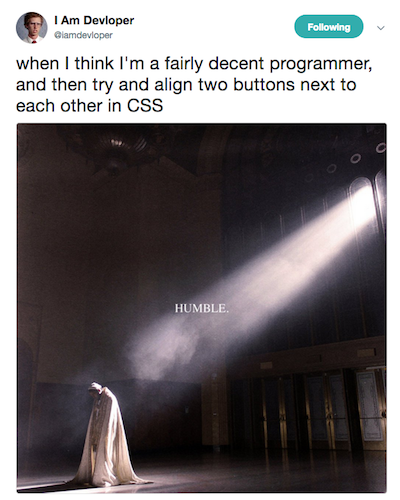
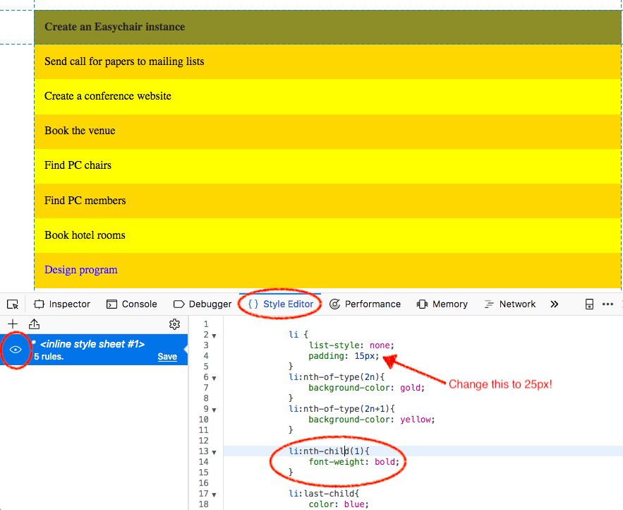
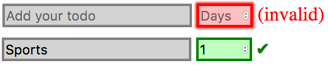
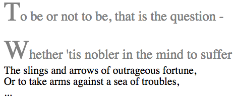
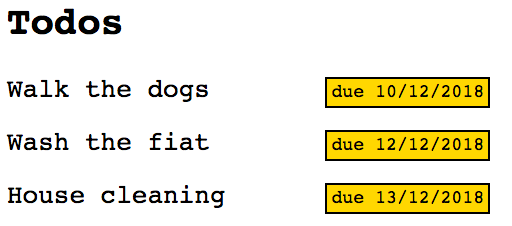
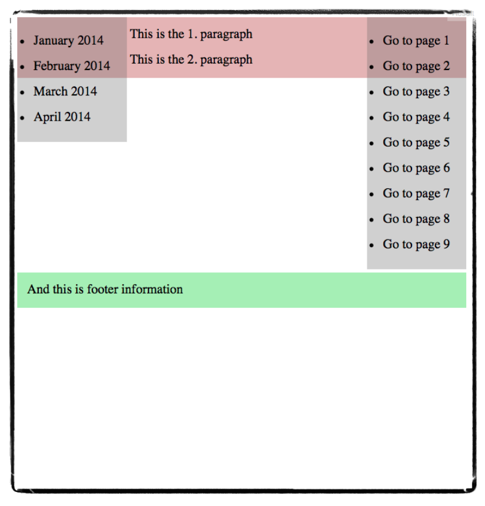
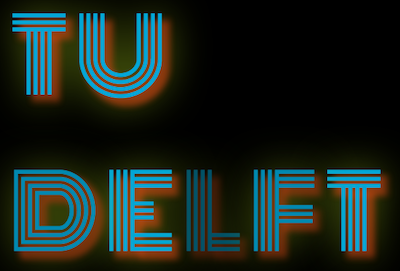

# CSS: the language of web design <!-- omit in toc -->

:point_right: [Overview of all Lecture 5 materials](README.md#lecture-5)

*At times we use :point_up: and :point_down: to make it clear whether an explanation belongs to the code snippet above or below the text. The :bangbang: sign is added to code examples you should run yourself.*

## Table of Contents <!-- omit in toc -->

- [Learning goals](#learning-goals)
- [A word of warning](#a-word-of-warning)
- [Context](#context)
- [Take-aways of book chapter 3](#take-aways-of-book-chapter-3)
- [Pseudo-classes](#pseudo-classes)
  - [:bangbang: nth-child(X) and nth-of-type(X)](#bangbang-nth-childx-and-nth-of-typex)
  - [:bangbang: root](#bangbang-root)
  - [:bangbang: hover and active](#bangbang-hover-and-active)
  - [:bangbang: enabled and disabled](#bangbang-enabled-and-disabled)
  - [:bangbang: not](#bangbang-not)
  - [:bangbang: Selector combinations](#bangbang-selector-combinations)
  - [:bangbang: valid and invalid](#bangbang-valid-and-invalid)
- [Pseudo-elements](#pseudo-elements)
  - [:bangbang: first-letter and first-line](#bangbang-first-letter-and-first-line)
  - [:bangbang: before and after](#bangbang-before-and-after)
- [:bangbang: Data attributes](#bangbang-data-attributes)
- [Element positioning](#element-positioning)
  - [:bangbang: Float](#bangbang-float)
  - [:bangbang: Position](#bangbang-position)
- [CSS media queries](#css-media-queries)
- [Animations and transitions](#animations-and-transitions)
  - [CSS vs. JavaScript animations](#css-vs-javascript-animations)
  - [:bangbang: Animations](#bangbang-animations)
  - [:bangbang: Transitions](#bangbang-transitions)
- [Browser-specific prefixes](#browser-specific-prefixes)
- [Rendering engines have bugs too!](#rendering-engines-have-bugs-too)
- [Self-check](#self-check)

## Learning goals

- Position and style HTML elements according to a given design of a web application.
- Employ pseudo-classes and pseudo-elements.
- Employ CSS variables and data access/creation facilities.
- Write CSS media queries.
- Create CSS-based animations.

## A word of warning



The [tweet](https://twitter.com/iamdevloper/status/936199543099621376) sums up a lot of CSS experiences - some things are easy with CSS (animations come to mind), while others, which intuitively should not be that hard to accomplish, will cost you a lot of time.

## Context

The CSS - or **Cascading Style Sheets** - language describes how elements in the document object model (DOM) should be rendered. As other web technologies, CSS can be considered a victim of the browser wars - which led to years of inactivity in the standard's refinement:

- **CSS1** became a W3C recommendation in 1996. It had support for fonts, colors, alignment, margins, ids and classes.
- Two years later, **CSS2** became a W3C recommendation, adding support for media queries and element positioning (among others). The W3C was ready to get started on CSS3. However, the browser support for CSS2 remained inconsistent; the W3C decided to focus on fixing inconsistencies with CSS2.1.
- In 2011, **CSS2.1** became a W3C recommendation which fixed errors and added support for features already widely implemented in major browsers.
- Work on **CSS3** began already in 1998, was put on hold, and is now back in full swing with browser vendors pushing to implement the newest standards. CSS became so complex and agreeing on a standard for the entire language became so tedious that after CSS2 the monolithic nature of the standard was given up. Instead, we now have **CSS modules**, which each progress at an individual pace. The current state of those modules is available at [https://www.w3.org/Style/CSS/current-work](https://www.w3.org/Style/CSS/current-work). Many of those modules are in *Working Draft* status, while some have already reached level 4 - the *level number* indicates how many revisions of the module have taken place.

Any CSS module developed after CSS2.1 can be considered as CSS3. There will not be a monolithic CSS4, instead the different modules of the CSS specification will each continue to develop at their own pace.

Be aware, that it is not possible to make use of the very latest CSS features and to expect them to work across all major browsers. Instead, which features to use should be based on:

- the intended user base (will tell us something about the most popular browsers in use);
- the mode of usage (smartphone vs. touch screen vs ...);
- the type of web application (are 3D animations necessary, etc.).

When building web applications that should work across a range of browsers (old and new), you will often come across the terms **shims**, **fallbacks** and **polyfills**. These are all terms used to provide HTML5 (which includes CSS3) functionalities in browsers that do not natively support them.

## Take-aways of book chapter 3

Having read Chapter 3 of the course book, you should be able to style HTML elements with CSS.

You have also learned about three types of style sheets:

- the browser's style sheet;
- the author's style sheet;
- the user's style sheet.

The user's style sheet overrides the other two and the author's style sheet overrides the browser's.

Style sheets are processed in order: later declarations override earlier ones if they are on the same or a higher specificity level.

You know that in the following code snippet :point_down::

```css
body {
  background-color: #ffff00;
}
```

`body` is a **selector**, `background-color` is a **property** and `#ffff00` is a **value**. You know the difference between a `class` and an `id` attribute and how to use both.

Lastly, you know about `!important` which overrides all other declarations.

In this lecture, we move beyond the course book chapter and highlight a number of more advanced CSS concepts.

:bangbang: **We strongly suggest to work with the toy examples presented here and not only render them yourself in the browser, but also make changes to the CSS to see the impact of those changes. Find out what your browser's Style Editor can do!**

## Pseudo-classes

A **pseudo-class** is a keyword added to a **selector** that indicates *a particular state or type* of the corresponding element. Pseudo-classes allow styling according to (among others) **document external** factors such as mouse movements and user browsing history.

They are used as follows :point_down::

```css
selector:pseudo-class {
    property: value;
    property: value;
}
```

Imagine you have a list of twenty todo items and you want to alternate the todo items' background color (to make it easier to read them). Two simple ways to go about this are:

- You can *hardcode* the CSS rule of every element, ending up with twenty rules. This is not maintainable.
- You write two CSS rules (one per background color), assign each to a class and then alternate in the todo items class assignment. Better than the first option, but the redundancy remains.

Ideally, we only create two CSS rules and solve the rest (alternate assignment of background colors) with pseudo-classes. And that's exactly what we can do with the two pseudo-classes we introduce next.

### :bangbang: nth-child(X) and nth-of-type(X)

- [`nth-child(X)`](https://developer.mozilla.org/en-US/docs/Web/CSS/:nth-child) is any element that is the Xth **child element** of its parent;
- [`nth-of-type(X)`](https://developer.mozilla.org/en-US/docs/Web/CSS/:nth-of-type) is any element that is the Xth **sibling** of its type.

In both cases, `X` can be an integer or formula, e.g `2n+1`, where `n` represents a number starting at 0 and incrementing. Instead of `2n` and `2n+1` we can also use `even` and `odd` as shortcuts. If we want to start counting elements in reverse order, we can use the analogous `nth-last-child(X)` and `nth-last-of-type(X)` pseudo-classes.

If we are aiming at the first and/or last child or sibling element, we also have additional shortcut pseudo-classes:

| Pseudo-class   | Equivalent to        |
|----------------|----------------------|
| `:first-child`   | `:nth-child(1)`        |
| `:last-child`    | `:nth-last-child(1)`   |
| `:first-of-type` | `:nth-of-type(1)`      |
| `:last-of-type`  | `:nth-last-of-type(1)` |

In the following example both pseudo-classes (`nth-child` and `nth-of-type`) are showcased :point_down::

```html
<!DOCTYPE html>
<html>
    <head>
        <style>
            li {
                list-style: none;
                padding: 15px;
            }
            li:nth-of-type(2n){
                background-color: gold;
            }
            li:nth-of-type(2n+1){
                background-color: yellow;
            }
            li:nth-child(1){
                color: tomato;
            }
            li:last-child{
                color: tomato;
            }
        </style>
    </head>
    <body>
        <ul>
            <li>Create an Easychair instance</li>
            <li>Send call for papers to mailing lists</li>
            <li>Create a conference website</li>
            <li>Book the venue</li>
            <li>Find PC chairs</li>
            <li>Find PC members</li>
            <li>Book hotel rooms</li>
            <li>Design program</li>
        </ul>
    </body>
</html>
```

This piece of code is rendered with alternating background colors as was our goal (try it out for yourself!). If we open Firefox's [Style Editor](https://developer.mozilla.org/en-US/docs/Tools/Style_Editor) we now see the following:



The Style Editor allows us to not only inspect the CSS, but to also:

- switch off the CSS (with a click on the "eye" symbol on the left);
- hover over a CSS rule to see what part of the rendering it affects (the screenshot was taken when the mouse hovered over `li:nth-child(1)`);
- **change the CSS** in the editor and view the immediate effect of those changes.

The last point is vital for efficient CSS styling: instead of coding, saving and opening your HTML file in the browser, you can prototype your CSS rules directly in the browser. Try it out for yourself! Just do not forget to then copy the new rules to your original CSS file as those changes are lost when the Style Editor is closed.

### :bangbang: root

One of the often voiced complaints about CSS used to be the lack of variable support (and thus languages that compile into CSS were born, e.g. [Sass](https://sass-lang.com/)) - in the example above :point_up:, we set the same color value of `tomato` in two CSS rules (if you are interested in why we have such a seemingly random collection of color names on the web, [head over to this Wikipedia overview](https://en.wikipedia.org/wiki/X11_color_names)). If we now decide to change that color value, we would have to manually walk over all style sheets and alter it. Clearly, variables (i.e. *entities containing specific values that can be reused*) would be very helpful.

In fact, since 2015/2016 (*yes, it took that long*), [CSS variables](https://developer.mozilla.org/en-US/docs/Web/CSS/Using_CSS_variables) are supported in all major browsers. Here is how they work :point_down::

```html
<!DOCTYPE html>
<html>
    <head>
        <style>
            :root {
                --highlight-color: tomato;
            }
            li {
                list-style: none;
                padding: 15px;
            }
            li:nth-of-type(2n){
                background-color: gold;
            }
            li:nth-of-type(2n+1){
                background-color: yellow;
            }
            li:nth-child(1){
                color: var(--highlight-color);
            }
            li:last-child{
                color: var(--highlight-color);
            }
        </style>
    </head>
    <body>
        <ul>
            <li>Create an Easychair instance</li>
            <li>Send call for papers to mailing lists</li>
            <li>Create a conference website</li>
            <li>Book the venue</li>
            <li>Find PC chairs</li>
            <li>Find PC members</li>
            <li>Book hotel rooms</li>
            <li>Design program</li>
        </ul>
    </body>
</html>
```

:point_up: In this example, we create a global CSS variable, i.e. one that is available to all elements in the DOM tree. For this reason, we make use of the pseudo-element `:root` which represents the `<html>` element. Variables are defined with the custum prefix `--` and can be accessed using the `var()` functionality. Non-global CSS variables can be added in the same manner to any element.

### :bangbang: hover and active

In the beginning we mentioned mouse movements as one of the document external factors that we can make our elements react to. Two popular pseudo-classes in this category are `:hover` and `:active`:

- `:hover` is a selector that becomes active when a mouseover on the element occurs.
- `:active` is a selector that becomes active when the element is currently *being active* (usually that means clicked).

Here is a simple example :point_down::

```html
<!DOCTYPE html>
<html>
    <head>
        <style>
            button {
                background: white;
                color: darkgray;
                width: 100px;
                padding: 5px;
                font-weight: bold;
                text-align: center;
                border: 1px solid darkgray;
            }

            button:hover {
                color: white;
                background: darkgray;
            }

            button:active {
                border: 1px dashed;
                border-color: black;
            }
        </style>
    </head>
    <body>
        <main>
            <button>Add Todo</button>
        </main>
    </body>
</html>
```

While this toy example is not very impressive, `:hover` can easily be employed to create image galleries (preview vs. full image) as well as pure CSS dropdown menus (hide the menu items apart from the header and only reveal them when the mouse hovers over the header).

### :bangbang: enabled and disabled

Particularly important for board game applications such as those in our assignments may be the pseudo-classes `:enabled` and `:disabled`. Imagine a game item that is only available sometimes; in our demo game for instance, once a letter has been clicked it is no longer possible to select it again. And of course this information should be visually conveyed to the user:

- `:enabled` is an element that can be clicked or selected.
- `:disabled` is an element that cannot be clicked or selected.

An example :point_down::

```html
<!DOCTYPE html>
<html>
    <head>
        <script>
            function disable(el){
                document.getElementById(el.id).disabled = true;
            }
        </script>
        <style>
            button {
                background: white;
                color: darkgray;
                width: 100px;
                padding: 5px;
                font-weight: bold;
                text-align: center;
                border: 1px solid darkgray;
            }

            button:enabled:hover {
                color: white;
                background: darkgray;
            }

            button:enabled:active {
                border: 1px dashed;
                border-color: black;
            }

            button:disabled {
                background: #ddd;
                color: #aaa;
                border: 1px solid #bbb;
            }
        </style>
    </head>
    <body>
        <main>
            <button id="b" onclick="disable(this)">Add Todo</button>
        </main>
    </body>
</html>
```

:point_up: Here you can see that it is possible to combine pseudo-classes, in this case we use `button:enabled:active` and define a style that an enabled **and** active button should have. Once the button is disabled, its style will not change anymore, no matter the mouse movements.

### :bangbang: not

`:not(X)` is a pseudo-class that matches all elements that are not represented by selector `X`. Let's look at at :point_down::

```html
<!DOCTYPE html>
<html>
  <head>
    <style>
      main :not(.todo){
        color: orange;
      }
    </style>
  </head>
  <body>
    <main>
      <h2>Todos</h2>
      <p class="firsttodo">Today's todos</p>
      <p class="todo">Tomorrow's todos</p>
      <p class="todo">Saturday's todos</p>
      <p>Sunday's todos</p>
    </main>
  </body>
</html>
```

:point_up: Important to know here is, that the selector `e1 e2` selects **all `<e2>` elements inside `<e1>` elements**. The `:not` selector is a short form for `*:not` with `*` being the **universal selector** (selecting all elements). Altogether our CSS rule says that any element within `<main>` that does not have class attribute `.todo` is assigned an orange font color.

### :bangbang: Selector combinations

`e1 e2` is not the only possible element combination as selector. Most commonly used are:

| Selector | Description                                            |
|----------|---------------------------------------------------------|
| e1       | Selects all `<e1>` elements                               |
| e1 e2    | Selects all `<e2>` elements within `<e1>`                   |
| e1,e2    | Selects all `<e1>` elements and all `<e2>` elements         |
| e1>e2    | Selects all `<e2>` elements that have `<e1>` as parent      |
| e1+e2    | Selects all `<e2>` elements that follow `<e1>` immmediately |

An example should make the differences between them clear :point_down::

```html
<!DOCTYPE html>
<html>
  <head>
    <style>

      /* select all p elements within div */
      div p {
        background-color: black;
        color: white;
      }
      /* select all main and all footer elements */
      main, footer {
        background-color: yellow;
      }
      /* select all p elements that have div as parent */
      div > p {
        font-weight: bold;
      }
      /* select all p elements that follow div immediately */
      div + p {
        color: red;
      }
    </style>
  </head>
  
  <body>
    <main>

      <div class="today">

        <div class="urgent">
          <p>Shopping</p>
          <p>Sports</p>
        </div>

        <p>Go to class</p>  <!-- follows directly after a <div></div> -->

      </div>

      <div class="tomorrow">

        <p>Go to class</p>

        <div class="urgent">
          <p>Organising the holidays</p>
        </div>

      </div>

    </main>

    <footer>
      <p>CSS example 2018.</p> <!-- a <p> element not inside a <div> -->
    </footer>
  </body>
</html>
```

The rendering of the above code looks as follows:


### :bangbang: valid and invalid

Let's move on to two more pseudo-classes, that are particularly useful for the styling of HTML forms: `:valid` and `:invalid`. Defining different styles for acceptable and non-acceptable input (e.g. if we have a grade form, only numbers from 0 to 10 are valid) makes it easy for users to see what is wrong. Although we can also use client-side JavaScript to check an input's validity, if we can do so with a CSS rule, that is preferred (less code to write for the developer, fewer opportunities to introduce bugs).

`:valid` and :`invalid` can be employed as pseudo-classes of any `<input>` element. Input elements are valid if their value adheres to the input type (a number for `type=number`, an email for [`type=email`](https://developer.mozilla.org/en-US/docs/Web/HTML/Element/input/email), etc.) and potential additional limitations due to attribute settings such as `min` or `max` as seen in this example :point_down::

```html
<!DOCTYPE html>
<html>
  <head>
    <style>
      input[type=text] {
        border: 0px;
        width: 150px;
        background-color: lightgrey;
        border: 2px solid grey;
      }

      input[type=number]{
        width: 40px;
      }

      input[type=number]:valid {
        background-color: rgba(0, 255, 0, 0.25);
          border: 2px solid green;
      }

      input[type=number]:invalid {
        background-color: rgba(255, 0, 0, 0.25);
          border: 2px solid red;
      }

      input[type=number]:valid + label::after {
        content: "\2714";
        color: green;
      }

      input[type=number]:invalid + label::after {
        content: " (invalid)";
        color: red;
      }
    </style>
  </head>
  <body>
    <main>
      <input type="text" placeholder="Add your todo" />
      <input id="dl" type="number" min="1" max="30" step="1" placeholder="Days" required />
      <label for="deadline1"> </label>
    </main>
  </body>
</html>
```

The rendered output with an invalid and valid deadline respectively looks as follows:



:point_up: This example does not only show off these four pseudo-classes, but also a number of other CSS features:

- **Attribute selectors** (e.g. `input[type=number]`) allow us to select specific types of `<input>` elements.
- The [`<label>`](https://developer.mozilla.org/en-US/docs/Web/HTML/Element/label) element can be associated with an `<input>` element when the latter's `id` attribute is the same as the `<label>`'s `for` attribute. This is particularly useful when labels are used as captions for user interface elements: a click on the label text will then activate the interface element (e.g. a checkbox). Here, we make use of the label to signal a valid or invalid input.
- We see here how to include **unicode characters**: when the deadline number is valid, we choose to display a checkmark, similar to :white_check_mark: (this image is a [GitHub Markdown emoji](https://gist.github.com/rxaviers/7360908) btw). This checkmark could indeed be an image, but here we chose to use a character, specifically unicode character [U+2714](http://graphemica.com/%E2%9C%94).
- The pseudo-element `::after` makes a first appearance, together with the `content` property. We discuss those next.

## Pseudo-elements

A **pseudo-element** creates an abstractions about the document tree *beyond* those specified by the document language; it provides access to an element's sub-part.

In order to distinguish pseudo-classes and pseudo-elements, the `::` notation was introduced in the specification, though browsers also accept the one-colon notation.

### :bangbang: first-letter and first-line

So, what are abstractions that go beyond what is specified in the document language? Two popular examples are the `::first-letter` and the `::first-line` pseudo-elements; they do exactly what the names suggests, enabling you to style the first letter and line respectively. Without those pseudo-elements, you would have to wrap the first letter in a `<span>` element and find a clever way of computing what exactly the first line of a piece of text is (to again, wrap it in a `<span>` element). Let's look at an example :point_down::

```html
<!DOCTYPE html>
<html>
  <head>
    <style>
    p::first-line {
      color: gray;
      font-size: 125%;
    }

    p::first-letter {
      font-size: 200%;
    }
    </style>
  </head>
  <body>
    <p>
      To be or not to be, that is the question -
    </p>

    <p>
      Whether 'tis nobler in the mind to suffer <br>
      The slings and arrows of outrageous fortune, <br>
      Or to take arms against a sea of troubles, <br>
      ...
    </p>
  </body>
</html>
```

The browser renders this code as follows:



When you open this example in your own browser, change the size of the browser window - the first line, no matter how long or small, will always be rendered in grey.

The code example :point_up: also showcases the percent unit for the `font-size` property. The base font-size of the document equates to `100%` and thus this unit allows you to scale the font-size in relation to the initial size. This is especially helpful when you design web applications for different device sizes - no additional *tuning* for different devices is required.

### :bangbang: before and after

As already seen in the [HTML form example](#bangbang-valid-and-invalid), adding (cosmetic) content right before and after an element is achieved through:

- `::before`
- `::after`

in combination with the `content` property.

Here is one extreme example of this concept, where all document *content* is delegated to the style sheet :point_down: (the unicode characters [201C](http://unicode.org/cldr/utility/character.jsp?a=201C) and [201D](https://unicode.org/cldr/utility/character.jsp?a=201D&B1=Show) are quotation marks):

```html
<!DOCTYPE html>
<html>
  <head>
    <style>
    cite::before {
      content: "\201CTo be, or ";
    }

    cite::after {
      content: "not to be ... \201D";
    }
    </style>
  </head>
  <body>
    <cite></cite>
  </body>
</html>
```

This is a poor choice admittedly as [accessibility](https://www.w3.org/standards/webdesign/accessibility) is close to zero. The document appears as content-less to a **screen reader**, a form of assistive technology that most commonly makes use of a text-to-speech engine to translate a HTML document into speech.

## :bangbang: Data attributes

As just seen, CSS does not only describe the style, it *can* carry data too. There are issues though:

- Data is distributed across HTML and CSS files.
- CSS is conventionally not used to store data.
- Content is not part of the DOM (leading to the just described accessibility problem).

Here is another example of storing data in CSS :point_down::

```html
<!DOCTYPE html>
<html>
  <head>
    <style>
    * {
      font-family: monospace;
    }

    p::after {
      background-color: gold;
      border: 1px solid;
      font-size: 70%;
      padding: 2px;
      margin-left: 50px;
    }

    p#t1::after {
      content: "due 10/12/2018";
    }

    p#t2::after {
      content: "due 12/12/2018";
    }

    p#t3::after {
      content: "due 13/12/2018";
    }
    </style>
  </head>
  <body>
    <main>
      <h2>Todos</h2>
      <p id="t1">Walk the dogs </p>
      <p id="t2">Wash the fiat </p>
      <p id="t3">House cleaning</p>
    </main>
  </body>
</html>
```

This is rendered as follows:



Instead of storing data directly in CSS, a better way is to *make use of data stored in HTML elements*. This is achieved through so-called **data attributes**: attributes on any HTML element that are prefixed with `data-`.

CSS can access those data attributes with the [`attr()`](https://developer.mozilla.org/en-US/docs/Web/CSS/attr) function: it retrieves the value of the selected element and data attribute.

Rewriting the example above with `data-` attributes removes the data from CSS and reduces the amount of CSS rule duplication :point_down: (the rendering remains the same):

```html
<!DOCTYPE html>
<html>
  <head>
    <style>
    * {
      font-family: monospace;
    }
    p::after {
      background-color: gold;
      border: 1px solid;
      font-size: 70%;
      padding: 2px;
      margin-left: 50px;
    }

    p::after {
      content: "due " attr(data-due);
    }
    </style>
  </head>
  <body>
    <main>
      <h2>Todos</h2>
      <p id="t1" data-due="10/12/2018" data-level="urgent">Walk the dogs </p>
      <p id="t2" data-due="12/12/2018">Wash the fiat </p>
      <p id="t3" data-due="13/12/2018">House cleaning</p>
    </main>
  </body>
</html>
```

A canonical example for `data-` attributes are tooltips :point_down::

```html
<!DOCTYPE html>
<html>
  <head>
    <style>
    li {
      cursor: help;
    }

    li:hover::after{
      background-color: rgba(10,10,10,0.7);
      color: gold;
      border: 1px dashed;
      padding: 5px;
      font-size: 60%;
      content: attr(data-name);
      position: relative;
      bottom: 15px;
      left: 5px;
    }
    </style>
  </head>
  <body>
    <main>
      <ul>
        <li data-name="Cascading Style Sheets">CSS</li>
        <li data-name="HyperText Markup Language">HTML</li>
        <li data-name="HyperText Transfer Protocol">HTTP</li>
        <li data-name="HyperText Transfer Protocol Secure">https</li>
      </ul>
    </main>
  </body>
</html>
```

This example :point_up: also showcases the use of the [`cursor`](https://developer.mozilla.org/en-US/docs/Web/CSS/cursor) property. Hovering over the list items results in a help icon. Note, that `cursor: none` results in no cursor being rendered, though this should be used with care as it tends to confuse users. The `position`, `bottom` and `left` properties will be discussed next (in short: they determine the placement of the tooltip).

## Element positioning

One of the more complex aspects of CSS are the myriad of ways to achieve element positioning (MDN's [CSS layout guide](https://developer.mozilla.org/en-US/docs/Learn/CSS/CSS_layout) provides you with a good idea of what options exists). We here consider three CSS properties used for element positioning:

- [`float`](https://developer.mozilla.org/en-US/docs/Web/CSS/float) defines how an element floats in the containing element (which in turn determines how other elements flow around it);
- [`position`](https://developer.mozilla.org/en-US/docs/Web/CSS/position) defines how an element is positioned in a document;
- [`display`](https://developer.mozilla.org/en-US/docs/Web/CSS/display) defines the display type of an element.

Let's also define two additional concepts, that stem from HTML4:

- **Block-level elements** are surrounded by line-breaks. They can contain block-level and inline elements. **The width is determined by their containing element.** Examples of block-level elements are `<main>` or `<p>`.
- **Inline elements** can be placed within block-level or inline elements. They can contain other inline elements. **The width is determined by their content.** Examples are `<span>` or `<a>`.

Note: While HTML5 has categories with more complex interactions, for the three properties listed above, the block-level and inline notions are sufficient.

### :bangbang: Float

By default, elements *flow*. Their order is determined by the order of their appearance in the HTML document.

In order to understand what exactly this means, experiment with the following code :point_down::

```html
<!DOCTYPE html>
  <head>
    <style>

      * {
        border-style: solid;

        /* Try out what happens when the following two lines
         * are removed ("CSS reset")
        */
        margin: 0;
        padding: 0;
      }

      body {
        border-color: orange;
      }

      main {
        border-color: grey;
      }

      span {
        border-color: green;
      }

      a {
        border-color: red;
      }

      p {
        border-color: blue;
      }

      /* Block-level vs. inline elements:
       * use `width: auto` as alternative
       */
      main {
        width: 400px;
      }

      /* element floating (use left/right/none) */
      /* a {
       *  float: left;
       * }
       */

    </style>
  </head>
  <body>
    <main>
      <p>
        This is a paragraph containing <a href="#">a link</a>.
      </p>
      <p>
        This is another paragraph
        <span>
          with a span and a <a href="#">link in the span</a>.
        </span>
      </p>
    </main>
  </body>
</html>
```

Admittedly, the resulting rendering is not looking great:


However, it serves a purpose: it helps us to understand how the different elements appear within their parent element.

:point_up: Try out the following code variations (remember, that you can make these changes directly in the *Style Editor* of your browser):

- Manually resize the browser window to explore how the block-level and inline elements render at different window sizes.
- In the `*{...}` we have employed a CSS reset, by setting both `margin` and `padding` to `0`. Remove those two lines of code.
- Replace `main { width: 400px; }` with `main { width: auto; }` and once more manually resize the browser window.

Let's now explore the use of `float`. With the `float` property, we can change the default flow. `float:left` (or `float:right`) takes an element **out of the flow**; it is then moved to the **leftmost** (or rightmost) possible position **in the containing element** - which is either the element edge or another float. In addition, if an element should not float, we can use `float: none`.

Try out the effects of `float` on the code example :point_up: by using one after the other:

- `a {float: right}`
- `a {float: left}`
- `a {float: none}`

If needed, we can also reset the flow the the value `clear`, either to reset the `left`, `right` or `both` sides of the flow. The canonical example for flow resetting are web page layouts that have **sidebars**, such as this one :point_down::



Here, we have two sidebars that each *float* to the left and right of the main content respectively. The footer should appear below both sidebars. Try out the HTML below :point_down: to see the effect of both `float` and `clear`: remove the commenting of one CSS rule at a time.

```html
<!DOCTYPE html>
  <head>
    <style>

    .nav {
      background-color: grey;
    }

    main {
      background-color: red;
    }

    footer {
      background-color: green;
    }


    /* Floating to the sides */
    /*
     * #nav1 {
     *  float: right;
     * }
     */

    /* Floating to the sides */
    /*
     * #nav2 {
     *  float: left;
     * }
     */

    /*
     * Resetting the flow: try what happens if clear:left or clear:right
     * is used alone. Instead of both left and right, we can also use
     * clear:both;
     */
    /*
     * footer {
     *  clear: left;
     *  clear: right;
     * }
     */  
    </style>
  </head>
  <body>
    <div id="nav1" class="nav">
      <ul>
        <li>Go to page 1</li>
        <li>Go to page 2</li>
        <li>Go to page 3</li>
        <li>Go to page 4</li>
        <li>Go to page 5</li>
      </ul>
    </div>

    <div id="nav2" class="nav">
      <ul>
        <li>January 2019</li>
        <li>February 2019</li>
        <li>March 2019</li>
        <li>April 2019</li>
      </ul>
    </div>

    <main>
      <p>
        Paragraph 1.
      </p>

      <p>
        Paragraph 2.
      </p>
    </main>

    <footer>
      Footer information.
    </footer>
  </body>
</html>
```

### :bangbang: Position

The [`position` property](https://developer.mozilla.org/en-US/docs/Web/CSS/position) enables fine-grained movement of elements. This is in contrast to `float`, which  meets our demands for coarse-grained positioning. Elements can be moved around in any direction (up/down/left/right) by absolute or relative units.

The `position` property has a number of possible values:

| Value             | Description                                                                        |
|-------------------|------------------------------------------------------------------------------------|
| `position:static`   | the default                                                                            |
| `position:relative` |  the element is adjusted on the fly, other elements are **not** affected               |
| `position:absolute` |  the element is taken out of the normal flow (**no space is reserved for it**)         |
| `position:fixed`    |  similar to `absolute`, but fixed to the **viewport** (=the area currently being viewed) |
| `position:sticky`   | in-between `relative` and `fixed`                                                      |

Important to know when using the `position` property is the direction of the CSS coordinate system: the top-left corner is `(0,0)`. The y-axis extends **downwards**. The x-axis extends to the **right**.

Let's walk through each of the position values in turn, starting with `relative`, where the movement of the element is **relative** to an element's original position. The horizontal offset from the original position is set through properties `left` and `right`, the vertical offset is controlled through `top` and `bottom`.

For the `position` property, we use a stack of eggs and reposition one or more eggs at a time. The original stack looks like this:


The following code uses relative positioning :point_down: to reposition two of the four eggs:

```html
<!DOCTYPE html>
  <head>
    <style>

    img {
      width: 50px;
    }
    /*
     * Try out different pixel values.
     * Remember that the coordinate system starts at the top-left
     * corner and extends downward and to the right!
     * What happens if the pixel value is negative?
     * At what point do the "eggs" leave the viewport?
     */
    #egg2 {
      position: relative;
      bottom: 20px;
      left: 20px;
    }

    #egg4 {
      position: relative;
      bottom: 50px;
      right: 10px;
    }

    </style>
  </head>
  <body>
    <main>
        <br />
         <br />
         <br />
        <br />
    </main>
  </body>
</html>
```


:point_down: If we change the positioning of some eggs to `position:absolute`, we now see that **they are taken out of the normal flow** and **no space** is reserved for them. The positioning of those elements is now relative to the *nearest ancestor* or the window itself (in our case it is the window itself):

```html
<!DOCTYPE html>
  <head>
    <style>

    img {
      width: 50px;
    }

    /*
     * Try out different pixel values.
     * Remember that the coordinate system starts at the top-left
     * corner and extends downward and to the right!
     */
    #egg2 {
      position: absolute;
      bottom: 50px;
      left: 0px;
    }

    #egg4 {
      position: absolute;
      bottom: 0px;
      right: 0px;
    }

    </style>
  </head>
  <body>
    <main>
        <br />
         <br />
         <br />
        <br />
    </main>
  </body>
</html>
```


:point_down: The `position:fixed` value is similar to `position:absolute`, but now the containing element is the **viewport**, i.e. the area of the document that is visible in the browser. This means that elements with `position:fixed` remain visible. Here is an example (you need to minimize the window until you need to scroll down to see all of the four eggs to achieve a visible effect):

```html
<!DOCTYPE html>
  <head>
    <style>

    img {
      width: 50px;
    }

    #info {
      position: fixed;
      background: yellow;
      left: 20px;
      top: 20px;
    }

    </style>
  </head>
  <body>
    <main>
        <br />
         <br />
         <br />
        <br />
    </main>

    <div id="info">
        These are no easter eggs.
    </div>
  </body>
</html>
```

Lastly, we cover the `display` property, which enables us to change the element type at will (block-level to inline and vice versa) at will and *hide* elements from view. The latter is likely to be most useful to us:

| Value          | Description                                                                                   |
|----------------|-----------------------------------------------------------------------------------------------|
| `display:inline` |  The element is rendered with an inline element box.                                          |
| `display:block`  |  The element is rendered with a   block element box.                                          |
| `display:none`   |  The element (and its descendents) are hidden from view; no space is reserved in the layout.  |

Once more, an example is sufficient to highlight the use of each of these values - uncomment the CSS rules one at a time:

```html
<!DOCTYPE html>
  <head>
    <style>
      p, span {
        border-style: solid;
        padding: 10px;
        margin: 10px;
      }
      p {
        border-color: blue;
      }

      /*
       * Try out the effect of adding each of these
       * display settings.
       */

      /*
       * span {
       *  border-color: red;
       * }
       */

      /*  
       * span {
       *  display: block;
       * }
       */

      /*
       * p {
       *   display: inline;
       * }
       */

      /*
       * span {
       *  display: none;
       * }
       */
    </style>
  </head>
  <body>
    <p>
      This is paragraph one.
    </p>

    <span>
      Span element one.
    </span>

    <span>
      Span element two.
    </span>

    <p>
      This is paragraph two.
    </p>
  </body>
</html>
```

## CSS media queries

So far, we have covered the basics of CSS but largely ignored the fact that in today's **multi-device** world, we are designing web applications for vastly different screen sizes. Different devices should be served different styles:

- when **printing** a web application's screen :fax:, the information printed should be the essentials (no ads, no sidebars, etc.);
- when **viewing** a web application on a small screen :iphone:, non-essential information (e.g. a footer) should be removed;
- when **viewing** a web application on a large screen :computer: all available information should be presented;
- when using **text-to-speech** devices :sound:, non-essential information should be removed.

**CSS media queries** enable the use of **device**/**media-type dependent** style sheets. While the HTML document is written once, the CSS is written once per device type. There are four device types currently in use:

| Value         | Description                               |
|---------------|-------------------------------------------|
| `media all`    |  Suitable for all device types.           |
| `media print` |  Suitable for documents in print preview. |
| `media screen` |  Suitable for screens.                    |
| `media speech` | Suitable for speech synthesizers.         |

Media queries are specified as so-called [at-rules](https://developer.mozilla.org/en-US/docs/Web/CSS/At-rule), that start with an `@` and instruct CSS how to behave. We will not only encounter at-rules for media queries, but also when discussing CSS animations later on.

Here is a concrete example of how media queries enable a **responsive design** :point_down::

```html
<!DOCTYPE html>
  <head>

    <!-- We can link a style sheet conditional on the media attribute -->
    <!-- Example of a logical or (,) in the media query -->
    <link rel="stylesheet" media="screen and (min-width: 800px), (min-width: 3000px)" href="large-device.css">

    <style>
      * {
        padding: 10px;
      }

      main {
        background-color: red;
      }

      #sidebar {
        background-color: green;
        float: right;
      }

      /* when printing, use black and white */
      @media print {
        body {
          color: black !important;
          width: 100%;
        }
      }

      /* hide the sidebar for small devices */
      /* Example of a logical or (",") as well as and ("and") in the media query */
      @media print, screen and (max-width: 400px) {
        #sidebar {
          display: none;
        }
      }
    </style>
  </head>
  <body>
    <div id="sidebar">
      <ul>
        <li>Anchor 1</li>
        <li>Anchor 2</li>
        <li>Anchor 3</li>
      </ul>
    </div>

    <main>
      <p>
        Paragraph 1
      </p>
      <p>
        Paragraph 2
      </p>  
      <p>
        Paragraph 3
      </p>  
      <p>
        Paragraph 4
      </p>  
    </main>
  </body>
</html>
```

Use your browser's responsive design mode :point_down: and the browser's *Print as PDF* feature to test the behaviour of the media queries.


## Animations and transitions

In general, CSS styles (states) are defined by the developer. The **rendering engine** takes care of the transition between styles. A rendering engine - also known as *browser engine* or *layout engine* - is responsible for translating HTML+CSS (among others) to the screen. The major browsers ship with their own rendering engines, the names of which you will encounter from time to time, especially when using CSS animations and transitions:

| Engine   | Browsers                                |
|----------|-----------------------------------------|
| `Gecko`    | Firefox                                 |
| `Trident`  | Internet Explorer                       |
| `EdgeHTML` | Microsoft Edge                          |
| `WebKit`   | Safari, older versions of Google Chrome |
| `Blink`    | Google Chrome, Opera                    |

**Animations** consist of:

- an animation style (e.g. `linear`);
- a number of **keyframes** that act as transition waypoints.

**Transitions** are animations with a simpler syntax. They consist of exactly **two states**: start and end state.

### CSS vs. JavaScript animations

There are several advantages to using CSS-based instead of JavaScript-based animations:

- CSS is relatively easy to use and debugging them is easier than debugging JavaScript code.
- The rendering engines are optimized for CSS-based animations; there is no need to optimize your JavaScript code.
- CSS animations can do much more than animating buttons. To see what is possible, head over to CodePen and look at a few [CSS animations](https://codepen.io/search/pens?q=css%20animation).

### :bangbang: Animations

Here is a first animation example - TU Delft rendered as a neon sign, adapted from [this CodePen example](https://codepen.io/DevchamploO/pen/NBWBGq) :point_down::

```html
<!DOCTYPE html>
<html>
  <head>
    <!-- Loading a specific font: https://fonts.google.com/specimen/Monoton -->
    <link href="https://fonts.googleapis.com/css?family=Monoton" rel="stylesheet">

    <style>
      body{
        background: black;
      }

      .neon{
        font-family: 'Monoton', cursive; /* referencing the loaded font */
        font-size: 150px;
        color: #00A6D6;
        position: absolute;
        top: 50%;
        left: 50%;
        transform: translate(-50%, -50%);
        font-weight: 400;
        letter-spacing: 10px;
        text-shadow: 10px 10px 10px #E64616, 5px 5px 60px #A5CA1A;
      }

      /*
       * Instead of linear, also try out `ease-in`, `ease-out`, `steps(10)`.
       */
      .flicker-slow{
        animation: flicker 3s linear infinite;
      }

      .flicker-fast{
        animation: flicker 1s linear infinite;
      }
      /*
       * The above short-hand can be replaced by the
       * following animation properties:
       */

      /*
      .flicker-slow{
        animation-name: flicker;
        animation-duration: 3s;
        animation-timing-function: linear;
        animation-iteration-count: infinite;
      }

      .flicker-fast{
        animation-name: flicker;
        animation-duration: 1s;
        animation-timing-function: linear;
        animation-iteration-count: infinite;
      }
      */

      @keyframes flicker {
        0%, 30%, 33%, 55%, 100% {
            opacity: .99;
        }

        31%, 50%, 56% {
          opacity: 0.3;
        }
      }
    </style>
  </head>
  <body>
    <h1 class="neon">
      TU <span class="flicker-slow">D</span>E<span class="flicker-fast">L</span><span class="flicker-slow">F</span>T
    </h1>
  </body>
</html>
```

It renders as follows:



The example :point_up: contains a number of interesting points:

- It is easy to load additional fonts. A popular free font service is [Google Fonts](https://fonts.google.com/); more information on how to use it is available from [MDN](https://developer.mozilla.org/en-US/docs/Learn/CSS/Styling_text/Web_fonts#Using_an_online_font_service).
- The CSS property [`text-shadow`](https://developer.mozilla.org/en-US/docs/Web/CSS/text-shadow) adds - as the name suggests - shadow to text. Importantly, a list of shadows can be added in a comma-separated list which are applied front-to-back (the first shadow is on top). Shadows can be defined in a number of ways, we here stick to a single one: `offset-x offset-y blur-radius color`.
- The [`animation`](https://developer.mozilla.org/en-US/docs/Web/CSS/animation) property is a short-hand property that combines a number of `animation-*` properties in one line. Specifically in our example `animation: flicker 3s linear infinite` refers to the keyframes (`flicker` - the `animation-name`), the duration of one animation cycle (3 seconds - the `animation-duration`), the `animation-timing-function` (`linear` means that the animation moves from start to end in a constant rate) and the `animation-iteration-count` (here: `infinite`, i.e. the animation never stops). We defined here two types of flickers: a slow flicker (3 seconds to complete a cycle) and a fast flicker (1 second to complete the cycle). Different letters of our `TU Delft` string are assigned to different *flicker classes*.
- The [`@keyframes`](https://developer.mozilla.org/en-US/docs/Web/CSS/@keyframes) control the intermediate steps in a CSS animation. In order to achieve flickering we change the opacity of the text string. In one animation cycle, we repeatedly move from an opacity of `.99` to `.3` and back. Specifically, we define 8 waypoints of our animation (with either opacity of `.99` or `.3`): `0%, 30%, 31%, 33%, 50%, 55%, 56%, 100%`. The rendering engine is then responsible to turn this code into an actual animation that resembles flickering.

To summarize, for us the most important animation properties are the following:

| Property                  | Despcription                                                                                                                       |
|---------------------------|------------------------------------------------------------------------------------------------------------------------------------|
| `animation-iteration-count` | Number of times an animation is executed (default: 1);  the value is either a positive number or `infinite`.                         |
| `animation-direction`       | By default the animation restarts at the starting keyframe;  if set to `alternate` the animation direction changes every  iteration. |
| `animation-delay`           | Number of seconds (s) or milliseconds (ms) until the animation  starts (default 0s).                                               |
| `animation-name`            | Identifies the `@keyframes`.                                                                                                         |
| `animation-duration`        | The duration of a single animation cycle in seconds (s) or milliseconds (ms).                                                      |
| `animation-timing-function` | Specifies how a CSS animation progresses between waypoints (common  choices are `linear`, `ease-in`, `ease-out`, `steps(N)`).              |

Let's look at a second example :point_down:, which shows a slightly different way to define keyframe waypoints: instead of `0%` the start state can also be defined with `from`, while the end state (`100%`) can be defined with `to` (and these two can also be mixed with other waypoints such as `50%`). This animation slides TU Delft's letters in place, with different letters moving at different speeds:

```html
<!DOCTYPE html>
<html>
  <head>
    <style>
      body {
        background-color: black;
        width: 900px;
        margin: 100px auto;
      }

      .box {
        width: auto;
        height: 100px;
        background-color: #00a6d6;
        margin: 0 auto;
        float: left;
        font-size: 100px;
        padding: 20px;
        color: white;
        text-shadow: 3px 3px 2px black;
      }

      @keyframes move {
        from {
          transform: translate(0px, 1000px)
        }

        to   {
          transform: translate(0px, 0px)
        }
      }

      #box1, #box7 {
        animation: move 1s;
      }

      #box2, #box8 {
        animation: move 4s;
      }

      #box3, #box6 {
        animation: move 2s;
      }

      #box4, #box5 {
        animation: move 3s;
      }
    </style>
  </head>
  <body>
      <div class="box" id="box1">T</div>
      <div class="box" id="box2">U</div>
      <div class="box" id="box3">&nbsp;&nbsp;</div>
      <div class="box" id="box4">D</div>
      <div class="box" id="box5">E</div>
      <div class="box" id="box6">L</div>
      <div class="box" id="box7">F</div>
      <div class="box" id="box8">T</div>
  </body>
</html>
```

:point_up: The animation's start state is defined through the [`transform`](https://developer.mozilla.org/en-US/docs/Web/CSS/transform) property, which allows us to rotate, scale, skew and translate an element: at the start of the animation, the elements are moved ([`translate`](https://developer.mozilla.org/en-US/docs/Web/CSS/transform-function/translate)) from their original position to a position that is 1000 pixels down. The end state of the animation moves the elements to position 0/0 again. While this may seem to move all letter elements to the same position, the `float:left` property ensures that the letters appear next to each other as intended.

### :bangbang: Transitions

Transitions are animations with only two states (a start state and an end state).

We actually have been using transitions all this time already, e.g. when defining `:hover`. In this case, the transition is from the original element style to the hover style. 

We can make use of the [`transition`](https://developer.mozilla.org/en-US/docs/Web/CSS/CSS_Transitions/Using_CSS_transitions) property to control the animation between the start and end state. The example below :point_down: shows off what the impact of `transition` is: we define two boxes which, when being hovered over, change their rotation by 70 degrees.

- `#box1` has no `transition` property, which makes the style change instanteneous;
- `#box2` has the `transition` property which determines how fast the transition for different properties takes place and we see a smooth animation when hovering.

```html
<!DOCTYPE html>
<html>
  <head>
    <style>
      #box1 {
        width: 100px;
        height: 100px;
        background-color: lightgreen;
      }

      #box1:hover {
        transform: rotate(70deg);
        background-color: darkgreen;
      }

      #box2 {
        width: 200px;
        height: 200px;
        background-color: yellow;
        transition: width 2s, height 2s, background-color 2s, transform 2s;
      }

      #box2:hover {
        transform: rotate(70deg);
        background-color: red;
      }
    </style>
  </head>
  <body>
    <div id="box1">
    </div>

    <div id="box2">
    </div>
  </body>
</html>
```

:point_up: The line `transition: width 2s, height 2s, background-color 2s, transform 2s` is a short-hand for the `transition-property` (the CSS property to which a transition should be applied) and the `transition-duration` (the seconds or milliseconds until the transition is complete). As seen here, we can define multiple transition properties in one line.

## Browser-specific prefixes

A last word on **vendor prefixes**. Older existing CSS code snippets will contain vendor prefixes. As an example, consider this [Stack Overflow question](https://stackoverflow.com/questions/20586143/css-animation-vs-transition). It contains CSS properties such as `-webkit-transition`, `-webkit-animation-duration` and so on. In the past, browser vendors decided to use [browser-specific prefixes](https://developer.mozilla.org/en-US/docs/Glossary/Vendor_Prefix) to include experimental CSS features in their rendering engines. This led to a lot of duplicate code, e.g.

```css
 main:-webkit-full-screen {
 } /* Chrome */
 main:-moz-full-screen {
 } /* Firefox */
main:-ms-fullscreen {
} /* Internet Explorer */
main:fullscreen {
} /* W3C proposal */
```

This approach has now been deprecated and although the vendor-specific prefixed properties still work, the use of such properties should be avoided.

## Rendering engines have bugs too!

Rendering engines do a lot of heavy lifting, and can also be attacked. [This GitHub Gist](https://gist.github.com/pwnsdx/ce64de2760996a6c432f06d612e33aea) is an example of a Safari DoS (Denial-of-service) attack; the device running Safari crashes after trying to render 3485 nested `<div>` elements!

## Self-check

Here are a few questions you should be able to answer after having followed the lecture and having worked through the required readings:

1. What is the main purpose of a *CSS reset*?

2. Consider the HTML page snippet below:

```html
<main>
	<section id="s1" class="todos todosHome">
		<p data-due="today" data-prio="urgent">
			Do the dishes
		</p>
		<p data-due="tomorrow" data-prio="neutral">
			Do the laundry
		</p>
	</section>
	<section>
		<p data-due="yesterday" data-prio="urgent">
			Prepare for the midterm
		</p>
		<p data-due="tomorrow" data-prio="urgent">
			Prepare for Q3
		</p>
	</section>
</main>
<footer>
	<p class="copyright neutral todos">
		Copyright 2018/19.
	</p>
</footer>
```

For brevity, only the content inside `<body>` is shown; you can assume code in the header that loads the corresponding CSS. Which CSS snippet will generate this presentation of the content:


3. Consider the HTML page snippet from Question 2 again. For all todo items, whose `data-prio` attribute is set to `urgent`, the string *Urgent!* should appear next to the item. How can this effect be achieved through CSS?

4. What are the differences between CSS animations and CSS transitions?

5. What is a rendering engine?

6. Explain the possible values of the `position` attribute.

7. Give three examples of pseudo-classes.

8. Explain how data can be stored in CSS and what the advantages/disadvantages are.
   
9. Explain the difference between CSS animations and transitions.
