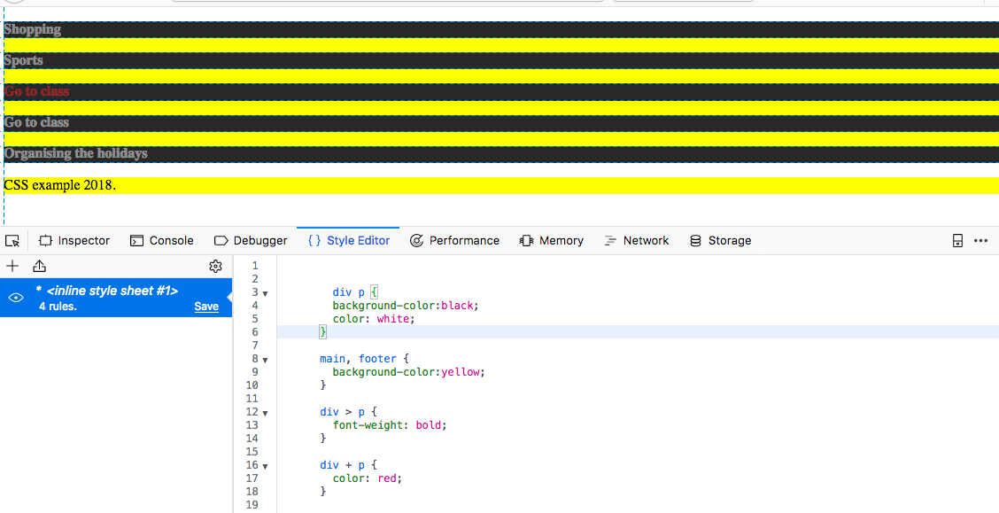

# CSS: the language of Web design

## Learning goals

- Position and style HTML elements according to a given design of a Web page 
- Employ pseudo-classes and pseudo-elements
- Employ CSS variables and data access/creation facilities
- Write CSS media queries
- Create basic CSS-based animations 

## A word of warning ...

[A tweet.](https://twitter.com/iamdevloper/status/936199543099621376)

This tweet pretty much sums up CSS - some things are incredible easy with CSS (animations come to mind), while others, which intuitively should not be that hard to accomplish, will cost you a lot of time. CSS - or **Cascading Style Sheets** - is a very complex language as you will find out in a moment.

## A bit of context

In essence, CSS describes how elements in the DOM should be rendered.

As other Web technologies, CSS can be considered as a victim of the browser wars - which led to years of inactivity in the standards' development:

- **CSS 1** became a W3C recommendation in 1996. It had support for fonts, colors, alignment, margins ids and classes.
- Two years later, **CCS 2** became a W3C recommendation, adding support for media queries and element positioning (among others). The W3C was ready to get started on CSS 3. However, the browser support for CSS 2 remained inconsistent; the W3C decided to focus on fixing inconsistencies with CSS 2.1.
- In 2011, **CSS 2.1** became a W3C recommendation whcih fixed errors and added support for features already widely implemented in major browsers (standardization of features that the browser vendors by themselves had added without much coordination).
- Work on **CSS 3** began already in 1998, was put on hold, and is now back in full swing with browser vendors today eager to implement the newest standards. CSS became so complex and agreeing on a standard for the entire language became so tedious that after CSS 2 that the monolithic nature of the standard was given up. Instead, we now have **CSS modules**, which each progress at an individual pace. The current status of those modules is available at [https://www.w3.org/Style/CSS/current-work](https://www.w3.org/Style/CSS/current-work). Many of those modules are in *Working Draft* status, while some have already reached level 4 (the level number indicates how many revisions of the module have taken place). One of the modules in working draft status is [CSS Animations Level 1](https://www.w3.org/TR/css-animations-1/) which - not surprisingly - describes the standard for CSS-based animations. Despite this being a *Working Draft*, CSS animations are already supported by all major browsers - at least partially with at times vendor-specific CSS properties (instead of standardized ones). 

Any CSS module developed after CSS 2.1 can be considered CSS 3. There will not be a monolithic CSS 4, instead the different modules of the CSS specification will each continue to develop at their own pace. 

Today, it is not possible to make use of the latest CSS features and to expect them to work across all major browsers. Instead, which features to use should be based on

- the intended user base (will tell us something about the most popular browsers in use);
- the mode of usage (smartphone vs. touch screen vs ...);
- the type of Web application (are 3D animations necessary);

When building Web applications that should work across a range of browsers (old and new), you will come across the terms **shims**, **fallbacks** and **polyfills**. These are all terms used to provide HTML5 (that includes CSS3) functionality in browsers that do not natively support them. Even 


## Take-aways of book chapter 3

If you have already read Chapter 3 of the course book, you should be able to answer the following question.

What is the result of applying the CSS below?

- The text within the paragraph `<p class="last">...</p>` will appear green.
- The text within `<span>...</span>` appearing right after a paragraph `<p>...</p>` will appear grey.
- The text within `<span>...</span>` appearing within a paragraph `<p>...</p>` will appear grey.
- The background of the rendered page will appear yellow.

```css
body {
    background-color: #ffff00;
    width: 800px;
    margin: auto;
}
h1 {
    color: maroon;
}
p span {
    color: gray;
    border: 1px solid gray;
}
p#last {
    color: green;
}
```

You have read about the three types of style sheets:

- the browser's style sheet;
- the author's style sheet;
- the user's style sheet;

with the user's style sheet overriding the other two and the author's style sheet overriding the browser's.

Style sheets are processed in order: later declarations override earlier ones if they are on the same or a higher specificity level.

You know that in the code snippet above, `body` is a **selector**, `background-color` is a **property** and `#ffff00` is a **value**. You know the difference between a `class` and an `id` attribute and how to style both.

Lastly, you read about `!important` which overrides all other declarations.

## Pseudo-elements and pseudo-classes

A **pseudo-class** is a keyword added to a **selector** that indicates *a particular state or type* of the corresponding element. Pseudo-classes allow styling according to (among others) **document external** factors such as mouse movements and user browsing history.

They are used as follows:

```css
selector:pseudo-class {
    property: value;
    property: value;
}
```

### Popular pseudo-classes

- `nth-child(X)` is any element that is the Xth **child element** of its parent;
- `nth-of-type(X)` is any element that is the Xth **sibling** of its type.

In both cases, `X` can be an int or formula, e.g `2n+1`, where `n` represents a number starting at 0 and incrementing.

In this example both pseudo-classes are showcased:

```html
<!DOCTYPE html>
<html>
    <head>
        <style>
            p:nth-child(2){
                color: red;
            }
            p:nth-of-type(2){
                background-color: #00ff00;
            }
            div {
                color: #00ff00;
            }
        </style>
    </head>
    <body>

        <main> <!-- parent of the <h2> and <p>'s -->
            <h2>Todos</h2>
            <p>Today's todos</p>    <!-- p sibling, also the second child of <main> -->
            <p>Tomorrow's todos</p> <!-- p sibling -->
            <p>Saturday's todos</p> <!-- p sibling -->
            <p>Sunday's todos</p>   <!-- p sibling -->
        </main>
    </body>
</html>
```

The rendering will show `Today's todos` with a red font (it is the 2. child of `<main>`) and `Tomorrow's todos` with a green background color (`#00ff00`) as that is the second element of type `<p>` among the sibling group.

If we are aiming at the first and/or last child or sibling element, we can also use a different set of pseudo-classes:

| Pseudo-class   | Equivalent to        |
|----------------|----------------------|
| :first-child   | :nth-child(1)        |
| :last-child    | :nth-last-child(1)   |
| :first-of-type | :nth-of-type(1)      |
| :last-of-type  | :nth-last-of-type(1) |


One of the often voiced complaints about CSS used to be the lack of variables support (and thus languages that compile into CSS were born, e.g. [Sass](https://sass-lang.com/)) - in the example above, we set the same value of `#00ff00;` on two properties. If we now decide to change that color value, we would have to manually walk over all style sheets and alter it. Clearly, variables (i.e. *entities containing specific values that can be reused*) would be very helpful.

In fact, since 2015/2016 (yes! it took that long), [CSS variables](https://developer.mozilla.org/en-US/docs/Web/CSS/Using_CSS_variables) are supported in today's major browsers. Here is how they work:

```html
<!DOCTYPE html>
<html>
    <head>
        <style>
            :root {
                --main-color: #00ff00;
            }
            p:nth-child(2){
                color: red;
            }
            p:nth-of-type(2){
                background-color: var(--main-color);
            }
            div {
                color: var(--main-color);
            }
        </style>
    </head>
    <body>

        <main> <!-- parent of the <h2> and <p>'s -->
            <h2>Todos</h2>
            <p>Today's todos</p>    <!-- p sibling, also the second child of <main> -->
            <p>Tomorrow's todos</p> <!-- p sibling -->
            <p>Saturday's todos</p> <!-- p sibling -->
            <p>Sunday's todos</p>   <!-- p sibling -->
        </main>
    </body>
</html>
```

In this example, we want to create a number of so-called global CSS variables, i.e. they should be available to all elements in the DOM tree. For this reason, we make use of the pseudo-element `:root` which represents the `<html>` element. Variables are defined with the custum prefix `--` and can be accessed using the `var()` functionality.

In the beginning we mentioned as one of the document external factors mouse movements that we can make our elements react to. Two popular pseudo-classes in this category are `:hover` and `:active`:

- `:hover` is a selector that becomes active when a mouseover on the element occurs
- `:active` is a selector that becomes active when the element is currently *being active* (usually that means clicked)

```html
<!DOCTYPE html>
<html>
    <head>
        <style>
            button {
                background: white;
                color: darkgray;
                width: 100px;
                padding: 5px;
                font-weight: bold;
                text-align: center;
                border: 1px solid darkgray;
            }

            button:hover {
                color: white;
                background: darkgray;
            }

            button:active {
                border: 1px dashed;
                border-color: black;
            }
        </style>
    </head>
    <body>
        <main>
            <button>Add Todo</button>
        </main>
    </body>
</html>
```

While this may seem not very impressive, `:hover` can also easily employed to create image galleries (preview vs. full image) as well as pure CSS dropdown menus (hide the menu items apart from the "header" and only reveal them when the mouse hovers over the header).

Particularly important for games may be the pseudo-classes `:enabled` and `:disabled`; imagine a game item that is only available sometimes (in our demo game for instance once a letter has been clicked once it is no longer possible to click/select it again). And of course this information should be visually conveyed to the user:

- `:enabled` is an element that can be clicked or selected
- `:disabled` is an element that cannot be clicked or selected

An example:

```html
<!DOCTYPE html>
<html>
    <head>
        <script>
            function disable(el){
                document.getElementById(el.id).disabled = true;
            }
        </script>
        <style>
            button {
                background: white;
                color: darkgray;
                width: 100px;
                padding: 5px;
                font-weight: bold;
                text-align: center;
                border: 1px solid darkgray;
            }

            button:enabled:hover {
                color: white;
                background: darkgray;
            }

            button:enabled:active {
                border: 1px dashed;
                border-color: black;
            }

            button:disabled {
                background: #ddd;
                color: #aaa;
                border: 1px solid #bbb;
            }
        </style>
    </head>
    <body>
        <main>
            <button id="b" onclick="disable(this)">Add Todo</button>
        </main>
    </body>
</html>
```

Here you can see that it is possible to combine pseudo-classes, in this case we use `button:enabled:active` and define a style that an enabled **and** active button should have. Once the button is disabled, its style will not change anymore, no matter the mouse movements.

`:not(X)` is a pseudo-class that matches all elements that are not represented by selector X. Let's look at this example:

```html
<!DOCTYPE html>
<html>
	<head>
		<style>
			main :not(.todo){
				color: orange;
			}
		</style>
	</head>
	<body>
		<main>
			<h2>Todos</h2>
			<p class="firsttodo">Today's todos</p>
			<p class="todo">Tomorrow's todos</p>
			<p class="todo">Saturday's todos</p>
			<p>Sunday's todos</p>
		</main>
	</body>
</html>
```

Important to know here is, that the selector `e1 e2` selects all `<e2>` elements inside `<e1>` elements. The `:not` selector is a short form for `*:not` with `*` being the universal selector (selecting all elements). Altogether our CSS rule says that any element within `<main>` that does not have class attribute `.todo` is assigned an orange font color.

`e1 e2` is not the only possible element combination as selector. Most commonly used are:

| Selector | Despcription                                            |
|----------|---------------------------------------------------------|
| e1       | Selects all `<e1>` elements                               |
| e1 e2    | Selects all `<e2>` elements within `<e1>`                   |
| e1,e2    | Selects all `<e1>` elements and all `<e2>` elements         |
| e1>e2    | Selects all `<e2>` elements that have `<e1>` as parent      |
| e1+e2    | Selects all `<e2>` elements that follow `<e1>` immmediately |

An example should make the differences between them clear:

```html
<!DOCTYPE html>
<html>
	<head>
		<style>

    		div p {
				background-color:black;
				color: white;
			}
			
			main, footer {
				background-color:yellow;
			}

			div > p {
				font-weight: bold;
			}

			div + p {
				color: red;
			}

		</style>
	</head>
	<body>
		<main>
			<div class="today">
				<div class="urgent">
					<p>Shopping</p>
					<p>Sports</p>
				</div>
				<p>Go to class</p>
			</div>
			<div class="tomorrow">
				<p>Go to class</p>

				<div class="urgent">
					<p>Organising the holidays</p>
				</div>
			</div>
		</main>
		<footer>
			CSS example 2018.
		</footer>
	</body>
</html>
```

Note, that your browser's *style editor* does not only allow you to inspect the CSS rules, but also see which rules apply to what part of the page (when hovering over a rule). You can edit the rules on the fly as well, which makes it a very useful tool for debugging your CSS. Here is a screenshot from Firefox's style editor:



Let's move on to four more pseudo-classes, that are particularly useful for the styling of HTML forms: `:in-range` and `:out-of-range` as well as `:valid` and `:invalid`. The latter two can be employed for any `<input>` element, while `:in-range` and `:out-of-range` apply specifically to `<input type="number">`. Input elements are valid if their value adheres to the input type (a number for `type=number`, an email for [`type=email`](https://developer.mozilla.org/en-US/docs/Web/HTML/Element/input/email), etc.) and potential additional limitations due to attribute settings (e.g. `min`, `max` and `maxlength`).

Here is an example:

```html
<!DOCTYPE html>
<html>
	<head>
		<style>
			input[type=text] {
				border: 0px;
				width: 150px;
			}

			input[type=number]{
				width: 100px;
			}

			input:in-range {
				background-color: rgba(0, 255, 0, 0.25);
  				border: 2px solid green;
			}

			input:out-of-range {
				background-color: rgba(255, 0, 0, 0.25);
  				border: 2px solid red;
			}

			input:in-range + label::after {
				content: "\2714";
				color: green;
			}

			input:out-of-range + label::after {
				content: " (invalid)";
				color: red;
			}
		</style>
	</head>
	<body>
		<main>
			<input type="text" placeholder="add your todo" />
			<input id="dl" type="number" min="1" max="30" placeholder="Days to deadline" />
			<label for="deadline1"> </label>
		</main>
	</body>
</html>
```

This example does not only show off these four pseudo-classes, but also a number of other CSS features:
- **Attribute selectors** (e.g. `input[type=number]`) allow us to select specific types of `<input>` elements.
- The [`<label>`](https://developer.mozilla.org/en-US/docs/Web/HTML/Element/label) element can be associated with an `<input>` element when the latter's `id` attribute is the same as the `<label>`'s `for` attribute. This is particularly useful when labels are used as captions for a user interface elements: a click on the label text will then activate the interface element (e.g. a checkbox). Here, we make use of the label to signal a valid or invalid input.
- We see here how to include **unicode characters**: when the deadline number is valid, we choose to display a checkmark. This checkmark could be an image, but here we chose to use a character, specifically unicode character [U+2714](http://graphemica.com/%E2%9C%94).
- The pseudo-element `::after` makes a first appearance, together with the `content` property. We discuss those next.

### Popular pseudo-elements

A **pseudo-element** creates an abstractions about the document tree *beyond* those specified by the document language; it provides access to an element's sub-part.

In order to distinguish pseudo-classes and pseudo-elements, the `::` notation was introduced in the specification, though browsers also accept the one-colon notation.

So, what are abstractions that go beyond what is specified in the document language? Two popular examples are the `::first-letter` and the `::first-line` pseudo-elements; they do exactly what the names suggests, enabling you to style the first letter and line respectively without sticking a `<span>` around them:


```html
<!DOCTYPE html>
<html>
	<head>
		<style>
		p::first-line {
			color: gray;
			font-size: 125%;
		}

		p::first-letter {
			font-size: 200%;
		}
		</style>
	</head>
	<body>
		<p>
			To be or not to be, that is the question -
		</p>

		<p>
			Whether 'tis nobler in the mind to suffer <br>
			The slings and arrows of outrageous fortune, <br>
			Or to take arms against a sea of troubles, <br>
			...
		</p>
	</body>
</html>
```
The example also showcases the percent unit for the `font-size` property. The base font-size of the document equates to `100%` and thus this unit allows you to scale you font-size in relation to the initial size. This is especially helpful when you design Web applications for different device sizes - no additional "tuning" for different devices is required.

Adding (cosmetic) content right before and after an element is achieved (not surprisingly) through:
- `::after`
- `::before`
in combination with the `content` property.

Here is one extreme example of this concept, where all document *content* is delegated to the stylesheet:

```html
<!DOCTYPE html>
<html>
	<head>
		<style>
		cite::before {
			content: "\201CTo be, or ";
		}

		cite::after {
			content: "not to be ... \201D";
		}
		</style>
	</head>
	<body>
		<cite></cite>
	</body>
</html>
```

This is a poor choice admittedly as [accessibility](https://www.w3.org/standards/webdesign/accessibility) is close to zero. The document for appears as content-less to a screen reader, a form of assistive technology that most commonly makes use of a text-to-speech engine to translate a HTML document into speech.

Let's dive into the idea of storing data in CSS in the next section in more detail.

## Data in CSS

CSS does not only describe the style, it *can* carry data too. There are issues though:
- Data is distributed across HTML and CSS files.
- CSS is conventionally not used to store data.
- Content is not part of the DOM (leading to the just described accessibility problem).

Here is another example of storing data in CSS:

```html
<!DOCTYPE html>
<html>
	<head>
		<style>
		p::after {
			background-color: gold;
			border: 1px solid;
			font-size: 70%;
			padding: 2px;
			margin-left: 50px;
		}

		p#t1::after {
			content: "due 10/12/2018";
		}

		p#t2::after {
			content: "due 12/12/2018";
		}

		p#t3::after {
			content: "due 13/12/2018";
		}
		</style>
	</head>
	<body>
		<main>
			<h2>Todos</h2>
			<p id="t1">Walk the dogs </p>
			<p id="t2">Wash the fiat </p>
			<p id="t3">House cleaning</p>
		</main>
	</body>
</html>
```

Instead of storing data directly in CSS, a better way is to *make use of data stored in HTML elements*. This is achieved through so-called **data attributes**: attributes on any HTML element that start with `data-`. CSS can access those data attributes with the [`attr()`](https://developer.mozilla.org/en-US/docs/Web/CSS/attr) function: it retrieves the value of the selected element and data attribute.

Rewriting the example above with `data-` attributes removes the data from CSS and reduces the amount of CSS rule duplication:

```html
<!DOCTYPE html>
<html>
	<head>
		<style>
		p::after {
			background-color: gold;
			border: 1px solid;
			font-size: 70%;
			padding: 2px;
			margin-left: 50px;
		}

		p::after {
			content: "due " attr(data-due);
		}

		</style>
	</head>
	<body>
		<main>
			<h2>Todos</h2>
			<p id="t1" data-due="10/12/2018" data-level="urgent">Walk the dogs </p>
			<p id="t2" data-due="12/12/2018">Wash the fiat </p>
			<p id="t3" data-due="13/12/2018">House cleaning</p>
		</main>
	</body>
</html>
```

A canonical example for `data-` attributes are tooltips:

```html
<!DOCTYPE html>
<html>
	<head>
		<style>
		li {
			cursor: help;
		}

		li:hover::after{
			background-color: rgba(10,10,10,0.7);
			color: gold;
			border: 1px dashed;
			padding: 5px;
			font-size: 60%;
			content: attr(data-name);
			position: relative;
			bottom: 15px;
			left: 5px;
		}
		</style>
	</head>
	<body>
		<main>
			<ul>
				<li data-name="Cascading Style Sheets">CSS</li>
				<li data-name="HyperText Markup Language">HTML</li>
				<li data-name="HyperText Transfer Protocol">http</li>
				<li data-name="HyperText Transfer Protocol Secure">https</li>
			</ul>
		</main>
	</body>
</html>
```

This example also showcases the use of the [`cursor`](https://developer.mozilla.org/en-US/docs/Web/CSS/cursor) property - here, hovering over the list items results in a help icon. Note, that `cursor: none` results in no cursor being rendered, though this should be used with care as it tends to confuse users. The `position`, `bottom` and `left` properties will be discussed next (in short: they determine the placement of the tooltip).

## Element positioning

One of the most confusing aspects in CSS are the myriad of ways to achieve element positioning (MDN's [CSS layout guide](https://developer.mozilla.org/en-US/docs/Learn/CSS/CSS_layout) provides you with a good idea of what exists). Due to our limited time, we will only consider three CSS properties used for element positioning:
- [`float`](https://developer.mozilla.org/en-US/docs/Web/CSS/float) defines how an element floats in the containing element (which in turn determines how other elements flow around it);
- [`position`](https://developer.mozilla.org/en-US/docs/Web/CSS/position) defines how an element is positioned in a document;
- [`display`](https://developer.mozilla.org/en-US/docs/Web/CSS/display) defines the display type of an element.

Let's also define two additional concepts, that stem from HTML4 - while HTML5 has more categories with more complex interactions, for our three elements above, the following two notions are sufficient:
- **Block-level elements** are surrounded by line-breaks. They can contain block-level and inline elements. **The width is determined by their containing element.** Examples of block-level elements are `<main>` or `<p>`.
- **Inline elements** can be placed within block-level or inline elements. They can contain other inline elements. **The width is determined by their content.** Examples are `<span>` or `<a>`. 

### Float

By default, elements *flow*. Their order is determined by the order of their appearance in the HTML document. Toggling the `<main>` element's width between `auto` and `400px` (and manually resizing the browser window) shows off the difference between block-level and inline elements. 

```html
<!DOCTYPE html>
	<head>
		<style>

			* {
				border-style: solid;

				/* Try out what happens when the following two lines
				 * are removed ("CSS reset")
				*/
				margin: 0;
				padding: 0;
			}

			body {
				border-color: orange;
			}

			main {
				border-color: grey;
			}

			span {
				border-color: green;
			}

			a {
				border-color: red;
			}

			p {
				border-color: blue;
			}

			/* Block-level vs. inline elements:
			 * use `width: auto` as alternative
			 */
			main {
				width: 400px;
			}

			/* element floating (use left/right/none) */
			/* a {
			 *	float: left;
			 * }
			 */

		</style>
	</head>
	<body>
		<main>
			<p>
				This is a paragraph containing <a href="#">a link</a>.
			</p>
			<p>
				This is another paragraph
				<span>
					with a span and a <a href="#">link in the span</a>.
				</span>
			</p>
		</main>
	</body>
</html>
```

With the `float` property, we can change this default flow. `float:left` (or `float:right`) takes an element **out of the flow**; it is then moved to the **leftmost** (or rightmost) possible position **in the containing element** - which is either the element edge or another float. In addition, if an element should not float, we can use `float: none`.

Try out the effects of `float` by using one after the other:
- `a {float: right}`
- `a {float: left}`
- `a {float: none}`

in the above example. Remember, that you can make these changes directly in the *Style Editor* of your browser!

If needed, we can also reset the flow the the value `clear` (either to reset the `left`, `right` or `both` sides of the flow). The canonical example for flow resetting are web page layouts that have **sidebars**, something like this:


Here, we have two sidebars that each *float* to the left and right of the main content respectively. The footer should appear below both sidebars. Try out the HTML below to see the effect of both `float` and `clear`.

```html
<!DOCTYPE html>
	<head>
		<style>

		.nav {
			background-color: grey;
		}

		main {
			background-color: red;
		}

		footer {
			background-color: green;
		}


		/* Floating to the sides */
		/*
		 * #nav1 {
		 *	float: right;
		 * }
		
		 * #nav2 {
		 *	float: left;
		 * }
		 */

		/* 
		 * Resetting the flow: try what happens if clear:left or clear:right
		 * is used alone. Instead of both left and right, we can also use
		 * clear:both; 
		 */
		/*
		 * footer {
		 *	clear: left;
		 *	clear: right;
		 * }
		 */	

		</style>
	</head>
	<body>
		<div id="nav1" class="nav">
			<ul>
				<li>Go to page 1</li>
				<li>Go to page 2</li>
				<li>Go to page 3</li>
				<li>Go to page 4</li>
				<li>Go to page 5</li>
			</ul>
		</div>

		<div id="nav2" class="nav">
			<ul>
				<li>January 2019</li>
				<li>February 2019</li>
				<li>March 2019</li>
				<li>April 2019</li>
			</ul>
		</div>

		<main>
			<p>
				Paragraph 1.
			</p>

			<p>
				Paragraph 2.
			</p>
		</main>

		<footer>
			Footer information.
		</footer>
	</body>
</html>
```

### Position

The [`position` property](https://developer.mozilla.org/en-US/docs/Web/CSS/position) enables fine-grained movement of elements (in contrast to `float` which is meets our demands for coarse-grained positioning). Elements can be moved around in any direction (up/down/left/right) by absolute or relative units.

The `position` attribute has a number of possible values:

| Value             | Description                                                                        |
|-------------------|------------------------------------------------------------------------------------|
| `position:static`   | the default                                                                            |
| `position:relative` |  the element is adjusted on the fly, other elements are not affected               |
| `position:absolute` |  the element is taken out of the normal flow (no space is reserved for it)         |
| `position:fixed`    |  similar to `absolute`, but fixed to the **viewport** (=the area currently being viewed) |
| `position:sticky`   | in-between `relative` and `fixed`                                                      |

Important to know when using the `position` property is the direction of the CSS coordinate system: the top-left corner is `(0,0)`. The y-axis extends **downwards**. The x-axis extends to the **right**.

Let's walk through each of the position values in turn, starting with `relative`: here, the movement of the element is **relative** to its original position. The horizontal offset from the original position is set through properties `left` and `right`, the vertical offset is controlled through `top` and `bottom`. 

```html
<!DOCTYPE html>
	<head>
		<style>

		img {
			width: 50px;
		}
		/* 
		 * Try out different pixel values. 
		 * Remember that the coordinate system starts at the top-left
		 * corner and extends downward and to the right!
		 * What happens if the pixel value is negative?
		 * At what point do the "eggs" leave the viewport?
		 */
		#egg2 {
			position: relative;
			bottom: 20px; 
			left: 20px;
		}

		#egg4 {
			position: relative;
			bottom: 50px;
			right: 10px;
		}

		</style>
	</head>
	<body>
		<main>
		    <br />
		     <br />
		     <br />
		    <br />
		</main>
	</body>
</html>
```

If we change the positioning of some of our little eggs to `position:absolute`, we now see that they are taken out of the normal flow and no space is reserved for them. The positioning of those elements is now relative to the nearest ancestor or the window itself (in our case it is the window).

```html
<!DOCTYPE html>
	<head>
		<style>

		img {
			width: 50px;
		}

		/* 
		 * Try out different pixel values. 
		 * Remember that the coordinate system starts at the top-left
		 * corner and extends downward and to the right!
		 */
		#egg2 {
			position: absolute;
			bottom: 50px; 
			left: 0px;
		}

		#egg4 {
			position: absolute;
			bottom: 0px;
			right: 0px;
		}

		</style>
	</head>
	<body>
		<main>
		    <br />
		     <br />
		     <br />
		    <br />
		</main>
	</body>
</html>
```

The `position:fixed` value is similar to `position:absolute`, but now the containing element is the **viewport**, i.e. the area of the document that is visible in the browser. This means that elements with `position:fixed` remain visible. Here is an example (you need to minimize the window until you need to scroll down to see all of our four eggs to achieve a visible effect):

```html
<!DOCTYPE html>
	<head>
		<style>

		img {
			width: 50px;
		}

		#info {
			position: fixed;
			background: yellow;
			left: 20px;
			top: 20px;
		}

		</style>
	</head>
	<body>
		<main>
		    <br />
		     <br />
		     <br />
		    <br />
		</main>

		<div id="info">
				These are no easter eggs.
		</div>
	</body>
</html>
```

Finally, we cover the `display` property, which enables us to change the element type at will (block-level to inline and vice versa) at will and *hide* elements from view. The latter is likely to be most useful to us:

| Value          | Description                                                                                   |
|----------------|-----------------------------------------------------------------------------------------------|
| `display:inline` |  The element is rendered with an inline element box.                                          |
| `display:block`  |  The element is rendered with a   block element box.                                          |
| `display:none`   |  The element (and its descendents) are hidden from view; no space is reserved in the layout.  |

Once more, an example is sufficient to highlight the use of each of these values:

```html
<!DOCTYPE html>
	<head>
		<style>
			p, span {
				border-style: solid;
				padding: 10px;
				margin: 10px;
			}
			p {
				border-color: blue;
			}

			/*
			 * Try out the effect of adding each of these
			 * display settings.
			 */

			/* 
			 * span {
			 *	border-color: red;
			 * }
			*/

			/*	
			 * span {
			 *	display: block;
			 * }
			 */

			/*
			 * p {
			 * 	display: inline;
			 * }
			 */

			/*
			 * span {
			 *	display: none;
			 * }
			 */
		</style>
	</head>
	<body>
		<p>
			This is paragraph one.
		</p>

		<span> 
			Span element one.
		</span>

		<span>
			Span element two.
		</span>

		<p>
			This is paragraph two.
		</p>
	</body>
</html>
```

## CSS media queries

So far, we have covered the basics of CSS but ignored - largely - the fact that in today's multi-device world, we are designing Web applications for vastly different screen sizes. Different devices should be served different styles, e.g.
- when **printing** a Web application's screen, the information printed should be the essentials (no ads, no sidebars, etc.);
- when **viewing** a Web application on a small screen, non-essential information (e.g. a footer) should be removed;
- when **viewing** a Web application on a large screen all available information should be presented;
- when using **text-to-speech** devices, non-essential information should be removed.

**CSS media queries** enable the use of **device-dependent** (i.e. media-type dependent) stylesheets. While the HTML document is written once, the CSS is written once per device type. There are four device types currently in use:

| Value         | Description                               |
|---------------|-------------------------------------------|
| `media all`    |  Suitable for all device types.           |
| `media print` |  Suitable for documents in print preview. |
| `media screen` |  Suitable for screens.                    |
| `media speech` | Suitable for speech synthesizers.         |

Here is a concrete example of how media queries enable a *responsive design*; use your browser's responsive design mode and *Print as PDF* feature to test the behaviour of the media queries:

```html
<!DOCTYPE html>
	<head>

		<!-- We can link a stylesheet conditional on the media attribute -->
		<!-- Example of a logical or (,) in the media query -->
		<link rel="stylesheet" media="screen and (min-width: 800px), (min-width: 3000px)" href="large-device.css">

		<style>

			* {
				padding: 10px;
			}

			main {
				background-color: red;
			}

			#sidebar {
				background-color: green;
				float: right;
			}

			/* when printing, use black and white */
			@media print {
				body {
					color: black !important;
					width: 100%;
				}
			}

			/* hide the sidebar for small devices */
			/* Example of a logical or (",") as well as and ("and") in the media query */
			@media print, screen and (max-width: 400px) {
				#sidebar {
					display: none;
				}
			}
		</style>
	</head>
	<body>
		<div id="sidebar">
			<ul>
				<li>Anchor 1</li>
				<li>Anchor 2</li>
				<li>Anchor 3</li>
			</ul>
		</div>

		<main>
			<p>
				Paragraph 1
			</p>
			<p>
				Paragraph 2
			</p>	
			<p>
				Paragraph 3
			</p>	
			<p>
				Paragraph 4
			</p>	
		</main>


	</body>
</html>
```
## Animations and transitions

In general, SSS styles (states) are defined by teh user, the rendering engine takes care of the transition between styles. A **rendering engine** (or browser engine, layout engine) is responsible for translating HTML+CSS (among others) to the screen. The major browsers ship with their own rendering engines, the names of which you will come across from time to time (especially when using CSS animations and transitions):

| Engine   | Browsers                                |
|----------|-----------------------------------------|
| `Gecko`    | Firefox                                 |
| `Trident`  | Internet Explorer                       |
| `EdgeHTML` | Microsoft Edge                          |
| `WebKit`   | Safari, older versions of Google Chrome |
| `Blink`    | Google Chrome, Opera                    |

**Animations** consist of
- an animation style (e.g. `linear`);
- a number of **keyframes** that act as transition waypoints.

**Transitions** are animations with a simpler syntax. They consist of
- exactly two states: start and end state.

### CSS vs. JavaScript animations

There are several advantages to using CSS-based instead of JavaScript-based animations:
- CSS is relatively easy to use (no need to learn the intricate details of JavaScript).
- The rendering engines are optimized for CSS-based animations.
- CSS animations can do much more than animating buttons. To see what is possible, head over to CodePen and look at a few [CSS animations](https://codepen.io/search/pens?q=css animation).

slide 65

## Browser-specific prefixes

CSS is under active development, many features are not stable, are often used with browser vendor prefixes, and, might change in the future (as the specification changes).

Recent move towards disabling experimental features in browsers by default; explicit reset by user required.
But … vendor prefixes will not go away anytime soon (that would break a lot of pages on the Web).

Advantage: exciting new
features can be used early on

Disadvantage: a new
browser release might
break the implemented CSS

http://lists.w3.org/Archives/Public/public-webapps/2012OctDec/0731.html
“For what it's worth, the current trend inside Mozilla is exactly what 
you say: avoiding vendor prefixes by either turning things off before 
shipping or shipping them unprefixed if they're stable enough.  At least 
as a general policy; specific cases might merit exceptions.”

At the same time, browsers need to implement these features so we can see how they work in practice. But consider the difficulties that would occur if two separate browsers implemented the same property but interpreted it inconsistently: The result of your code would appear differently—perhaps radically so—in each of the browsers. To prevent this from happening, each of the browser vendors began to prefix a short code to the beginning of experimental properties. Let’s imagine our much-desired monkeys property has been newly defined in a specification, and that all of the major browser vendors have decided to implement it to see how it works
E {
    -moz-monkeys: value; /* Firefox */
    -ms-monkeys: value; /* Internet Explorer */
    -webkit-monkeys: value; /* Chrome/Safari */
}


```css
 main:-webkit-full-screen {
 } /* Chrome */
 
 main:-moz-full-screen {
 } /* Firefox */

main:-ms-fullscreen {
} /* Internet Explorer */

main:fullscreen {
} /* W3C proposal */
```

-webkit? Google Chrome is not based on Webkit anymore …

www.chromium.org/blink/developer-faq

*Will we see a -chrome- vendor prefix now?*

*We’ve seen how the proliferation of vendor prefixes has caused pain for developers and we don't want to exacerbate this. As of today, Chrome is adopting a policy on vendor prefixes, one that is similar to Mozilla's recently announced policy.*

*In short: we won't use vendor prefixes for new features. Instead, we’ll expose a single setting (in about:flags) to enable experimental DOM/CSS features for you to see what's coming, play around, and provide feedback, much as we do today with the “Experimental WebKit Features”/"Enable experimental Web Platform features" flag. Only when we're ready to see these features ship to stable will they be enabled by default in the dev/canary channels.*

*For legacy vendor-prefixed features, we will continue to use the -webkit- prefix because renaming all these prefixes to something else would cause developers unnecessary pain. We've started looking into real world usage of HTML5 and CSS3 features and hope to use data like this to better inform how we can responsibly deprecate prefixed properties and APIs. As for any non-standard features that we inherited (like -webkit-box-reflect), over time we hope to either help standardize or deprecate them on a case-by-case basis.*


## Rendering engine


## Self-check

Here are a few questions you should be able to answer after having followed the lecture and having worked through the required readings:
