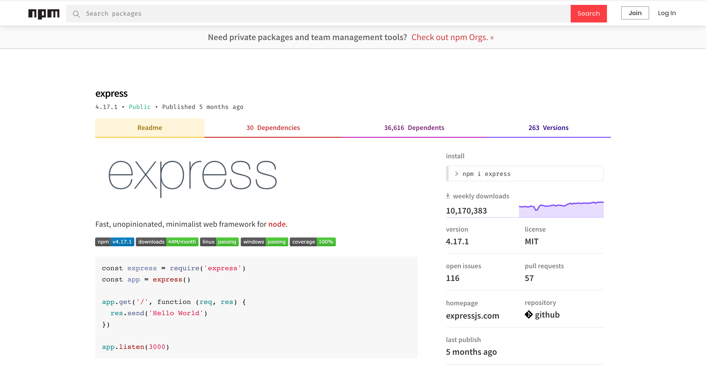
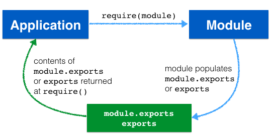
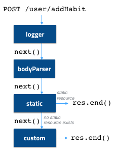
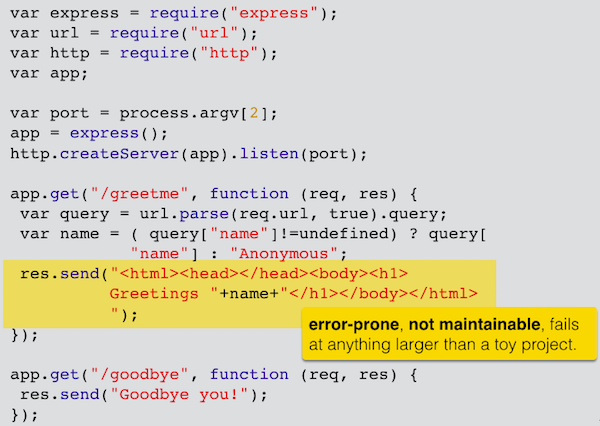

# Advanced Node.js <!-- omit in toc -->

*At times we use ☝️ and 👇 to make it clear whether an explanation belongs to the code snippet above or below the text. The ‼️ sign is added to code examples you should run yourself. When you see a :bug:, we offer advice on how to debug your code with the browser's and VSC's tooling - these hints are solely to help you with your programming project and not exam material! Paragraphs with a 🚩 are just for your information and not exam material.*

## Table of Contents <!-- omit in toc -->
- [Learning goals](#learning-goals)
- [Organization and reusability of Node.js code](#organization-and-reusability-of-nodejs-code)
  - [A file-based module system](#a-file-based-module-system)
  - [:bangbang: A first module example](#bangbang-a-first-module-example)
  - [:bangbang: require is blocking](#bangbang-require-is-blocking)
  - [:bangbang: module.exports vs. exports](#bangbang-moduleexports-vs-exports)
- [Creating and using a (useful) module](#creating-and-using-a-useful-module)
- [Middleware in Express](#middleware-in-express)
  - [:bangbang: Logger example](#bangbang-logger-example)
  - [:bangbang: Authorisation component example](#bangbang-authorisation-component-example)
  - [Components are configurable](#components-are-configurable)
- [Routing](#routing)
  - [Routing paths and string patterns](#routing-paths-and-string-patterns)
  - [Routing parameters](#routing-parameters)
  - [Organizing routes](#organizing-routes)
- [Templating with EJS](#templating-with-ejs)
  - [:bangbang: A first EJS example](#bangbang-a-first-ejs-example)
  - [:bangbang: EJS and user-defined functions](#bangbang-ejs-and-user-defined-functions)
  - [:bangbang: JavaScript within EJS templates](#bangbang-javascript-within-ejs-templates)
  - [:bangbang: Express and templates](#bangbang-express-and-templates)
- [Self-check](#self-check)


## Learning goals

- Organize Node.js code into modules.
- Understand and employ the concept of *middleware*.
- Employ routing.
- Employ templating.

## Organization and reusability of Node.js code

So far, we have organized all server-side code in a single file, which is only a feasible solution for small projects. In larger projects, this quickly ends in unmaintainable code, especially when working in a team.

These issues were recognized early on by the creators of Node.js. For this reason, they introduced the concept of **modules**. **A Node.js module is (1) a single file or (2) a directory of files and all code contained in it**.

By default, *no code in a module is accessible to other modules*. Any property or method that should be visible to other modules has to be **explicitly** marked as such - you will learn shortly how exactly. Node.js modules can be published to [npmjs.com](https://www.npmjs.com/), the most important portal to discover and share modules with other developers. This is [Express' page on npm](https://www.npmjs.com/package/express):



<sup>Screenshot taken on October 11, 2019.</sup>

:point_up: You see here that modules often depend on a number of other modules (in this case: 30 dependencies). As Express is a very popular module, it is listed as dependency in more than 27,000 other modules.

 You already know how to install modules, e.g. `npm install winston` installs one of the most popular [Node loggers](https://www.npmjs.com/package/winston). You can also use the command line to search for modules to install, e.g. `npm search winston`.

While it is beyond the scope of this course to dive into the details of the npm registry, it should be mentioned that it is not without issues; the story of how 17 lines of code - a single npm module - nearly broke much of the modern web for half a day can be found [here](http://arstechnica.com/information-technology/2016/03/rage-quit-coder-unpublished-17-lines-of-javascript-and-broke-the-internet/).

### A file-based module system

In Node.js each file is its own module. This means that the code we write in a file does not pollute the *global namespace*. In Node.js we get this setup "for free". When we write client-side JavaScript, we have to work hard to achieve the same effect (recall the module pattern covered in the [JavaScript lecture](Lecture-js.md)).

The module system works as follows: each Node.js file can access its so-called **module definition** through the `module` object. The module object is your entry point to modularize your code. To make something available from a module to the outside world, `module.exports` or its alias `exports` is used as we will see in a second. The `module` object looks as follows (depending on the Node version and underlying operating system the object properties may vary slightly) :point_down::

```javascript
module {
  id: '.',
  path: '/Users/Node/Web-Teaching',
  exports: {},
  parent: null,
  filename: '/Users/Node/Web-Teaching/tmp.js',
  loaded: false,
  children: [],
  paths: [
    '/Users/Node/GitHub/Web-Teaching/node_modules',
    '/Users/Node/GitHub/node_modules',
    '/Users/Node/node_modules',
    '/Users/node_modules',
    '/node_modules'
  ]
}
```

To see for yourself how the `module` object looks on your machine you can do one of two things:

1. Create a Node.js script containing only the line `console.log(module);` and run it.
2. Start the node REPL (just type `node` into the terminal) and then type `console.log(module);`.  

We see that in our module object above :point_up: nothing is currently being *exported* as `exports` is empty.

Once you have defined your own module, the globally available `require` function is used to import a module. At this stage, you should recognize that you have been using Node.js modules since your first attempts with Node.js.

Here is a graphical overview of the connection between `require` and `module.exports`:



An application uses the `require` function to import module code. The module itself populates the `module.exports` variable to make certain parts of the code base in the module available to the outside world. Whatever was assigned to `module.exports` (or its alias `exports`) is then returned to the application when the application calls `require()`.

### :bangbang: A first module example

Let's consider files `foo.js` :point_down::

```javascript
var fooA = 1;                       //LINE 1
module.exports = "Hello!";          //LINE 2
module.exports = function() {       //LINE 3
    console.log("Hi from foo!");    //LINE 4
};                                  //LINE 5
```

and `bar.js` :point_down::

```javascript
var foo = require("./foo");
foo();                      //CASE 1: Hi from foo!
require("./foo")();         //CASE 2: Hi from foo!
console.log(foo);           //CASE 3: [Function]
console.log(foo.toString());//CASE 4: function () {console.log("Hi from foo!");}
console.log(fooA);          //CASE 5: ReferenceError (you will have to remove this line to reach the next one)
console.log(module.exports);//CASE 6: {}
```

:point_up: Here, `foo.js` is our `foo` module and `bar.js` is our application that imports the module to make use of the module's functionality (you can run the script as usual with `node bar.js`).

- In the `foo` module, we define a variable `fooA` in line 1. In lines 2 and 3, you can see how a module uses `module.exports` to make parts of its code available: in line 2, we assign a string to `module.exports`, in line 3 we make a new assignment to `module.exports` and define a function that prints out *Hi from foo!* on the console. Which of the two assignments will our application `bar` end up with?
- In `bar.js` the first line calls the `require()` function and assigns the returned value to the variable `foo`. In line 1 we used as argument `./foo` instead of `./foo.js` - you can use both variants. The dot-slash indicates that `foo.js` resides in the current directory.

Node.js runs the referenced JavaScript file :point_up: (here: `foo.js`) in a **new scope** and **returns the final value** of `module.exports`. What then is the final value after executing `foo.js`? It is the function we defined in line 3.

As you can see in lines 2 and beyond of `bar.js` there are several ways to access whatever `require` returned:

- **CASE** :one: We can call the returned function and this results in *Hi from foo!* as you would expect.
- **CASE** :two: We can also combine lines 1 and 2 into a single line with the same result.
- **CASE** :three: If we print out the variable `foo`, we learn that it is a function.
- **CASE** :four: Using the `toString()` function prints out the content of the function.
- **CASE** :five: Next, we try to access `fooA` - a variable defined in `foo.js`. Remember that Node.js runs each file in a new scope and only what is assigned to `module.exports` is available. Accordingly, `fooA` is not available in `bar.js` and we end up with a reference error. :bug: Visual Studio Code flags up this error (`fooA is not defined`) already at the code writing stage. 
- **CASE** :six: Finally, we can also look at the `module.exports` variable of `bar.js` - this is always available to a file in Node.js. In `bar.js` we have not assigned anything to `module.exports` and thus it is an empty object.

### :bangbang: `require` is blocking

This module setup also explains why `require` is **blocking**: once a call to `require()` is made, the referenced file's code is executed and only once that is done, does `require()` return. This is in contrast to the usual *asynchronous* nature of Node.js functions.

Let's now consider what happens if a module is imported more than once :point_down::

```javascript
var t1 = process.hrtime()[1];//returns an array with [seconds, nanoseconds]
var foo1 = require("./foo");
console.log(process.hrtime()[1] - t1);//303914

var t2 = process.hrtime()[1];
var foo2 = require("./foo");
console.log(process.hrtime()[1] - t2);//35012
```

:point_up: Here, we execute `require('./foo')` twice and log both times the time it takes for `require` to return. The first time the line `require(foo.js)` is executed, the file `foo.js` is read from disk (this takes some time). In subsequent calls to `require(foo.js)`, however, the **in-memory object is returned**. Thus, `module.exports` is **cached**.

We here resort to using `process.hrtime()` wich returns an array whose first value is the time in seconds and the second is the time in nanoseconds relative to *"an arbitrary time in the past"* ([Node documentation](https://nodejs.org/api/process.html#process_process_hrtime_time)). While they are not useful to compute an absolute time, they can accurately measure the duration of code as seen in the above example. Depending on your machine, the reported nanoseconds intervals will differ, though on average it should take about ten times longer the first time we execute `require(foo.js)`.

*Note: if you are already familiar with JavaScript you may ask yourself why we do not rely on [`Date.now()`](https://developer.mozilla.org/en-US/docs/Web/JavaScript/Reference/Global_Objects/Date/now) to measure time differences. It returns the number of **milliseconds** that have passed since January 1, 1970 00:00:00 UTC (why this particular time? Because that is the [Unix time](https://en.wikipedia.org/wiki/Unix_time)!). On modern machines, a millisecond-based time resolution does not offer a high enough resolution to detect this difference in loading time.*


### :bangbang: module.exports vs. exports

Every Node.js file has access to `module.exports`. If a file does not assign anything to it, it will be an empty object, but it is **always** present. Instead of `module.exports` we can use `exports` as `exports` is an **alias** of `module.exports`. This means that the following two code snippets are equivalent :point_down::

```javascript
//SNIPPET 1
module.exports.foo = function () {
    console.log('foo called');
};

module.exports.bar = function () {
    console.log('bar called');
};
```

```javascript
//SNIPPET 2
exports.foo = function () {
    console.log('foo called');
};

exports.bar = function () {
    console.log('bar called');
};
```

:point_up: In the first snippet, we use `module.exports` to make two functions (`foo` and `bar`) accessible to the outside world. In the second snippet, we use `exports` to do exactly the same. Note that in these two examples, **we do not assign something to `exports` directly**, i.e. we do not write `exports = function ....`. This is in fact **not possible** as `exports` is only a reference (a short hand if you will) to `module.exports`: if you directly assign a function or object to `exports`, then its reference to `module.exports` will be **broken**. You can only **assign directly** to `module.exports`, for instance, if you only want to make a single function accessible.

## Creating and using a (useful) module

In the example above :point_up:, `foo.js` is a module we created. Not a very sensible one, but still, it is a module. Modules can be either:

- a **single file**, or,
- a **directory of files**, one of which is `index.js`.

A module can contain other modules (that's what `require` is for) and should have a specific purpose. For instance, we can create a *grade rounding module* whose functionality is the rounding of grades in the Dutch grading system. Any argument that is not a number between 1 and 10 is rejected :point_down::

```javascript
/* not exposed */
var errorString = "Grades must be a number between 1 and 10.";

function roundGradeUp(grade) {
  if (isValidNumber(grade) == false) {
    throw errorString;
  }
  return ( Math.ceil(grade) > 10 ? 10 : Math.ceil(grade));//max. is always 10
}

function isValidNumber(grade) {
  if (
    isNaN(grade) == true ||
    grade < exports.minGrade ||
    grade > exports.maxGrade
  ) {
    return false;
  }
  return true;
}

/* exposed */
exports.maxGrade = 10;
exports.minGrade = 1;
exports.roundGradeUp = roundGradeUp;
exports.roundGradeDown = function(grade) {
  if (isValidNumber(grade) == false) {
    throw errorString;
  }
  return Math.floor(grade);
};
 ```

We can use the grading module in an Express application as follows :point_down::

```javascript
var express = require("express");
var url = require("url");
var http = require("http");
var grading = require("./grades"); // our module file resides in the current directory
var app;

var port = process.argv[2];
app = express();
http.createServer(app).listen(port);

app.get("/round", function(req, res) {
  var query = url.parse(req.url, true).query;
  var grade = query["grade"] != undefined ? query["grade"] : "0";

  //accessing module functions
  res.send(
    "UP: " +
      grading.roundGradeUp(grade) +
      ", DOWN: " +
      grading.roundGradeDown(grade)
  );
});
```
Assuming the Node script is started on `localhost` and port `3000`, we can then test our application with several valid and invalid queries:

- `http://localhost:3000/round?grade=2.1a`
- `http://localhost:3000/round?grade=2.1`
- `http://localhost:3000/round?grade=`
- `http://localhost:3000/round?grade=10`

## Middleware in Express

Middleware components are small, self-contained and reusable code pieces across applications. Imagine you have written an Express application with tens of different routes and now decide to log every single HTTP request coming in. You could add 2-3 lines of code to every route to achieve this logging OR you write a middleware logging component that gets called before any other route is called. How exactly this works in Express is discussed here.

Middleware components have **three parameters**:

- an HTTP request object,
- an HTTP response object, and,
- an optional callback function (`next()`) to indicate that the component is finished and the dispatcher (which orchestrates the order of middleware components) can move on to the next component.

Middleware components have a number of abilities:

- Execute code.
- Change the request and response objects.
- End the request-response cycle.
- Call the next middleware function in the middleware stack.

As a concrete example, imagine an Express application with a POST route `/user/moveMade` :point_down::



:point_up: The first middleware to be called is the logging component, followed by the bodyParser component which parses the HTTP request body; next, the static component is probed (is there a static resource that should be served to the user?) and if no static resource exists, a final custom component is called. When an HTTP response is sent (`res.end`), the middleware call chain is complete. 

### :bangbang: Logger example

Our goal is to create a logger that records every single HTTP request made to our application as well as the URL of the request. We need to write a function that accepts the HTTP request and response objects as arguments and `next` as callback function. Here, we write two functions to showcase the use of several middleware components :point_down::

```javascript
var express = require("express");

//a middleware logger component
function logger(request, response, next) {
  console.log("%s\t%s\t%s", new Date(), request.method, request.url);
  next(); //control shifts to next middleware function
}

//a middleware delimiter component
function delimiter(request, response, next) {
  console.log("-----------------");
  next();
}

var app = express();
app.use(logger); //register middleware component
app.use(delimiter);
app.listen(3001);
```

If you start the script and then make the following HTTP requests:

- http://localhost:3001/first
- http://localhost:3001/second
- http://localhost:3001/

your output on the terminal will look something like this:

```console
2020-01-14T19:17:16.577Z        GET     /first
-----------------
2020-01-14T19:17:19.111Z        GET     /second
-----------------
2020-01-14T19:17:21.159Z        GET     /
-----------------
```

:point_up: Importantly, `next()` enables us to move on to the next middleware component while `app.use(...)` registers the middleware component with the dispatcher. Try out this code for yourself and see what happens if:

- `app.use` is removed;
- the order of the middleware components is switched, i.e. we first add `app.use(delimiter)` and then `app.use(logger)`;
- in one or both of the middleware components the `next()` call is removed.

You will observe different behaviours of the application that make clear how the middleware components interact with each other and how they should be used in an Express application.

In the example above we did not actually sent an HTTP response back, but you know how to write such a code snippet yourself. So far, none of our routes have contained `next` for a simple reason: all our routes ended with an HTTP response being sent and this completes the request-response cycle; in this case there is no need for a `next()` call.


### :bangbang: Authorisation component example

In the [node-component-ex](demo-code/node-component-ex) example application, we add an authorisation component to a simple Todo application back-end: only clients with the **correct username and password** (i.e. authorised users) should be able to receive the list of todos when requesting them. We achieve this by adding a middleware component that is activated for every single HTTP request and determines:

- whether the HTTP request contains an authorization header (if not, access is denied);
- and whether the provided username and password combination is the correct one.

Before we dive into the code details, install and start the server as explained [here](https://github.com/chauff/Web-Teaching/tree/master/demo-code#node-component-ex). Take a look at `app.js` before proceeding.

Once the server is started, open another terminal and use `curl` (a command line tool that provides us with a convenient way to include username and password as you will see in a second):

- Request the list of todos without authorisation, i.e. `curl http://localhost:3000/todos` - you should see an `Unauthorized access` error.
- Request the list of todos with the correct username and password (as hardcoded in our demonstration code): `curl --user user:password http://localhost:3000/todos`. The option `--user` allows us to specify the username and password to use for authentication in the `[USER]:[PASSWORD]` format. This request should work and you should receive the list of todos.
- Request the list of todos with an incorrect username/password combination: `curl --user test:test http://localhost:3000/todos`. You should receive a `Wrong username/password combination` error.

Having found out how the code *behaves*, let us look at the authorization component. We here define it as an anynymous function as argument to `app.use` :point_down::

```javascript
app.use(function (req, res, next) {
    var auth = req.headers.authorization;
    if (!auth) {
        return next(new Error("Unauthorized access!"));
    }

    //extract username and password
    var parts = auth.split(' ');
    var buf = new Buffer(parts[1], 'base64');
    var login = buf.toString().split(':');
    var user = login[0];
    var password = login[1];

    //compare to 'correct' username/password combination
    //hardcoded for demonstration purposes
    if (user === "user" && password === "password") {
        next();
    }
    else {
        return next(new Error("Wrong username/password combination!"));
    }
});
```

:point_up: This code snippet first determines whether an authorization header was included in the HTTP request (accessible at `req.headers.authorization`). If no header was sent, we pass an error to the `next()` function, for Express to catch and process, i.e. sending the appropriate HTTP response. If an authorization header is present, we now extract the username and password (remember from the http lecture that it is base64 encoded!) and determine whether they match `user` and `password` respectively. If they match, `next()` is called and the next middleware component processes the request, which in our `app.js` file is `app.get("/todos",...)`.

### Components are configurable

One of the design goals of middleware is **reusability** across applications: once we define a logger or an authorization component, we should be able to use it in a wide range of applications without additional engineering effort. Reusable code usually has parameters that can be set. To make this happen, we can wrap the original middleware function in a *setup function* which takes the function parameters as input :point_down: (this works because of the principle of closures as briefly discussed in the JavaScript lecture):

```javascript
function setup(options) {
    // setup logic
    return function(req, res, next) {
        // middleware logic
    }
}
app.use( setup({ param1 : 'value1' }) );
```

## Routing

Routing is the mechanism by which requests are routed to the code that handles them. The routes are specified by a URL and HTTP method (most often `GET` or `POST`). You have employed routes already - every time you wrote `app.get()` you specified a so-called **route handler** and wrote code that should be executed when that route (or URL) is called.

This routing paradigm is a significant departure from the past, where **file-based** routing was commonly employed. In file-based routing, we access files on the server by their actual name, e.g. if you have a web application with your contact details, you typically would write those details in a file `contact.html` and a client would access that information through a URL that ends in `contact.html`. Modern web applications are not based on file-based routing, as is evident by the fact URLs these days do not contain file endings (such as `.html` or `.asp`) anymore.

In terms of routes, we distinguish between request **types** (`GET /user` differs from `POST /user`) and request **routes** (`GET /user` differs from `GET /users`).

**Route handlers are middleware**. So far, we have not introduced routes that include `next` as third argument, but since they *are* middleware, we can indeed add `next` as third argument.

Let's look at an example where this makes sense :point_down::

```javascript
//clients requests todos
app.get("/todos", function (req, res, next) {
    //hardcoded “A-B” testing
    if (Math.random() < 0.5) {
        return next();
    }
    console.log("Todos in schema A returned");
    res.json(todosA);
});

app.get("/todos", function (req, res,next) {
    console.log("Todos in schema B returned");
    res.json(todosB);
});
```

:point_up: We define two route handlers for the same route `/todos`. Both anonymous functions passed as arguments to `app.get()` include the `next` argument. The first route handler generates a random number between 0 and 1 and if that generated number is below 0.5, it calls `next()` in the return statement. If the generated number is >=0.5, `next()` is not called, and instead a response is sent to the client making the request.
If `next` was used, the dispatcher will move on to the second route handler and here, we do not call `next`, but instead send a response to the client.
What we have done here is to hardcode so-called *A/B testing*. Imagine you have an application and two data schemas and you aim to learn which schema your users prefer. Half of the clients making requests will receive schema A and half will receive schema B.

We can also provide multiple handlers in a single `app.get()` call :point_down::

```javascript
//A-B-C testing
app.get('/todos',
    function(req,res, next){
        if (Math.random() < 0.33) {
            return next();
        }
        console.log("Todos in schema A returned");
        res.json(todosA);
    },
    function(req,res, next){
        if (Math.random() < 0.66) {
            return next();
        }
        console.log("Todos in schema B returned");
        res.json(todosB);
    },
    function(req,res){
        console.log("Todos in schema C returned");
        res.json(todosC);
    }
);
```

:point_up: This code snippet contains three handlers - and each handler will be used for about one third of all clients requesting `/todos`. While this may not seem particularly useful at first, it allows you to create generic functions that can be used in any of your routes, by dropping them into the list of functions passed into `app.get()`. What is important to understand *when* to call `next` and *why* in this setting we have to use a `return` statement - without it, the function's code would be continued to be executed.

### Routing paths and string patterns

When we specify a path (like `/todos`) in a route, the path is eventually converted into a **regular expression** (short: regex) by Express. Regular expressions are patterns to match character combinations in strings. They are very powerful and allow us to specify **matching patterns** instead of hard-coding all potential routes. For example, we may want to allow users to access todos via a number of similar looking routes (such as `/todos`, `/toodos`, `/todo`). Instead of duplicating code three times for three routes, we can employ a regular expression to capture all of those similarly looking routes in one expression.

Express distinguishes three different types of route paths: strings, string patterns and regular expressions. So far, we have employed just strings to set route paths. String patterns are routes defined with strings and a subset of the standard regex meta-characters, namely: `+ ? * ( ) []`. Regular expressions contain the full range of common regex functionalities (routes defined through regular expressions are enclosed in `/ /`, not `' '`), allowing you to create arbitrarily complex patterns. If you are curious how complex regular expressions can become, take a look at the size of regular expressions to [validate email addresses](https://stackoverflow.com/questions/201323/how-to-validate-an-email-address-using-a-regular-expression).

Express' string pattern meta-characters have the following interpretations:

| Character | Description                                      | Regex    | Matched expressions |
|-----------|--------------------------------------------------|----------|---------------------|
| +         | one or more occurrences                          | ab+cd    | abcd, abbcd, …      |
| ?         | zero or one occurrence                           | ab?cd    | acd, abcd           |
| *         | zero or more occurrences of any char (wildcard)  | ab*cd    | abcd, ab1234cd, …   |
| […]       | match anything inside for one character position | ab[cd]?e | abe, abce, abde     |
| (…)       | boundaries                                       | ab(cd)?e | abe, abcde          |

It is important to realize that the use of `*` in Express' string patterns is somewhat unique. In most other languages/frameworks, whenever `*` is mentioned in relation to regular expressions, it refers to zero or more occurrences of the preceding element. In Express' string patterns, `*` is a wildcard.

These meta-characters can be combined as seen here :point_down:

```javascript
app.get('/user(name)?s+', function(req,res){
	res.send(…)
});
```

In order to test your own string patterns, you can set up a simple server-side script such as the following :point_down:

```javascript
 var express = require("express");
 
 var app = express();
 
 app.get('/user(name)?s+',function(req, res){
     res.send("Yes!");
 });
 
 app.get('*', function(req,res){
     res.send("No!");
 });
 
 app.listen(3001);
 ```

 Once a string pattern is coded, you can simply open the browser, and test different routes, receiving a *Yes!* for a matching route and a *No!* for a non-matching route. 

### Routing parameters

Apart from regular expressions, routing parameters can be employed to enable **variable input** as part of the route. Consider the following code snippet :point_down::

```javascript
var todoTypes = {
    important: ["TI1500","ADS","Calculus"],
    urgent: ["Dentist","Hotel booking"],
    unimportant: ["Groceries"],
};

app.get('/todos/:type', function (req, res, next) {
    var todos = todoTypes[req.params.type];
    if (!todos) {
        return next(); // will eventually fall through to 404
    }
    res.send(todos);
});
```

:point_up: We have defined an object `todoTypes` which contains `important`, `urgent` and `unimportant` todos. We can hardcode routes, for example `/todos/important` to return only the important todos, `/todos/urgent` to return the urgent todos only and `/todos/unimportant` to return the unimportant todos. This is not a maintainable solution though (just think about objects with hundreds of properties). Instead, we create a single route that, dependent on a **routing parameter**, serves different todos. This is achieved in the code snippet shown here. The **routing parameter type** (indicated with a starting colon `:`) will match any string that does not contain a slash. The routing parameter is available to us in the `req.params` object. Since the route parameter is called `type`, we access it as `req.params.type`. The code snippet checks whether the route parameter matches a proprty of the `todoTypes` object and if it does, the correct todo list is returned in an HTTP response. If the parameter does not match any property of the `todoTypes` object, we make a call to next and move on the next route handler - e.g. a 404 page.

Routing parameters can have various levels of nesting :point_down::

```javascript
var todoTypes = {
    important: {
        today: ["TI1500"],
        tomorrow: ["ADS", "Calculus"]
    },
    urgent: {
        today: ["Dentist", "Hotel booking"],
        tomorrow: []
    },
    unimportant: {
        today: ["Groceries"],
        tomorrow: []
    }
};
app.get('/todos/:type/:level', function (req, res, next) {
    var todos = todoTypes[req.params.type][req.params.level];
    if (!todos) {return next();}
    res.send(todos);
});
```

:point_up: We do not only use the importance type for our todos, but also partition them according to their due date. The route handler now contains two routing parameters, `:type` and `:level`. Both are accessible through the HTTP request object. We now use the two parameters to access the contents of the `todoTypes` object. If the two parameters do not match properties of `todoTypes`, we call `next()` and otherwise, send the requested response.

### Organizing routes

Lastly, a word on how to organize your routes. Adding routes to the main application file becomes unwieldy as the codebase grows. Based on the knowledge of this lecture, you can move routes into a separate module. All you need to do is to pass the `app` instance into the module (here: `routes.js`) as an argument :point_down::

```javascript
/* routes.js */
module.exports = function(app){

    /* Route 1 */
    app.get('/', function(req,res){
        res.send(...);
    }))

    /* Route 2, ... */
};
```

```javascript
/* app.js */
//...
require('./routes.js')(app);
//...
```

:point_up: `routes.js` is a route module in which we assign a function to `module.exports` which contains the routes. In `app.js` we add the routes to our application through the `require` function and passing `app` in as an argument.

## Templating with EJS

When we started our journey with Node.js and Express, we discussed that writing HTML in this manner :point_down::



is a poor choice, as the code quickly becomes unmaintainable, hard to debug and generally a pain to work with.

One approach to solve this problem is the use of **Ajax**: the HTML code is *blank* in the sense that it does not contain any user-specific data. The HTML and JavaScript (and other resources) are sent to the client and the client makes an Ajax request to retrieve the user-specific data from the server-side. 

With **templating, we are able to directly send HTML with user-specific data to the client** and thus remove the extra request-response cycle that Ajax requires:


With templates, our goal is to write as little HTML by hand as possible. Instead, 

- we create a **HTML template** void of any data,
- add data, and
- from template+data generate a rendered HTML view.

This approach keeps the code clean and separates the coding logic from the presentation markup. Templates fit naturally into the *Model-View-Controller* paradigm which is designed to keep logic, data and presentation separate.

This concept exists in several languages and even for Node.js alone, several template engines exist. In this course, we teach the basics of **EJS** [version 2](https://github.com/mde/ejs) - *Embedded JavaScript* - a relatively straightforward template engine and language.

### :bangbang: A first EJS example

Let's take a first look at EJS. For this exercise, we will use Node's **REPL** (*Read-Eval-Print Loop*). It is the **Node.js shell**; any valid JavaScript which can be written in a script can be passed to the REPL as well. It useful for experimenting with Node.js, and figuring out some of JavaScript's more eccentric behaviors.

To start the REPL, simply type `node` in the terminal and the Node shell becomes available, indicated by `>`. Start your REPL and type each of the JavaScript code lines below :point_down: into the shell, ending each line with `<ENTER>`.

If you receive an `Error: Cannot find module 'ejs'` error after the `var ejs = require('ejs');` line, exit the shell (to do so, type `.exit`) and install the `ejs` module. To do this, run `npm install ejs` and then go back to the REPL.

If you want to avoid the constant `Undefined` messages on the REPL (which are simply the return values of the commands entered), start the REPL with `node -e "require('repl').start({ignoreUndefined:true})"`. 

```javascript
var ejs = require('ejs');
var template = '<%= message %>'; //<%= outputs the value into the template (HTML escaped)
var context = {message: 'Hello template!'};
console.log(ejs.render(template, context));
```

:point_up: Here, we first make the EJS object available via `require()`. Next, we define our template string. In this template we aim to replace the message with the actual data. Our `context` variable holds an object with a property `message` and value `Hello template!`. Lastly, we have to bring the template and the data together by calling `ejs.render()`. The output will be the **rendered view**. The template contains `<%=`, a so-called *scriptlet tag* to indicate the start of an element to be replaced with data as well as an ending tag `%>`.

Ther are two types of scriptlet tags that **output values**:

- `<%= ... %>` outputs the value into the template in **HTML escaped** form.
- `<%- ... %>` outputs the value into the template in **unescaped** form. This enables cross-site scripting attacks, which we will discuss in the [security lecture](Lecture-security.md).

In order to see the difference between the two types of tags, go back to Node's REPL and try out the following code snippet twice, each time with a different variant of the `template` string :point_down::

```javascript
var ejs = require('ejs');
var template = '<%- message %>';        //UNESCAPED
//var template = ‘<%= message %>';      //ESCAPED
var context = {message: "<script>alert('hi!');</script>"};
console.log(ejs.render(template, context));
```

:point_up: The HTML-escaped variant produces the output `&lt;script&gt;alert(&#39;hi&#39;);&lt;/script&gt;` while the un-escaped `template` variant produces `<script>alert('hi');</script>`. In the latter case, this is code that the browser will execute.

### :bangbang: EJS and user-defined functions

In order to make templates maintainable, it is possible to provide user-defined functions to a template as follows :point_down::

```javascript
var ejs = require('ejs');
var people = ['wolverine', 'paul', 'picard'];

var transformUpper = function (inputString) { return inputString.toUpperCase();}

var template = '<%= helperFunc(input.join(", ")); %>';
var context = {
    input: people,
    helperFunc: transformUpper //user-defined function
};
console.log(ejs.render(template, context));
```

:point_up: `transformUpper` is a user-defined function that expects a string as input and transforms it to uppercase. The `context` object has a property `helperFunc` which is assigned a user-defined function as value. In the template, we use the properties of the `context` object; `ejs.render` brings template and data together.

### :bangbang: JavaScript within EJS templates

To make templates even more flexible, we can incorporate JavaScript in the template, using the `<%` scriptlet tag :point_down::

```javascript
var ejs = require('ejs');

var template = "<% if(movies.length>2){movies.forEach(function(m){console.log(m.title)})} %>";

var context = {'movies': [
  {title:'The Hobbit', release:2014},
  {title:'X-Men', release:2016},
  {title:'Superman V', release:2014}
]};

ejs.render(template, context);
```

 :point_up: The context is an array of objects, each movie with a title and release date. In the template, we use [`Array.prototype.forEach`](https://developer.mozilla.org/en-US/docs/Web/JavaScript/Reference/Global_Objects/Array/forEach) (it executes a provided function once per array element) to iterate over the array and print out the title and release date if our array has more than two elements (admittedly, not a very sensible example but it shows off the main principle). The `<%` scriptlet tags are used for **control-flow purposes**. If you replace the opening scriptlet tag with `<%-` or `<%=` (try it!), you will end up with an error.

### :bangbang: Express and templates

 *How do templates tie in with the Express framework?* So far, we have used the REPL to show off some of EJS' capabilities. It turns out that so-called **views** can be easily configured with Express. Not only that, an application can also make use of several template engines at the same time.

Three steps are involved:

:one: We set up the *views directory* - the directory containing all templates. Templates are essentially HTML files with EJS scriptlet tags embedded and file ending `.ejs`:

 ```javascript
 app.set('views', __dirname + '/views');
 ```

:two: We define the template engine of our choosing:

```javascript
app.set('view engine', 'ejs');
```

:three: We create template files.

An functioning Express/EJS demo can be found at [demo-code/node-ejs-ex](demo-code/node-ejs-ex). Try it out (i.e. install and run it). Let's consider the application's `app.js` :point_down::

```javascript
var express = require("express");
var url = require("url");
var http = require("http");
var app;

var port = process.argv[2];
app = express();
http.createServer(app).listen(port, function () {
  console.log("Ready on port " + port);
});

var todos = [];
todos.push({ message: 'Final exam', dueDate: 'January 2016'  });
todos.push({ message: 'Prepare for assignment 6', dueDate: '05/01/2016' });
todos.push({ message: 'Sign up for final exam', dueDate: '06/01/2016' });

app.set('views', __dirname + '/views');
app.set('view engine', 'ejs');

app.get("/todos", function (req, res) {
  res.render('todos', { title: 'My list of TODOs', todo_array: todos });
});
```

:point_up: We first set up the views directory, then the view engine and finally we use Express' [`res.render`](https://expressjs.com/en/api.html#res.render) in order to render a view and send the rendered HTML to the client. Important to realize in this example is, that the first argument of `res.render` is a view stored in `views/todos.ejs` which the Express framework retrieves for us. The second argument is an object that holds the variables of the template, here `title` and `todo_array`. To confirm this, let's look at the template file itself, `todos.ejs` which contains the corresponding variable names :point_down::

```html
<!DOCTYPE html>
<html>
<head>
    <title><%= title %></title>
</head>
<body>
    <h1>TODOs</h1>
    <div>
        <% todo_array.forEach(function(todo) { %>
        <div>
            <h3><%=todo.dueDate%></h3>
            <p><%=todo.message%></p>
        </div>
        <% }) %>
    </div>
</body>
</html>
```

## Self-check

Here are a few questions you should be able to answer after having followed the lecture and having worked through the required readings:

1. Does `require()` use synchronous or asynchronous access?
2. Consider these two files, `constants.js` and `bar.js`. What is the console output of `node bar.js`?

```javascript
//constants.js
module.exports.pi = 3.1415;
module.exports.password = "root";
```

```javascript
//bar.js
var constants1 = require('./constants');
constants1.password = "admin";
var constants2 = require('./constants');
console.log(constants2.password);
var constants3 = require('./constants');
constants2.pi = 3;
console.log(constants3.pi);
```

3. Consider these two files, `constants.js` and `bar.js`. What is the console output of `node bar.js`?

```javascript
//constants.js
module.exports = function() {
    return {
        pi: 3.1415,
        one: 1,
        login: "root",
        password: "root"
    }
}(); //pay attention to the final bracket pair!
```

```javascript
//bar.js
var constants1 = require('./constants');
constants1["password"] = "admin";
var constants2 = require('./constants');
console.log(constants2["password"]);
var constants3 = require('./constants');
constants2["pi"] = 3;
console.log(constants3["pi"]);
```

4. Name three different routes that this handler matches.

```javascript
app.get('/user(name)?s+', function(req,res){
    res.send(…)
});
```

5. Name three different routes that this handler matches.

```javascript
app.get('/whaa+[dt]s+upp*', function(req,res){
    res.send(…)
});
```

5. What is the console output after executing this code snippet?

```javascript
var ejs = require('ejs');
var people = ['Wolverine', 'paul', 'picard'];
var X = function (input) {
        if(input){
            return input[0];
        }
        return "";
    }
var template = '<%= helperFunc(input); %>';
var context = {
    input: people,
    helperFunc: X
};
console.log(ejs.render(template, context));
```
