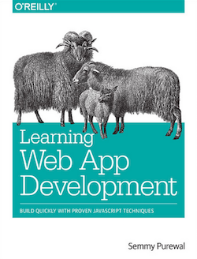
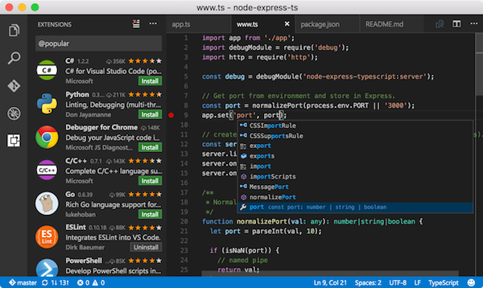
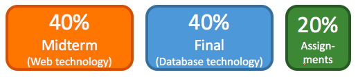
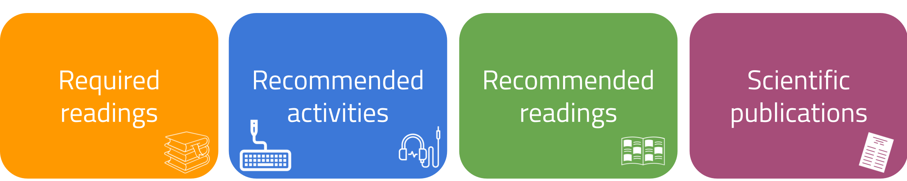

<!--
<html>
  <head>
    <link rel="stylesheet" type="text/css" href="styles.css">
  </head> 
 

  

    <button class="dropbtn">Assignments
      <i class="fa fa-caret-down"></i>
    </button>
    

      <a href="./Assignment-1.html">Assignment 1</a>
      <a href="./Assignment-2.html">Assignment 2</a>
      <a href="./Assignment-3.html">Assignment 3</a>
    

   

  

    <button class="dropbtn">Lecture Transcripts
      <i class="fa fa-caret-down"></i>
    </button>
    

      <a href="./Lecture-1.html">Lecture 1</a>
      <a href="./Lecture-2.html">Lecture 2</a>
      <a href="./Lecture-3.html">Lecture 3</a>
      <a href="./Lecture-4.html">Lecture 4</a>
      <a href="./Lecture-5.html">Lecture 5</a>
      <a href="./Lecture-6.html">Lecture 6</a>
      <a href="./Lecture-7.html">Lecture 7</a>
      <a href="./Lecture-8.html">Lecture 8</a>
    

   

  

    <button class="dropbtn">Extra reading
      <i class="fa fa-caret-down"></i>
    </button>
    

      <a href="./nodeschool-exercises.html">Nodeschool Exercises</a>
      <a href="./university-web-tech-courses.html">Web Tech Courses</a>
    

   

  

    <button class="dropbtn">Setting up
      <i class="fa fa-caret-down"></i>
    </button>
    

      <a href="./How-to-use-VSC.html">Visual studio code</a>
      <a href="./virtual-machine-initialization.html">Virtual machine setup</a>
    

   

   <a href="https://github.com/chauff/Web-Teaching/tree/master/slides">Lecture Slides</a>
   <a href="https://github.com/chauff/Web-Teaching/tree/master/demo-code">Demo Code</a>
  

</html>
-->

CSE1500: Web and Database Technology <!-- omit in toc -->
==

The **Web technology materials and resources** of the 2019/20 [Web and Database Technology course](http://studiegids.tudelft.nl/a101_displayCourse.do?course_id=48438) at TU Delft are listed here. 

They were initially created for the 2018/19 edition of the course. Lectures with a 🚧 marker are not yet finalized for the 2019/20 edition and small changes are possible.

The database materials (lectures/assignments) are not included here! You can find them on Brightspace! Due to the many code examples in the web technology lectures we opted to maintain the materials in a GitHub repository.

## Table of Contents <!-- omit in toc -->
- [Course instructors](#course-instructors)
- [Web technology course book](#web-technology-course-book)
- [Tooling](#tooling)
  - [Recommended](#recommended)
  - [Required](#required)
- [Course grading](#course-grading)
- [Course topics](#course-topics)
- [Web technology tutorials](#web-technology-tutorials)
- [Sample exams](#sample-exams)
- [Assignments &amp; assessment](#assignments-amp-assessment)
- [Demo application](#demo-application)
- [Interactive web technology exercises](#interactive-web-technology-exercises)
- [Twitter accounts to follow](#twitter-accounts-to-follow)
- [Web development resources](#web-development-resources)
- [Lecture material types](#lecture-material-types)
- [Web lectures](#web-lectures)
  - [Lecture 9](#lecture-9)
  - [Lecture 10](#lecture-10)
  - [Lecture 11](#lecture-11)
  - [Lecture 12](#lecture-12)
  - [Lecture 13](#lecture-13)
  - [Lecture 14](#lecture-14)
  - [🚧 Lecture 15](#%f0%9f%9a%a7-lecture-15)
  - [🚧 Lecture 16](#%f0%9f%9a%a7-lecture-16)

## Course instructors

The responsible instructors are Associate Professors [Claudia Hauff](https://chauff.github.io/) (web) and Professor [Alessandro Bozzon](https://www.alessandrobozzon.com/) (databases). The responsible instructors can be reached at `cse1500-ewi@tudelft.nl`. 

The web technology werkcolleges are led by Assistant Professor [Julián Urbano](https://julian-urbano.info/). [Azqa Nadeem](http://homepage.tudelft.nl/j9y2d/) covers some of the werkcolleges as well, will teach the web security lecture and is responsible for the web technology teaching assistants.

## Web technology course book 

The course book for the web technology part is [**Learning Web App Development**](https://www.oreilly.com/library/view/learning-web-app/9781449371388/) by Semmy Purewal. This book covers HTML, CSS, JavaScript and Node.js/Express - exactly the technologies we cover in this course. The book is written for learners without any prior knowledge in these technologies. This book was published in 2014. This could be considered a feature or a bug ... we consider it a feature, as it means that a lot of the recently incorporated changes in the JavaScript language are **not** part of the book. Given that we only have one lecture to introduce the JavaScript language itself, the coverage of the JavaScript language in the book is sufficient and complete enough to allow everyone to start coding! 

The book also covers version control basics (`git` to be specific) which can be ignored for the purposes of our lectures. You will learn all about `git` in the academic quarters that follow!

## Tooling

### Recommended

[Visual Studio Code](https://code.visualstudio.com/) (VSC) is the strongly recommended development environment for the web technology assignments. It is a free and open-source IDE available for all major operating systems. It was originally designed to support Node.js programmers (a server-­side JavaScript framework we use in this class), but now has extensions for many programming languages. Best of all, **Visual Studio Code itself is written in JavaScript**!

VSC offers **many extensions**. You can find a guide on how to browse and install them [here](https://code.visualstudio.com/docs/editor/extension-gallery). A list with all kinds of "delightful" extensions can be found [here](https://github.com/viatsko/awesome-vscode). Since this may be a bit overwhelming, we made a short list of the extensions we recommend to install for this course. For the programming assignments we strongly recommend the **VS Live Share** extension for those students that do not want to dive into `git` yet! 

- [ESLint](https://marketplace.visualstudio.com/items?itemName=dbaeumer.vscode-eslint), the most popular linting utility for JavaScript (a linter is a tool that analyzes source code to flag potentially poor code such as unused variables) - use it to improve your code.
- [Bracket Pair Colorizer](https://marketplace.visualstudio.com/items?itemName=CoenraadS.bracket-pair-colorizer) does what the name suggests.
- [Quokka.js](https://marketplace.visualstudio.com/items?itemName=WallabyJs.quokka-vscode) - a great tool to try out JavaScript snippets without hassle.
- [VS Live Share](https://marketplace.visualstudio.com/items?itemName=MS-vsliveshare.vsliveshare) - a collaborative real-time coding extension (especially useful if a student team works mostly remotely).
- [Material Icon Theme](https://marketplace.visualstudio.com/items?itemName=PKief.material-icon-theme) to make finding the file you are after in your app directory a bit easier.
- 
- If you like to add TODOs to your code, try [Todo Tree](https://marketplace.visualstudio.com/items?itemName=Gruntfuggly.todo-tree), it makes sure you don't overlook any of your TODOs!
- Finally, a good [theme](https://code.visualstudio.com/docs/getstarted/themes) for your IDE to make coding more enjoyable is also not a bad idea. [Dracula](https://marketplace.visualstudio.com/items?itemName=dracula-theme.theme-dracula) is a popular one. [Cobalt2](https://marketplace.visualstudio.com/items?itemName=wesbos.theme-cobalt2) is also nice. If you want to pick based on visuals, head over to [https://vscodethemes.com/](https://vscodethemes.com/).

If you need to be convinced about why Visual Studio Code is a great IDE to use, check out [this podcast](https://syntax.fm/show/012/why-is-everyone-switching-to-vs-code) by Wes Bos and Scott Tolinski on this very topic.

**Browser developer tools** are built into all modern browsers; familiarize yourself with the developer tools of your favorite browser. In our lectures, we will showcase Firefox's developer tools - an elaborate description of them can be found at [MDN](https://developer.mozilla.org/en-US/docs/Tools).

If you are new to team programming, and want to use VSC's features efficiently, [read our guide](How-to-use-VSC.md).

### Required 

The latest stable version of [Node.js](https://nodejs.org/en/). 

Two modern web browsers such as Chrome, Firefox, Edge, etc. to test your project code across browser implementations.

Telnet (for [Assignment 4](Assignment-4.md)).

## Course grading

**Passing requirements**: the overall grade must be **5.8** or higher AND the midterm grade must be at least a **5** AND the final exam grade must be at least a **5** in accordance with TU Delft's exam regulations.

Assignments are done in **pairs of two students** and are graded by student assistants in a binary manner (pass or fail). There are six assignments in total, three cover database topics and three cover web technology topics. While the assignments together make up only 20% of the final grade and are not required, we strongly recommend to tackle the assignments - they cover a lot of exam materials in a practical manner!

We have two assessment moments: one for the database assignments and one for the web technology assignments. The assessment is interview-based. Each assessment moment can yield anything between 3x pass and 3x no-pass. The grading is conducted per student.

The table below shows how the number of passes (maximum 6: 3x database and 3x web) are converted to the assignment grade:

| Number of passes | Grade |
|------------------|-------|
| 6                | 10.0  |
| 5                | 8.3   |
| 4                | 6.7   |
| 3                | 5.0   |
| 2                | 3.3   |
| 1                | 1.7   |
| 0                | 0.0   |

## Course topics

Both databases and web are covered in eight lectures each. The midterm covers only database topics. The final covers only web technology topics.

| Week | Monday                    | Wednesday               | Thursday     |
|------|---------------------------|-------------------------|------------|
| 2.1  | Introduction to databases | Relational database systems             | ---        |
| 2.2  | Design of relational database systems          | SQL 1        | ---        |
| 2.3  | SQL 2            | NoSQL: graph stores | ---        |
| 2.4  | NoSQL: document stores    |SQL (advanced)     | ---        |
| 2.5 | ---                       | ---                     | **Midterm exam** |
| 2.6  | HTTP                      | HTTP/HTML5                   | ---        |
| 2.7  | JavaScript                | Node.js                 | ---        |
| 2.8  | CSS                       | Node.js (advanced)      | ---        |
| 2.9  | Cookies and sessions      | Web security            | ---        |
| 2.10  | **Final exam**                       | ---                 | ---        |

## Web technology tutorials

We offer three tutorials (interactive sessions to solve small problems) for interested students - these tutorials are optional and do not count towards the 140 hours of this course:
- Week 2.7: JavaScript
- Week 2.8: Node.js
- Week 2.9: old exam questions

Check the [MyTimeTable app](https://mytimetable.tudelft.nl/) to determine which tutorial session to attend! 

## Sample exams

Until (and including) the 2017/18 edition, the web and database topics were interwoven (usually 1 lecture of web and 1 lecture of database topics per week) and thus for most years, the midterm and final exams also contain questions on both topics. For the 2019/20 edition, the final exam will contain about 40 multiple choice questions on the web technology topics.

**Exam topics are all topics covered in the lectures and the required readings.** Content of the recommended activitivies/readings that goes beyond what is covered in the lectures/course book is not exam material.

- [Midterm 2015/16](https://github.com/chauff/chauff.github.io/blob/master/documents/webdb-2017-18/midterm2.pdf) ([with answers](https://github.com/chauff/chauff.github.io/blob/master/documents/webdb-2017-18/midterm2-answers.pdf))
- [Final 2015/16](https://chauff.github.io/documents/webdb-2017-18/final2.pdf) ([with answers](https://chauff.github.io/documents/webdb-2017-18/final2-answers.pdf))
- [Midterm 2016/17](https://chauff.github.io/documents/webdb-2017-18/midterm1.pdf)
- [Final 2016/117](https://chauff.github.io/documents/webdb-2017-18/final1.pdf)
- [Midterm 2018/19](exams/midterm-cse1500-201819.pdf) ([with answers](exams/midterm-cse1500-201819-solutions.pdf))
- [Midterm Resit 2018/19](exams/midterm-resit-cse1500-201819.pdf) ([with answers](exams/midterm-resit-cse1500-201819-solutions.pdf))

## Assignments & assessment

There are six assignments in this course in total.

Assignments are worked on in **teams of 2 students**. *We do not allow larger teams; we do not allow teams of 1*.

Assignments 1-3 cover database topics and can be found on Brightspace. Assignments 4-6 cover web technology topics: 

- [Assignment 4 (web)](Assignment-4.md)
- [Assignment 5 (web)](Assignment-5.md)
- [Assignment 6 (web)](Assignment-6.md)

**Assessment**: the three web assignments are assessed in a **single** interview session with a TA; the interview lasts 20-25 minutes. Each of the three assignments can be passed or failed (binary judgment, there are no grade levels) on an individual basis. The assessment rubric for the web assignments is available [here](rubric.md). The assessment takes place during week 2.9.

**All assignments must be submitted in Brightspace before your assessment timeslot, and in any case no later than January 22, 2020 at 23:30 (hard deadline).** All submissions are timestamped. Late submissions (or re-submissions) will not be assessed. We are going to check if your submitted work is consistent with the one used for assessment.

FYI, in previous years, roughly 90% of groups attempted and passed the first assignment, about 60% of groups passed two assignments and about 30% of groups all three assignments. 

## Demo application

A demo board game application (a word guesser) [is available](https://github.com/chauff/Web-Teaching/tree/master/demo-code) as well. It has has been implemented along the lines of the assignments.

The demo app, just as listed in this year's board game project, consists of two screens, a splash screen:

and a game screen:

## Interactive web technology exercises

Students who do not have a lot of prior knowledge often struggle to get started.
Here is a [list of useful interactive exercises](nodeschool-exercises.md) and how they match up with each lecture. Each of these exercises is small, taking just a few minutes (sometimes less than a minute) to solve.

## Twitter accounts to follow

Twitter is a great resource to hear the latest and greatest about the web stack. Here is a list of accounts we recommend to follow

- [Franziska Hinkelmann](https://twitter.com/fhinkel), working on Node.js at Google
- [Lin Clark](https://twitter.com/linclark) makes technical challenges accessible to the wider public for Mozilla
- [V8](https://twitter.com/v8js), Google's JavaScript engine
- [JavaScript Daily](https://twitter.com/JavaScriptDaily), does exactly as the name suggests
- [AmsterdamJS](https://twitter.com/amsterdamjs), local JavaScript community
- [Node.js](https://twitter.com/nodejs) (of course)
- [Axel Rauschmeyer](https://twitter.com/rauschma), an author of popular JavaScript books
- [Addy Osmani](https://twitter.com/addyosmani), working on Google Chrome and well known for his JavaScript design patterns book
- [Wes Bos](https://twitter.com/wesbos), a popular teacher of the web stack
- [Mozilla Hacks](https://twitter.com/mozhacks), official Mozilla account for web developers
- [Visual Studio Code](https://twitter.com/code) (of course)
- [JavaScript Conference Series](https://twitter.com/jsconf) - look out for their conference talks, usually posted on YouTube
- [Chrome DevTools](https://twitter.com/ChromeDevTools), tips and tricks of the dev tool trade
- [Syntax](https://twitter.com/syntaxfm), podcasts for web developers

## Web development resources

The practical assignments of this work often require looking up Web development specifics. Two good resources, in general, for Web engineering are [Mozilla's MDN portal](https://developer.mozilla.org/en-US/) and [Google's Web Fundamentals](https://developers.google.com/web/fundamentals/).

 

## Lecture material types

For each lecture we provide a range of materials:

- **Required readings**: most of the required readings are book chapters of the web course book. The book introduces each technology from scratch. The lectures go beyond what is covered in the book and assume that you have read the corresponding book chapter(s) **before** the lecture.
- **Recommended activities**: activities that we think will help you get a better grasp of the different web technologies. Activities are either programming exercises or podcasts (there are some great ones out there!). Don't see those as a complete list to work through, that is impossible given the time!
- **Recommended readings**: these may be tweets, blog posts or book chapters that help you understand some of the introduced concepts better; again, do not attempt to read all of the materials.
- **Relevant scientific publications**: we are often asked why this kind of course is part of the computer science curriculum. Isn't this "just" programming? To showcase how web technologies are researched, we here list a number of scientific publications that contribute to our understanding of (the use of) web technologies.

*If you are interested in knowing what other universities teach in terms of web technologies, take a look at [this list of courses with a web focus](university-web-tech-courses.md).*

## Web lectures

All lecture transcripts and assigments (which were developed in Markdown) were **automatically** converted to PDF format, for those students preferring PDFs. Warning: due to the automatic conversion not all pages will look great. You can find them in the [generatedPDFs](generatedPDFs/) folder here on GitHub.

Lectures 1-8 cover database topics and can be found on Brightspace.

### Lecture 9

The lecture covers HTTP ([intro slides](slides/2019_20/intro.pdf), [lecture slides](slides/2019_20/http.pdf), [transcript](Lecture-http.md)).
  
- Required readings: *none*
- Recommended activity:
  - :headphones: Listen to [this podcast](https://syntax.fm/show/044/how-to-learn-new-things-quickly) on how to learn new things quickly in the Web technology world.
  - :tv: A [short video](https://www.youtube.com/watch?v=fXUni9WrUuw) (in Dutch) by CWI (Centrum Wiskunde & Informatica) to celebrate 30 years since the Netherlands was connected to the public Internet!
- Recommended readings:
  - :closed_book: Chapters 1, 2 and 3 of [HTTP: The Definite Guide (O'REILLY 2002)](http://shop.oreilly.com/product/9781565925090.do).
  - [MDN overview of HTTP](https://developer.mozilla.org/en-US/docs/Web/HTTP).
  - Developer tools overview of your favorite web browser (e.g. [Firefox](https://developer.mozilla.org/son/docs/Tools) or [Chrome](https://developer.chrome.com/devtools)).
  - [A brief history of HTTP](https://hpbn.co/brief-history-of-http/).
  - [Browser fingerprinting](https://arstechnica.com/security/2017/02/now-sites-can-fingerprint-you-online-even-when-you-use-multiple-browsers/) showcases how seemingly innocuous data can identify users.
  - [A crash course on HTTP and DNS by Mozilla (among other things)](https://hacks.mozilla.org/2018/05/a-cartoon-intro-to-dns-over-https/).
  - A detailed overview of the [history of web standards](https://www.smashingmagazine.com/2019/01/web-standards-guide/) and how to make use of them.
- Relevant scientific publications:
  - Ihm, S. and Pai, V.S., 2011. [Towards understanding modern web traffic](https://dl.acm.org/citation.cfm?id=2068845). In Proceedings of the 2011 ACM SIGCOMM conference on Internet measurement conference (pp. 295-312). ACM.
  - Naylor, D., Finamore, A., Leontiadis, I., Grunenberger, Y., Mellia, M., Munafò, M., Papagiannaki, K. and Steenkiste, P., 2014. [The cost of the S in HTTPS](https://dl.acm.org/citation.cfm?id=2674991). In Proceedings of the 10th ACM International on Conference on emerging Networking Experiments and Technologies (pp. 133-140).
  - Falaki, H., Lymberopoulos, D., Mahajan, R., Kandula, S. and Estrin, D., 2010. [A first look at traffic on smartphones](https://dl.acm.org/citation.cfm?id=1879176). In Proceedings of the 10th ACM SIGCOMM conference on Internet measurement (pp. 281-287).

### Lecture 10

This lecture covers web design and HTML5 ([lecture slides](slides/2019_20/html.pdf), [transcript](Lecture-design.md)).

- Required readings:
  - :warning: Chapter 2 of the [web course book](http://shop.oreilly.com/product/0636920030621.do).
  - :warning: [Introduction to HTML forms](https://developer.mozilla.org/en-US/docs/Learn/HTML/Forms/Your_first_HTML_form) (ignore the section on *Basic form styling*, we will cover CSS in a later lecture) and [Sending form data](https://developer.mozilla.org/en-US/docs/Learn/HTML/Forms/Sending_and_retrieving_form_data) (up to and including the section on *Viewing HTTP requests*).
- Recommended activity:
  - :headphones: Listen to [this podcast with Tom Dale](http://talkingcode.com/podcast/episode-11-tom-dale/) discussing modern web applications and the move from web sites to web apps and an almost *native* experience.
- Recommended readings:
  - :closed_book: Chapter 3 of the [Definite Guide to HTML5](https://www.apress.com/gp/book/9781430239604).
  - [Web Fundamentals by Google](https://developers.google.com/web/fundamentals/).
  - [Examples of what modern web technologies can achieve in Chrome](https://experiments.withgoogle.com/) (if you use another browser, not all examples may work as expected).
  - [Atomic Design by Brad Frost](http://atomicdesign.bradfrost.com/) 
- Relevant scientific publications:
  - Fernandez, A., Insfran, E. and Abrahão, S., 2011. [Usability evaluation methods for the web: A systematic mapping study](https://www.sciencedirect.com/science/article/pii/S0950584911000607). Information and Software Technology, 53(8), pp. 789-817.
  - Sonderegger, A. and Sauer, J., 2010. [The influence of design aesthetics in usability testing: Effects on user performance and perceived usability](https://www.sciencedirect.com/science/article/pii/S0003687009001148). Applied Ergonomics, 41(3), pp. 403-410.
  - Mathur, A., Acar, G., Friedman, M., Lucherini, E., Mayer, J., Ghetty, M. and Narayanan, A., 2019. [Dark Patterns at Scale: Findings from a Crawl of 11KShopping Websites](https://webtransparency.cs.princeton.edu/dark-patterns/), ACM Human-Computer Interaction, Vol. 3, CSCW, Article 81.

### Lecture 11

This lecture covers client-side JavaScript ([lecture slides](slides/2019_20/js.pdf), [transcript](Lecture-js.md)).

- Required readings:
  - :warning: Chapter 4 of the [web course book](http://shop.oreilly.com/product/0636920030621.do).
- Recommended activities:
  - [Interactive JavaScript exercises](nodeschool-exercises.md).
  - :headphones: Listen to [this podcast by Wes Bos and Scott Tolinski](https://syntax.fm/show/047/how-to-get-better-at-debugging) on debugging.
  - [JavaScript30](https://javascript30.com/): 30 day vanilla JS coding challenges
- Recommended readings:
  - :closed_book: [Learning JavaScript design patterns](https://addyosmani.com/resources/essentialjsdesignpatterns/book/), in particular the sections on the [constructor pattern](http://addyosmani.com/resources/essentialjsdesignpatterns/book/#constructorpatternjavascript) and the [module pattern](http://addyosmani.com/resources/essentialjsdesignpatterns/book/#modulepatternjavascript).
  - MDN's introduction to [JavaScript objects](https://developer.mozilla.org/en-US/docs/Learn/JavaScript/Objects).
  - [The dynamic nature of JavaScript makes optimization tricky (blog post)](https://v8project.blogspot.com/2017/09/elements-kinds-in-v8.html).
  - [Why do we need all those fancy tools for JavaScript development nowadays? (blog post)](https://medium.com/the-node-js-collection/modern-javascript-explained-for-dinosaurs-f695e9747b70).
  - [Learn how to debug with Firefox devtools](https://mozilladevelopers.github.io/playground/debugger).
  - [Array.prototype.sort is now stable in V8](https://twitter.com/mathias/status/1036626116654637057) (tweet): shows that even basic mechanisms like sorting are still being changed in mature implementations.
  - [Tooling and conventions](https://twitter.com/manucorporat/status/1037370271286657024) are vital in the fast-paced world of JavaScript.
  - [The State of JavaScript 2017](https://2017.stateofjs.com/).
- Relevant scientific publications:
  - Charland, A. and Leroux, B., 2011. [Mobile application development: web vs. native](https://queue.acm.org/detail.cfm?id=1968203). Queue, 9(4), p. 20.
  - Mowery, K., Bogenreif, D., Yilek, S. and Shacham, H., 2011. [Fingerprinting information in JavaScript implementations](https://hovav.net/ucsd/dist/jspriv.pdf). In Proceedings of W2SP (Vol. 2, No. 11).
  - Ratanaworabhan, P., Livshits, B. and Zorn, B.G., 2010. [JSMeter: Comparing the Behavior of JavaScript Benchmarks with Real Web Applications](https://www.usenix.org/legacy/events/webapps10/tech/full_papers/Ratanaworabhan.pdf). In Proceedings of the 2010 USENIX conference on Web application development.
  - Lin, J., 2018. [Computing without Servers, V8, Rocket Ships, and Other Batshi*t Crazy Ideas in Data Systems](http://ceur-ws.org/Vol-2167/keynote1.pdf). In Proceedings of DESIRES. A quote ... "_So, the future is. . .  JavaScript? Once  we get beyond the fact that JavaScript is an undeniably shitty language on which to build an interlingual execution platform, there is at least some so-crazy-it-might-actually-work appeal to this idea._"
  - Patra, J., Dixit, P.N. and Pradel, M., 2018. [ConflictJS: finding and understanding conflicts between JavaScript libraries](http://mp.binaervarianz.de/icse2018.pdf). In Proceedings of the 40th International Conference on Software Engineering, pp. 741-751.
  - Jangda, A., Powers, B., Berger, E. D., & Guha, A., 2019. [Not so fast: analyzing the performance of webassembly vs. native code](https://www.usenix.org/system/files/atc19-jangda.pdf). In Proceedings of the 2019 USENIX Annual Technical Conference, pp. 107-120.

### Lecture 12

This lecture covers Node.js ([lecture slides](slides/2019_20/node.pdf), [transcript](Lecture-node.md)).

- Required readings:
  - :warning: Chapters 5 & 6 of the [web course book](http://shop.oreilly.com/product/0636920030621.do). We will cover Node.js in the lecture from sratch, use the reading to get a first idea of what Node.js is about!
- Recommended activities:
  - [Interactive Node.js exercises](nodeschool-exercises.md).
- Recommended readings:
  - The [MDN documentation on Asynchronous JavaScript](https://developer.mozilla.org/en-US/docs/Learn/JavaScript/Asynchronous) is an excellent source to learn about the topic in more detail.
  - [Node.js State of the Union 2017](https://medium.com/the-node-js-collection/node-js-state-of-the-union-blog-2017-ed86640ec451).
  - [The world runs on Node.js (Twitter thread)](https://twitter.com/bitandbang/status/1037306199522328577).
  - If you are interested in learning how best to get involved in the Node community, [read this blog post](https://dev.to/azure/start-contributing-to-nodejs-in-the-new-year-3dlh) on how to go about it.
- Relevant scientific publications:
  - Chaniotis, I.K., Kyriakou, K.I.D. and Tselikas, N.D., 2015. [Is Node.js a viable option for building modern web applications? A performance evaluation study.](https://link.springer.com/article/10.1007/s00607-014-0394-9) Computing, 97(10), pp.1023-1044.
  
### Lecture 13

This lecture covers CSS ([lecture slides](slides/2019_20/css.pdf), [transcript](Lecture-css.md)).
  
- Required readings:
  - :warning: Chapter 3 of the [web course book](http://shop.oreilly.com/product/0636920030621.do).
- Recommended activities:
  - :tv: Watch [this talk by Rachel Andrew](https://www.youtube.com/watch?v=cYGOv2ToZjY) to learn more about the long (and painful) history of CSS.
  - :tv: Watch [this talk by Mandy Michael](https://youtu.be/5qgUC_z8syw) on text effects in CSS. Data attributes and pseudo-elements are a powerful combination!
  - :headphones: Listen to [this podcast by Wes Bos and Scott Tolinski](https://syntax.fm/show/021/what-s-new-in-css-variables-scoping-new-selectors-and-color-functions) on the present and future of CSS.
- Recommended readings:
  - :closed_book: Chapters 1-4 and chapter 13 of [The Book of CSS3: A developer's guide to the future of web design](https://nostarch.com/css3_2e) by Peter Gasston (2nd edition, 2014).
  - To make sense of CSS positioning, take a look [here](https://alistapart.com/article/css-positioning-101).
  - If you want to look behind the scenes, read Mozilla's blog post on their [CSS engine Quantum CSS](https://hacks.mozilla.org/2017/08/inside-a-super-fast-css-engine-quantum-css-aka-stylo/).
  - After studying this lecture you have the basic knowledge to consider a career as a [Front-End Developer](https://frontendmasters.com/books/front-end-handbook/2019/#1)
- Relevant scientific publications:
  - Meyerovich, L.A. and Bodik, R., 2010, April. [Fast and parallel webpage layout](https://dl.acm.org/citation.cfm?id=1772763) In Proceedings of the 19th international conference on World wide web (pp. 711-720). ACM.

### Lecture 14

This lecture covers advanced Node.js concepts ([lecture slides](slides/2019_20/node2.pdf), [transcript](Lecture-node2.md)).

- Required readings: *none*
- Recommended activities:
  - An interactive ejs playground can be found [here](https://ionicabizau.github.io/ejs-playground/).
- Recommended readings:
  - To learn more about ejs, take a look at its [GitHub repository](https://github.com/mde/ejs).
  - To learn more about middleware and Express, take a look at the [Express documentation](http://expressjs.com/en/guide/using-middleware.html).
  - An overview of [best practices in Node.js](https://github.com/i0natan/nodebestpractices).
  - [Slide deck on High Performance JS in V8](https://docs.google.com/presentation/d/1KCcA-WAyhGs0SEOrfU21fjaTWTxvNxYLwmNlGIbuZFw/edit?usp=sharing).
- Relevant scientific publications:
  - Fard, A.M. and Mesbah, A., 2013, September. [JSNose: Detecting javascript code smells](https://www.computer.org/csdl/proceedings-article/2013/scam/12OmNylsZKu/12OmNwHhoWN). In Source Code Analysis and Manipulation (SCAM), 2013 IEEE 13th International Working Conference on (pp. 116-125). IEEE.
  - Nasehi, S.M., Sillito, J., Maurer, F. and Burns, C., 2012, September. [What makes a good code example?: A study of programming Q&A in StackOverflow](https://pdfs.semanticscholar.org/8b8d/4c0284f26d5e4ce08c85f98fd453762ab26d.pdf). In 2012 28th IEEE International Conference on Software Maintenance (ICSM) (pp. 25-34). IEEE.

### 🚧 Lecture 15

This lecture covers cookies and sessions ([transcript](Lecture-sessions.md)).

- Required readings: *none*
- Recommended activities: *none*
- Recommended readings:
  - :closed_book: Chapter 9 of [Web Development with Node & Express](http://shop.oreilly.com/product/0636920032977.do) by Ethan Brown.
  - Instead of cookies to recognize a user, we can also resort to the more stealthy version of [browser fingerprinting](https://arstechnica.com/security/2017/02/now-sites-can-fingerprint-you-online-even-when-you-use-multiple-browsers/).
- Relevant scientific publications:
  - Roesner, F., Kohno, T. and Wetherall, D., 2012. [Detecting and defending against third-party tracking on the web](https://www.usenix.org/system/files/conference/nsdi12/nsdi12-final17.pdf). In Proceedings of the 9th USENIX conference on Networked Systems Design and Implementation (pp. 12-12). USENIX Association.
  - Park, J.S. and Sandhu, R., 2000. [Secure cookies on the Web](https://ieeexplore.ieee.org/abstract/document/865085). IEEE internet computing, 4(4), pp.36-44.
  - Franken, G., Van Goethem, T. and Joosen, W., 2018. [Who left open the cookie jar? a comprehensive evaluation of third-party cookie policies](https://www.usenix.org/system/files/conference/usenixsecurity18/sec18-franken.pdf). In Proceedings of the 27th USENIX Security Symposium, pp. 151-168.

### 🚧 Lecture 16

This lecture covers web security topics ([transcript](Lecture-security.md)).

- Required readings: *none*
- Recommended activities:
  - :headphones: Listen to [this podcast](https://syntax.fm/show/035/keeping-up-with-the-codeashians-dealing-with-our-fast-paced-industry) on how to navigate the fast-paced Web technology industry.
  - The [OWASP Juice Shop](https://www.owasp.org/index.php/OWASP_Juice_Shop_Project) is a more advanced Node.js/Express application that is intentionally insecure to train your web security skills.
- Recommended readings:
  - :closed_book: If you want to know everything there is about security, read Ross Anderson's [Security Engineering book](https://www.cl.cam.ac.uk/~rja14/book.html). [Chapter 21](http://www.cl.cam.ac.uk/%7Erja14/Papers/SEv2-c21.pdf) is most pertinent to the web security lecture (warning: this is an extensive read).
  - [Stanford's CS155](https://crypto.stanford.edu/cs155/): Computer and Network Security course has a number of lectures on web security (PDFs: [here](https://crypto.stanford.edu/cs155/lectures/08-browser-sec-model.pdf), [here](https://crypto.stanford.edu/cs155/lectures/10-SessionMgmt.pdf), [here](https://crypto.stanford.edu/cs155/lectures/09-web-site-sec.pdf) and [here](https://crypto.stanford.edu/cs155/lectures/11-workers-sandbox-csp.pdf)).
  - CERN's [web security lecture](https://indico.cern.ch/event/242207/).
  - The [Open Web Application Security Project](https://www.owasp.org/index.php/Main_Page) provides an extensive list of practical tips, best practices and further readings on the topic.
  - [Node.js security best practices](https://medium.com/@nodepractices/were-under-attack-23-node-js-security-best-practices-e33c146cb87d).
- Relevant scientific publications:
  - Aggarwal, G., Bursztein, E., Jackson, C. and Boneh, D., 2010. [An Analysis of Private Browsing Modes in Modern Browsers](http://crypto.stanford.edu/~dabo/papers/privatebrowsing.pdf). In Proceedings of the 19th USENIX conference on Security. USENIX Association.
  - Kieyzun, A., Guo, P.J., Jayaraman, K. and Ernst, M.D., 2009. [Automatic creation of SQL injection and cross-site scripting attacks](https://dl.acm.org/citation.cfm?id=1555036). In Proceedings of the 31st International Conference on Software Engineering (pp. 199-209). IEEE Computer Society.
  - Von Ahn, L., Maurer, B., McMillen, C., Abraham, D. and Blum, M., 2008. [recaptcha: Human-based character recognition via web security measures](http://science.sciencemag.org/content/321/5895/1465). Science, 321(5895), pp.1465-1468.
  - Acar, G., Eubank, C., Englehardt, S., Juarez, M., Narayanan, A. and Diaz, C., 2014. [The web never forgets: Persistent tracking mechanisms in the wild](https://www.ftc.gov/system/files/documents/public_comments/2015/10/00064-98109.pdf). In Proceedings of the 2014 ACM SIGSAC Conference on Computer and Communications Security (pp. 674-689). ACM.
