# CSS: the language of web design <!-- omit in toc -->



## Table of Contents <!-- omit in toc -->

- [Required & recommended readings and activities](#required--recommended-readings-and-activities)
- [:scroll: Learning goals](#scroll-learning-goals)
- [A first demo](#a-first-demo)
- [A word of warning](#a-word-of-warning)
- [A bit of history](#a-bit-of-history)
- [Takeaways of the required readings](#takeaways-of-the-required-readings)
- [Pseudo-classes](#pseudo-classes)
  - [:bangbang: nth-child(X) and nth-of-type(X)](#bangbang-nth-childx-and-nth-of-typex)
  - [:bangbang: :root](#bangbang-root)
  - [:bangbang: :hover, :active and :visited](#bangbang-hover-active-and-visited)
  - [:bangbang: :enabled and :disabled](#bangbang-enabled-and-disabled)
- [Pseudo-elements](#pseudo-elements)
  - [:bangbang: ::first-letter and ::first-line](#bangbang-first-letter-and-first-line)
  - [:bangbang: ::before and ::after](#bangbang-before-and-after)
- [:bangbang: Selector combinations](#bangbang-selector-combinations)
- [:bangbang: Data attributes](#bangbang-data-attributes)
- [Element positioning](#element-positioning)
  - [Display types](#display-types)
  - [Grid layout](#grid-layout)
  - [CSS units and functions](#css-units-and-functions)
    - [Units of measurement](#units-of-measurement)
    - [Functions](#functions)
  - [:bangbang: Position](#bangbang-position)
    - [position:relative](#positionrelative)
    - [position:absolute](#positionabsolute)
    - [position:fixed](#positionfixed)
- [CSS media queries](#css-media-queries)
- [CSS animations and transitions](#css-animations-and-transitions)
  - [CSS vs. JavaScript animations](#css-vs-javascript-animations)
  - [CSS animations](#css-animations)
    - [:bangbang: Text-heavy animations](#bangbang-text-heavy-animations)
    - [:bangbang: Animations: CSS weather demo](#bangbang-animations-css-weather-demo)
  - [Transitions](#transitions)
- [Vendor prefixes](#vendor-prefixes)
- [CSS frameworks and APIs](#css-frameworks-and-apis)
- [Self-check](#self-check)

## Required & recommended readings and activities

- Required readings:
  - [What is CSS @MDN](https://developer.mozilla.org/en-US/docs/Learn/CSS/First_steps/What_is_CSS)
  - [Getting started with CSS @MDN](https://developer.mozilla.org/en-US/docs/Learn/CSS/First_steps/Getting_started)
  - [How CSS is structured @MDN](https://developer.mozilla.org/en-US/docs/Learn/CSS/First_steps/How_CSS_is_structured)
- Recommended activities:
  - :tv: Watch [this talk by Rachel Andrew](https://www.youtube.com/watch?v=cYGOv2ToZjY) to learn more about the long (and painful) history of CSS.
  - :tv: Watch [this talk by Lea Verou](https://www.youtube.com/watch?v=kZOJCVvyF-4) to learn more about CSS variables.
  - :tv: Watch [this talk by Lea Verou](https://www.youtube.com/watch?v=YsX4uFgyvpk) to learn a few more CSS tricks.
  - :tv: Watch [this talk by Mandy Michael](https://youtu.be/5qgUC_z8syw) on text effects in CSS. Data attributes and pseudo-elements are a powerful combination!
  - :tv: Watch [Una Kravetz](https://www.youtube.com/watch?v=qm0IfG1GyZU) run through 10 modern layouts with just a few lines of CSS grid!
  - :headphones: An entire [podcast series](https://pod.link/thecsspodcast) by Una Kravets and Adam Argyle about CSS exists too!
  - :headphones: Listen to [this podcast by Wes Bos and Scott Tolinski](https://syntax.fm/show/021/what-s-new-in-css-variables-scoping-new-selectors-and-color-functions) on the present and future of CSS.
  - The [CSS grid generator](https://cssgrid-generator.netlify.app/) can help you wrap your head around the main CSS grid properties.
  - At [https://flukeout.github.io/](https://flukeout.github.io/) you find a game to practice CSS selectors. Another CSS selector practice page can be found [here](https://codepen.io/pehaa/full/ROapJZ).
- Recommended readings:
  - [The state of CSS 2020](https://2020.stateofcss.com/): a developer survey on the CSS features that are being used and seen as important going forward.
  - [Extensive post](https://developer.mozilla.org/en-US/docs/Tools/Page_Inspector/How_to/Examine_and_edit_CSS) on Firefox's developer tools for CSS.
  - :closed_book: Chapters 1-4 and chapter 13 of [The Book of CSS3: A developer's guide to the future of web design](https://nostarch.com/css3_2e) by Peter Gasston (2nd edition, 2014).
  - [A blog post on the history of CSS: Old CSS, new CSS](https://eev.ee/blog/2020/02/01/old-css-new-css/)
- Relevant scientific publications:
  - Meyerovich, Leo A., and Rastislav Bodik. [Fast and parallel webpage layout](https://dl.acm.org/citation.cfm?id=1772763). Proceedings of the 19th international conference on WWW. 2010.
  - Panchekha, Pavel, and Emina Torlak. [Automated reasoning for web page layout](https://doi.org/10.1145/2983990.2984010). Proceedings of the 2016 ACM SIGPLAN International Conference on Object-Oriented Programming, Systems, Languages, and Applications. 2016.

## :scroll: Learning goals

- Position and style HTML elements according to a given design of a web application.
- Employ pseudo-classes and pseudo-elements.
- Employ CSS variables and data access/creation facilities.
- Write CSS media queries.
- Create CSS-based animations.

## A first demo

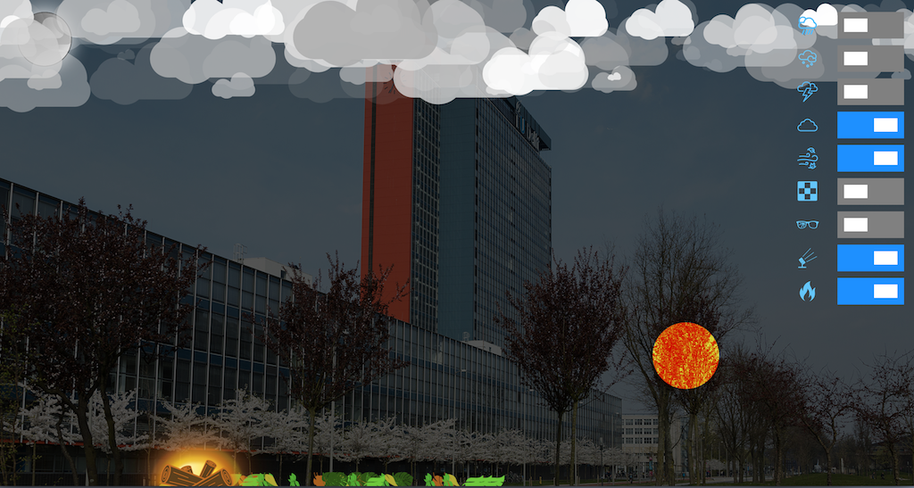

<sup>[CSS weather demo](https://codepen.io/charlottehase/full/abzYoQp).</sup>

At [CodePen](https://codepen.io/) you find our [CSS weather demo](https://codepen.io/charlottehase/full/abzYoQp) that shows off some CSS capabilities. Throughout this transcript we will refer to this demo from time to time. We added elaborate comments that should help you get started exploring the demo code. This demo contains only a single image (the TU DELFT EWI building), everything else is designed with CSS. Since some elements appear hundreds of times (e.g., every rain drop is a separate `<span>`, every cloud is a `<div>` element) the demo also shows off how to set up an element's style in JavaScript.

If you want to find inspirations about what is possible with HTML, CSS (and JavaScript), it is worthwhile to explore [CodePen](https://codepen.io/) (a platform where frontend designers share and learn).

## A word of warning

The tweet below sums up a lot of CSS experiences&mdash;some things are easy with CSS (animations come to mind), while others, which intuitively should not be that hard to accomplish (e.g. the vertical alignment of elements before CSS grid came along), will cost you a lot of time.

<blockquote class="twitter-tweet"><p lang="en" dir="ltr">when I think I&#39;m a fairly decent programmer, and then try and align two buttons next to each other in CSS <a href="https://t.co/v43Lp9Vv0U">pic.twitter.com/v43Lp9Vv0U</a></p>&mdash; I Am Devloper (@iamdevloper) <a href="https://twitter.com/iamdevloper/status/936199543099621376?ref_src=twsrc%5Etfw">November 30, 2017</a></blockquote> <script async src="https://platform.twitter.com/widgets.js" charset="utf-8"></script>

Another important bit of information comes from Addy Osmani :point_down::

<blockquote class="twitter-tweet"><p lang="en" dir="ltr">border: 1px solid red; is the console.log of CSS</p>&mdash; Addy Osmani (@addyosmani) <a href="https://twitter.com/addyosmani/status/1275700187491639298?ref_src=twsrc%5Etfw">June 24, 2020</a></blockquote> <script async src="https://platform.twitter.com/widgets.js" charset="utf-8"></script>

Finally, remember to take a look at [caniuse.com](https://caniuse.com/) if you find different browsers showing different renderings of your styling.

## A bit of history

The **Cascading Style Sheets** (CSS) language describes how elements in the DOM should be rendered. As other web technologies, CSS can be considered to be a victim of the browser wars&mdash;which led to years of inactivity in the standard's refinement:

- **CSS1** became a W3C recommendation in 1996. It had support for fonts, colors, alignment, margins, ids and classes.
- Two years later, **CSS2** became a W3C recommendation, adding support for media queries and element positioning (among others). The W3C was ready to get started on CSS3. However, the browser support for CSS2 remained inconsistent; the W3C decided to focus on fixing inconsistencies with CSS2.1.
- In 2011, **CSS2.1** became a W3C recommendation which fixed errors and added support for features already widely implemented in major browsers.
- Work on **CSS3** began already in 1998, was put on hold, and is now back in full swing with browser vendors pushing to implement the newest standards. CSS became so complex and agreeing on a standard for the entire language became so tedious that after CSS2 the monolithic nature of the standard was given up. Instead, we now have **CSS modules**, which each progress at an individual pace. The current state of those modules is available at [https://www.w3.org/Style/CSS/current-work](https://www.w3.org/Style/CSS/current-work). Many of those modules are in _Working Draft_ status, while some have already reached level 4 - the _level number_ indicates how many revisions of the module have taken place.

Any CSS module developed after CSS2.1 can be considered as CSS3. There will not be a monolithic CSS4, instead the different modules of the CSS specification will each continue to develop at their own pace.

## Takeaways of the required readings

Having worked through the required readings, you should be able to add basic styling to HTML elements. You know that style sheets are processed in order: later declarations override earlier ones if they are on the same or a higher specificity level.

You know that the following code snippet shows a **CSS rule** :point_down::

```css
body {
  background-color: #ffff00;
  color: gold;
}
```

:point_up: Here, `body` is a **selector**, `background-color` and `color` are **properties** and `#ffff00` as well as `gold` are **values**. You know the difference between a `class` and an `id` attribute and how to make use of both in CSS.

_Note_: In this example :point_up: one color value is represented by its hex value, another one by name. Throughout this transcript, we often use color names&mdash;there are more than 140 color names that all modern browsers recognize ([a nicely formatted list is available on Wikipedia](https://en.wikipedia.org/wiki/Web_colors#X11_color_names)). Besides hex values, colors can also be represented by their `rgba` values (red, green, blue, alpha). We suggest [convertingcolors.com](https://convertingcolors.com/) as one option to convert between different color formats.

You have also learned about two types of style sheets: the **browser's style sheets** (also called the _internal stylesheets_ or _default styles_) and the **web application style sheets**, the latter overriding the former. There is a third type of style sheets and that are the **user style sheets**: user style sheets allow users to override the web applications' look and feel according to their own needs (e.g. larger font sizes or specific colors).

We now move beyond these basics and introduce a number of more advanced CSS concepts.

## Pseudo-classes

A **pseudo-class** is a keyword added to a **selector** that indicates _a particular state or type_ of the corresponding element. Pseudo-classes allow styling according to, among others, **document external** factors such as mouse movements and user browsing history as well as **element external** factors such as the placement of the element within the document structure.

Pseudo-classes are added to a selector with a colon (`:`) separating them:

```css
selector:pseudo-class {
  property: value;
  property: value;
}
```

In the upcoming sections, we introduce the following pseudo-classes: `nth-child`, `nth-of-type`, `root`, `hover`, `active`, and `visited`, `enabled` and `disabled`. This list is by no means complete (take a look at this list of [pseudo-classes implemented in most modern browsers](https://developer.mozilla.org/en-US/docs/Web/CSS/Pseudo-classes)), but sufficient for our purposes.

### :bangbang: nth-child(X) and nth-of-type(X)

Imagine you want to show off a number of game statistics on the splash screen of your web application. To increase readability, the background and font colors of the items should alternate. There are various ways to do this, here are two:

- We can _hardcode_ the CSS rule of every element, ending up with as many rules as we have game statistics to show off. This is not maintainable.
- We write two CSS rules (one per color choice), assign each to a class (e.g. `.odd` and `.even`) and then alternate the class assignment of the elements holding the game statistics. Better than the first option, but still not ideal. What happens if we want to include a game statistic in the middle of the existing list? All subsequent game statistics would have to be assigned a different class to maintain the alternating colors styles.

Ideally, we only create two CSS rules and solve the rest (alternate assignment of colors) automatically. And that's exactly what we can do with the two pseudo-classes we introduce now:

- [`:nth-child(X)`](https://developer.mozilla.org/en-US/docs/Web/CSS/:nth-child) is any element that is the Xth **child element** of its parent;
- [`:nth-of-type(X)`](https://developer.mozilla.org/en-US/docs/Web/CSS/:nth-of-type) is any element that is the Xth **sibling** of its type.

In both cases, `X` can be an integer or formula, e.g `2n+1`, where `n` represents a number starting at 0 and incrementing. Element indices start at `1`. Instead of `2n` and `2n+1` we can also use `even` and `odd` as shortcuts. If we want to start counting elements in reverse order, we can use the analogous `:nth-last-child(X)` and `:nth-last-of-type(X)` pseudo-classes.

<optional-info markdown="block">
If we are aiming at the first and/or last child or sibling element, we also have additional pseudo-classes available to us:

| Pseudo-class     | Equivalent to          |
| :--------------- | :--------------------- |
| `:first-child`   | `:nth-child(1)`        |
| `:last-child`    | `:nth-last-child(1)`   |
| `:first-of-type` | `:nth-of-type(1)`      |
| `:last-of-type`  | `:nth-last-of-type(1)` |
</optional-info>

Let's see how this looks in a toy example. Lets style a list of five game statistics, each one being held by a `<div>` element. We also add a `<h1>` element for our header (_Game statistics_). Our DOM tree thus looks as follows:

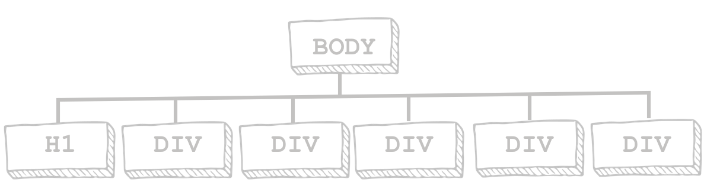

<sup>"Hand-drawn" DOM tree. It corresponds to the HTML document below.</sup>

The corresponding HTML document with _inline_ styling showcases the pseudo-classes `:nth-child` and `:nth-of-type`:

```html
<!DOCTYPE html>
    <head>
        <style>
            div {
                margin-bottom: 2px;
                padding: 2px;
                white-space: pre;
                font-family: monospace;
            }
            div:nth-child(2n){
                background-color: orchid;
                color: lavender;
            }
            div:nth-child(2n+1){
                background-color: lavender;
                color: orchid;
            }
            div:nth-child(3) {
                border: 1px dashed black;
            }
            div:nth-of-type(3) {
                border: 1px solid black;
            }
        </style>
    </head>

    <body>
        <h1>Game statistics</h1>
        <div>12,567 players registered</div>
        <div>   231 games ongoing</div>
        <div>    17 games waiting for players to join</div>
        <div> 2,302 users are in audience mode</div>
        <div>99.87% server uptime</div>
    </body>
</html>
```

:bangbang: Save this code :point_up: in a file and open it in your browser. Right-click anywhere on the page and select <kbd>Inspect element</kbd> (Firefox) or <kbd>Inspect</kbd> (Chrome). This will open the dev tools' page inspector. If you use Firefox, you should see the following interface:

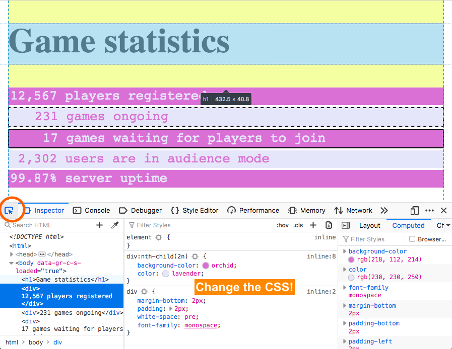

<sup>Firefox's Page Inspector panel. Screenshot taken September 8, 2020. To inspect an element of the page, first click on the circled arrow (this activates the element picker).</sup>

The list of game statistics :point_up: is rendered with alternating colors as was our goal. We also see here how `:nth-child` and `:nth-of-type` differ (note that in the code above, `X=3` in both cases, though the element they refer to differs):

- the second `<div>` (_231 games ..._) element is the third child of its parent `<body>` and thus rendered with a dashed black border;
- the third `<div>` (_17 games waiting ..._) element is the third element of its type and thus is rendered with a solid black border.

If we were to remove the `<h1>` element in our code snippet, `:nth-child(X)` and `:nth-of-type(X)` would point to the same `<div>` element. Lastly, we want to point out that basic text alignment (in our game stats example all counts are right-aligned) can be achieved by a combination of [`white-space:pre`](https://developer.mozilla.org/en-US/docs/Web/CSS/white-space) (which preserves the sequence of whitespaces in the HTML document, which is **not** the case in the default setting) and [`font-family:monospace`](https://developer.mozilla.org/en-US/docs/Web/CSS/font-family) (which applies a font where all glyphs have the same width).

<debug-info markdown="block">
Firefox's developer tools do not only allow us to inspect the CSS, but also to:

- switch off the CSS (hover over a `property:value` listing and a checkbox appears to switch that listing on/off);
- **change the CSS** in the editor (change a value, add a `property:value`) and view the immediate effect of those changes.

The last point makes for efficient CSS styling: instead of coding, saving and opening your HTML file in the browser, you can prototype your CSS rules directly in the browser. Just do not forget to then copy the new rules to your original CSS file as those changes are lost when the browser tab is closed. In addition, Visual Studio Code has also good code commentary for CSS: it not only flags misspelt properties but also flags rules that are incompatible with each other.
</debug-info>

### :bangbang: CSS variables and :root 

One of the often voiced complaints about CSS used to be the lack of variable support and thus languages that compile into CSS were born, e.g. [Sass](https://sass-lang.com/). If we want to change for instance the color scheme of our course homepage to something like this :point_down::

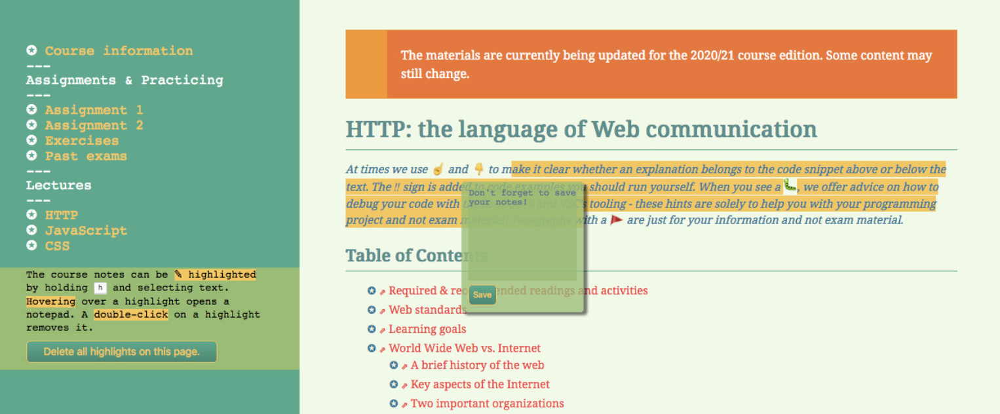

we may have to alter tens or hundreds of CSS rules. If we now decide to change those color values again, we have to determine all rules that need to be altered (again). Clearly, variables (i.e. _entities containing specific values that can be reused_) would be very helpful.

In fact, since 2016 (_yes, it took that long_), [CSS variables](https://developer.mozilla.org/en-US/docs/Web/CSS/Using_CSS_variables) are supported in all major browsers. Here is how they work with our game statistics example :point_down::

```html
<!DOCTYPE html>
    <head>
        <style>
            /* :root refers to the <html> element */
            :root {
                --darkColor: orchid;
                --lightColor: lavender;
                --borderColor: black;
                --borderThickness: 1px;
            }
            div {
                margin-bottom: 2px;
                padding: 2px;
                white-space: pre;
                font-family: monospace;
            }
            div:nth-child(2n){
                background-color: var(--darkColor);
                color: var(--lightColor);
            }
            div:nth-child(2n+1){
                background-color: var(--lightColor);
                color: var(--darkColor);
            }
            div:nth-child(3) {
                border: var(--borderThickness) dashed var(--borderColor);
            }
            div:nth-of-type(3) {
                border: var(--borderThickness) solid var(--borderColor);
            }
        </style>
    </head>

    <body>
        <h1>Game statistics</h1>
        <div>12,567 players registered</div>
        <div>   231 games ongoing</div>
        <div>    17 games waiting for players to join</div>
        <div> 2,302 users are in audience mode</div>
        <div>99.87% server uptime</div>
    </body>
</html>
```

:point_up: In this example, we create a global CSS variable, i.e. one that is available to all elements in the DOM tree. For this reason, we make use of the pseudo-class `:root` which represents the `<html>` element. Variables are defined with the custom prefix `--` and can be accessed using the `var()` function. Non-global CSS variables can be added in the same manner to any element, though they are then only available within their `{....}` block.

For our course homepage we developed several themes, before settling on the final one you are seeing now. In order to make the creation of different themes efficient, we created variables for everything customizable (mostly colors). Take a look at the page inspector and explore the more than 40 variables we created for this purpose :point_down::

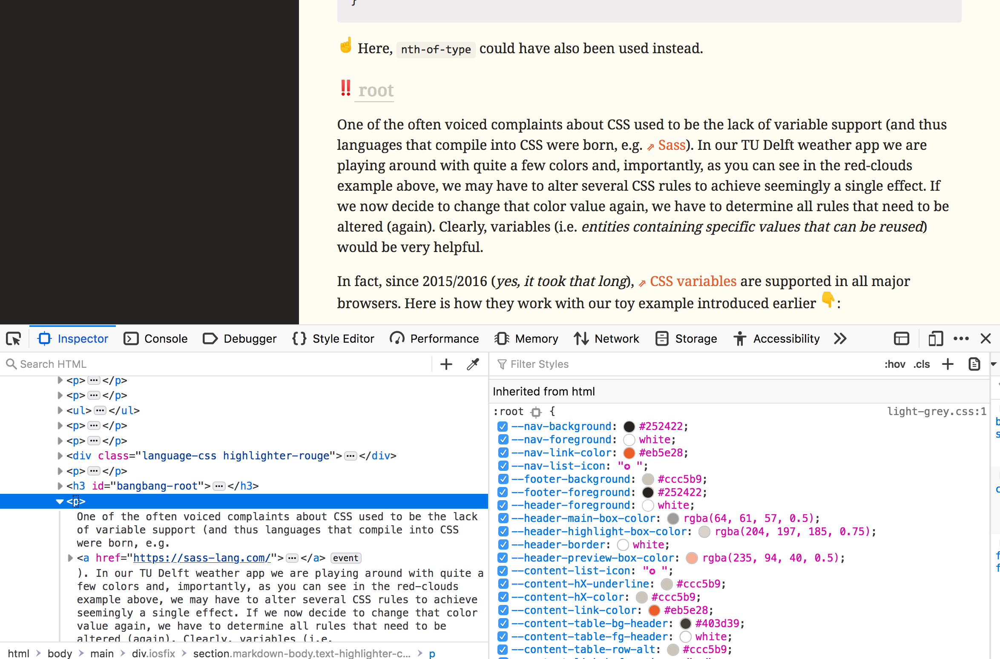

<sup>Firefox's Page Inspector panel. Screenshot taken September 8, 2020. The middle pane shows a subset of all global variables defined for our course page styling.</sup>

With those variables defined, we can replace one theme with another by changing the property values of a single CSS file (i.e. the one holding all global variables).

While we can only take a glimpse at CSS variables here, note that they are vital to achieve a separation of concern between style and behaviour. Take a look at [this talk by Lea Verou](https://www.youtube.com/watch?v=kZOJCVvyF-4) to learn more about CSS variables.

### :bangbang: :hover, :active and :visited

Earlier on, we listed mouse movements as one of the document external factors that we can make our elements react to. Three popular pseudo-classes in this category are `:hover`, `:active`, and `:visited`:

- `:hover` is a selector that becomes active when a mouseover on the element occurs.
- `:active` is a selector that becomes active when the element is currently _being active_ (e.g. while it is _being clicked_).
- `:visited` is a selector that selects links a user has _already visited_. It is thus more specific than `:hover` and `:active` which apply to any type of element, not just links.

Take a look at our slightly revised game statistics example which showcases all three pseudo-classes :point_down:. When running this example, use the mouse to hover over/click on elements and note how the color and border properties change.

```html
<!DOCTYPE html>
    <head>
        <style>
            :root {
                --darkColor: orchid;
                --lightColor: lavender;
                --borderColor: darkslateblue;
                --activeBorderColor: white;
                --borderThickness: 3px;
                --visitedColor: gray;
            }
            div {
                margin-bottom: 2px;
                padding: 2px;
                white-space: pre;
                font-family: monospace;
                border: var(--borderThickness) solid transparent;
            }
            div:nth-child(2n){
                background-color: var(--darkColor);
                color: var(--lightColor);
            }
            div:nth-child(2n+1){
                background-color: var(--lightColor);
                color: var(--darkColor);
            }
            div:hover {
                border: var(--borderThickness) dashed var(--borderColor);
            }

            div:active {
                border-color: var(--activeBorderColor);
            }

            a {
                color: unset;
            }

            a:visited {
                color: var(--visitedColor);
            }

        </style>
    </head>

    <body>
        <h1>Game statistics</h1>
        <div>12,567 players registered</div>
        <div>   231 games ongoing</div>
        <div>    17 games waiting for players to join</div>
        <div> 2,302 users are in audience mode</div>
        <div>99.87% server <a href="https://en.wikipedia.org/wiki/Uptime">uptime</a></div>
    </body>
</html>
```

One remark about the code :point_up:: the `unset` value resets a property to its inherited value. By default, the browser renders an unvisited link in a bright blue color. Here though, we want the link to retain the color of its surrounding text. The `unset` keyword helps us to achieve this without having to explicitly set a link color.

While this small example does not look overly impressive, it should be noted that `:hover` can be employed to create CSS-only dropdown menus. This is exactly what we are doing on this site with the _arrow up box_ on the bottom left corner of your screen. Hovering over it brings up the navigation links. Another hover example (this time materialized as detecting a mouseover event in JavaScript) is our [Stars at night demo at CodePen](https://codepen.io/charlottehase/full/rNwVBxP): hovering over one of the three style buttons changes the style of the page.

### :bangbang: :enabled and :disabled

Particularly helpful for board game applications are the pseudo-classes `:enabled` and `:disabled`:

- `:enabled` is an element that can be clicked or selected.
- `:disabled` is an element that cannot be clicked or selected.

Imagine a game element that is only available sometimes; in our [balloons demo game](https://github.com/chauff/balloons-game) for instance, once a letter has been chosen in the game, it is no longer possible to select it again. This information should be visually conveyed to the user. To do this, we enable/disable an element and define the look of the element in its two states with pseudo-elements `:enabled` and `:disabled`.

These two pseudo-classes are not available for all elements (as not all elements are clickable), but they are available, among others, for `<button>`, `<input>` and `<textarea>`. So, in order to continue with our game statistics example, we now replace all `<div>` elements (which cannot be enabled/disabled) with `<button>` elements. We add an event listener to every button: once it has been clicked, it will be disabled :point_down:. According to our styling rules, disabled buttons are greyed out. We define hover/active pseudo-classes for enabled buttons only via `button:enabled:active`; it is thus possible to combine certain pseudo-classes. Once a button is disabled, its style will no longer change, no matter the mouse actions:

```html
<!DOCTYPE html>
    <head>
        <style>
            :root {
                --darkColor: orchid;
                --lightColor: lavender;
                --borderColor: darkslateblue;
                --activeBorderColor: white;
                --borderThickness: 3px;
                --visitedColor: gray;
            }
            button {
                margin-bottom: 2px;
                padding: 2px;
                white-space: pre;
                font-family: monospace;
                border: var(--borderThickness) solid transparent;
                display: block;
                width: 90vw;
                text-align: left;
            }
            button:nth-child(2n){
                background-color: var(--darkColor);
                color: var(--lightColor);
            }
            button:nth-child(2n+1){
                background-color: var(--lightColor);
                color: var(--darkColor);
            }
            button:enabled:hover {
                border: var(--borderThickness) dashed var(--borderColor);
            }

            button:enabled:active {
                border-color: var(--activeBorderColor);
            }

            button:disabled {
                background-color: darkgray;
                color: gray;
            }
        </style>
    </head>

    <body>
        <h1>Game statistics</h1>
        <button>12,567 players registered</button>
        <button>   231 games ongoing</button>
        <button>    17 games waiting for players to join</button>
        <button> 2,302 users are in audience mode</button>
        <button>99.87% server uptime</button>

        <script>
            let buttons = document.querySelectorAll("button");
            console.log(buttons.length);
            for(let b of buttons){
                b.addEventListener("click", function(){
                    this.disabled = true;
                })
            }
        </script>
    </body>
</html>
```

For completeness, this is how our above code snippet looks rendered with two buttons disabled and the mouse hovering over the second game statistic :point_down::


## Pseudo-elements

**Pseudo-elements** create abstractions about the document tree _beyond_ those specified by the document language. They provide access to an element's **sub-parts** such as the first letter of a paragraph.

In order to distinguish pseudo-classes and pseudo-elements, the double-colon (`::`) notation was introduced in the specification, though browsers in practice also accept the colon (`:`) notation.

### :bangbang: ::first-letter and ::first-line

So, what are abstractions that go beyond what is specified in the document language? Two popular examples are the `::first-letter` and the `::first-line` pseudo-elements. They do exactly what the names suggests, enabling you to style the first letter and first line respectively. Without those pseudo-elements, you would have to wrap the first letter in a `<span>` (or similar) element. This may only be mildly annoying, however, determining what constitutes the first line of a piece of text requires a clever way of computing at which word exactly the line ends while taking into account changing viewport sizes (to then again, wrap that part of the text in a `<span>` element). Let's look at an example :point_down::

```html
<!DOCTYPE html>
<html>
  <head>
    <style>
      p::first-line {
        color: gray;
        font-size: 125%;
      }

      p::first-letter {
        font-size: 200%;
      }
    </style>
  </head>
  <body>
    <p>To be or not to be, that is the question -</p>
    <p>
      Whether 'tis nobler in the mind to suffer <br />
      The slings and arrows of outrageous fortune, <br />
      Or to take arms against a sea of troubles, <br />
      ...
    </p>
  </body>
</html>
```

Depending on the size of the browser window, what part of the text is enlarged differs :point_down::

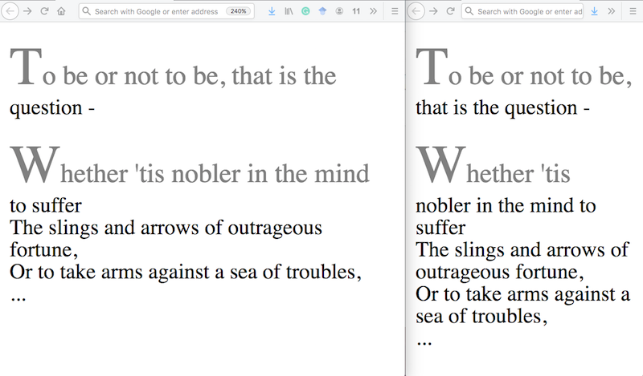

<sup>Two renderings (note the different browser window sizes) of the above HTML document.</sup>

The code example :point_up: also showcases the percent unit for the `font-size` property. The base font-size of the document equates to `100%` and thus this unit allows you to scale the font-size in relation to the initial size. This is especially helpful when you design web applications for different device sizes - no additional tuning for different devices is required.

### :bangbang: ::before and ::after

Adding (cosmetic) content right before and after an element is achieved through `::before` and `::after` respectively in combination with the `content` property. One example is the <a href="">hyperlink</a> styling we use on our course page: each link is preceded by a little arrow (⇗) to reinforce the message that this is indeed a hyperlink.

These two pseudo-elements are not only useful though to style text in a particular manner but to also create visual artifacts (such as each cloud in our CSS weather demo) that on first sight may require an image instead of just a few CSS rules.

Important to remember is that `::before` is the **first child** of the element it belongs to and `::after` is the **last child** of the element it belongs to.

Here is one extreme example of this concept, where all document _content_ is delegated to the style sheet :point_down: (the unicode characters [201C](http://unicode.org/cldr/utility/character.jsp?a=201C) and [201D](https://unicode.org/cldr/utility/character.jsp?a=201D&B1=Show) are quotation marks):

```html
<!DOCTYPE html>
<html>
  <head>
    <style>
      cite::before {
        content: "\201CTo be, or ";
      }

      cite::after {
        content: "not to be ... \201D";
      }
    </style>
  </head>
  <body>
    <cite></cite>
  </body>
</html>
```

This is a poor choice admittedly as [accessibility](https://www.w3.org/standards/webdesign/accessibility) is close to zero. Let's take a look at the page inspector :point_down::

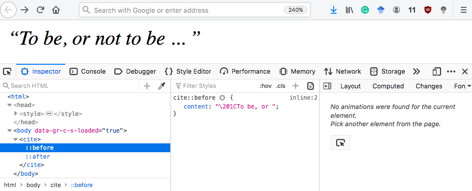

:point_up: The document appears as content-less (as all text has been delegated to the CSS file) to a **screen reader**, a form of assistive technology that most commonly makes use of a text-to-speech engine to translate a HTML document into speech. We will come back to this issue of storing data in CSS in the next section.

Before we do that, let's discuss `::before` and `::after` as a manner of building relatively complex shapes with just a few lines of CSS. Concretely, let's go over how the cloud shape was designed in our CSS weather demo.

Below :point_down: on the right you see the cloud shape we use and on the left how it looks like if all elements of it are assigned a different color: our cloud consists of a `<div>` element (a rectangle with rounded edges) and a `::before` pseudo-element (a rectangle with rounded edges that is rotated 33 degrees and moved slightly with respect to its parent) and a `::after` pseudo-element (a rectangle with rounded edges that is rotated 33 degrees moved slightly with respect to its parent):

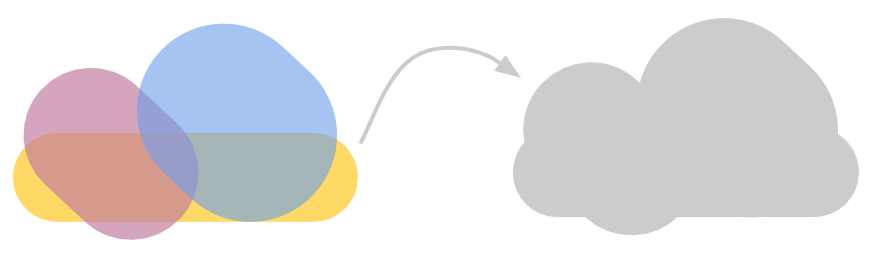

The relevant CSS code snippets in our CSS weather demo looks as follows:

```css
/* the cloud itself */
.cloud {
  width: 200px;
  height: 60px;
  background: #fff;
  border-radius: 200px;
  /* these last two properties are relevant for the animation of each cloud only */
  position: absolute;
  animation: moveclouds 15s linear infinite;
}

/* both sub-parts of cloud share a lot of rules, so we use the el1,el2 selector combination */
.cloud::before,
.cloud::after {
  content: "";
  background: white;
  width: 100px;
  height: 80px;
  border-radius: 100px;
  transform: rotate(33deg);
  /* important here is to know that the before/after pseudo-elements
    * are children of the element they belong to and thus absolute
    * positioning makes sense here
    */
  position: absolute;
  top: -15px;
  left: 10px;
}

/* we overwrite a few of the previously defined properties */
.cloud::after {
  width: 110px;
  height: 90px;
  top: -45px;
  /* left: auto means that the position of the element is based on the right property value */
  left: auto;
  right: 5px;
}
```

:point_up: The rounded edges are achieved via the [`border-radius`](https://developer.mozilla.org/en-US/docs/Web/CSS/border-radius) property. We have not yet introduced element positioning, but note that [`position: absolute`](https://developer.mozilla.org/en-US/docs/Web/CSS/position) positions an element *relative to its closest positioned ancestor*. Since we know that pseudo-elements `::before` and `::after` are the first and last child of the element `E` they have been defined for respectively, their closest positioned ancestor is `E`. We can use `position:absolute` to create the slight offset we need to achieve the cloud effect.

<debug-info markdown="block">
Note that above we include the `content` property, even though it is empty and thus `content: ''`. This is required; if a pseudo-element has its `content` property not explicitly set, the pseudo-element will not be rendered.
</debug-info>

## :bangbang: Selector combinations

So far, we have dealt with individual selectors such as `button` or `div`. As the HTML documents increase in complexity, we also need to be able to combine several selectors to target a specific subset of elements. A number of selector combinations exist, we here list the ones most commonly used :point_down::

| Selector combination | Description                                                |
| -------------------- | ---------------------------------------------------------- |
| e1                   | Selects all `<e1>` elements                                |
| e1 e2                | Selects all `<e2>` elements within `<e1>`                  |
| e1,e2                | Selects all `<e1>` elements and all `<e2>` elements        |
| e1>e2                | Selects all `<e2>` elements that have `<e1>` as parent     |
| e1+e2                | Selects all `<e2>` elements that follow `<e1>` immediately |

Let's slightly revise our running game statistics example to clarify what each of the selector combinations means. We now consider this DOM tree which showcases three different selector combinations :point_down::

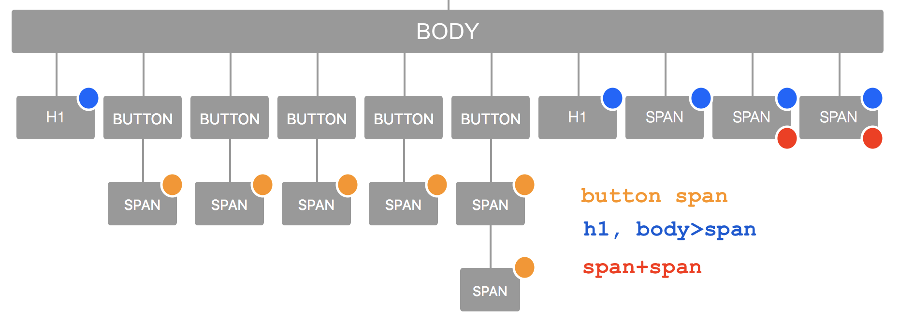

<sup>The DOM tree visualization (with some post-processing) is derived from [this CodePen demo](https://codepen.io/pavlovsk/pen/QKGpQA): it allows you to visualize arbitrary html document structures.</sup>

Let's walk through the three examples:

- In order to select all `<span>` elements that appear _inside_ a button, we use the selector `button span`: it selects all `span` elements within `button`.
- To select all elements that are neither a button nor inside of one, we use `h1, body>span`: it selects all `<h1>` elements and all `<span>` elements that have `<body>` as parent.
- Finally, to select the last two `<span>` elements we use `span+span`: it selects all `<span>` elements that follow immediately after a `<span>` element.

There may of course be other selectors that lead to the same subset of selected elements. Here are three questions to test your selector combination knowledge without resorting to `class` or `id` attributes. Remember that your solution may differ from what is shown here. The questions revolve around the above DOM tree visualization.

<details>
<summary>How can we select just the second &lt;h1&gt; element?</summary>
button+h1
</details>

<details>
<summary>How can we select the one &lt;span&gt; element that is inside another?</summary>
span>span
</details>

<details>
<summary>Which buttons does the selector combination button+button+button select?</summary>
The last three buttons. Why? Because now we want to select all button elements that follow a button+button element immediately. 
</details>

For completeness, the HTML document corresponding to our DOM tree visualization and its rendering look as follows:

```html
<!DOCTYPE html>
    <head>
        <style>
            :root {
                --darkColor: orchid;
                --lightColor: lavender;
                --borderColor: darkslateblue;
                --activeBorderColor: white;
                --borderThickness: 3px;
                --visitedColor: gray;
            }
            * {
                font-family: monospace;
            }
            button {
                margin-bottom: 2px;
                padding: 2px;
                white-space: pre;
                border: var(--borderThickness) solid transparent;
                display: block;
                width: 95vw;
                text-align: left;
                overflow: hidden;
                text-overflow: ellipsis;
            }
            button:nth-child(2n){
                background-color: var(--darkColor);
                color: var(--lightColor);
            }
            button:nth-child(2n+1){
                background-color: var(--lightColor);
                color: var(--darkColor);
            }

            button span {
                font-style: italic;
                color: darkblue;
            }

            h1, body>span {
                font-family: sans-serif;
                color: DeepPink;
            }

            span+span {
                color: RoyalBlue;
            }

        </style>
    </head>

    <body>
        <h1>Game statistics</h1>
        <button><span class="count">12,567</span> players registered</button>
        <button>   <span class="count">231</span> games ongoing</button>
        <button>    <span class="count">17</span> games waiting for players to join</button>
        <button> <span class="count">2,302</span> users are in audience mode</button>
        <button><span class="perc">99.87<span class="sign">%</span></span> server uptime</button>
        <h1>Game rules</h1>
        <span>Rule 1: Have fun!</span>
        <span>Rule 2: No less than 3, no more than 5 players!</span>
        <span>Rule 3: There can only be one winner!</span>
    </body>
</html>
```

<sup>HTML document corresponding to the above DOM tree visualization.</sup>

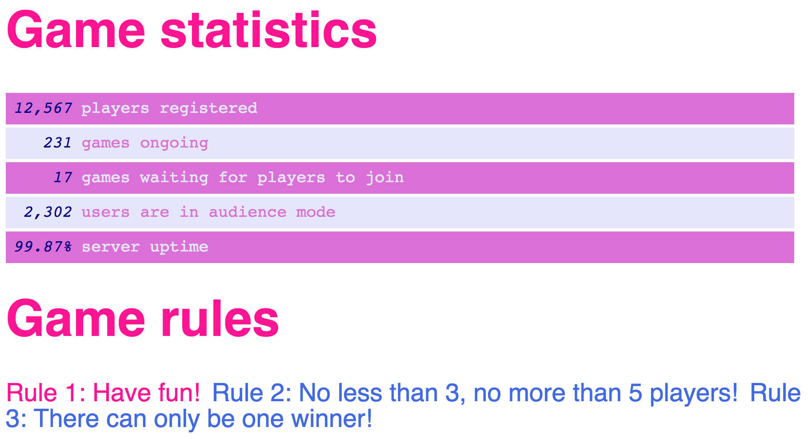

<sup>Rendering of the above HTML document.</sup>


## :bangbang: Data attributes

Let's return to the topic of storing data within CSS files. There are several issues when doing so:

- Data is distributed across HTML and CSS files.
- CSS is conventionally not used to store data.
- Content is not part of the DOM (leading to the already described accessibility problem).

Instead of storing data directly in CSS, a better way is to _make use of data stored in HTML elements_. This is achieved through so-called **data attributes**: attributes on any HTML element that are prefixed with `data-`.

CSS can access those data attributes with the [`attr()`](https://developer.mozilla.org/en-US/docs/Web/CSS/attr) function: it retrieves the value of the selected element and data attribute.

What kind of data should be stored in `data-` attributes? Typically data, that is small, good to have but not essential for the web application. The alternative to storing data in an HTML element is of course to resort to another HTTP request for this data (e.g. via Ajax). This solution here avoids this extra step but also means that the data may be less up-to-date than a recurring Ajax request.

Let's look at a concrete example: we now report the game statistics with an additional piece of information: the last time the numbers were updated. This information should be "taped" to the right-hand side of the `<button>` element it belongs to :point_down:

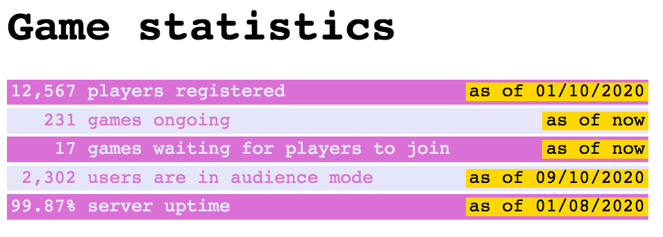

The HTML document leading to this rendering looks as follows :point_down::

```html
<!DOCTYPE html>
    <head>
        <style>
            :root {
                --darkColor: orchid;
                --lightColor: lavender;
            }
            * {
                font-family: monospace;
            }
            button {
                margin-bottom: 2px;
                padding: 2px;
                white-space: pre;
                display: block;
                width: 95vw;
                text-align: left;
                border: unset;
                position: relative;
                overflow: hidden;
                text-overflow: ellipsis;
            }
            button:nth-child(2n){
                background-color: var(--darkColor);
                color: var(--lightColor);
            }
            button:nth-child(2n+1){
                background-color: var(--lightColor);
                color: var(--darkColor);
            }

            button::after {
                background-color: gold;
                color: black;
                position: absolute;
                right: 0px;
                content: "as of " attr(data-date);
                padding-right: 2px;
                padding-left: 2px;
            }
        </style>
    </head>

    <body>
        <h1>Game statistics</h1>
        <button id="b1" data-date="01/10/2020">12,567 players registered</button>
        <button id="b2" data-date="now">   231 games ongoing</button>
        <button id="b3" data-date="now">    17 games waiting for players to join</button>
        <button id="b4" data-date="09/10/2020"> 2,302 users are in audience mode</button>
        <button id="b5" data-date="01/08/2020">99.87% server uptime</button>
    </body>
</html>
```

:point_up: Important to remember: only attributes that start with the prefix `data-` can be surfaced in CSS via the `attr()` function.

<debug-info markdown="block">
:point_up: Remember that we stated earlier on that `position:absolute` positions an element relative to its closest **positioned** ancestor. Observe what happens if the line `position: relative` is removed from the `button` selector: the positioning of the button elements does not change but the pseudo-elements holding our data are now positioned with respect to the `<body>` element as it is the closest ancestor with a position. If your positioning of pseudo-elements is not where you think it should be, make sure to have set the `position` property in its parent!
</debug-info>

<optional-info markdown="block">
:point_up: Once we *switch off* the button's pseudo-element `::after` (as indicated above, it is sufficient to remove the `content` property for this purpose) and then focus on the text inside each button, we observe that with decreasing browser window width, the full text is cut down and partially replaced by a ellipsis (...) and thus avoid an overflow of the text. This is achieved through the property/value pairs of [`overflow:hidden`](https://developer.mozilla.org/en-US/docs/Web/CSS/overflow) and [`text-overflow:ellipsis`](https://developer.mozilla.org/en-US/docs/Web/CSS/text-overflow). Without `overflow:hidden` the text will flow over the edge of the button. Once it is set, the text is cut off at the end of the button's content area. This does not look great. Adding `text-overflow:ellipsis` ensures that the user sees ... instead of the sudden clipping of the text. The renderings below should make the differences clear.

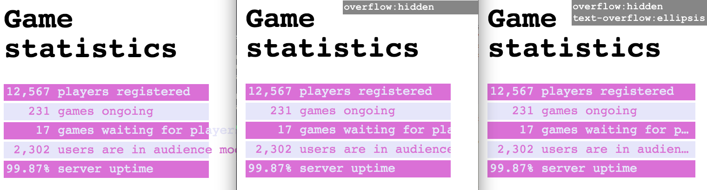

<sup>Left: neither the overflow nor text-overflow properties are set. Middle: the overflow property is set to hidden. Right: overflow is set to hidden, text-overflow is set to ellipsis.</sup>
</optional-info>

The canonical example for `data-` attributes are tooltips as they provide useful, but not essential additional information :point_down::

```html
<!DOCTYPE html>
<html>
  <head>
    <style>
      li {
        cursor: help;
      }

      li:hover::after {
        background-color: rgba(10, 10, 10, 0.7);
        color: gold;
        border: 1px dashed;
        padding: 5px;
        font-size: 60%;
        content: attr(data-name);
        position: relative;
        bottom: 15px;
        left: 5px;
      }
    </style>
  </head>
  <body>
    <main>
      <ul>
        <li data-name="Cascading Style Sheets">CSS</li>
        <li data-name="HyperText Markup Language">HTML</li>
        <li data-name="HyperText Transfer Protocol">HTTP</li>
        <li data-name="HyperText Transfer Protocol Secure">HTTPS</li>
      </ul>
    </main>
  </body>
</html>
```

This example :point_up: also showcases the use of the [`cursor`](https://developer.mozilla.org/en-US/docs/Web/CSS/cursor) property. Hovering over the list items results in a help icon. Note, that `cursor: none` results in no cursor being rendered, though this should be used with care as it tends to confuse users. The `position`, `bottom` and `left` properties will be discussed next (in short: they determine the placement of the tooltip).

## Element positioning

One of the most complex aspects of CSS are the myriad of ways to achieve element positioning. MDN's [CSS layout guide](https://developer.mozilla.org/en-US/docs/Learn/CSS/CSS_layout) provides you with a good idea of what options exists. We here cover three types of positioning in this order:

- The property [`display`](https://developer.mozilla.org/en-US/docs/Web/CSS/display) defines the display type of an element.
- [Grids](https://developer.mozilla.org/en-US/docs/Learn/CSS/CSS_layout/Grids) consist of rows and columns and elements can be placed onto them.
- The property [`position`](https://developer.mozilla.org/en-US/docs/Web/CSS/position) defines how an element is positioned in a document.

Before we dive into the details, let's briefly talk about the default positioning of elements: when we create HTML documents without any styling, the elements do not appear randomly on the screen, instead they are ordered in some fashion. By default, elements _flow_. **Their order is determined by the order of their appearance in the HTML document.** We also know that by default certain elements are surrounded by line-breaks and others are not. These two types of elements are known as block-level and inline elements respectively.

**Block-level elements** are surrounded by line-breaks. They can contain block-level and inline elements. **Their width is determined by their containing element.** Examples of block-level elements are `<main>`, `<h1>` or `<p>`.

**Inline elements** can be placed within block-level or inline elements. They can contain other inline elements. **Their width is determined by their content.** Examples are `<span>` or `<a>`.

In order to understand what this means, experiment with the following code :point_down::

```html
<!DOCTYPE html>
  <head>
    <style>

      * {
        border-style: solid;
        margin: 0;
        padding: 0;
      }

      body {
        border-color: orange;
      }

      main {
        border-color: grey;
      }

      span {
        border-color: green;
      }

      a {
        border-color: red;
      }

      p {
        border-color: blue;
      }

      /* Block-level vs. inline elements:
       * use `width: auto` as alternative
       */
      main {
        width: 400px;
      }
    </style>
  </head>
  <body>
    <main>
      <p>
        This is a paragraph containing <a href="#">a link</a>.
      </p>
      <p>
        This is another paragraph
        <span>
          with a span and a <a href="#">link in the span</a>.
        </span>
      </p>
    </main>
  </body>
</html>
```

Admittedly, the resulting rendering is not looking great :point_down::

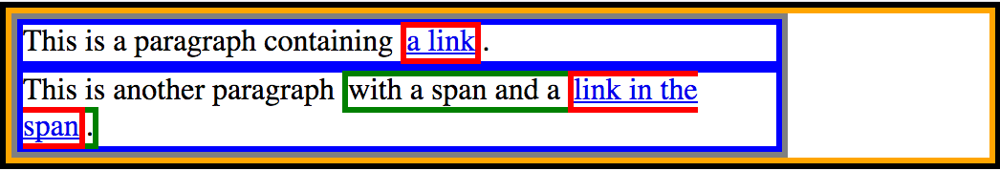

However, it serves a purpose: it helps us to understand how the different elements appear within their parent element.

:bangbang: Try out the following code variations. Remember, that you can make these changes directly in the _Style Editor_ of your browser:

- Manually resize the browser window to explore how the block-level and inline elements render at different window sizes.
- In the `*{...}` we have employed a CSS reset, by setting both `margin` and `padding` to `0`. Remove those two lines of code.
- Replace `main { width: 400px; }` with `main { width: auto; }` and once more manually resize the browser window.

Having introduced elements' flow and block as well as inline elements, we can now move on to display types.

### Display types

The [`display`](https://developer.mozilla.org/en-US/docs/Web/CSS/display) property enables us to change the element type (e.g. from block-level to inline), _hide_ elements from view and determine the layout of its children. These are the most important display types:

| Value            | Description                                                                                 |
| :--------------- | :------------------------------------------------------------------------------------------ |
| `display:inline` | The element is treated as an inline element.                                                  |
| `display:block`  | The element is treated as a block element (line breaks before and after the element).       |
| `display:none`   | The element (and its descendants) are hidden from view; no space is reserved in the layout. |
| `display:grid`   | The children of this element are arranged according to the grid layout.                     |

There [are more display types](https://developer.mozilla.org/en-US/docs/Web/CSS/display), but for the purposes of our class these four are sufficient. Probably the most relevant for the board game project (next to using the grid layout) is `display:none` as it allows us to hide an element from view with a single line of CSS.

### Grid layout

As the name suggests, a `display` type of `grid` allows us to create a two-dimensional grid layout within a page. This relatively new construct to CSS reduces the effort required to implement grid-like layouts. Such grids can be arbitrarily complex as seen in our [stained glass window demo](https://codepen.io/charlottehase/full/xxrRmXK):

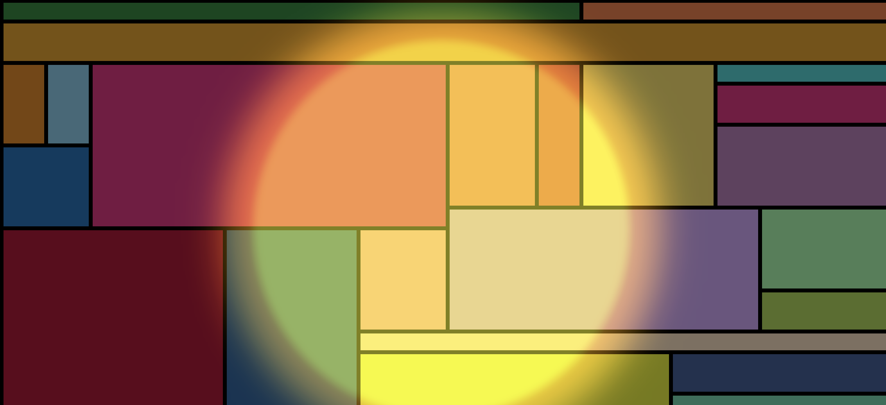

To demonstrate the basics of implementing a grid layout, let's walk through creating a simple 3x3 grid. A CSS grid is comprised of rows and columns. Each element that we define within the grid can be likened to as a _cell_. An example of the 3x3 grid is shown below:

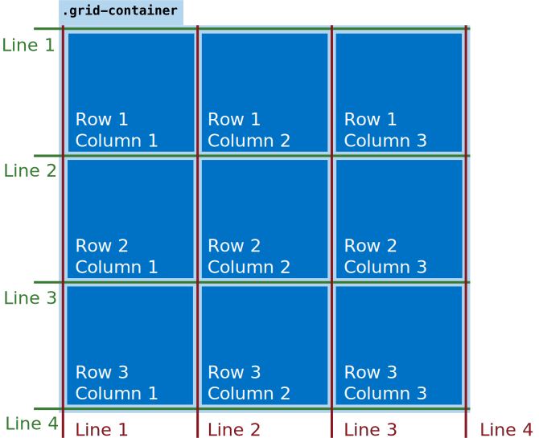

:point_up: Included within the example are a series of lines. We will be making use of those later, but for now you can use the lines to work out what column (in red) or row (in green) a particular cell is located at within the grid. Note that the cell corresponding to a column line is to its right; the cell corresponding to a row line is underneath it. Counting starts from the **top left corner**.

To create a grid layout, pick the element that will contain the grid (*the container*). For the container, set the `display` attribute to `grid`. Each of the child elements within the container element will act as grid cells. Consider this example :point_down:. Note that we also add a selector for the child elements; these are the cells, or the elements within the `grid-container`.

```css
.grid-container {
  display: grid;
}

.grid-container div {
  background-color: orange;
}
```

```html
<div class="grid-container">
  <div>Row 1, Column 1</div>
  <div>Row 1, Column 2</div>
  <div>Row 1, Column 3</div>
  <div>Row 2, Column 1</div>
  <div>Row 2, Column 2</div>
  <div>Row 2, Column 3</div>
  <div>Row 3, Column 1</div>
  <div>Row 3, Column 2</div>
  <div>Row 3, Column 3</div>
</div>
```

The corresponding rendered output looks as follows :point_down::

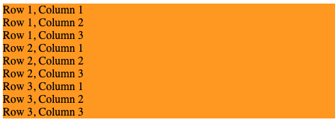

What gives? The elements are not in a grid layout; they are still block elements below one another!

In order for the grid layout to work, we need to tell the grid container how many rows and columns there should be, as well as the widths/heights of each. To do so, the simplest way is to use the `grid-template-rows` and `grid-template-columns` properties :point_down::

```css
.grid-container {
  display: grid;
  grid-template-rows: 100px 100px 100px;
  grid-template-columns: 100px 100px 100px;
}
```

This :point_up: has the effect of producing the desired 3x3 grid, with each cell being fixed as a square with 100 pixels along the sides:

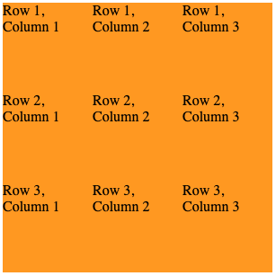

:point_up: That looks more like a grid!

For the two new properties that we have just added, we provide _three_ values; one for each of the number of rows/columns that we desire. If we were to add a fourth value to `grid-template-rows`, this would for the example have the effect of adding an additional row to the grid.

This approach is useful if you wish to provide a lop-sided grid (i.e. a table, with more rows than columns).

Note that we could make the definitions more succinct using the CSS `repeat()` function. The below CSS snippet :point_down: has the exact same outcome as what we have shown above:

```css
.grid-container {
  display: grid;
  grid-template-rows: repeat(3, 100px);
  grid-template-columns: repeat(3, 100px);
}
```

You can of course mix up providing values and using `repeat()`, too! The example below :point_down: produces a grid where the first column has a width of 200 pixels, but the remaining two columns have widths of only 100 pixels (being defined with the `repeat()` function).

```css
.grid-container {
  display: grid;
  grid-template-rows: repeat(3, 100px);
  grid-template-columns: 200px repeat(2, 100px);
}
```

Notice how the gap between columns 1 and 2 is wider than between columns 2 and 3 :point_down::

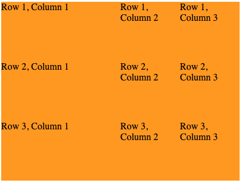

Of course, our grid currently looks a bit off as the different cells that we have are right next to one another. CSS grids provide the ability to add gaps between rows and columns via the `grid-row-gap` and `grid-column-gap` properties, respectively:

```css
.grid-container {
  display: grid;
  grid-template-rows: repeat(3, 100px);
  grid-template-columns: repeat(3, 100px);
  grid-row-gap: 10px;
  grid-column-gap: 10px;
}
```

This :point_up: produces a much nicer looking grid, with 10 pixel gaps between each row and column :point_down::

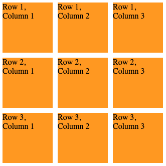

As an aside, we could use some fancy CSS selectors to make the grid look more like a chessboard, with alternating black and white (or near-white) cells. The CSS snippet below redefines the selectors for the children of the `grid-container` :point_down::

```css
.grid-container div {
  background-color: gray;
}

.grid-container div:nth-child(2n) {
  background-color: black;
  color: white;
}
```

:point_up: The top selector, `.grid-container div` sets all children of the container to have a light grey background. The second selector works only every child that has a position that is a multiple of 2 (i.e. `2n`). For this selector, the background of the cell is set to black, with the text colour set to white. This second selector will override the background colour set in the first selector. The rendered output looks as follows :point_down::

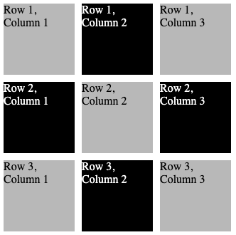

Finally, we demonstrate how to merge cells together. There may be instances where a particular cell should span over multiple rows and columns (for example, when you have headers for groups of data in a table). Remember the lines that we defined in our grid illustration at the start of this section? This is where they will come in handy. Let's say we want to stretch the cell that belongs to _Row 3, Column 2_ over to also cover _Row 3, Column 3_ :point_down::

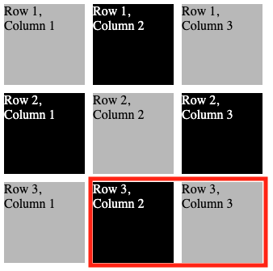

We can achieve this by first ditching the final child element within the grid container, leaving only eight children :point_down::

```html
<div class="grid-container">
  <div>Row 1, Column 1</div>
  <div>Row 1, Column 2</div>
  <div>Row 1, Column 3</div>
  <div>Row 2, Column 1</div>
  <div>Row 2, Column 2</div>
  <div>Row 2, Column 3</div>
  <div>Row 3, Column 1</div>
  <div id="stretched">Stretched Cell</div>
</div>
```

:point_up: Note, that we also applied an `id` to the cell we want to stretch. This is so we can write a CSS selector that only targets the given element :point_down::

```css
#stretched {
  grid-column-start: 2;
  grid-column-end: 4;
}
```

:point_up: This denotes that for the element with id `stretched`, we wish the element to begin at column line 2, and end at column line 4. This has the following effect on the grid :point_down::

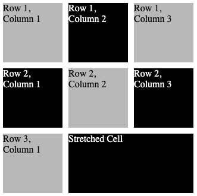

Note the stretched cell at the bottom right, spanning over two columns.

We can also stretch a cell over two or more rows using the `grid-row-start` and `grid-row-end` properties. Of course, we can also combine column and row stretching by using a combination of both! This provides an incredibly powerful way of keeping order in your grids.

As always, we have only scratched the surface with our introduction of CSS grids. There are many other properties that are defined in the CSS specification that allow you to control grids&mdash;check out the [MDN documentation](https://developer.mozilla.org/en-US/docs/Web/CSS/grid) if you are interested!

<optional-info markdown="block">
### CSS units and functions

Up until now, we have used a small number of units of measurement to express the widths and heights of elements on a page. We have come across `px` as unit of measurement (the [magic unit of CSS](https://www.w3.org/Style/Examples/007/units.en.html)&mdash;`1px` is defined "such that a horizontal 1px wide line can be displayed with sharp edges"). This unit of measurement allows you to specify an _absolute measurement_ on the screen:

```css
.some-class {
  width: 100px;
  height: 200px;
}
```

We have also identified percentage units, e.g. `width: 50%`. As you may expect, these allow you to express the width/height/measurement of a particular element in percentage terms of its container. In other words, this measurement is _relative_ to its container, rather than being absolute.

But what about more complex units of measurement? Many different types of measurement are available as part of contemporary CSS implementations, but what are the essential ones to know?

#### Units of measurement

For modern web design, we are most interested in _relative units_&mdash;that is, units of measurement relative to the container of the element you are assigning values to.

- `em` is a unit of measurement relative to the font size of the element being used. This is useful, for example, when setting the height of an element to be slightly taller than the text it contains.

There are also units of measurement that are relative to the available real estate on the user's screen:

- `vw` is a unit that is relative to the _width of the viewport_, where the viewport is the size of the browser/app that the page is viewed in. `1vw` is equal to 1/100 of the viewport's width.
- `vh` is the same as above, but this time associated with the _height of the viewport_. This time, `1vh` is equal to 1/100 of the viewport's height.

These units are then taken further, with two more units whose measurements are compared against potentially changing targets:

- `vmin` is relative to the _smallest dimension of the viewport_. For example, if you view a page on a smartphone in portrait mode, this would be the width (as the height will be greater). `1vmin` equates to 1/100 of the viewport's smallest dimension.
- `vmax` instead considers the _largest dimension of the viewport_. `1vmax` equates to 1/100 of the viewport's largest dimension (e.g. width when viewed on a smartphone in landscape mode).

There are also a series of measurements specific to given scenarios. For example, the `grid` layout we discussed above can make use of the `fr` unit. Short for _fractional unit_, the name may suggest that this unit splits up available space into a series of fractions:

```css
.grid-container {
  display: grid;
  grid-template-columns: 1fr 1fr 1fr;
}
```

:point_up: The above example creates three columns of equal width (1 fractional unit each). If we wished to make the first column double the width of the other two columns, we would double up the value for the first column:

```css
.grid-container {
  display: grid;
  grid-template-columns: 2fr 1fr 1fr;
}
```

We can also assign a width to the `grid-container`:

```css
.grid-container {
  display: grid;
  width: 520px;
  grid-template-columns: 250px 2fr 1fr;
}
```

:point_up: With a maximum width of `520px` for the container, our first column will take nearly half of the available space (`250px`). The final two columns will then be split over three fractional units (from a remaining space of `270px`, this means three equal divisions of `90px`). As such, the second column of `2fr` will have an absolute width of `180px`, with the third column of `1fr` having an absolute width filling out the remaining `90px`.

_As a general rule of thumb, you should consider using relative units of measurement when developing responsive CSS designs. This will mean you do not have to worry about designing different CSS rules for different sizes of screen; everything will be relative to the size of the screen the page is being rendered on!_

#### Functions

Modern CSS allows you to make use of _built-in functions_ to compute values on-the-fly for attributes you specify. Your CSS styles may have attributes whose values can only be determined at runtime. For example, we made use of the `repeat()` function when learning about CSS grids.

The syntax for using a function in CSS is as follows :point_down::

```css
selector {
  attribute: function(parameters);
}
```

:point_up: Here, `function` is the function name, and `parameters` are parameters (usually provided as an expression) that you can pass to the function.

A useful function is `calc()`: it calculates the result of a provided expression. You can add, subtract, divide and multiply values together. Values can be of different units:

```css
.container {
  width: calc(100% - 20vw);
}
```

:point_up: The width of this `container` is set to 100% of its own container, with `20vw` units subtracted from the 100%.

You can also mix relative and absolute measurements :point_down::

```css
.container {
  width: calc(100% - 50px);
}
```

If you have followed the lecture carefully, you may also be aware of a function that is used previously to obtain variables. This function is called `var()`, and takes the name of the variable you wish to be put in place of the function call:

```css
:root {
  --theBackgroundColour: blue;
}

.container {
  background-color: var(--theBackgroundColour);
}
```

There are also functions for defining colours according to the RGB colour model:

```css
.container {
  background-color: rgb(0, 0, 255);
}
```

:point_up: This example makes use of the `rgb()` function, which returns the colour you specify (in this case, blue!). For colours with an alpha channel (with transparency), use `rgba`:

```css
.container {
  background-color: rgba(0, 0, 255, 0.5);
}
```

:point_up: This has the same effect as the examples above, except for the inclusion of transparency. This final parameter is specified between `0` and `1`, with `0` being completely transparent, and `1` being completely opaque.

The final function we introduce here is called `minmax()`. This function is used within CSS grids, and allows you to specify a _range of acceptable values_ for your grid column widths and row heights. By including this function, CSS allows you to make CSS grids that better adapt to the available viewport size as it is resized.

To demonstrate this function in action, observe the following CSS:

```css
.grid-container {
  display: grid;
  grid-template-rows: repeat(4, 200px);
  grid-template-columns: repeat(4, minmax(100px, 200px));
  grid-row-gap: 10px;
  grid-column-gap: 10px;
}

.grid-container div {
  background-color: seagreen;
}
```

and corresponding HTML snippet: 

```html
<div class="grid-container">
  <div></div>
  <div></div>
  <div></div>
  <div></div>
  <div></div>
  <div></div>
  <div></div>
  <div></div>
</div>
```

:point_up: Of particular interest here is the value assigned to `grid-template-columns` in `.grid-container`. We make use of the `repeat()` function to repeat the `minmax(100px, 200px)` function call 4 times, resulting in four column values. The `minmax(100px, 200px)` function call provides a value that is a minimum of `100px`, and steadily increases as the width of the container also increases. This will increase up until a maximum of `200px` in this example.

A demonstration of this in action is shown below:

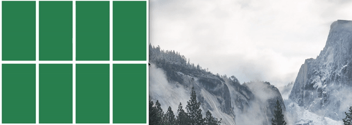

:point_up: Note that after the width of the viewport is increased past the point where each grid "cell" can fit comfortably within the viewport at its maximum width of `200px`, they no longer increase in width. This is the `max` part of the `minmax()` function in operation!

</optional-info>

### :bangbang: Position

The [`position` property](https://developer.mozilla.org/en-US/docs/Web/CSS/position) enables fine-grained movement of elements. Elements can be moved around in any direction (up/down/left/right) by absolute or relative units.

The `position` property takes a number of possible values:

| Value               | Description                                                                                 |
| :------------------ | :------------------------------------------------------------------------------------------ |
| `position:static`   | the default                                                                                 |
| `position:relative` | the element is adjusted on the fly, other elements are **not** affected                     |
| `position:absolute` | the element is taken out of the normal flow (**no space is reserved for it**)               |
| `position:fixed`    | similar to `absolute`, but fixed to the **viewport** (i.e. the area currently being viewed) |
| `position:sticky`   | in-between `relative` and `fixed` (_we do not consider it further in this class_)           |

Important to know when using the `position` property is the direction of the CSS coordinate system: the top-left corner is `(0,0)`. The y-axis extends **downwards**. The x-axis extends to the **right**.

Finally it is time to retire our game statistics example. We showcase the impact of the different `position` values with the placement of nine countries' flags on the screen. We place our flags on a 3x3 grid: that sounds like something CSS grid should be used for and that's exactly what we are doing. For now, we also want the grid to fill the entire **viewport** but not go beyond that. The **viewport** is the area of the document that is visible in the browser. This can be achieved by giving each flag the width of `33.33vw` and the height of `33.33vh`.

Below is our HTML document and the corresponding rendering, so far without any`position` property defined :point_down::

```html
<!DOCTYPE html>
<html>
  <head>
    <style>
      body {
        display: grid;
        grid-template-rows: repeat(3, 1fr);
        grid-template-columns: repeat(3, 1fr);
        margin: 0;
        padding: 0;
        background-color: #444;
      }

      div {
        width: 33.33vw;
        height: 33.33vh;
        border: 2px solid lightgray;
        box-sizing: border-box; /* size of the element now _includes_ the border */
      }

      .netherlands {
        background: linear-gradient(red 33%, white 33% 66%, darkblue 66%);
      }

      .austria {
        background: linear-gradient(red 33%, white 33% 66%, red 66%);
      }

      .ireland {
        background: linear-gradient(
          90deg,
          green 33%,
          white 33% 66%,
          orange 66%
        );
      }

      .monaco {
        background: linear-gradient(crimson 50%, white 50%);
      }

      .latvia {
        background: linear-gradient(darkred 40%, white 40% 60%, darkred 60%);
      }

      .estonia {
        background: linear-gradient(royalblue 33%, black 33% 66%, white 66%);
      }

      .france {
        background: linear-gradient(
          90deg,
          #0055a4 33%,
          white 33% 66%,
          #ef4135 66%
        );
      }

      .romania {
        background: linear-gradient(
          90deg,
          #002b7f 33%,
          #fcd116 33% 66%,
          #ce1126 66%
        );
      }

      .germany {
        background: linear-gradient(black 33%, red 33% 66%, gold 66%);
      }
    </style>
  </head>
  <body>
    <div class="top left austria"></div>
    <div class="top center romania"></div>
    <div class="top right france"></div>

    <div class="mid left estonia"></div>
    <div class="mid center ireland"></div>
    <div class="mid right latvia"></div>

    <div class="bottom left monaco"></div>
    <div class="bottom center germany"></div>
    <div class="bottom right netherlands"></div>
  </body>
</html>
```

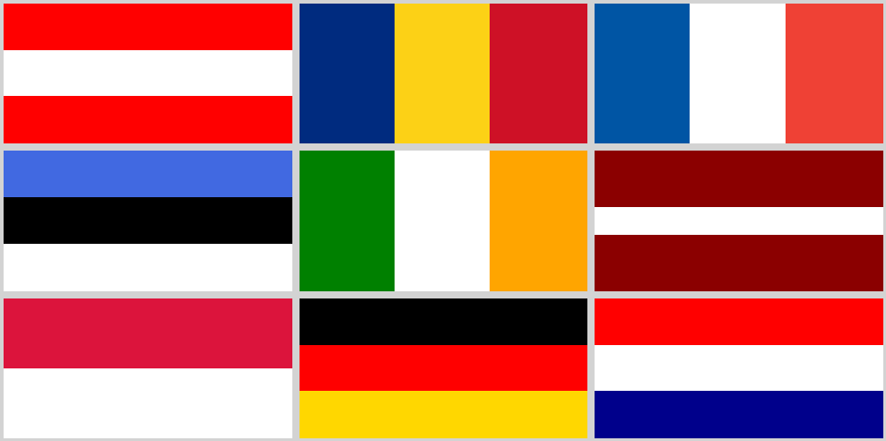

<sup>Rendering of the above HTML document in Firefox.</sup>

A few remarks about the piece of code :point_up::

- How do we assign a flag to a specific `<div>`? We add the corresponding classname in the `<div>`'s `class` attribute. As shown here, it is possible to assign a number of classes to an element. This is quite useful for the board game project to style game fields according to whether or not they contain a game piece.
-  If we want to style elements that have a particular **set of classes** assigned to them, we have a selector for this purpose: `.class1.class2.class3...`.
- By setting each flag' width and height to 1/3 of the viewport width (`1vw` corresponds to 1% of the viewport width) and 1/3 of the viewport height (`1vh` corresponds to 1% of the viewport height) respectively, we ensure that our grid is always fully shown in the viewport.
- The full set of rules applied to an element is the _union_ of all rules whose selectors match the element.

<optional-info markdown="block">
If you look closely at our flag example above, the flags are not images that we link from another source, these are images the browser is _generating_. How does that work? The [`linear-gradient`](https://developer.mozilla.org/en-US/docs/Web/CSS/linear-gradient) function creates an image on the fly, based on the color gradient information provide. This may look odd at first sight, as there is nothing gradual in terms of color changes, but that is due to the manner in which we define the gradient. If we were to replace `linear-gradient(black 33%, red 33% 66%, gold 66%)` with `linear-gradient(black, red, gold)` we would see the gradual change of color. By setting the color boundary explicitly (e.g. `red 33% 66%`) we achieve the clear-cut color changes we need for our flags. Having defined the `linear-gradient` function, we assign the returned image to a `<div>`'s `background` property and our flag is ready. Other types of gradients exist such as the [`radial-gradient`](https://developer.mozilla.org/en-US/docs/Web/CSS/radial-gradient) which we employed to style the moon in our CSS weather demo.
</optional-info>

Let's walk through each of the position values in turn. _We stick to the above HTML document and only present the CSS rules that need to be changed._

#### position:relative

Adding the property/value pair `position:relative` to an element sets up the element to be moved **relative to its original position**. The original space reserved for this element remains reserved. The horizontal offset from the original position is set through properties `left` and `right`, the vertical offset is controlled through `top` and `bottom`:

- `left` moves the element **to the right** of its original position by the given length;
- `right` moves the element **to the left** of its original position;
- `top` moves the element **downward** of its original position;
- `bottom` moves the element **upwards** of its original position.

_The movements may be counterintuitive at first, but keep in mind that the CSS coordinate system starts at the top left corner of the window._

Let's move the Romanian and German flags. Replace the `.romania` and `.germany` rules of our initial code by the following rules:

```css
.romania {
  background: linear-gradient(90deg, green 33%, white 33% 66%, orange 66%);
  position: relative;
  top: 20px;
  left: 50px;
}

.germany {
  background: linear-gradient(black 33%, red 33% 66%, gold 66%);
  position: relative;
  bottom: 20px;
  right: 50px;
}
```

The rendering will now look as follows (minus the annotations we made to showcase the position changes of the flags):

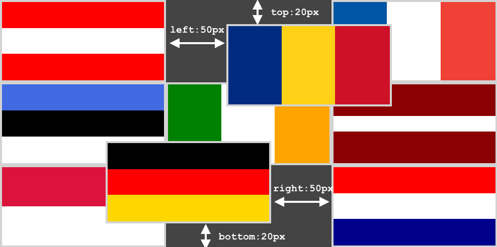

<sup>The Romanian and German flags have been moved from the original position via position:relative.</sup>

:point_up: None of the other flags have moved, `position:relative` only affects the element whose position is changed.

#### position:absolute

An element with property `position:absolute` is taken **out of the element flow**. The original space reserved for this element is no longer reserved. Its position is determined relative to its nearest ancestor element that has the absolute position property set as well. If this property is not set for any ancestor, the viewport is considered as ancestor. The horizontal and vertical offset properties have the following effects:

- `left`: distance to the left edge of the containing block;
- `right`: distance to the right edge of the containing block;
- `bottom`: distance between the element's bottom edge and the bottom edge of the containing block;
- `top`: distance between the element's top edge and the top edge of the containing block.

Let's move the flags of Romania and Germany again, this time with absolute positioning. We now want to position our flags relative to the `<body>` element. To make the distinction to the viewport clear, each flag now covers half the viewport, requiring scrolling to see the entire rendered page. Replace the `.romania` and `.germany` rules of our initial code by the following four rules :point_down::

```css
div {
  height: 50vh;
}

/* observe what happens when this CSS rule is removed */
body {
  position: absolute;
}

.romania {
  background: linear-gradient(90deg, #002b7f 33%, #fcd116 33% 66%, #ce1126 66%);
  position: absolute;
  top: 20px;
  left: 50px;
}

.germany {
  background: linear-gradient(black 33%, red 33% 66%, gold 66%);
  position: absolute;
  bottom: 20px;
  right: 50px;
}
```

Once again, the browser will render the HTML document as follows (minus the annotations we made to showcase the position changes of the flags):

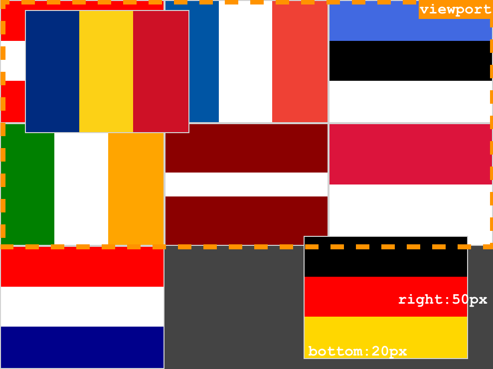

<sup>The Romanian and German flags have been moved from the original position via position:absolute. The closest ancestor with absolute positioning is the &lt;body&gt; element. The dashed line demarks the viewport.</sup>

:point_up: As `<body>`'s `position` value is `absolute`, the two flags are now positioned relative to the `<body>` element. The most important observation to make is that almost all flags have changed their position. Since the Romanian and German flags have been taken out of the document flow, no space is reserved for them and as a result all but the first flag (Austria top/left) have moved. We here also see once again that the order of CSS rules matters: in our *initial code listing* we have a rule for `<div>`s that contains `height: 33vh`. We now add a rule `div {height: 50vh; }` which **overrides** this earlier setting.

<optional-info markdown="block">
Remember that CSS rule ordering matters when you are trying to update properties with seemingly no effect. Important to know though, CSS rule precedence is more complicated than _later rules trump earlier ones_ when the selectors are not exactly the same (as is the case for us): [take a look at this article](http://vanseodesign.com/css/css-specificity-inheritance-cascaade/) to learn more.
</optional-info>

:bangbang: Observe for yourself what happens when the `body {position: absolute}` rule is removed. <spoiler-info>The flags will now be placed relative to the viewport!</spoiler-info>

In our CSS weather demo many elements (the moon, the raindrops, the snow flakes) have an absolute position as they should be placed with respect to the closest absolutely positioned ancestor. In the CSS weather demo, this is the viewport: we want the moon to always be at the top left of the viewport, the rain drops should always start at the top of the viewport and end at the bottom, etc.

<optional-info markdown="block">
#### position:fixed

:point_down: The `position:fixed` setting is similar to `position:absolute`, but now the containing element is **always** the **viewport**. This means that elements with `position:fixed` always remain visible. We now add another `<div>` element to show some information about the flags that should always remain at the same position, no matter the amount of scrolling. The HTML document looks as follows (all updated lines compared to the initial code listing contain comments) :point_down::

```html
<!DOCTYPE html>
<html>
  <head>
    <style>
      body {
        display: grid;
        grid-template-rows: repeat(3, 1fr);
        grid-template-columns: repeat(3, 1fr);
        margin: 0;
        padding: 0;
        background-color: #444;
        position: absolute;
      }

      div {
        width: 33.33vw;
        height: 50vh; /* CHANGED */
        border: 2px solid lightgray;
        box-sizing: border-box;
      }

      .netherlands {
        background: linear-gradient(red 33%, white 33% 66%, darkblue 66%);
      }

      .austria {
        background: linear-gradient(red 33%, white 33% 66%, red 66%);
      }

      .ireland {
        background: linear-gradient(
          90deg,
          green 33%,
          white 33% 66%,
          orange 66%
        );
      }

      .monaco {
        background: linear-gradient(crimson 50%, white 50%);
      }

      .latvia {
        background: linear-gradient(darkred 40%, white 40% 60%, darkred 60%);
      }

      .estonia {
        background: linear-gradient(royalblue 33%, black 33% 66%, white 66%);
      }

      .france {
        background: linear-gradient(
          90deg,
          #0055a4 33%,
          white 33% 66%,
          #ef4135 66%
        );
      }

      .romania {
        background: linear-gradient(
          90deg,
          #002b7f 33%,
          #fcd116 33% 66%,
          #ce1126 66%
        );
      }

      .germany {
        background: linear-gradient(black 33%, red 33% 66%, gold 66%);
      }

      .info {
        /* CSS rule ADDED */
        width: auto;
        height: auto;
        background-color: #333;
        color: white;
        position: fixed; /* TRY IT: set position: absolute to observe the difference */
        top: 0px;
        left: 0px;
        font-family: monospace;
      }
    </style>
  </head>
  <body>
    <div class="top left austria"></div>
    <div class="top center romania"></div>
    <div class="top right france"></div>

    <div class="mid left estonia"></div>
    <div class="mid center ireland"></div>
    <div class="mid right latvia"></div>

    <div class="bottom left monaco"></div>
    <div class="bottom center germany"></div>
    <div class="bottom right netherlands"></div>

    <div class="info">Flags shown: AT, RO, FR, EE, IE, LV, MC, DE, NL.</div>
    <!-- ADDED -->
  </body>
</html>
```

This video shows off the effect both `position` values `fixed` and `absolute` have. Focus on the position of the info box on the top. On the left, we use `position:fixed` for the info box and on the right `position:absolute` :point_down::

<video src="../img/css-abs-fixed.mov" controls></video>

<sup>Position property set on the info box: position:fixed (on the left) and position:absolute (on the right).</sup>
</optional-info>

## CSS media queries

So far, we have largely ignored the fact that in today's **multi-device** world, we are designing web applications for vastly different screen sizes. Different devices should be served different styles:

- when **printing** a web application's screen :fax:, the information printed should be the essentials (no ads, no sidebars, etc.);
- when **viewing** a web application on a small screen :iphone:, non-essential information (e.g. a footer) may be removed and elements that appear side-by-side on large screens should be shown on top of each other;
- when **viewing** a web application on a large screen :computer: all available information should be presented side-by-side;
- when using **text-to-speech** devices :sound:, non-essential information should be removed.

Our course page looks quite different in small screen vs. large screen devices, i.e. it is responsive :point_down::

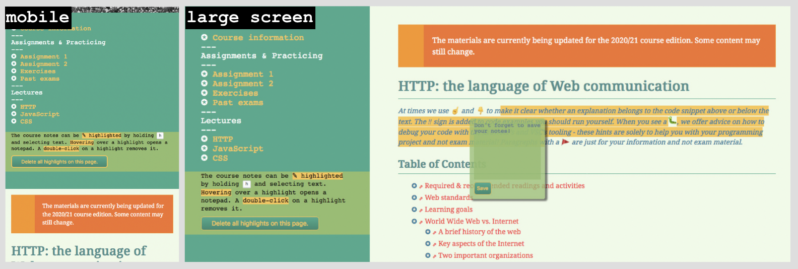

<sup>Media queries example: CSE1500.</sup>

Let's take a look at the CSS rules we employed here to achieve this before introducing CSS media queries more formally. By default, we style `<main>` (which contains the navigation bar and the course content) as follows:

```css
main {
  display: grid;
  grid-template-columns: 0.3fr 0.7fr;
  grid-template-rows: auto 30px;
}
```

:point_up: We have defined two columns, the navigation bar on the left and the content on the right. For smaller devices we want those two columns *stacked* on top of each other. And so we add the following CSS code snippet:

```css
@media (max-width: 500px) {
  main {
    grid-template-columns: 1fr;
    grid-template-rows: auto 1fr 30px;
  }
  /* other rules */
}
```

:point_up: The syntax is new, but the code is pretty readable: if we have a device with a maximum width of 500px, `<main>`'s grid consists of a single column and three rows (navigation row, content row and footer row).

Admittedly, there are a few more CSS rules that govern the responsive design of the course page (in particular the font size) and one more intermediate step at `max-width: 767px`. The browser's **responsive design mode** allows you to _simulate_ different devices to explore the impact of different media queries as can be seen in this video:

<video src="../img/css-cse1500-responsive.mov" controls></video>

<sup>Responsive design mode of Firefox as of September 2020.</sup>

More formally: **CSS media queries** enable the use of **device**/**media-type dependent** style sheets and rules. While the HTML document is written once, the CSS is written once per device type. There are four device types currently in use:

| Value          | Description                                                              |
| :------------- | :----------------------------------------------------------------------- |
| `media all`    | Suitable for all device types. The default if no media type is provided. |
| `media print`  | Suitable for documents in print preview.                                 |
| `media screen` | Suitable for screens.                                                    |
| `media speech` | Suitable for speech synthesizers.                                        |

Media queries are specified as so-called [at-rules](https://developer.mozilla.org/en-US/docs/Web/CSS/At-rule), that start with an `@` and instruct CSS how to behave. We will not only encounter at-rules for media queries, but also when discussing CSS animations later on.

We can create different style sheets for different device types and link them **conditionally** on the media attribute. In the code example below :point_down: we link the file `large-device.css` when at least one of two conditions holds:

- the media type is `screen` **and** the width is at least `800px` but no more than `2000px`;
- the width of the device is at least `3000px` independent of the device type.

```html
<!DOCTYPE html>
<html>
  <head>
    <link
      rel="stylesheet"
      media="screen and (min-width: 800px) and (max-width: 2000px), 
      (min-width: 3000px)"
      href="large-device.css"
    />

    <style>
      /* more rules can be defined here */
    </style>
  </head>
  <body></body>
</html>
```

:point_up: Thus, a logical _and_ is expressed as `and` and a logical _or_ is expressed as `,`. The logical and has precedence over the logical or. As always in CSS, the order of the rules matter, later media queries trump those declared earlier.

Lastly, as another example it is worth mentioning that in our [demo game](https://github.com/chauff/cse1500-balloons-game) we employ a CSS media query (the last few lines in [style.css](https://github.com/chauff/cse1500-balloons-game/blob/master/public/stylesheets/style.css)) to display a warning message to the user if the display size is too small.

## CSS animations and transitions

Finally we come to the most visually exciting part of CSS! How to liven up a web app with CSS animations!

In general, CSS styles (states) are defined by the developer. As concrete examples, in our CSS weather demo, we define:

- how a rain drop looks, its starting point, end point and how quickly it should "fall";
- the path the leaves travel and their speed;
- the opacity levels of a `<div>` to simulate flash lightning;
- etc.

The **rendering engine** then takes care of the **transition between styles**. A rendering engine&mdash;also known as _browser engine_ or _layout engine_&mdash;is responsible for translating HTML+CSS (among others) to the screen. The major browsers ship with their own rendering engines, the names of which you will encounter from time to time, especially when using CSS animations and transitions:

| Engine     | Browsers                                |
| :--------- | :-------------------------------------- |
| `Gecko`    | Firefox                                 |
| `Trident`  | Internet Explorer                       |
| `EdgeHTML` | Microsoft Edge                          |
| `WebKit`   | Safari, older versions of Google Chrome |
| `Blink`    | Google Chrome, Opera                    |

Rendering engines do a lot of heavy lifting, and can also be attacked. [This GitHub Gist](https://gist.github.com/pwnsdx/ce64de2760996a6c432f06d612e33aea) is an example of a Safari DoS (Denial-of-service) attack; the device running Safari crashes after trying to render 3485 nested `<div>` elements!

**Animations** consist of:

- an animation style (e.g. `linear`, 3 seconds duration, 10 times);
- a number of **keyframes** that act as transition waypoints.

**Transitions** are animations with a simpler syntax. They consist of exactly **two states**: start and end state.

### CSS vs. JavaScript animations

Going back to the example of falling raindrops, we could compute the position of each raindrop between the start and end state ourselves and draw the raindrop at each of the computed positions on a canvas at something like 100 frames per second. This would also lead to an animation, but one we implemented ourselves in JavaScript.

There are several advantages to using CSS-based instead of JavaScript-based animations

- CSS is relatively easy to use; debugging CSS-based animations is easier than debugging JavaScript code.
- The rendering engines are optimized for CSS-based animations; when implementing an animation from scratch in JavaScript code would have to be optimized to reach the desired frame rate.
- CSS animations can do much more than animating buttons. To see what is possible (beyond the CSS weather demo), head over to CodePen and look at a few [CSS animations](https://codepen.io/search/pens?q=css%20animation).

### CSS animations

We look at two CSS animation examples in more detail: a 1980s inspired splash screen for our 3x3 flags grid (let's assume we are making a _guess the country_ game) and the CSS weather demo. The former is focused on text-only content, the latter is heavy on non-textual content (clouds, raindrops, etc.).

#### :bangbang: Text-heavy animations

The styling of the splash screen of our imaginary _Guess the Country_ game is inspired by [this CodePen example](https://codepen.io/DevchamploO/pen/NBWBGq) and shows off faulty neon lightning and rotating cards :point_down::

<video src="../img/css-text-animation.mov" controls></video>

The corresponding HTML document looks as follows (in essence we have kept the flags HTML document structure in place, use country names instead of flags and added an absolutely positioned `<div>` that contains the game's title):

```html
<!DOCTYPE html>
<html>
  <head>
    <!-- Loading a specific font: https://fonts.google.com/specimen/Monoton -->
    <link
      href="https://fonts.googleapis.com/css?family=Monoton"
      rel="stylesheet"
    />

    <style>
      body {
        display: grid;
        grid-template-rows: repeat(3, 1fr);
        grid-template-columns: repeat(3, 1fr);
        margin: 0;
        padding: 0;
        background-color: blue;
      }

      div {
        margin: 1px;
        width: 33vw;
        height: 33vh;
        border: 2px solid lightgray;
        box-sizing: border-box;
        background-color: blue;
        color: white;
        text-align: center;
        font-size: 300%;
        line-height: 33.33vh; /* a workaround to achieve vertically centered text */
      }

      #title {
        padding: 10px;
        font-family: "Monoton", cursive; /* referencing the loaded font */
        font-size: 400%;
        color: gold;
        background-color: Navy;
        width: auto;
        height: auto;
        border: unset; /* no border */
        opacity: unset;
        box-shadow: 15px 10px 10px MidnightBlue;
        text-align: center;

        /* center the title horizontally/vertically on the page */
        position: absolute;
        top: 50%;
        left: 50%;
        transform: translate(-50%, -50%);

        letter-spacing: 5px;
        text-shadow: 10px 10px 10px red, 5px 5px 60px red;
      }

      .flicker-slow {
        animation: flicker 3s linear infinite;
      }
      .flicker-fast {
        animation: flicker 1s linear infinite;
      }
      /* avoid starting all animations at exactly the same time */
      .flicker-delay1 {
        animation-delay: -0.5s;
      }
      .flicker-delay2 {
        animation-delay: -1.9s;
      }

      @keyframes flicker {
        0%,
        30%,
        33%,
        55%,
        100% {
          opacity: 0.99;
        }
        31%,
        50%,
        56% {
          opacity: 0.3;
        }
      }

      .rotate-slow {
        animation: rotate 20s linear infinite;
      }
      .rotate-delay1 {
        animation-delay: 3s;
      }
      .rotate-delay2 {
        animation-delay: 5s;
      }
      .rotate-delay3 {
        animation-delay: 8s;
      }
      .rotate-delay4 {
        animation-delay: 11s;
      }
      .rotate0delay5 {
        animation-delay: 13s;
      }
      .rotate0delay6 {
        animation-delay: 14s;
      }
      .rotate0delay7 {
        animation-delay: 17s;
      }
      .rotate0delay8 {
        animation-delay: 18s;
      }

      @keyframes rotate {
        20% {
          transform: rotate3d(0, 1, 0, 180deg);
          background-color: red;
        }
        30% {
          background-color: blue;
        }
        40%,
        100% {
          transform: rotate3d(0, 1, 0, 360deg);
        }
      }
    </style>
  </head>
  <body>
    <div class="top left rotate-slow rotate-delay4">Monaco</div>
    <div class="top center rotate-slow rotate-delay2">Germany</div>
    <div class="top right rotate-slow rotate-delay5">Poland</div>

    <div class="mid left rotate-slow rotate-delay1">France</div>
    <div class="mid center rotate-slow rotate-delay1">Austria</div>
    <div class="mid right rotate-slow rotate-delay7">Netherlands</div>

    <div class="bottom left rotate-slow rotate-delay8">Romania</div>
    <div class="bottom center rotate-slow rotate-delay6">Ireland</div>
    <div class="bottom right rotate-slow rotate-delay3">Latvia</div>

    <div id="title">
      <span class="flicker-slow">Gu</span>es<span
        class="flicker-slow flicker-delay1"
        >s</span
      >
      t<span class="flicker-fast flicker-delay2">h</span>e C<span
        class="flicker-slow"
        >o</span
      >untr<span class="flicker-fast flicker-delay1">y</span>.
    </div>
  </body>
</html>
```

A few remarks about the code :point_up::

- The [`animation`](https://developer.mozilla.org/en-US/docs/Web/CSS/animation) property is a short-hand property that combines a number of `animation-*` properties in one line. Specifically in our example `animation: flicker 3s linear infinite` refers to the keyframes (`flicker` - the `animation-name`), the duration of one animation cycle (3 seconds - the `animation-duration`), the `animation-timing-function` (`linear` means that the animation moves from start to end in a constant rate) and the `animation-iteration-count` (here: `infinite`, i.e. the animation never stops). We defined here two types of flickers: a slow flicker (3 seconds to complete a cycle) and a fast flicker (1 second to complete the cycle). Different letters of our `TU Delft` string are assigned to different _flicker classes_.
- The [`@keyframes`](https://developer.mozilla.org/en-US/docs/Web/CSS/@keyframes) control the intermediate steps in a CSS animation. In order to achieve flickering we change the opacity of the text string. In one animation cycle, we repeatedly move from an opacity of `.99` to `.3` and back. Specifically, we define 8 waypoints of our animation (with either opacity of `.99` or `.3`): `0%, 30%, 31%, 33%, 50%, 55%, 56%, 100%`. The rendering engine is then responsible to turn this code into an actual animation that resembles flickering.
- The country cards' animation states are defined through the [`transform`](https://developer.mozilla.org/en-US/docs/Web/CSS/transform) property, which allows us to rotate, scale, skew and translate an element.
- By default, all elements with a particular animations are animated _at the same time_. That is often undesired as the animations should look somewhat random (we do not want all letters to flickr at exactly the same time, we do not want all cards to perform a rotation at exactly the same time). The [`animation-delay` property](https://developer.mozilla.org/en-US/docs/Web/CSS/animation-delay) allows us to define the amount of time to wait before starting the animation. If that delay differs for most elements (as it does in our splash screen), we achieve the desired randomized effect.

<optional-info markdown="block">

The code above :point_up: also showcases a few elements that are outside the scope of this class:

- It is easy to load additional fonts. A popular free font service is [Google Fonts](https://fonts.google.com/); more information on how to use it is available from [MDN](https://developer.mozilla.org/en-US/docs/Learn/CSS/Styling_text/Web_fonts#Using_an_online_font_service).
- The CSS property [`text-shadow`](https://developer.mozilla.org/en-US/docs/Web/CSS/text-shadow) adds - as the name suggests - shadow to text. Importantly, a list of shadows can be added in a comma-separated list which are applied front-to-back (the first shadow is on top). Shadows can be defined in a number of ways, we here stick to a single one: `offset-x offset-y blur-radius color`.
- CSS is not only restricted to 2d animations, it also provides functionality for 3d animations as shown with [`rotate3d()` function](https://developer.mozilla.org/en-US/docs/Web/CSS/transform-function/rotate3d) which enables us to define rotations in 3d space.

</optional-info>

To summarize, for our purposes the most important animation properties are the following:

| Property                    | Description                                                                                                                                                                                                          |
| :--------------------------- | :-------------------------------------------------------------------------------------------------------------------------------------------------------------------------------------------------------------------- |
| `animation-iteration-count` | Number of times an animation is executed (default: 1); the value is either a positive number or `infinite`.                                                                                                          |
| `animation-direction`       | By default the animation restarts at the starting keyframe; if set to `alternate` the animation direction changes every iteration.                                                                                   |
| `animation-delay`           | Number of seconds (s) or milliseconds (ms) until the animation starts (default 0s). A **negative** value (e.g. `x=-5s`) means that the animation starts immediately but already `x` seconds into the animation cycle |
| `animation-name`            | Identifies the `@keyframes`.                                                                                                                                                                                         |
| `animation-duration`        | The duration of a single animation cycle in seconds (s) or milliseconds (ms), e.g. `2.5s`, `500ms`.                                                                                                                  |
| `animation-timing-function` | Specifies how a CSS animation progresses between waypoints (common choices are `linear`, `ease-in`, `ease-out`, `steps(N)`).                                                                                         |

#### :bangbang: Animations: CSS weather demo

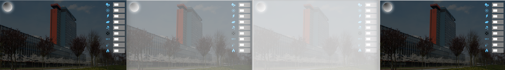

<sup>Lightning animation sequence example.</sup>

We now go over the **lightning** effect in our CSS weather demo: it consists of a single `<div>` covering the viewport. The animation takes 5 seconds and for 75% of the time does nothing. Then it briefly paints the `<div>` background white with increasing opacity (that's lightning), the `<div>` becomes transparent again and then this happens a second time. So here, one animation cycle results in two _lightning bolts_.

Once again, we only have to define the states of the animation, the rendering engine does the rest.

```css
/* ++++++++++++++++++++ LIGHTNING ++++++++++++++++++++ 
 * Adapted/inspired from https://codepen.io/Chrislion_me/pen/rVqwbO
 */
.lightning {
  /* the entire background-image should be filled with lightning;
   * thus we position with respect to the parent (<body>) at 0/0
   */
  position: absolute;
  width: 100%;
  height: 100%;

  animation: flash ease-out 5s infinite;
}

@keyframes flash {
  /* basic idea: the white div covering the entire screen appears
   * very briefly with varying levels of opacity;
   * The from/74% duplication of opacity: 0 is important here, as
   * otherwise the transition from the start to 75% is a gradually
   * whiter screen.
   */
  from {
    opacity: 0;
  } /* from is the same as 0% */
  74% {
    opacity: 0;
  }
  75% {
    background-color: white;
    opacity: 0.6;
  }
  76% {
    background-color: white;
    opacity: 0.2;
  }
  80% {
    background-color: white;
    opacity: 0.95;
  }
  82% {
    opacity: 0;
  }
  92% {
    opacity: 0;
  }
  93% {
    background-color: white;
    opacity: 0.5;
  }
  94% {
    background-color: white;
    opacity: 0.2;
  }
  96% {
    background-color: white;
    opacity: 0.9;
  }
  to {
    opacity: 0;
  } /* to is the same as 100% */
}
```

Beyond lightning, we also have an animated moon: it appears to be radiating continuously if you look closely. This is an animation of the moon's `box-shadow` property. The moon itself is a `<div>` element with a `border-radius` set such that it results in a perfect circle :point_down: :

```css
#moon {
  /* the moon is positioned with respect to the <body> element at
   * the top left corner
   */
  position: absolute;
  left: 160px;
  top: 80px;
  border-radius: 50%; /* making it round */
  height: 100px;
  width: 100px;
  border: 1px solid black; /* a black line around the circle*/
  /* we create a background image that has a radial gradient
   * going from dark-grey to white 
   */
  background: radial-gradient(circle at 20px 10px, #333, #fff);
  /* shadow: has no offset (equal shadow on all sides) and a large blue value */
  box-shadow: 0 0 25px #fff;
  animation: flicker 3s infinite;
}

@keyframes flicker {
  0% {
    box-shadow: 0 0 25px #fff;
  }
  25% {
    box-shadow: 0 0 60px #fff;
  }
  50% {
    box-shadow: 0 0 50px #fff;
  }
  90% {
    box-shadow: 0 0 27px #fff;
  }
}
```

Lastly, while lightning and the moon were done in _pure CSS_, for the raindrops and the clouds we made use of JavaScript: note though that this is not strictly necessary. Since we need hundreds of raindrops/clouds that are all slightly different (slightly different locations, size, color, opacity, speed) we would need to create hundreds of different CSS rules. JavaScript makes this much easier&mdash;we create these rules programmatically. Let's quickly look at how the clouds were created. All properties that remain static for the majority of clouds are fixed in the CSS file:

```css
.cloud {
  width: 200px;
  height: 60px;
  background: #fff;
  border-radius: 200px;
  position: absolute;
  /* z-index:10; with this, the cloud is in front of the switches */
  animation: moveclouds 15s linear infinite;
}

.cloud::before,
.cloud::after {
  content: "";
  background: white;
  width: 100px;
  height: 80px;
  /* important here is to know that the before/after pseudo-elements
   * are children of the element they belong to and thus absolute
   * positioning makes sense here
   */
  position: absolute;
  top: -15px;
  left: 10px;
  border-radius: 100px;
  transform: rotate(33deg);
}

.cloud::after {
  width: 110px;
  height: 90px;
  top: -45px;
  /* left: auto means that the position of the element is based on the right property value */
  left: auto;
  right: 5px;
}

/* simple animation: clouds go from left to right */
@keyframes moveclouds {
  0% {
    margin-left: -20%;
  }
  100% {
    margin-left: 120%;
  }
}
```

Now we still have to create the `<div>` elements and assign to each the `.cloud` class as well as the properties unique to each cloud. For this to work, it is vital that the created element is added to the DOM tree (the rendering engine will not render it otherwise). For this reason, our HTML file contains a `<div id="clouds">` element and all generated individual cloud elements are added as its children with the line `clouds.appendChild(c)` :point_down::

```js
var totalNumClouds = 30;

/*
 * checkbox unchecked: find the <div> with id "clouds" and delete all its children.
 * checkbox checked: find the <div> with id "clouds" and create four <div> elements
 * with class .cloud and id's c1 to c4.
 */
function toggleClouds(e) {
  let clouds = document.getElementById("clouds");

  if (document.getElementById("cloudsCheckbox").checked == false) {
    while (clouds.firstChild) {
      clouds.removeChild(clouds.firstChild);
    }
  } else {
    for (let i = 1; i <= totalNumClouds; i++) {
      let c = document.createElement("div");
      c.classList.add("cloud"); //class .cloud in the CSS file

      //random location
      c.style.top = 50 + getRandomInt(120) + "px";

      //random opacity
      c.style.opacity = Math.random();

      //random animation speed
      c.style.animationDuration = 15 + getRandomInt(20) + "s";

      //random starting point within the animation
      c.style.animationDelay = -1 * getRandomInt(40) + "s";

      //slightly different size per cloud
      c.style.transform = "scale(" + (0.1 + Math.random()) + ")";
      clouds.appendChild(c); //add element to the DOM tree
    }
  }
}
```

_Note: the rain drops are generated in a similar fashion, so we do not go into the code details here._

<optional-info markdown="block">
### Transitions

As already mentioned, transitions are animations with only two states: a start state and an end state.

We actually have been using transitions all this time already, e.g. when defining `:hover`. In this case, the transition is from the original element style to the hover style.

We can make use of the [`transition`](https://developer.mozilla.org/en-US/docs/Web/CSS/CSS_Transitions/Using_CSS_transitions) property to control the animation between the start and end state. The example below :point_down: shows off what the impact of `transition` is: we define two boxes which, when being hovered over, change their rotation by 70 degrees.

- `#box1` has no `transition` property, which makes the style change instantaneous;
- `#box2` has the `transition` property which determines how fast the transition for different properties takes place and we see a smooth animation when hovering.

```html
<!DOCTYPE html>
<html>
  <head>
    <style>
      #box1 {
        width: 100px;
        height: 100px;
        background-color: lightgreen;
      }

      #box1:hover {
        transform: rotate(70deg);
        background-color: darkgreen;
      }

      #box2 {
        width: 200px;
        height: 200px;
        background-color: yellow;
        transition: width 2s, height 2s, background-color 2s, transform 2s;
      }

      #box2:hover {
        transform: rotate(70deg);
        background-color: red;
      }
    </style>
  </head>
  <body>
    <div id="box1"></div>

    <div id="box2"></div>
  </body>
</html>
```

:point_up: The line `transition: width 2s, height 2s, background-color 2s, transform 2s` is a short-hand for the `transition-property` (the CSS property to which a transition should be applied) and the `transition-duration` (the seconds or milliseconds until the transition is complete). As seen here, we can define multiple transition properties in one line.
</optional-info>

<optional-info markdown="block">
## Vendor prefixes

A last word on **vendor prefixes**. Many CSS code snippets you find online will contain vendor prefixes (either at property or rule level). As an example, consider this [Stack Overflow question](https://stackoverflow.com/questions/20586143/css-animation-vs-transition). It contains CSS properties such as `-webkit-transition`, `-webkit-animation-duration` and so on. In the past, browser vendors decided to use [browser-specific prefixes](https://developer.mozilla.org/en-US/docs/Glossary/Vendor_Prefix) to include experimental CSS features in their rendering engines. This led (and is still leading) to a lot of duplicate code, e.g.

```css
main:-webkit-full-screen {
} /* Chrome */
main:-moz-full-screen {
} /* Firefox */
main:-ms-fullscreen {
} /* Internet Explorer */
main:fullscreen {
} /* W3C proposal */
```

This approach has now been _largely_ deprecated. Most CSS rules/properties are interpretable across modern browsers without requiring vendor prefixes. So how do you know which rules/properties require or do not require such prefixes? One approach is to initially avoid all vendor prefixes and use each browser's dev tools to determine whether a CSS rule/property is recognized. It may not be recognized because it is not implemented in the rendering engine or requires a vendor prefix.

As an example, compare how the hovered-over hyperlinks look like on our course page on Firefox and Chrome. Firefox's CSS rendering engine implements the CSS property `text-decoration-thickness` and thus hovered links look as follows:

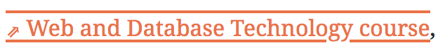

Chrome's rendering engine does not (yet?) implement it (:point*down: \_note the thinner lines and the smaller gap between the font and the underline in comparison to Firefox's rendering above*). Correspondingly, Chrome's developer tools show a warning that this is an unrecognized property :point_down::

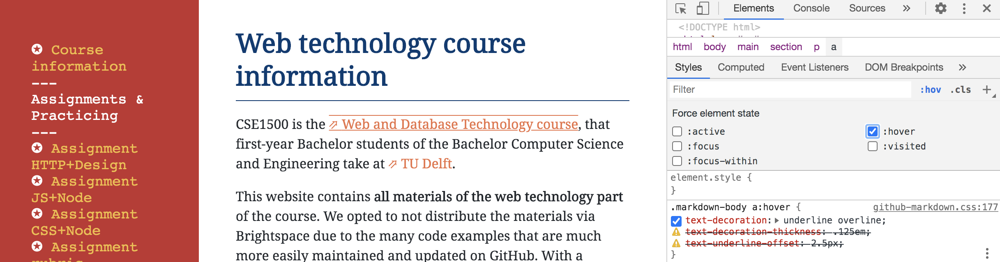

An alternative is [caniuse.com](https://caniuse.com/) which not only provides information on which CSS rules/properties are implemented but also on their need for a vendor prefix. Here is an example of the CSS property `user-select` for which (among others) the Safari browser requires the use of the `-webkit` prefix :point_down::

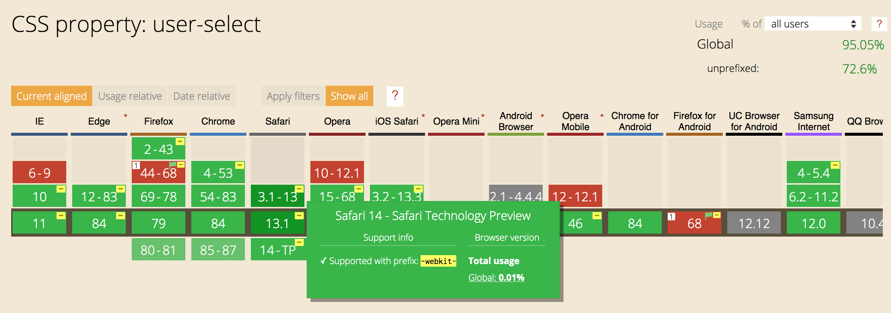

A tedious and boring task (i.e. to check for the need of vendor-specific prefixes) that does not require any type of creativity and requires lookups in a large database? _A perfect setup for automation._ The npm package [Autoprefixer](https://www.npmjs.com/package/autoprefixer) is a popular tool to do exactly that: it parses vendor-less CSS and automatically adds the correct vendor prefixes. While in our small-scale class project this is not needed, in production-level code such automation (likely part of a much larger chain of processes to convert handwritten code) is highly recommended.

</optional-info>

<optional-info markdown="block">
## CSS frameworks and APIs

Frameworks designed to make CSS easier to handle exist. A popular front-end framework is [Bootstrap](https://getbootstrap.com/) which originally came out of Twitter. It contains a whole host of templates that make interface design less painful: instead of sweating about each and every CSS detail, you can make use of a large set of predefined components and thus focus on the bigger picture (the interface as a whole). While Bootstrap is still the most popular front-end framework, [Tailwind CSS](https://tailwindcss.com/) is starting to draw a large user base. It is more low-level than Bootstrap and thus allows the front-end to look more unique (designs based on Bootstrap often have a particular look and feel) while taking care of the painful details.

While frameworks provide the developer with a more high-level view of CSS, [CSS Houdini](https://developer.mozilla.org/en-US/docs/Web/Houdini) goes in the opposite direction: it provides low-level API access to the CSS engine inside the browser!
</optional-info>

## Self-check

Here are a few questions you should be able to answer after having followed the lecture and having worked through the required readings:

<details> 
  <summary>Through which mechanism can data be stored directly in CSS files?</summary>
  The <span markdown="span">content</span> attribute.
</details>

<details> 
  <summary>True or False? A single DOM element cannot contain multiple classes.</summary>
  False.
</details>

<details> 
  <summary>True or False? A <span markdown="span">class</span> attribute can be added to any DOM element.</summary>
  True.
</details>

<details> 
  <summary>What is the main purpose of a "CSS reset"?</summary>
  To reset the browser-specific default stylesheet to a consistent baseline.
</details>

<details>
  <summary>What is the difference between an inline and a block element?</summary>
Block-level elements are surrounded by line-breaks. They can contain block-level and inline elements. Inline elements can be placed within block-level or inline elements. They can contain other inline elements.
</details>

<details>
  <summary>What is the difference between <span markdown="span">nth-of-type</span> and <span markdown="span">nth-child</span>?</summary>
<span markdown="span">nth-child(X)</span> is any element that is the Xth child element of its parent; <span markdown="span">nth-of-type(X)</span> is any element that is the Xth sibling of its type.
</details>

<details>
  <summary>What is the purpose of CSS media queries</summary>
CSS media queries enable the use of device/media-type dependent style sheets and rules. While the HTML document is written once, the CSS is written once per device type. 
</details>

<details>
  <summary>What is the difference between pseudo-classes <span markdown="span">hover</span> and <span markdown="span">active</span>?</summary>
<span markdown="span">hover</span> is a selector that becomes active when a mouseover on the respective element occurs. In contrast, <span markdown="span">active</span> is a selector that is triggered when the element is activated.
</details>

<details>
  <summary>What does the selector combination <span markdown="span">e1+e2</span> mean?</summary>
This combination selects all <span markdown="span">e2</span> elements that follow <span markdown="span">e1</span> immediately.
</details>

<details>
  <summary>Explain the difference between <span markdown="span">position:absolute</span> and <span markdown="span">position:relative</span>.</summary>
The difference lies in the element flow. With <span markdown="span">position:relative</span>, the element is adjusted on the fly, other elements are not affected. In contrast, with <span markdown="span">position:absolute</span>, the element is taken out of the normal flow (no space is reserved for it).
</details>

<details>
  <summary>When should <span markdown="span">position:fixed</span> be used?</summary>
A major use case are elements that should be visible at all times to the user, no matter the scrolling behavior.
</details>
