# HTML: the language of the web <!-- omit in toc -->



## Table of Contents <!-- omit in toc -->
- [Required & recommended readings and activities](#required--recommended-readings-and-activities)
- [:scroll: Learning goals](#scroll-learning-goals)
- [Web sites vs. web applications vs. the web as a platform](#web-sites-vs-web-applications-vs-the-web-as-a-platform)
- [Cross-platform applications](#cross-platform-applications)
- [Web design basics](#web-design-basics)
  - [Rule: Don't make me think](#rule-dont-make-me-think)
  - [Rule: Minimize noise and clutter](#rule-minimize-noise-and-clutter)
  - [Rule: If you cannot make it self-evident, make it self-explanatory](#rule-if-you-cannot-make-it-self-evident-make-it-self-explanatory)
  - [Aesthetics matter (of course!)](#aesthetics-matter-of-course)
- [Usability testing: expectations vs. reality](#usability-testing-expectations-vs-reality)
- [Performance metrics](#performance-metrics)
- [HTML5](#html5)
  - [The move towards HTML5](#the-move-towards-html5)
  - [Who decides the HTML standard](#who-decides-the-html-standard)
- [Self-check](#self-check)

## Required & recommended readings and activities

- Required readings:
  - [Getting started with HTML @MDN](https://developer.mozilla.org/en-US/docs/Learn/HTML/Introduction_to_HTML/Getting_started)
  - [HTML text fundamentals @MDN](https://developer.mozilla.org/en-US/docs/Learn/HTML/Introduction_to_HTML/HTML_text_fundamentals)
  - [Document and website structure @MDN](https://developer.mozilla.org/en-US/docs/Learn/HTML/Introduction_to_HTML/Document_and_website_structure)
  - [Introduction to HTML forms @MDN](https://developer.mozilla.org/en-US/docs/Learn/HTML/Forms/Your_first_HTML_form) (**skip over** the section on *Basic form styling*, we will cover this topic in a later lecture).
- Recommended activity:
  - :headphones: Listen to [this podcast with Tom Dale](http://talkingcode.com/podcast/episode-11-tom-dale/) discussing modern web applications and the move from web sites to web apps and an almost *native* experience.
- Recommended readings:
  - :closed_book: Chapter 3 of the [Definite Guide to HTML5](https://www.apress.com/gp/book/9781430239604).
  - A blog post on the [use of animations to enhance the user experience](https://uxdesign.cc/the-ultimate-guide-to-proper-use-of-animation-in-ux-10bd98614fa9).
  - [Web Fundamentals by Google](https://developers.google.com/web/fundamentals/).
  - [Examples of what modern web technologies can achieve in Chrome](https://experiments.withgoogle.com/) (if you use another browser, not all examples may work as expected).
  - [Atomic Design by Brad Frost](http://atomicdesign.bradfrost.com/) 
  - [Laws of UX](https://lawsofux.com/): web design principles explained in short snippets.
  - [CodePen's September 2020 Challenges are all about HTML](https://codepen.io/challenges/2020/september/) and what you can do with 100 HTML elements of a single type.
- Relevant scientific publications:
  - Fernandez, Adrian, Emilio Insfran, and Silvia Abrahão. [Usability evaluation methods for the web: A systematic mapping study](https://www.sciencedirect.com/science/article/pii/S0950584911000607). Information and software Technology 53.8 (2011): 789-817.
  - Sonderegger, Andreas, and Juergen Sauer. [The influence of design aesthetics in usability testing: Effects on user performance and perceived usability](https://www.sciencedirect.com/science/article/pii/S0003687009001148). Applied ergonomics 41.3 (2010): 403-410.
  - Mathur, Arunesh, et al. [Dark Patterns at Scale: Findings from a Crawl of 11KShopping Websites](https://webtransparency.cs.princeton.edu/dark-patterns/). Proceedings of the ACM on Human-Computer Interaction. Vol 3. CSCW (2019): 1-32.
  


## :scroll: Learning goals

- Apply web design principles during the design stage of a web app.
- Explain the ideas behind usability testing and employ it.
- Employ HTML.

This lecture does not cover **how to write HTML**, this is covered in the required readings for this lecture. At the end of this lecture we provide historic context to understand/appreciate the current state of HTML.

## Web sites vs. web applications vs. the web as a platform

The W3C has many working groups, among them (until 2016) the *Web Applications (WebApps) Working Group* whose [goal](https://www.w3.org/2014/06/webapps-charter.html) was as follows:

```
As web browsers and the web engine components that power them become ubiquitous across a range
of operating systems and devices, developers are increasingly using web technologies to build
applications and are relying on web engines as application runtime environments. Examples of
applications now commonly built using web technologies include reservation systems, online
shopping / auction sites, games, multimedia applications, maps, enterprise-specific applications,
interactive design applications, and PIM (email, calendar, etc) systems.
```

In 2017 this group was superseded by the [*Web Platform Working Group*](https://www.w3.org/2017/08/webplatform-charter.html) which has a similar goal (but not written up as nicely). The working group is responsible for a number of web technologies that move us closer towards the vision of the **browser as the operating system**, including:

- client-side database and offline applications;
- file and filesystem APIs;
- WebSockets;
- Web Workers (enables web applications to spawn background processes);
- DOM & HTML;
- Canvas (for drawing);
- Web components (a component model for the web).

## Cross-platform applications

*Do web technologies also help you to create desktop apps or mobile apps?* 

Indeed, they do! [Electron](https://electronjs.org/) is an open-source project that enables you to build **cross-platform desktop apps** for Windows, Mac and Linux with HTML, JavaScript and CSS - the very technologies you learn about in this course.

Electron itself uses [Node.js](https://nodejs.org/en/), the server-side JavaScript runtime we cover in a later lecture together with [Chromium](https://www.chromium.org/), an open-source web runtime.

The major benefit of Electron should be clear: instead of writing three separate desktop variants (one for each operating system) you only have to write and maintain one. New features are integrated in one application instead of three, which reduces feature delivery time. For these reasons, many well-known applications today are built on Electron, including [Visual Studio Code](https://code.visualstudio.com/) (the IDE we recommend you to use), the [Slack](https://slack.com) app, [Atom](https://atom.io/) and [many, many more](https://electronjs.org/apps).

If you ever wanted to know how *Windows 95* looks like, there is an [Electron app for that as well](https://github.com/felixrieseberg/windows95). It looks like this :point_down::


<sup>Windows 95 stuffed into an Electron app.</sup>

On the downside, such a cross-platform approach usually brings with it considerable overhead - each application for instance bundles Chromium, which means that even if your app is not doing anything else besides `Hello World` it will be at least 30MB large. More concretely, the unzipped Windows95 Electron app is more than 454 MB in size, while the original Windows 95 operating system required about [40 MB of disk space](https://www.technologytips.com/windows-system-requirements/).

While Electron focuses on **cross-platform desktop applications**, initiatives with a similar goal for the mobile world (i.e. generating native apps for Android/iOS from HTML/CSS/JavaScript) exist as well. By far the most popular is [React Native](https://reactnative.dev/). Before you can use it though you will have to learn [React](https://reactjs.org/), a very popular JavaScript library for building user interfaces that is being developed by Facebook.


## Web design basics

The design of a meaningful user experience ("UX"), which for us is narrowed down to the design of web user interfaces (UIs), requires insights primarily from psychology and human-computer interaction. 

While this is well beyond the scope of our course, we present here a few basic rules that web applications should adhere to. These rules may seem obvious, but in practice are often ignored. This lecture is partially based on the book [Don't Make Me Think, Revisited (2014)](http://www.sensible.com/dmmt.html) by Steve Krug. In the following sections we go over a number of Krug's rules with concrete examples. Note that the book may look somewhat outdated (in the end, web applications six years ago looked quite different from today), however the principles are general enough to remain applicable to this day. 

Before you continue, I suggest you head to [https://userinyerface.com/](https://userinyerface.com/) and "play" its game: attempt to fill in the form as quickly as you can. Along the way, you will come across many *extremely* annoying user interface features that you have undoubtedly seen elsewhere on the web already. This (probably horrifying) experience shows why good UI design is so important.

### Rule: Don't make me think

The way a web site or web application (I tend to use the terms interchangeably here; the rules apply to both apps and sites) works should be self-evident; the user should not have to expend **cognitive effort** to understand what she can do.

Consider this example of [ebay.com](https://www.ebay.com/) :point_down::

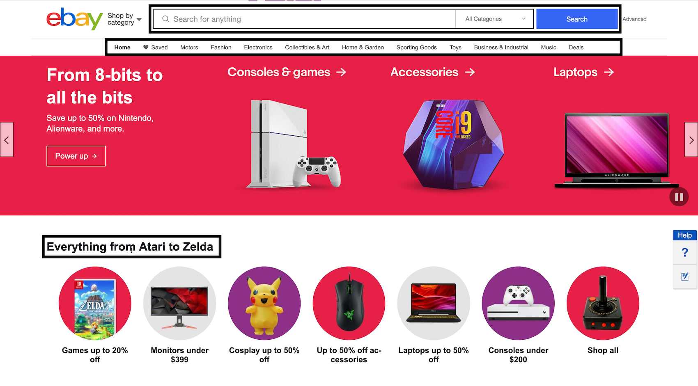

<sup>Screenshot of `ebay.com` taken on October 11, 2019.</sup>

:point_up: Here, it is very clear for the user what she can do: search for products, browse through the available items via product categories and shop for discounted electronics.

Contrast ebay with the following older example from [koopplein](https://web.archive.org/web/20140207233217/http://koopplein.nl/) :point_down::


<sup>Screenshot of `koopplein.nl` taken February 8, 2014.</sup>

:point_up: It is not self-evident for the user how to act to achieve her goals and major questions are raised:

- How do I get to the offers?
- What if I want to look at offers from Delft **and** Rijswijk instead of one or the other?
- What is all this text about?

**Good to know**: In case you wonder how it is possible to go back in time and look at older versions of a web site (as today's [koopplein.nl presence](https://koopplein.nl/) looks considerably better), head over to the [Wayback Machine](https://web.archive.org/), maintained by the Internet Archive whose mission is to **archive** the web. The Wayback Machine of course does not archive the entire web (this would be impossible), but it does take regular snapshots of more than **390 billion web pages**, including those of koopplein - [take a look](https://web.archive.org/web/*/koopplein.nl).

When naming and formatting links, buttons, section headers, etc. adhere to **established standards** and **be clear instead of clever**. For instance, a company's web site that has a link to its current job offers should use as link text `Jobs` or `Vacancies` (clear to the user what this link is about) instead of `Interested?` or `Join us!` (less clear).

Similarly, there are established style standards of how to format a link: in the early years of the web, blue underlined text was synonymous with a link and thus we are now stuck with the saying *10 blue links* as a synonym for web search results.

Users should also **not get lost within a web site**. A site should provide users with information on where they are and on how they arrived at that point. Ebay for instance leaves so-called **breadcrumbs** :point_down::

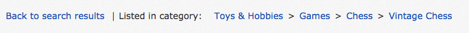

Lastly, it should be easy for the user to **distinguish different parts of a site** such as advertisement vs. content. Below is an example from Google that does a poor job in this respect. It is not obvious on first sight that the first search result is indeed a paid advertisement (the little **Ad** tag can easily be overlooked) instead of a so-called *organic* search result (i.e. one the search algorithm surfaces at the top ranked result) :point_down::

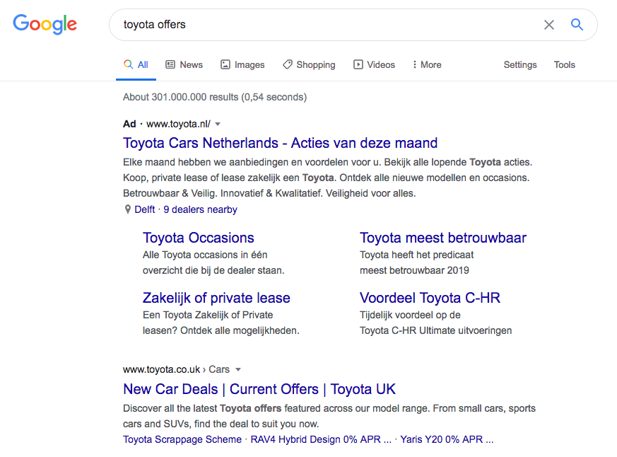

<sup>Google search result page, September 8, 2020.</sup>

A few years ago ([August 15, 2013](https://web.archive.org/web/20130815204510/https://www.google.com/search?q=toyota) to be precise) Google was more forthcoming when it came to clearly notifying its users about advertisements :point_down::

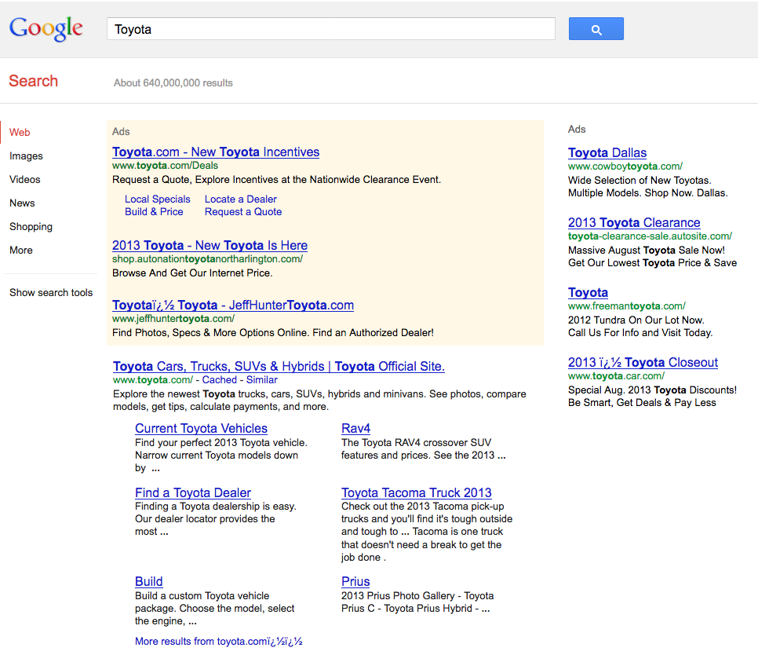

<sup>Google search result page, August 15, 2013.</sup>

It should be mentioned that Google is not the only offender here, take this example :point_down: from Twitter which is similarly poorly designed in terms of content distinction between organic tweets and promoted (i.e. paid) ones:


<sup>Twitter, September 7, 2020.</sup>

The Google/Twitter examples above are of course not accidental: user interface designers are not accidentally trying to disguise the fact that those are ads (also known as *promoted* or *sponsored* content). This is done on purpose: [we know that users are less likely to focus their attention on ads](https://doi.org/10.1145/1835449.1835459) if they recognize them as such. Disguising them to some degree means a higher likelihood of users paying attention to them. A higher engagement level means a higher financial return for the company. This is what is known as a **dark pattern**, more specifically the pattern of disguised ads. More formally, *"dark patterns are user interface design choices that benefit an online service by coercing, steering, or deceiving users into making unintended and potentially harmful decisions." A recent [study of 11K shopping websites](https://webtransparency.cs.princeton.edu/dark-patterns/) found dark patterns in more than 10% of them (the more popular the shopping site, the more likely the appearance of dark patterns). Dark patterns exist in different domains, not just social web platforms, e-commerce sites or search engines: in the past, researchers have looked at dark patterns [in the design of games](http://fdg2013.org/program/papers/paper06_zagal_etal.pdf), [privacy](https://www.degruyter.com/downloadpdf/j/popets.2016.2016.issue-4/popets-2016-0038/popets-2016-0038.pdf) and [home robots](https://ieeexplore.ieee.org/abstract/document/8673274).


### Rule: Minimize noise and clutter

This rule does not have to be explained in great detail. Here is an example of ZDNet and how it looked in 2001 and 2014 respectively, to make things clear :point_down::


<sup>ZDNet crawled on [March 31, 2001](https://web.archive.org/web/20010331202808/http://www4.zdnet.com:80/).</sup>

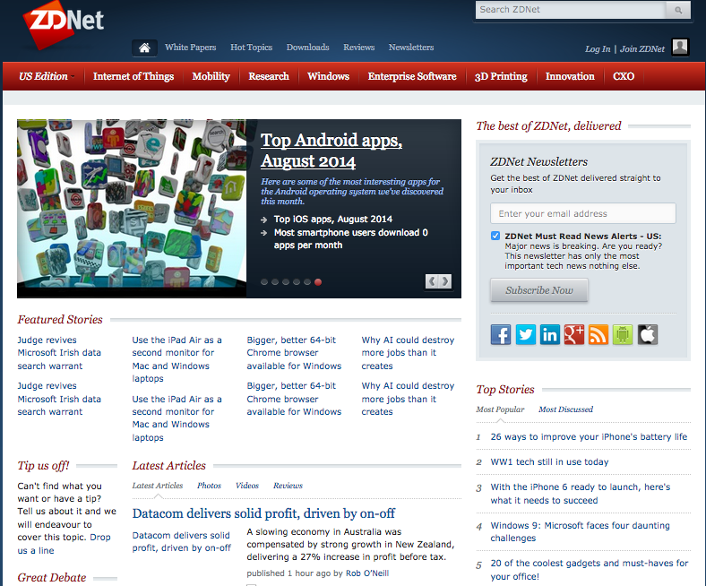

<sup>ZDNet crawled on [August 31, 2014](https://web.archive.org/web/20140831235129/http://www.zdnet.com/).</sup>

While it is not hard to go back to very old web designs and find faults in them (a not-too-serious look at the history of web design can be found [here](https://pavellaptev.github.io/web-dark-ages)), it should also be mentioned that in those times, every single HTTP request/response pair was time-consuming (the Internet was slow) and expensive. It made sense to push as much content as possible into a single page which could then be sent to the client in a single HTTP response.

### Rule: If you cannot make it self-evident, make it self-explanatory

Self-explanatory sites require users to expend a small amount of **cognitive effort**, that is, the mental effort it takes to engage in a task. When a site is not self-explanatory, a small amount of explanatory text can go a long way. In today's mobile world where a lot of content is accessed [*mobile first*](https://mayvendev.com/blog/mobilefirst), it is vital to keep the mobile user in mind who has to deal with a small screen, a touch-based interface and possibly many distractions while surfing the web.

A positive example of this rule is the following Surveymonkey splash screen :point_down::


<sup>Surveymonkey crawled on [December 1, 2013](https://web.archive.org/web/20131201000510/https://www.surveymonkey.com/).</sup>

In contrast, take a look at this entry page of a Dutch business and take a guess at what it does :point_down::


<sup>Screenshot taken October 11, 2019.</sup>

<details> 
  <summary>Click to find out the answer! </summary>
   This is the homepage of a Dutch cafe chain: https://coffeecompany.nl/ - not something easily guessable from the entry page. 
</details>

The entry page (or home page) of a web application should answer a number of essential questions, none of which are answered in our example:

- What **is** this?
- What can I **do** here?
- Why **should** I be here?
- What do they **have** here?

As a side note, another serial offender of the entry page checklist are university home pages as immortalized in [this xkcd comic](http://xkcd.com/773/).

Lastly, **avoid happy talk**, that is text without any content for the sake of adding some text (e.g. a welcome message).


### Aesthetics matter (of course!)

This may be obvious, but the look and feel of an application of course also influences both the users' *perceived* usability as well as the *actual* usability. An insightful piece of research conducted by [Sonderegger & Sauer](https://www.sciencedirect.com/science/article/pii/S0003687009001148) has measured this influence. They conducted an experiment with an objectively ugly and an objectively good looking mobile phone prototype: not only did the study participants rate the ugly phone as being less usable, they actually performed worse in a given task than the participants receiving the good looking device.

## Usability testing: expectations vs. reality

Our expectations of web users are often *not* grounded in reality. We may expect users to be **rational**, **attentive** and having a **clear goal** in mind.

Instead, the average web user:

- quickly scans a web page (not even reading it);
- decides within seconds whether or not a site is worth their attention (research on so-called *dwell time* has shown this [again](https://dl.acm.org/citation.cfm?id=1835513) and [again](https://dl.acm.org/citation.cfm?id=2835833));
- clicks on the first link they find;
- depends a lot on the browser's back button ([which can causes issues for web applications](https://baymard.com/blog/back-button-expectations));
- does not read instructions.

A web application should be designed based on **user reality**. **Usability testing** is an important step to create a well-designed web application. The development cycle consists of *designing*-*testing*-*reviewing*:

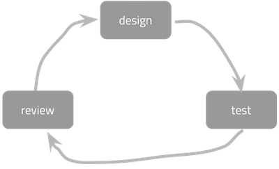

<sup>Development cycle.</sup>

In a **usability test**, a user is given a **typical task**, such as:

- Create a user account.
- Retrieve a lost password.
- Change the current credit card information.
- Delete a user account.
- Find an article in the archive.
- Edit a posting made in a forum.
- Start a game with three players.

While the user is busy with the task, her actions towards completing the task are being recorded. These actions are then translated into performance metrics. Performance metrics depend on the task, it could be the **number of clicks** required to complete the task, the **time taken** or the **number of wrongly clicked elements**.

Usability testers should be a mix of target audience and average web users; 2-3 testers per iteration tend to be sufficient.

A typical usability setup has the following roles:

- The **participant** (our tester) sits in front of the device (laptop, mobile phone, tablet).
- The **facilitator** sits next to her and guides her through the test.
- The **observers** (developers of the app, managers, etc.) watch the usability test and discuss the tester's performance (and how to improve it) afterwards.

This [blog post](https://asinthecity.com/2013/04/09/recording-mobile-device-usability-testing-sessions-guerrilla-style/) provides a good practical overview of usability testing with mobile devices, and includes imagery of the [participant and facilitator setup](https://benmelbourne.files.wordpress.com/2013/04/pop-up-mobile-usability-testing-lab-2.jpg) and the [observer setup](https://benmelbourne.files.wordpress.com/2013/04/pop-up-mobile-usability-testing-lab-5.jpg).

The result of a usability test are a set of issues. Each of those issues should be assigned a **priority** (low, medium, high) and the next iteration of the development should focus on the high priority problems. No new issues should be added to the list until the most severe issues are fixed.

## Performance metrics

Once web applications become complex, besides general usability we also need to consider various **performance metrics**, ideally metrics that are *user-centric*. A basic question to ask is: *how long does it take for the entire application to load?*. This is of course a rather crude metric and it is not always clear what exactly this means, due to polling, etc. We thus need more fine-grained performance metrics. The [web vitals section at Google's web.dev resource](https://web.dev/metrics/) provides a good overview of what questions to ask in order to measure aspects of an application's performance that are *relevant* to the user. Let's focus on the three metrics that Google considers to be [core web vitals](https://web.dev/vitals/):

- Largest contentful paint ([LCP](https://web.dev/lcp/)): LCP measures the time it takes to load a page's main content, which correlates very well with users' perceived load speed. 
- First input delay ([FID](https://web.dev/fid/)): FID measures the time between a user first interacting with a page and the browser processing corresponding event handlers.
- Cumulative layout shift ([CLS](https://web.dev/cls/)): CLS measures a page's visual stability by aggregating to what extent visible elements shift in the layout unexpectedly.

As an example of a popular online web metrics tool let's take a look at Google's [https://web.dev/measure/](https://web.dev/measure/). How does TU Delft's homepage do in terms of its web performance? Let's find out :point_down::

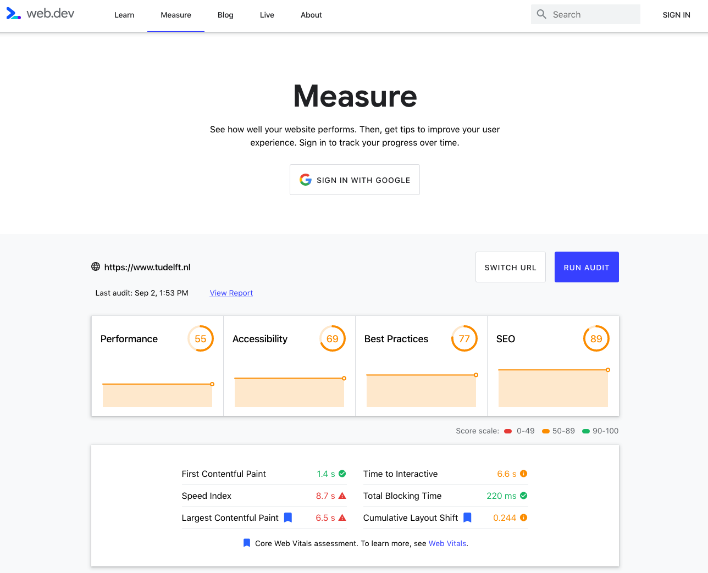

<sup>Screenshot taken September 2, 2020.</sup>

:point_up: Overall, it could be better. A click on [View Report](https://lighthouse-dot-webdotdevsite.appspot.com//lh/html?url=https%3A%2F%2Fwww.tudelft.nl) shows not only more performance metrics but also actionable insights (e.g. *remove unused JavaScript*, *reduce initial server response time*, *avoid excessive DPOM size*, ...).

An alternative service is [webhint.io](https://webhint.io/) (originally coming out of the Microsoft Edge development team). Once more, let's use the TU Delft home page as an example :point_down::

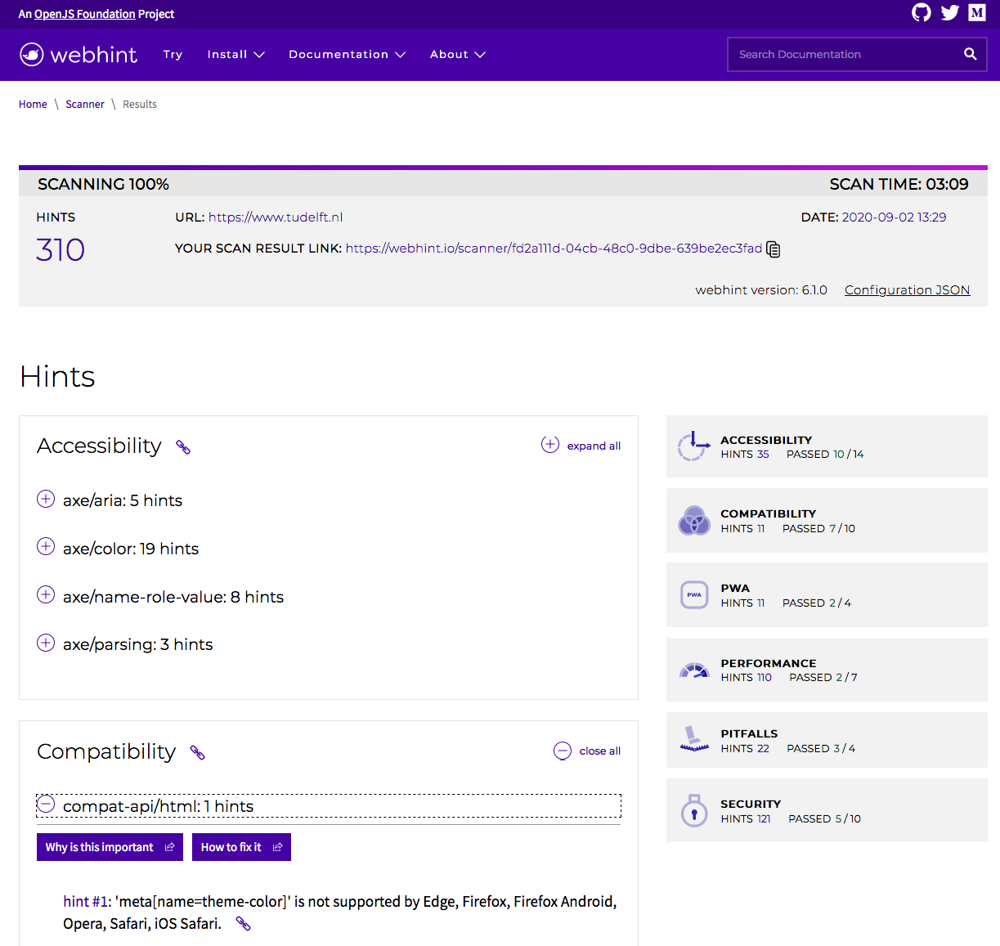

<sup>Screenshot taken September 2, 2020.</sup>

:cookie: In both examples, we see that web performance only delivers part of the picture. There are many more metrics beyond those related to an application's *performance*. Other important types of web metrics revolve around accessibility and security.

:bug: Beyond online tools, browser extensions such as [Lighthouse](https://developers.google.com/web/tools/lighthouse/) and web performance libraries such as [Perfume.js](https://github.com/zizzamia/perfume.js) exist as well that allow you to gain more specific insights into your application's performance.

## HTML5

HTML5 is a set of related technologies (core HTML5, CSS, JavaScript) that together enable **rich web content**:

- **Core HTML5**: mark up content;
- **CSS**: control the appearance of marked-up content;
- client-side **JavaScript**: manipulate the contents of HTML documents and respond to user interactions.

Modern web application development requires knowledge of all three technologies. In practice, it also requires a whole set of additional frameworks and tools to go from prototype code to production code, such as build tools, transpilers, code coverage tools and so on. This is the case even "just" for [frontend coding](https://medium.com/the-node-js-collection/modern-javascript-explained-for-dinosaurs-f695e9747b70). We will introduce a few of those tools throughout the practical assignments.

Before HTML5 we had **XHTML** and HTML 4.01. XHTML is a reformulation of HTML 4 as an XML 1.0 application and stands for **Extensible HyperText Markup Language**. It looks as follows (taken straight from the [W3C XHTML recommendation](https://www.w3.org/TR/xhtml1/)):

```html
<?xml version="1.0" encoding="UTF-8"?>
<!DOCTYPE html
     PUBLIC "-//W3C//DTD XHTML 1.0 Strict//EN"
    "http://www.w3.org/TR/xhtml1/DTD/xhtml1-strict.dtd">
<html xmlns="http://www.w3.org/1999/xhtml" xml:lang="en" lang="en">
  <head>
    <title>Virtual Library</title>
  </head>
  <body>
    <p>Moved to <a href="http://example.org/">example.org</a>.</p>
  </body>
</html>
```

XHTML was designed to make processing of web pages **easier for machines** by having a very strict set of rules. The problem though was that (X)HTML is written by developers, not machines and it turned out to be too much hassle to write valid XHTML. Moreover, browsers were and are able to render invalid XHTML pages properly (so why even try to write valid XHTML?) and thus XHTML was eventually abandoned in favor of HTML5, which is not only less strict but also added a host of new features to the language.

With this introduction of new features **browser compatibility** issues returned: some browser vendors are faster than others in implementing W3C standards (in addition to implementing their own non-standardized features). A good resource to check which browser versions support which HTML5 feature and to what extent is [https://caniuse.com/](https://caniuse.com/).

As a concrete example, here is the browser support overview of HTML5 form features as provided by [caniuse](https://caniuse.com/#search=form%20features) :point_down::

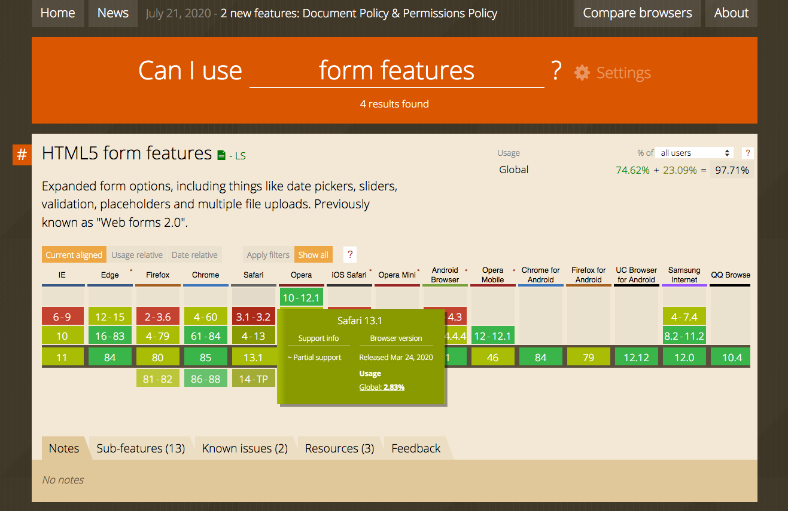

<sup>Screenshot taken on September 2, 2020.</sup>

We can thus easily find out which browser versions do (not) support these features or only partially support them. This enables application developers to make choices - depending on their target population (and the most popular browsers among the target population), certain HTML5 features should be employed *with care*. That does not mean to *not* use the latest HTML5 features, it just means that we need to be considerate of our users and provide them with options, even if they rely on browsers that are not supporting the features we use. As a concrete example, let's use the `<input type="date">` widget. Here is how the [MDN demo on this input type](https://developer.mozilla.org/en-US/docs/Web/HTML/Element/input/date) is rendered on Firefox and Safari respectively :point_down::

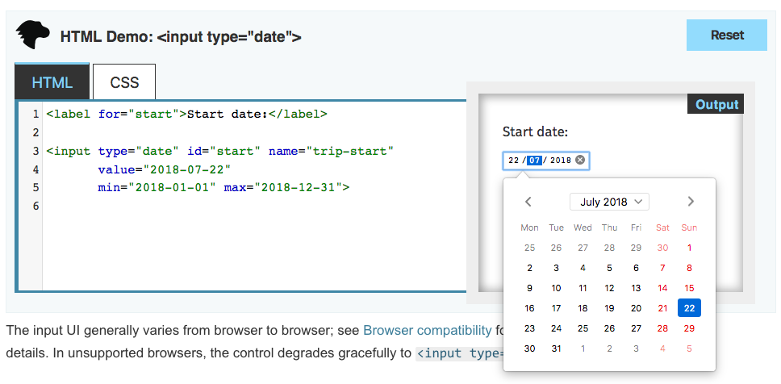

<sup>Firefox screenshot taken September 2, 2020.</sup>

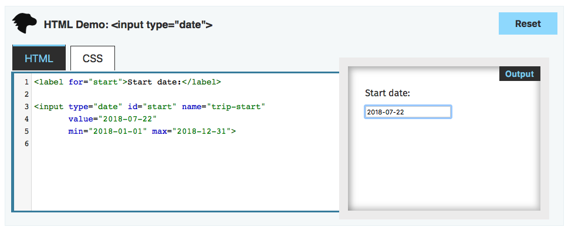

<sup>Safari screenshot taken September 2, 2020.</sup>

:point_up: We find that Firefox supports this input type with a calendar picker widget, while Safari does not. What can we do in this case? The answer is to use (or create!) *polyfills*. A polyfill is a code snippet that brings a modern browser feature (such as a calendar picker) to browsers that do not natively support that feature. Here is an example of a [polyfill for Safari (among others)](https://github.com/chemerisuk/better-dateinput-polyfill). Sometimes when looking for polyfills one can also come across the term *shim*. These concepts are not quite interchangeable, though they often used in the same contexts.

### The move towards HTML5

The initial list of HTML tags (1991/92) was **static**: `<title> <a> <isindex> <plaintext> <listing> <p> <h1> <address> <hp1> <dl> <dt> <ul>`. JavaScript was created within 10 days (*which explains many JavaScript quirks*) in May 1995 by [Brendan Eich](https://twitter.com/BrendanEich), a co-founder of Mozilla who today is behind the browser [Brave](https://brave.com/). At the time, Eich worked at Netscape, which offered Netscape Navigator, a dominant browser in those years. It was the beginning of client-side **dynamic** scripting for the browser.

**Plugins** were created to go beyond what at the time was possible with HTML. Probably the most famous plugin remains Adobe Flash, which was introduced in 1996. HTML5 is a drive to return rich content **directly** into the browser, without the need for plugins or addons.

HTML5 introduced a number of **semantic HTML elements** including `<article> <footer> <header> <main> <aside> <section> <output>`. As a guideline, when creating an HTML document, it is always best to select the **most specific** element to represent your content (instead of only using `<div>`'s). Semantic elements provide **meaning** but do not force a particular presentation. Older HTML elements (pre-HTML5) often do force a particular presentation, e.g. `<b>` (bold) or `<i>` (italics). At the same time, those heavily used HTML elements cannot be moved to an obsolete state - as this would inevitably break a large portion of the web. For the browser vendors, backwards compatibility is a necessity, not an option. It should be pointed out that **semantic HTML** is quite different from the grand vision of the [Semantic Web](https://www.w3.org/standards/semanticweb/) :point_down::

```
The Semantic Web is a Web of data — of dates and titles and part numbers and chemical
properties and any other data one might conceive of.
```

:bug: If you are interested in how web applications are structured, the browser's dev tools are your friend! In Firefox, open the web developer tools and head to the *Inspector* tab. Hovering with the mouse over elements of the web application will highlight the corresponding HTML (and vice versa) as shown here for our course home page :point_down::

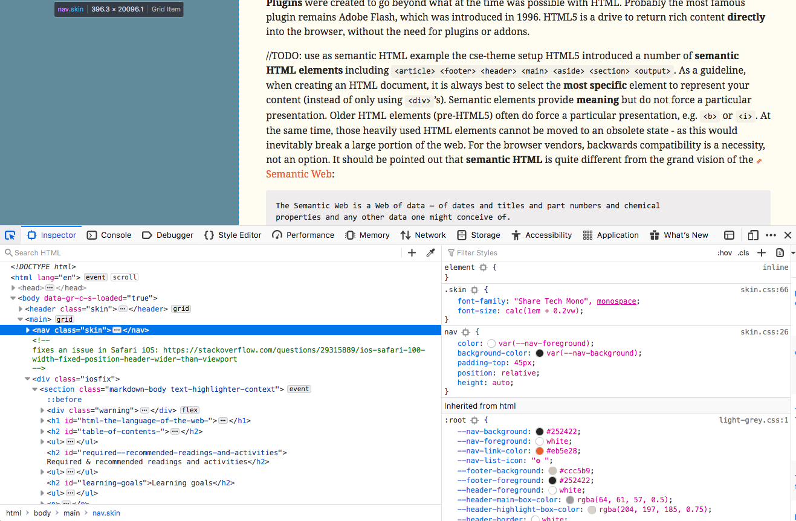

<sup>Firefox web dev tooling. Inspector tab. Screenshot taken September 2, 2020.</sup>

### Who decides the HTML standard

HTML is widely used, which makes standardization a slow process. Many different stakeholders are part of W3C's [Web Platform Working Group](https://www.w3.org/WebPlatform/WG/) (Microsoft, Google, Mozilla, Nokia, Baidu, Yandex, etc.). The standardization process of the W3C is elaborate, as a wide variety of stakeholders have to build consensus. Confusingly, a **W3C recommendation** is the highest level of standardization possible, before achieving it, a number of steps leading up to the recommendation are required:

1. **Working Draft**: *a document that W3C has published for review by the community, including W3C Members, the public, and other technical organizations.*
2. **Candidate Recommendation**: *a document that W3C believes has been widely reviewed and satisfies the Working Group's technical requirements. W3C publishes a Candidate Recommendation to gather implementation experience.*
3. **Proposed Recommendation**: *a mature technical report that, after wide review for technical soundness and implementability, W3C has sent to the W3C Advisory Committee for final endorsement.*
4. **W3C Recommendation**: *a specification or set of guidelines that, after extensive consensus-building, has received the endorsement of W3C Members and the Director. W3C recommends the wide deployment of its Recommendations. Note: W3C Recommendations are similar to the standards published by other organizations.*

<sup>Source: [W3C Recommendation Track Process](https://www.w3.org/2018/Process-20180201/#maturity-levels).</sup>

Informally, one could say that the W3C standardizes what the browser vendors have agreed upon and have chosen to implement or chosen to implement in the near future. A more pessimistic view of the process has been voiced by Rich Harris:

<blockquote class="twitter-tweet"><p lang="en" dir="ltr">How Web Standards Work<br><br>1. design a flawed API (it&#39;s fine! APIs are hard)<br>2. ship it in the most-used browser, despite objections<br>3. get cross-browser working group to fix the API<br>4. oops, too late, that would break the web <a href="https://t.co/IuU6Xxzilv">pic.twitter.com/IuU6Xxzilv</a></p>&mdash; Rich Harris (@Rich_Harris) <a href="https://twitter.com/Rich_Harris/status/1220412711768666114?ref_src=twsrc%5Etfw">January 23, 2020</a></blockquote> <script async src="https://platform.twitter.com/widgets.js" charset="utf-8"></script> 

Consensus building takes time. HTML5 for instance was a candidate recommendation in Q4-2012 and became a W3C recommendation in Q4-2014. HTML5.1 was a candidate recommendation in Q1-2015 and became a recommendation in Q4-2016.

As of August 2018, [HTML5.3](https://www.w3.org/TR/html53/) has a *Working Draft* status; if you look at the standard text you will find it to be very elaborate (this is a 1,000+ pages document!) and precise, sufficiently so that any browser vendor can take the text and implement the features described in it without ambiguity.

In rare cases, features added to a web standard can also be removed again, the [AppCache](https://developer.mozilla.org/en-US/docs/Web/HTML/Using_the_application_cache) is a prime example of this: it was developed as technology to enable offline web applications in a simple manner (by adding a manifest file to a site containing no more than a few lines of text), but turned out to have so many [pitfalls](https://alistapart.com/article/application-cache-is-a-douchebag) that it was eventually abandoned in favor of another set of technologies ([Service Workers](https://developers.google.com/web/fundamentals/primers/service-workers/)). However, it is [still supported by all major browsers apart from the latest Chrome versions](https://caniuse.com/#search=appcache):

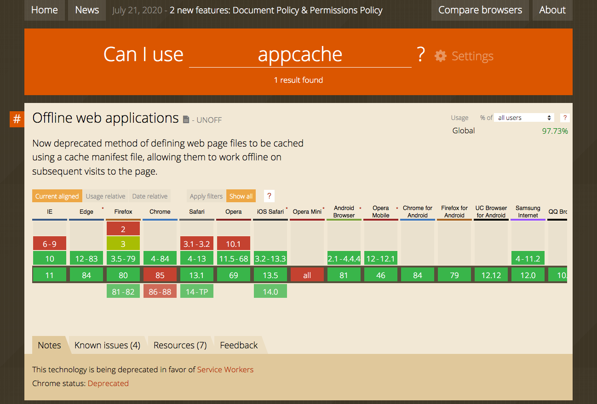

<sup>Screenshot taken on September 2, 2020.</sup>

The W3C writes the following about the AppCache: *This feature is in the process of being removed from the web platform. (**This is a long process that takes many years.**) Using the application cache feature at this time is highly discouraged. Use service workers instead.* 


## Self-check

Here are a few questions you should be able to answer after having followed the lecture and having worked through the required readings:

<details> 
  <summary>True or False? The `action` attribute of an HTML form defines where the data gets sent. Its value must be a valid relative or absolute URL.</summary>
  True.
</details>

<details> 
  <summary>True or False? If an HTML form is sent using the GET method, the data is appended to the body of the HTTP request.</summary>
  False.
</details>

<details> 
  <summary>How can we enable users to not get lost within a complex website?</summary>
  Through the use of so-called breadcrumbs, that provide users with information on where within the site they currently are.
</details>

<details> 
  <summary>True or False? The `action` attribute of an HTML form defines how the form is accessed on the client: either as a HTTP POST request or an HTTP GET request.</summary>
  False.
</details>

<details>
<summary>In a usability test, what is the task of the facilitator?</summary>
The facilitator guides the participant through the test.
</details>

<details>
<summary>Name three web performance metrics.</summary>
LCP, FID, and CLS.
</details>

<details>
<summary>What does the CLS metric measure?</summary>
CLS measures a page's visual stability by aggregating to what extent visible elements shift in the layout unexpectedly.
</details>

