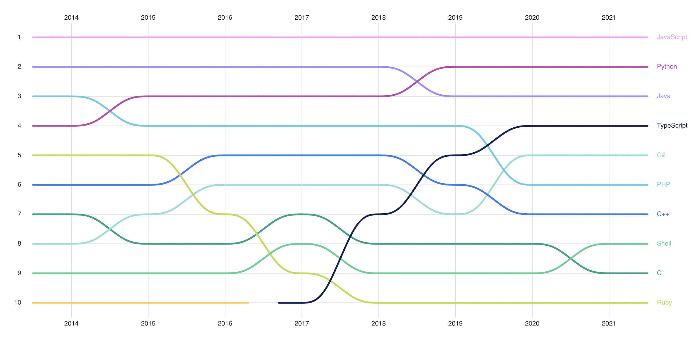
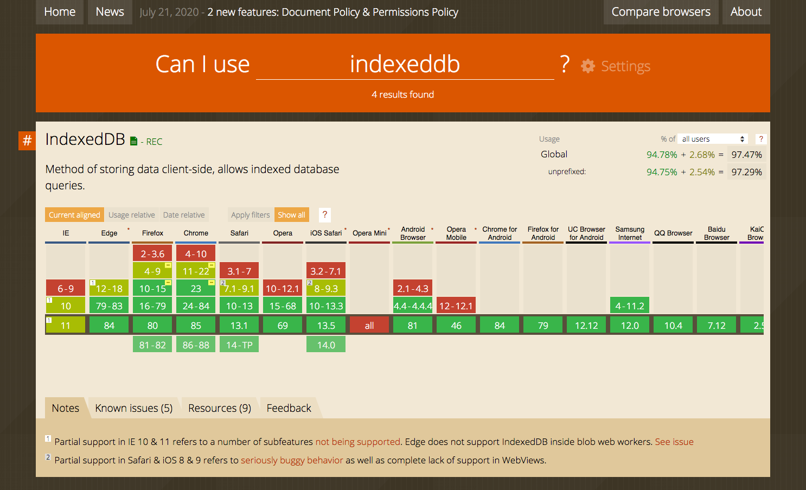
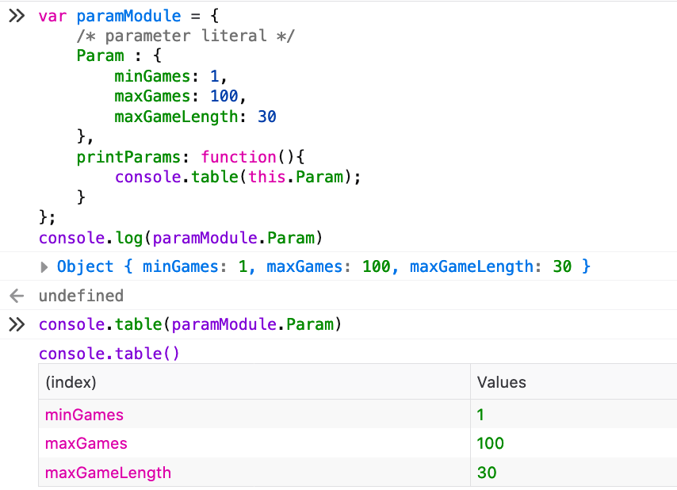
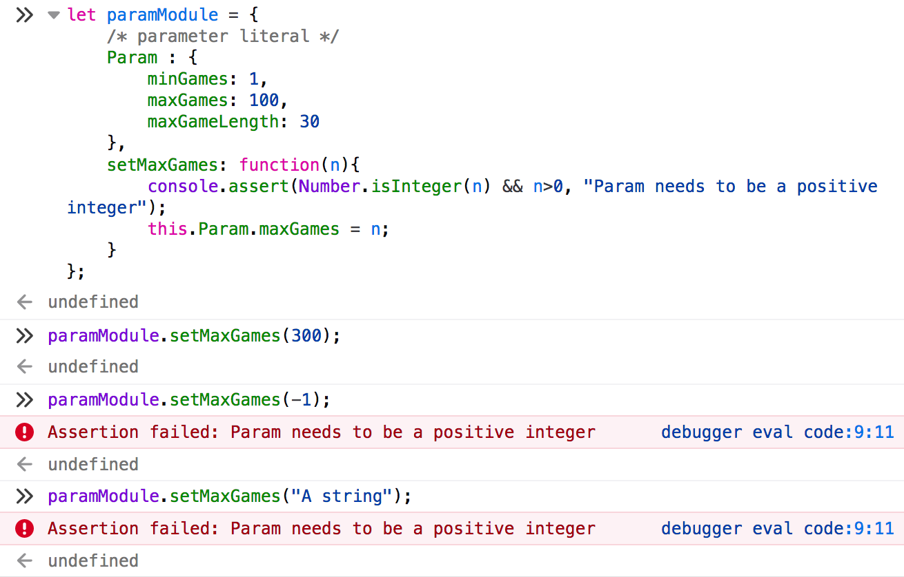
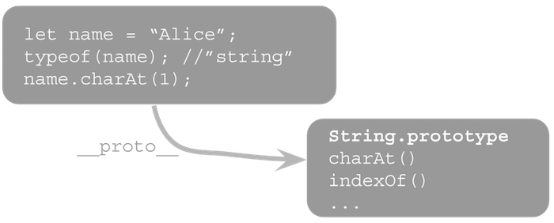
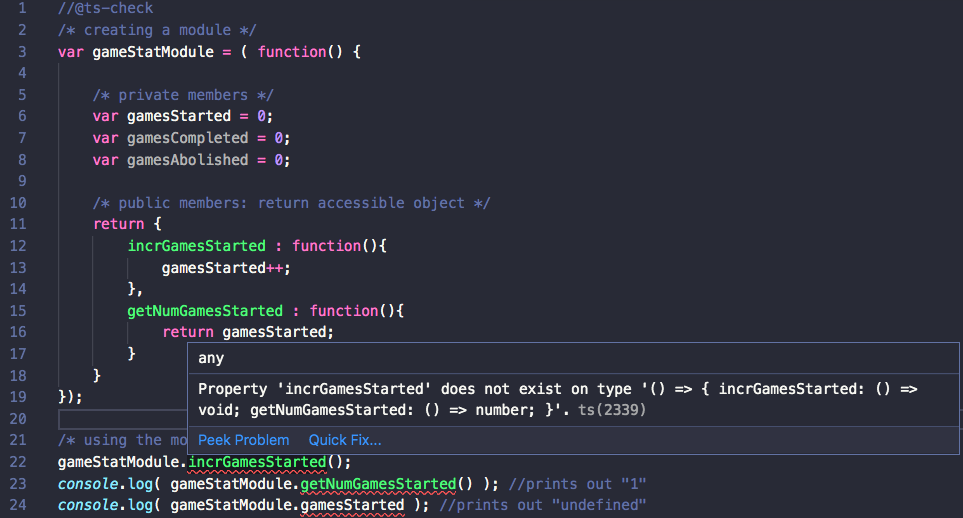
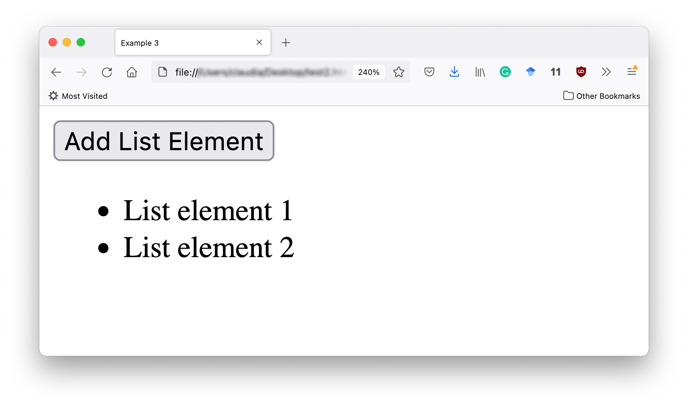
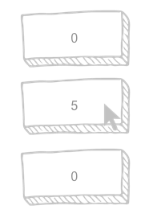
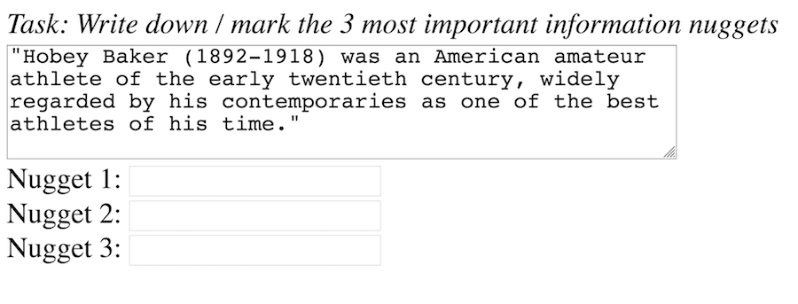
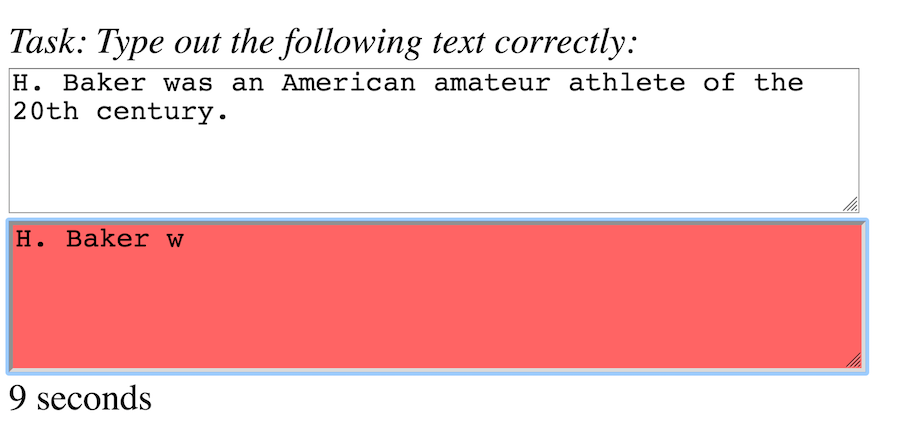

# JavaScript: the language of browser interactions <!-- omit in toc -->

_This is the densest web technology lecture of this course. Learning how to program takes time. Do not get frustrated if it is hard in the beginning._



## Table of Contents <!-- omit in toc -->

- [Required & recommended readings and activities](#required--recommended-readings-and-activities)
- [:scroll: Learning goals](#scroll-learning-goals)
- [Takeaways of the required readings](#takeaways-of-the-required-readings)
- [JavaScript in context](#javascript-in-context)
- [Scripting overview](#scripting-overview)
  - [Server-side vs. client-side scripting](#server-side-vs-client-side-scripting)
  - [The `<script>` tag](#the-script-tag)
  - [:bangbang: Activity](#bangbang-activity)
- [Scoping, hoisting and this](#scoping-hoisting-and-this)
  - [Scoping](#scoping)
  - [Hoisting](#hoisting)
  - [The keyword `this`](#the-keyword-this)
- [JavaScript design patterns](#javascript-design-patterns)
  - [Preliminaries](#preliminaries)
    - [Functions and objects](#functions-and-objects)
    - [Object creation with `new`](#object-creation-with-new)
    - [Object literals](#object-literals)
  - [Design pattern I: Basic constructor](#design-pattern-i-basic-constructor)
  - [Design pattern 2: Prototype-based constructor](#design-pattern-2-prototype-based-constructor)
  - [Design pattern 3: Module](#design-pattern-3-module)
- [Becoming interactive](#becoming-interactive)
  - [Document object model](#document-object-model)
  - [Events](#events)
  - [Seven examples](#seven-examples)
    - [:bangbang: Example 1: Changing an element's style](#bangbang-example-1-changing-an-elements-style)
    - [:bangbang: Example 2: document.getElementById / document.querySelector](#bangbang-example-2-documentgetelementbyid--documentqueryselector)
    - [:bangbang: Example 3: creating new nodes](#bangbang-example-3-creating-new-nodes)
    - [:bangbang: Example 4: `this`](#bangbang-example-4-this)
    - [:bangbang: Example 5: mouse events](#bangbang-example-5-mouse-events)
    - [:bangbang: Example 6: a crowdsourcing interface](#bangbang-example-6-a-crowdsourcing-interface)
    - [:bangbang: Example 7: a typing game](#bangbang-example-7-a-typing-game)
- [Final notes ...](#final-notes-)
- [Self-check](#self-check)

## Required & recommended readings and activities

- Required readings:
  - [A first splash into JavaScript @MDN](https://developer.mozilla.org/en-US/docs/Learn/JavaScript/First_steps/A_first_splash).
  - [JavaScript variables @MDN](https://developer.mozilla.org/en-US/docs/Learn/JavaScript/First_steps/Variables).
  - [JavaScript strings @MDN](https://developer.mozilla.org/en-US/docs/Learn/JavaScript/First_steps/Strings) (**skip over** the _Template literals_ section).
  - [Manipulating documents @MDN](https://developer.mozilla.org/en-US/docs/Learn/JavaScript/Client-side_web_APIs/Manipulating_documents) (**skip over** the _Manipulate styles_ section, this will be covered in a later lecture).
- Recommended activities:
  - :headphones: Listen to [this podcast by Wes Bos and Scott Tolinski](https://syntax.fm/show/047/how-to-get-better-at-debugging) on debugging.
  - [JavaScript30](https://javascript30.com/): 30 day vanilla JS coding challenges by Wes Bos
- Recommended readings:
  - [A blog post by the V8 team on how to read the ECMAscript specification](https://v8.dev/blog/understanding-ecmascript-part-1).
  - :closed_book: [Learning JavaScript design patterns](https://addyosmani.com/resources/essentialjsdesignpatterns/book/), in particular the sections on the [constructor pattern](http://addyosmani.com/resources/essentialjsdesignpatterns/book/#constructorpatternjavascript) and the [module pattern](http://addyosmani.com/resources/essentialjsdesignpatterns/book/#modulepatternjavascript).
  - [JavaScript for impatient programmers: online quizzes](https://exploringjs.com/impatient-js/quiz/).
  - MDN's introduction to [JavaScript objects](https://developer.mozilla.org/en-US/docs/Learn/JavaScript/Objects).
  - [JavaScript notes](https://wesbos.com/javascript) by Wes Bos
  - MDN's [JavaScript Guide](https://developer.mozilla.org/en-US/docs/Web/JavaScript/Guide).
  - [The modern JavaScript tutorial](https://javascript.info/) - detailed tutorial on JavaScript, going well beyond what we cover in this course.
  - [The dynamic nature of JavaScript makes optimization tricky (blog post)](https://v8project.blogspot.com/2017/09/elements-kinds-in-v8.html).
  - [Why do we need all those fancy tools for JavaScript development nowadays? (blog post)](https://medium.com/the-node-js-collection/modern-javascript-explained-for-dinosaurs-f695e9747b70).
  - [Learn how to debug with Firefox devtools](https://mozilladevelopers.github.io/playground/debugger).
  - [Array.prototype.sort is now stable in V8](https://twitter.com/mathias/status/1036626116654637057) (tweet): shows that even basic mechanisms like sorting are still being changed in mature implementations.
  - [Tooling and conventions](https://twitter.com/manucorporat/status/1037370271286657024) are vital in the fast-paced world of JavaScript.
  - [The State of JavaScript 2020](https://2020.stateofjs.com/en-US/).
  - [Clean Code concepts adapted for JavaScript](https://github.com/ryanmcdermott/clean-code-javascript): a popular GitHub repository with many examples of good and bad code patterns.
  - If you are already familiar with the concept of software testing, take a look at this article about the [state of JavaScript testing in 2020](https://medium.com/welldone-software/an-overview-of-javascript-testing-7ce7298b9870).
  - The [You Don't Know JS](https://github.com/getify/You-Dont-Know-JS/blob/1st-ed/README.md) book series provides a deep dive into all important JavaScript concepts.
- Relevant scientific publications:
  - Wirfs-Brock, Allen, and Brendan Eich. [JavaScript: the first 20 years](https://doi.org/10.1145/3386327). Proceedings of the ACM on Programming Languages 4.HOPL (2020): 1-189.
  - Charland, Andre, and Brian Leroux. [Mobile application development: web vs. native](https://queue.acm.org/detail.cfm?id=1968203). Communications of the ACM 54.5 (2011): 49-53.
  - Mowery, Keaton, et al. [Fingerprinting information in JavaScript implementations](https://hovav.net/ucsd/dist/jspriv.pdf). Proceedings of W2SP 2.11 (2011).
  - Ratanaworabhan, Paruj, Benjamin Livshits, and Benjamin G. Zorn. [JSMeter: Comparing the Behavior of JavaScript Benchmarks with Real Web Applications](https://www.usenix.org/legacy/events/webapps10/tech/full_papers/Ratanaworabhan.pdf). WebApps 10 (2010).
  - Lin, Jimmy. [Computing without Servers, V8, Rocket Ships, and Other Batshi\*t Crazy Ideas in Data Systems](http://ceur-ws.org/Vol-2167/keynote1.pdf) DESIRES (2018): 3-6.
  - Patra, Jibesh, Pooja N. Dixit, and Michael Pradel. [ConflictJS: finding and understanding conflicts between JavaScript libraries](http://mp.binaervarianz.de/icse2018.pdf). Proceedings of the 40th International Conference on Software Engineering. 2018.
  - Jangda, Abhinav, et al. [Not so fast: analyzing the performance of webassembly vs. native code](https://www.usenix.org/system/files/atc19-jangda.pdf). In Proceedings of the 2019 USENIX Annual Technical Conference, pp. 107-120.
  - Chaqfeh, Moumena, et al. [JSCleaner: De-Cluttering Mobile Webpages Through JavaScript Cleanup](https://doi.org/10.1145/3366423.3380157). Proceedings of The Web Conference. 2020.

## :scroll: Learning goals

- Write valid JavaScript code for the browser (variables, functions, conditionals, objects).
- Employ JavaScript design patterns.
- Employ the principle of callbacks.
- Write interactive web applications based on click, mouse and keystroke events.

## Takeaways of the required readings

Having worked through the required reading you should know:

- the basics of JavaScript;
- how to include JavaScript in your web application;
- the DOM.

In this lecture we reinforce this knowledge and built upon it by covering a number of important JavaScript design patterns.

## JavaScript in context

In the early years of JavaScript, it was considered more of a toy language. Today though, it is the most important language of the modern web stack. On GitHub, one of the most popular social coding platforms world-wide, [JavaScript has taken the number 1 language spot in the past few years](https://octoverse.github.com/#top-languages), with [TypeScript](https://www.typescriptlang.org/), a language developed by Microsoft which compiles into JavaScript, claiming rank #7 in 2019 and rank #4 in 2020:



<sup>Top languages over time (as measured by number of contributors) on GitHub. [Image source](https://octoverse.github.com/), 2019.</sup>

Vital to JavaScript's rise from toy language to serious contender ([even in space!](https://twitter.com/jason_mayes/status/1267227834096861184)) is the availability of tooling, frameworks and libraries such as browsers' built-in dev tools, build tools, testing frameworks, UI frameworks, and so on. Another reason that Javascript became so popular is that it enables development in multiple programming paradigms ([read this interview](https://levelup.gitconnected.com/kyle-simpson-ive-forgotten-more-javascript-than-most-people-ever-learn-3bddc6c13e93) with Kyle Simpson, author of one of the most popular JavaScript book series if you want to know more).

Today's **JavaScript runtime environments** are highly efficient and a number of them exist:

- [V8](https://developers.google.com/v8/) is Google's JavaScript engine (used in Chrome and other browsers).
- [SpiderMonkey](https://developer.mozilla.org/en-US/docs/Mozilla/Projects/SpiderMonkey) is Mozilla's engine and used in Firefox.
- [Chakra](https://github.com/Microsoft/ChakraCore) is Microsoft's JavaScript runtime engine. It was originally used in Microsoft's Edge browser. In December 2018, Microsoft decided to [adopt Chromium](https://blogs.windows.com/windowsexperience/2018/12/06/microsoft-edge-making-the-web-better-through-more-open-source-collaboration/) (Google's open-source browser project) as its JavaScript runtime in the browser. Chakra is still powering Windows applications that are written in HTML/CSS and JavaScript.

While the browser is the most obvious usage scenario for JavaScript runtime environments, they are also used in other areas such as [microcontrollers](https://github.com/jerryscript-project/jerryscript). **Most importantly for us: the Node.js platform we cover in the next lecture is built on top of V8.**

Javascript is an _interpreted_ language. That has advantages and disadvantages:

- advantage: quick upstart;
- disadvantage: the program overall _runs_ slower than one written in a language (such as Java) requiring compilation.

Today's JavaScript engines both interpret _and_ compile by employing so-called **just-in-time (JIT) compilation**. This means that JavaScript code that is run repeatedly such as often-called functions is eventually compiled and no longer interpreted. [This article by Lin Clark](https://hacks.mozilla.org/2017/02/a-crash-course-in-just-in-time-jit-compilers/) explains this in more detail for those that want to know more.

**JavaScript tracks ECMAScript**, the scripting-language specification standardized by [Ecma International](http://www.ecma-international.org/). While JavaScript is the most popular implementation of the standard, other implementations or dialects (such as [ActionScript](https://en.wikipedia.org/wiki/ActionScript)) exist as well.

JavaScript is a language in flux. One of the confusing aspects about JavaScript today are the naming conventions, you may come across terms such as **ES6**, **ES7**, **ES2015**, **ECMAScript 2017**, and so on. These names refer to different version of ECMAScript (ES for short) which is in continuous development. Most often, you are likely to encounter **ES6** (also referred to as **ES2015**) which added a host of new features to the standard (a good overview is provided at [http://es6-features.org/](http://es6-features.org/)) and required a long-standing effort: _the completion of the sixth edition is the culmination of a fifteen year effort_ ([source](https://tc39.github.io/ecma262/)). Starting with **ES2016** (also known as **ES7**), ECMAScript is updated in a yearly cycle.

In this course we cover _plain JavaScript_, but it is worthwhile to know that [many](https://github.com/jashkenas/coffeescript/wiki/list-of-languages-that-compile-to-js) languages compile into JavaScript.
Three of the most well-known languages are [CoffeeScript](https://coffeescript.org/), [TypeScript](https://www.typescriptlang.org/) and [Dart](https://www.dartlang.org/); all three fill one or more gaps of the original JavaScript language. 

Here is one example of what TypeScript offers: JavaScript is a **dynamic language**, this means that you have no way of enforcing a certain **type** on a variable. Instead, a variable can hold any type, a String, a Number, an Array ... but of course often you _know_ what you want the type to be (for instance function parameters). It is useful to provide this knowledge upfront. TypeScript allows you to do that, by **enabling static type checking**.

## Scripting overview

### Server-side vs. client-side scripting

**Server-side scripting** refers to scripts that run on the **web server**. Executing the scripts on the server means they are **private** and only the result of the script execution is returned to the client. The client thus has to trust the server's computations (there is no possibility to validate the code that ran on the server). Server-side scripts can access **additional resources** (such as databases) and they can use **non-standard language features**. At the same time, as all computations are conducted on the server, with many clients sending HTTP requests, this can quickly **increase the server's load**. As clients often only receive an HTML document as result of the computation, the app developer does not have to worry about clients' device capabilities&mdash;any modern browser can render HTML.

**Client-side scripting** does not return the *result* of a computation to the client, but instead sends the *script* (and if necessary the data) to the client which enables the user to dig through the code. An example of what can be found this way is the _NYTimes election needle jitter_: a jitter was introduced to an election needle visualization in order to convey the uncertainty around election forecasting. This jitter though was not based on data as readers were expecting, but instead hard-coded as a random component into the client-side script. This was quickly spotted by a Twitter user:

<blockquote class="twitter-tweet"><p lang="en" dir="ltr">Looking for trends in <a href="https://twitter.com/nytimes?ref_src=twsrc%5Etfw">@nytimes</a>&#39;s presidential forecast needle? Don&#39;t look too hard - the bounce is random jitter from your PC, not live data <a href="https://t.co/pwcV6epee7">pic.twitter.com/pwcV6epee7</a></p>&mdash; Alp Toker (@atoker) <a href="https://twitter.com/atoker/status/796176641600974851?ref_src=twsrc%5Etfw">November 9, 2016</a></blockquote> <script async src="https://platform.twitter.com/widgets.js" charset="utf-8"></script>

and a lot of criticism followed ([1](http://nymag.com/intelligencer/2016/11/new-york-times-forecast-dial-had-a-fake-twitch-jitter.html), [2](https://www.theverge.com/2016/11/8/13571216/new-york-times-election-forecast-jitter-needle)).

An advantage of client-side coding is **reduced server load**, as clients execute the scripts, though all data necessary for the scripts (which could be megabytes or gigabytes of data) need to be downloaded and processed by the client.

<optional-info markdown="block">
Modern browsers implement the [IndexedDB API](https://w3c.github.io/IndexedDB/):



<sup>Screenshot taken on September 3, 2020.</sup>

IndexedDB provides a standard for an in-browser database that is transaction-based and stores key-value pairs persistently. While it cannot be queried with SQL directly, libraries such as [JSstore](https://github.com/ujjwalguptaofficial/JsStore) exist that act as wrapper around IndexedDB to enable SQL-like querying. The storage limits are browser and device-dependent; in principle it is possible to store gigabytes of data within the browser's database. This can be very useful for instance for games (game objects are stored in the database) as well as client-side in-browser data processing tools.
</optional-info>

### The `<script>` tag

The placement of the `<script>` tag is an often discussed issue (1.5+K upvotes for [this question on Stack Overflow alone](https://stackoverflow.com/questions/436411/where-should-i-put-script-tags-in-html-markup)). In this course, we adhere to the following:

As the browser renders the page in a top-down fashion, with DOM elements created in the order they appear in the HTML document, we place the `<script>` tags right before the closing `<body>` tag. Thus, the DOM is already complete once the JavaScript is being executed. Interactivity based on the DOM should only start **after** the DOM has been fully loaded; if you decide to place your script's elsewhere, make use of the browser window's [load event](https://developer.mozilla.org/en-US/docs/Web/API/Window/load_event) which is fired once the DOM has loaded.

### :bangbang: Activity

Let's get into the mindset for JavaScript. Based on the required readings, try to answer the following two questions. Look at the source code, check the answer and if you don't believe it, make sure to also try it out yourself!

On to the two questions ...

Executing the following JavaScript code snippet yields what output?

```javascript
function giveMe(x) {
  return function (y) {
    return x * y;
  };
}
var giveMe5 = giveMe(5);

console.log(giveMe5(10));
```

<details> 
  <summary>Click to find out the answer! </summary>
   50 
</details>

Executing the following JavaScript code snippet yields what output?

```javascript
function toPrint(x) {
  console.log(x);
}

function my_func(x, y) {
  y(x);
}

my_func(5, toPrint);
```

<details> 
  <summary>Click to find out the answer! </summary>
   5
</details>

If you compare these code snippets to how Java treats functions (or methods), you should realize that this language is quite different from what you have seen so far in your studies.

## Scoping, hoisting and this

We now cover three JavaScript principles that often lead to confusion and long debugging sessions.

### Scoping

Scoping is the **context in which values and expressions are visible**. In contrast to other languages, JavaScript has very few scopes: `local`, `global` and `block`. A _block_ is used to group a number of statements together with a pair of curly brackets `{...}`.

The scopes of values and expressions depend on _where_ and _how_ they are declared:

| Where/how                                        | Scope  |
| :----------------------------------------------- | :----- |
| `var` declared within a function                 | local  |
| `var` declared outside of a function             | global |
| `let` (ES6)                                      | block  |
| `const` (ES6)                                    | block  |
| variable declaration without `var`/`let`/`const` | global |

The difference between `let` and `const` is that `const` does not allow the reassignment or redeclaration of a variable. The originally assigned element though **can** change. The following example should make this clear:

```javascript
let a = [1, 2, 3]; //array with 3 numbers
const b = [4, 5, 6]; //array with 3 numbers

a = "hello world"; //OK

b = "hello world"; //Uncaught TypeError: invalid assignment to const 'b'

b[0] = -1; //OK, the originally assigned array is changed
console.log(b); //Array(3) [ -1, 5, 6 ]
```

Before **ES6** there was no **block scope**, we only had two scopes available: `local` and `global`. Having only two scopes available resulted in code behavior that does not always seem intuitive. Let's look at one popular example: imagine we want to print out the numbers 1 to 10. This is easy to achieve in JavaScript:

```javascript
for (var i = 1; i <= 10; i++) {
  console.log(i);
}
```

Let's now imagine that the print outs should happen each after a delay of one second. Once you know that `setTimeout(fn, delay)` initiates a timer that calls the specified function `fn` (below: an **anonymous function**) after a `delay` (specified in milliseconds) you might expect the following piece of code 👇 to print out the numbers 1 to 10 with each number appearing after [roughly](https://johnresig.com/blog/how-javascript-timers-work/) a second:

```javascript
for (var i = 1; i <= 10; i++) {
  setTimeout(function () {
    console.log(i);
  }, 1000);
}
```

☝️ When you run the code you will actually find it to behave very differently: after a one second delay, you will see ten print outs of the number `11`. Here is why: `setTimeout` is executed ten times without delay. Defined within `setTimeout` is a **callback**, i.e. the function to execute when the condition (the delay) is met. After the tenth time, the `for` loop executes `i++` and then breaks as the `i<=10` condition is no longer fulfilled. This means `i` is `11` at the end of the `for` loop. As `i` has **global scope** here, every single callback refers to the same variable. After a bit more time passes (reaching ~1 second), each of the function calls within `setTimeout` is now being executed. Every single function just prints out `i`. Since `i` is `11`, we will end up with ten print outs of `11`.

Let's fix the two issues (printing 11s instead of 1...10 and waiting a second _between print outs_ one by one). In the code above, `var i` has **global** scope, but we actually need it to be of **local scope** such that every function has its own local copy of it. In addition, we increment the delay with each increment of `i`. **Before ES6** the following code snippet was the established solution:

```javascript
//setup before ES6
function fn(i) {
  setTimeout(function () {
    console.log(i);
  }, 1000 * i);
}

for (var i = 1; i <= 10; i++) fn(i);
```

:point_up: You will find this construct in all kinds of code bases. We first define a function `fn` with one parameter and then use `setTimeout` within `fn`. JavaScript passes the value of a variable in a function; if the variable refers to an array or object, the value is the **reference** to the object. Here, `i` is a `number` and thus every call to `fn` has its own local copy of `i`.

With the introduction of **ES6** and `let`, we no longer need this additional function construct as `let` has block scope and thus every `i` referred to within `setTimeout` is a different variable. This now works as we would expect:

```javascript
for (let i = 1; i <= 10; i++)
  setTimeout(function () {
    console.log(i);
  }, 1000 * i);
```

Scoping is also important when it comes to larger programming projects: imagine that you are working on a large project which makes use of a dozen or more JavaScript libraries. If all of these libraries would fill up the global namespace, inevitably at some point your code would stop working due to collisions in the global namespace. For this reason, JavaScript libraries tend to have very few variables ending up in global scope.

### Hoisting

[Hoisting](https://developer.mozilla.org/en-US/docs/Glossary/Hoisting) is best explained with a concrete example. Consider the following JavaScript code snippet. What kind of console output do you expect after executing this snippet?


```javascript
var x = six();

//CASE 1: function declaration
function six() {
  return 6;
}

var y = seven();

//CASE 2: function expression
var seven = function () {
  return 7;
};

console.log(x + " - " + y);
```

In both cases we seem to be executing a function (`six()` and `seven()` respectively) before they are defined. You may either believe that the JavaScript runtime does not care about when something is declared and the output will be `6 - 7` or you may believe that the JavaScript runtime does indeed care and the output will be a `TypeError: six is not a function`. Neither of these two options are correct however, the output will be a `TypeError: seven is not a function`. This means that while `var x = six();` works (i.e., we can call `six()` before declaring it), `var y = seven();` does not.

The difference lies in how we went about :point_up: defining our `six` and `seven` functions:

- `function six(){...}` is a **function declaration** and is defined as soon as its surrounding function or script is executed due to the **hoisting principle**: declarations are processed before any code is executed.
- `var seven = function(){...}` is a **function expression** and is only defined when that line of code is reached.

In our example :point_up:, the JavaScript runtime _hoists_ the declaration of `six` to the top; it is processed before the remaining code is executed. Expressions are not hoisted.

This is not only the case for functions, variable declarations are also hoisted. Consider this next example:

```javascript
function f() {
  x = 5;
  y = 3;
}
f();
console.log(x); //5
console.log(y); //3
```

:point_up: Variables `x` and `y` have global scope as they are not prefixed by `var` or `let` or `const`. And so the console output will be `5` and `3`.

But what happens in this slightly changed piece of code? :point_down:

```javascript
function f() {
  a = 5;
  b = 3;
  var a, b; //variable declaration
}
f();
console.log(a); //ReferenceError: a is not defined
console.log(b);
```

Now we will end up with a `ReferenceError: a is not defined` as the `var a` declaration at the end of function `f` is **hoisted** to the top of the function. The same applies to `b`. Both variables `a` and `b` thus have local scope and are not accessible to the `console.log` calls in lines 7 and 8.

### The keyword `this`

As you know, in Java, `this` refers to the current object. **In JavaScript what `this` refers to is dependent on _how_ the function containing `this` was called**.

We also have the option to set the value of a function's `this` independent of how the function was called, using the [`bind` function](https://developer.mozilla.org/en-US/docs/Web/JavaScript/Reference/Global_objects/Function/bind).

Let's walk through this concrete code example to showcase the behavior of `this`:

```javascript
//We assume execution in the browser's Web Console, we thus
//know the global window object exists. It is provided by 
//the browser.

//name is a property of the  global `window` variable;
//can also be accessed as window.name
var name = "Beat Saber";

function game(n) {
  this.name = n;
  this.printName = function () {
    console.log(this.name);
  };
}

//CASE 1
//Creating a new object and calling the object's printName() function
var gameObj = new game("Astro Bot Rescue Mission");
gameObj.printName(); // this.name = "Astro Bot Rescue Mission"

//CASE 2
//Copying the printName function;
//printName is now a property of the global window object
var printName = gameObj.printName;
printName(); // this.name = "Beat Saber"

//CASE 3
//Fixing 'this' of the printName function
var boundPrintName = printName.bind({ name: "Tetris Effect" });
boundPrintName(); // this.name = "Tetris Effect"
```

:point_up: If you execute this code in the browser's Web Console, you will observe the output of the `printName` function (originally defined inside the `game` function) to be different each time. Why? Because each time, `this` refers to a different object. We called the function in three different ways:

- CASE 1: as a method of an object;
- CASE 2: as a property of the global `window` object;
- CASE 3: as a bound function.

While a detailed discussion of `this` is outside the scope of this lecture, you should realize that it is a complex concept. MDN has a [whole page](https://developer.mozilla.org/en-US/docs/Web/JavaScript/Reference/Operators/this) dedicated to `this`, while the popular You Don't Know JavaScript book series covers the concept in about [half a book](https://github.com/getify/You-Dont-Know-JS/tree/1st-ed/this%20%26%20object%20prototypes).

<optional-info markdown="block">
In ES6 so-called **arrow functions** were introduced. Instead of writing:

```javascript
let sum = function (a, b) {
  return a + b;
};
```

we can shorten it to:

```javascript
let sum = (a, b) => {
  return a + b;
};
```

This may look just like a more compact way of writing a function expression, but there is more to it. In particular, the way `this` behaves in this context is different to that of regular functions! Be aware of this if you are [looking deeper](https://developer.mozilla.org/en-US/docs/Web/JavaScript/Reference/Functions/Arrow_functions) into the use of arrow functions!

A canonical use case for arrow functions are the `.map()`, `.reduce()` and `.filter()` functions introduced in ES6 for arrays:

- [`.map()`](https://developer.mozilla.org/en-US/docs/Web/JavaScript/Reference/Global_Objects/Array/map): creates a new array and populates it by calling the provided function on every element of the calling array.
- [`.reduce()`](https://developer.mozilla.org/en-US/docs/Web/JavaScript/Reference/Global_Objects/Array/Reduce): creates a single output value by calling the provided reducer function on every element of the calling array.
- [`.filter()`](https://developer.mozilla.org/en-US/docs/Web/JavaScript/Reference/Global_Objects/Array/filter): creates a new array with those elements of the calling array that pass the provided filter function.

This may sound a bit abstract, but once you see an example it wil all makes sense. Consider the array `let ar=["Beat Saber", "Astro Bot Rescue Mission", "Tetris Effect"]`. If we want to convert all array elements to upper case, we apply a function to every array element: `let arUpperCase = ar.map(x => x.toUpperCase())`. If we want to only keep those strings of more than ten characters we use `let arLong = ar.filter(x => x.length > 10)`. The `.reduce()` function works on every element of the array and produces a single output value. For instance, the total number of characters of our array of strings can be computed as follows: `let totalChars = ar.reduce((acc, val) => acc + val.length,0);`.
</optional-info>

<debug-info markdown="block">
Throughout this and the coming lectures we repeatedly point to the browser's web console as a quick way to explore JavaScript. [In the words of Kyle Simpson](https://github.com/getify/You-Dont-Know-JS/blob/2nd-ed/get-started/ch1.md#its-not-always-js):

```
The developer console is not trying to pretend to be a JS compiler that
handles your entered code exactly the same way the JS engine handles a 
.js file. It's trying to make it easy for you to quickly enter a few 
lines of code and see the results immediately. These are entirely 
different use-cases, and as such, it's unreasonable to expect one tool 
to handle both equally.
```

Thus, are (very few) specific instances where different browsers' web consoles interpret the same code snippet slightly differently and differently to the browser's JavaScript runtime engine.
</debug-info>

## JavaScript design patterns

Design patterns are code solutions that are **reusable** and created for **often occcurring problems** in software design. A basic example of a reusable solution is one for object creation. Instead of everyone trying to figure out how to create objects, we use well-known **recipes** (a.k.a. design patterns) that were developed over time and apply them.
There are many different design patterns, some are known to work across languages and some are specific to just a small subset of programming languages. What we cover in this lecture is mostly specific to JavaScript. Note that besides **design patterns**, there also exist **anti-patterns**, that are programming recipes which are popular but ineffective at tackling a recurring problem.

### Preliminaries
#### Functions and objects

In JavaScript, **functions are first-class citizens** of the language. This means that **functions can be passed as parameters**, they can be **returned from functions** and they can be **assigned to a variable**:

```javascript
//a function is passed as second parameter
function cutoffStringAt(c, fn) {
  //a function is returned
  return function (s) {
    fn(s.substring(0, c));
  };
}

//a function is assigned to a variable
var cutoffStringAt5 = cutoffStringAt(5, function (s) {
  console.log(s);
});
```

This is quite a difference to Java for example, where functions cannot be passed around.

The object-oriented programming paradigm is based on a set of cooperating objects (each one able to send/receive "messages" and process data) instead of a collections of functions or a set of commands. The goal of object-oriented design is to assign every object a distinct role, in order to improve code maintainability.

In JavaScript, **functions are also objects**. Apart from functions, JavaScript also comes with a number of other built-in objects: Strings, arrays and objects specific to the fact that JavaScript was developed to add interaction to HTML. One example is the `document` object, which only makes sense in the context of an HTML page. Note, that the `document` object is not part of core JavaScript (the language is defined independently of the browser context), however when we discuss client-side scripting we do mean JavaScript in the browser. The browser is the host application in this case and provides the `document` object.

JavaScript objects can be created in different ways. This is very much unlike Java where there is essentially only one.

:warning: When discussing object-oriented JavaScript it needs to be mentioned that since ES6 the `class` keyword exists in JavaScript. It does not act though in the same way as the `class` keyword in Java and acts mostly as _syntactic sugar_. Inheritance in JavaScript is prototype-based (you will learn soon what this means) and the `class` keyword does not change this. You may wonder, why we do not include a discussion of `class` here&mdash;there simply is no time. JavaScript (as you may have realized by now) has a tremendous amount of features and the language is growing all the time. We here cover only a part of JavaScript, sticking to the essentials.

#### Object creation with `new`

Let's start with the creation of objects. Here you see one way of creating objects in JavaScript:

```javascript
var game = new Object();
game["id"] = 1;
game["player1"] = "Alice"; //bracket notation
game.player2 = "Bob"; //dot notation
console.log(game["player2"]); //prints out "Bob"
console.log(game.player1); //prints out "Alice"

game["won lost"] = "1 12";

game.printID = function () {
  console.log(this.id);
};
game["printID"](); // prints out "1"
game.printID(); //prints out "1"
```

:point_up: In line 1 we create an empty object with `new Object()` that we can then assign name/value pairs. Here, `id`, `player1`, etc. are the object's **properties** and their name must be a valid JavaScript identifier (basically a string that does not start with a number). Note, that `printID` (line 10) is also an object property, although it is often also referred to as a method because we define a function as part of an object. As seen here, JavaScript makes it easy to add methods, by assigning a function to the property of an object.

We have two ways to set and get an object's properties: either through the bracket notation (e.g. line 3)or the dot notation (e.g. line 4). It usually does not matter which notation to use, the exception here being property names with whitespaces. Property names that contain whitespaces must be set and accessed through the bracket notation as in the example above for `game["won lost"]` (line 8); the corresponding dot notation of `game.won lost` or `game."won lost"` will lead to a `SyntaxError`.

#### Object literals

There is a second way to create objects and that is via **object literals**. An object literal is a list of zero or more pairs of property names and associated values of an object, enclosed in curly braces:

```javascript
var game = {
  id: 1,
  player1: "Alice",
  player2: "Bob",
  "won lost": "1 12",
  printID: function () {
    console.log(this.id);
  },
};
```

:point_up: This time, `"won lost"` (line 5) is a valid property name, but only if enclosed in quotation marks. _Instead of remembering when whitespaces are allowed, it is best to avoid them at all when assigning property names._

Object literals can be complex, they can contain objects themselves:

```javascript
var paramModule = {
  /* parameter literal */
  Param: {
    minGames: 1,
    maxGames: 100,
    maxGameLength: 30,
  },
  printParams: function () {
    console.table(this.Param);
  },
};
```

<debug-info markdown="block">
For debugging purposes, the function [`console.table`](https://developer.mozilla.org/en-US/docs/Web/API/Console/table) is a good alternative to `console.log`, especially for objects and arrays, as it displays tabular data as a table :point_down::



<sup>Firefox's Web Console, September 4, 2020.</sup>

Continuing the debugging theme, another worthwhile function to know about is [`console.assert`](https://developer.mozilla.org/en-US/docs/Web/API/console/assert) which prints an error if an assertion is false. If you have for instance a function that should always be called with a single positive integer, there is nothing you can do to enforce this&mdash;JavaScript is a dynamic language. However, if you know that any valid function call must have a single integer argument, you can use assertions to&mdash;at least at runtime&mdash;observe the assertion failure in case the function is used in an unintended manner:



<sup>Firefox's Web Console, September 4, 2020.</sup>
</debug-info>

Having discussed object literals, what do you think happens when we need 1000 objects of the same kind? What happens if a method needs to be added to all objects? Object literals clearly do have some drawbacks. Let's now look at three design patterns to resolve those (and other) drawbacks! 

The first design pattern we introduce should be the most familiar to you, as it looks similar to the object creation pattern we use in Java.

### Design pattern I: Basic constructor

First, let's quickly recap what classes in Java offer us:

- we can encapsulate private members, i.e. members of the class that are not accessible externally;
- we define constructors that define how to initialize a new object;
- we define methods (public, protected, private).

Here is a **Java** example:

```java
public class Game {
    private int id; /* encapsulate private members */
    /* constructor: a special method to initialize a new object */
    public Game(int id){
        this.id = id; /* this: reference to the current object */
    }
    public int getID(){
        return this.id;
    }
    public void setID(int id){
        this.id = id;
    }
}
```

And here is how we do the same in JavaScript:

```javascript
function Game(id) {
  this.id = id;
  this.totalPoints = 0;
  this.winner = null;
  this.difficulty = "easy";

  this.getID = function () {
    return this.id;
  };
  this.setID = function (id) {
    this.id = id;
  };
}
```

**We use functions as constructors and rely on `this`**. We rely on the keyword `new` to initialize a new object similar to what you have already seen before :point_down::

```javascript
var g1 = new Game(1);
g1.getID();
g1.setID(2);
var g2 = new Game(3);

//ES6: object destructuring allows us to extract several object 
//     properties at once instead of one-by-one
var { totalP, winner, diff } = g1;
//ES6: template literals to make string concatenations more readable
console.log(
  `This game reached ${totalP} points, was won by ${winner} and had difficulty ${diff}.`
);
```

**In JavaScript, an object constructor is just a normal function**. When the `new` keyword appears, the JavaScript runtime executes two steps:

1. A new anonymous empty object is created and `this` refers to it.
2. The new object is **returned** at the end of the function (though no `return` statement exists).

A common error is to forget the `new` keyword. The JavaScript runtime will not alert you to this mistake, in fact, the JavaScript runtime will execute the function as-is. Let's take a look at what happens when you copy and paste the following code into your browser's Web Console:

```javascript
function Game(id) {
  this.id = id;
  this.getID = function () {
    return this.id;
  };
  this.setID = function (id) {
    this.id = id;
  };
}

var g1 = new Game("ONE");
var id = g1.getID();
console.log(id); //prints out "ONE"
g1.setID(2);

var g2 = Game("TWO"); //what does "this" refer to now?
```

:point_up: In this code snippet we created a new object assigned to variable `g1` (line 11), but for `g2` we forgot the keyword `new` in line 16 and thus no object was created or assigned to `g2`. If you check what was assigned to `g2` you will find it to be `undefined` (the variable was declared but not defined). So, what happens then to `this.id = id` (line 2)? What does `this` refer to in this case? It turns out that without an object, in the browser context, `this` refers to the global `window` object (which represents the window in which the script is running). If you type `window.id` you will find the property to exist and hold the value of `TWO`. Of course, this is not desired as you may accidentally overwrite important properties of the `window` object.

**Thus, be sure to know when to use `new` and what `this` refers to when.**

Another interesting feature of JavaScript is the possibility to add new properties and methods **on the fly**, after object creation. In Java, once we have written our class and instantiated objects from the class, we cannot rewrite the class blueprint to affect the already created objects. JavaScript is a **prototype-based language** and here we can actually change our objects on the fly :point_down::

```javascript
function Game(id) {
  this.id = id;
  this.getID = function () {
    return this.id;
  };
  this.setID = function (id) {
    this.id = id;
  };
}

var g1 = new Game("1");
g1.player1 = "Alice";

var g2 = new Game("2");
g2.player1 = "Bob";

g1.printPlayer = function () {
  console.log(this.player1);
}; //we add a method on the fly!
g1.printPlayer(); //prints out "Alice"

g2.printPlayer(); //TypeError: g2.printPlayer is not a function

g1.hasOwnProperty("printPlayer"); //true
g2.hasOwnProperty("printPlayer"); //false

g1.toString(); //"[object Object]" (we never defined toString() )
```

Here is a quick summary of the basic constructor:

- Advantage: very easy to use
- Issues:
  1. Not obvious how to use **inheritance**;
  2. Objects **do not share** functions (`g2` did not have a `printPlayer` method, but `g1` had);
  3. All members are **public** and **any piece of code can be accessed, changed or deleted**. This in turn makes for less than great code maintainability.

We tackle issues i. and ii. with the next design pattern.

We have already touched upon the drawback of issue iii: imagine you are using a particular JavaScript library; if you are not aware of the library's internals, you may inadvertently "overwrite" important parts of the code without ever being informed about it.

### Design pattern 2: Prototype-based constructor

Line 27 of the code snippet above :point_up: shows that objects come with **default methods**, and so the natural question should be, where do these methods come from? The answer is **prototype chaining**. Objects have a **secret pointer** to another object&mdash;the object's prototype. And thus, when creating an object with a basic constructor as just seen, **the properties of the constructor's prototype are also accessible in the new object**. 

If a property is not defined in the object, the **prototype chain** is followed:



:point_up: Here, `name.__proto__` points to the object that is next in the lookup chain to resolve property names. As always though, things are not quite as simple and over time JavaScript runtimes have evolved in their implementation of [**proto**](http://2ality.com/2015/09/proto-es6.html). Normally, it is not necessary to manually _walk up_ the prototype chain, instead the JavaScript runtime does the work for you.

So, why is this important and how can you make use of this knowledge? Recall, that one of the issues in the basic constructor is that **objects do not share functions**. Often we do want objects to share functions and if a function changes that change should be reflected in all objects that have this property/method.

This is exactly what the prototype-based constructor provides. Let's look at an example:

```javascript
function Game(id) {
  this.id = id;
}

/* new member functions are defined once in the prototype */
Game.prototype.getID = function () {
  return this.id;
};
Game.prototype.setID = function (id) {
  this.id = id;
};

//using it
var g1 = new Game("1");
g1.setID("2"); //that works!

var g2 = new Game("2");
g2.setID(3); //that works too!

//g1 and g2 now point to different setID properties
//g2 follows the prototype chain
//g1 has  property setID
g1["setID"] = function (id) {
  this.id = "ID" + id;
};
g1.setID(4);

console.log(g1.getID()); //ID4
console.log(g2.getID()); //3
```

:point_up: All we have to do to make properties available to all objects is to use the `.prototype` property to walk up the prototype chain and assign a property to `Game.prototype` (lines 6 and 9).
When the two game objects are created and `setID()` is called, the JavaScript runtime walks up the prototype chain and "finds" the **first** property that matches the desired property name.

This explanation should also answer the following question: what happens if a property is defined as property of the object **as well as** as property of the prototype? The JavaScript runtime stops as soon as the property is found in the chain and this means that `g1.setID` and `g2.setID` now refer to different pieces of code.

Changes made to the prototype are also reflected in existing objects:

```javascript
function Game(id) {
  this.id = id;
}

/* new member functions are defined once in the prototype */
Game.prototype.getID = function () {
  return this.id;
};
Game.prototype.setID = function (id) {
  this.id = id;
};

//using it
var g1 = new Game("1");
g1.setID("2"); //works
console.log(g1.getID()); //prints out "2"

Game.prototype.setID = function (id) {
  console.assert(typeof id == "number", "Expecting a number");
  this.id = id;
};

g1.setID("3"); //leads to "Assertion failed: Expecting a number"
```

The prototype chaining allows us to set up **inheritance through prototyping**. This requires two steps:

1. Create a new constructor.
2. Redirect the prototype.

Let's assume we want to inherit from `Game` to create a more specialized two-player game variant:

```javascript
function Game(id) {
  this.id = id;
}

/* new member functions are defined once in the prototype */
Game.prototype.getID = function () {
  return this.id;
};
Game.prototype.setID = function (id) {
  this.id = id;
};

/* constructor */
function TwoPlayerGame(id, p1, p2) {
  /*
   * call(...) calls a function with a given `this` 
   * value and arguments.
   */
  Game.call(this, id);
  this.p1 = p1;
  this.p2 = p2;
}

/* redirect prototype */
TwoPlayerGame.prototype = Object.create(Game.prototype);
TwoPlayerGame.prototype.constructor = TwoPlayerGame;

/* use it */
var TPGame = new TwoPlayerGame(1, "Alice", "Bob");
console.log(TPGame.getID()); //prints out "1"
console.log(TPGame.p1); //prints out "Alice"
```

:point_up: Why do we need to redirect the prototype? Recall the prototype chain: when we make the call to `TPGame.getID()` the JavaScript runtime finds `getID()` to not be a property of `TPGame`. So it attempts to walk up the prototype chain and in order to make `Game` part of the `TPGame` prototype chain we have to manually set it.

Why do we have to also set the `constructor` property? You will see if you run this piece of code and remove line 26 the code still works as expected. Why do we even add this line? If we do not add this line, then the `constructor` of `TwoPlayerGame.prototype` will be `Game` (check it out for yourself). With this extra line of code we "hand-wire" the correct constructor (which for `TwoPlayerGame.prototype` should be `TwoPlayerGame`). You can think of this as making sure the wiring is correct, even if your code does not rely on this wiring at the moment.

Here is one example where it does indeed matter whether whether this wiring is correct :point_down::

```javascript
function Game() {}
function TwoPlayerGame() {}

TwoPlayerGame.prototype = Object.create(Game.prototype);

TwoPlayerGame.prototype.create = function create() {
  return new this.constructor();
};

var o = new TwoPlayerGame().create();
console.log(o instanceof TwoPlayerGame); //prints out "false" as long as the constructor is not set to TwoPlayerGame
```

As a rule of thumb: when using prototypical inheritance, always set up both the `prototype` and `prototype.constructor`; in this manner the wiring is correct, no matter how you will use the inheritance chain later on.

To finish off, here is a summary of the prototype-based constructor:

- Advantages:
  - **Inheritance is easy** to achieve;
  - **Objects share functions**;
- Issue: all members are **public** and **any piece of code can be accessed, changed or deleted**.

We now tackle the remaining issue with the next design pattern.

### Design pattern 3: Module

The module pattern has the following goals:

- **Do not declare any global variables** or functions unless required.
- Emulate **private/public** membership.
- Expose only the **necessary** members to the public.

We start with a concrete example of the **module pattern**:

```javascript
/* creating a module */
var gameStatModule = (function () {
  /* private members */
  var gamesStarted = 0;
  var gamesCompleted = 0;
  var gamesAbolished = 0;

  /* public members: return accessible object */
  return {
    incrGamesStarted: function () {
      gamesStarted++;
    },
    getNumGamesStarted: function () {
      return gamesStarted;
    },
  };
})();

/* using the module */
gameStatModule.incrGamesStarted();
console.log(gameStatModule.getNumGamesStarted()); //prints out "1"
console.log(gameStatModule.gamesStarted); //prints out "undefined"
```

:point_up: We are defining a variable `gameStatModule` (line 2) which is assigned a `function` expression that is immediately invoked. This is known as an *Immediately Invoked Function Expression* (or [IIFE](https://developer.mozilla.org/en-US/docs/Glossary/IIFE)).

An IIFE itself is also a design pattern, it looks as follows:

```javascript
(function () {
  //statements
})();
```

:point_up: The function is **anonymous** (it does not have a name and it does not need a name, as it is immediately invoked) and the final pair of brackets `()` leads to its immediate execution. The brackets surrounding the function are not strictly necessary, but they are commonly used for readability.

Let's get back to our module example :point_up:. The function we immediately execute contains a number of variables with function scope and a return statement. **The return statement contains the result of the function invocation**. In this case, an *object literal* is returned and this object literal has two methods: `incrGamesStarted()` and `getNumGamesStarted()`. Outside of this module, we cannot directly access `gamesStarted` or any of the other emulated _private_ variables, all we will get is an `undefined` as the returned object does not contain those properties. The returned object though **has access** to them through JavaScript's concept of [closures](https://developer.mozilla.org/en-US/docs/Web/JavaScript/Closures). _A closure is the combination of a function and the lexical environment within which that function was declared_ (as defined by MDN); in our case the lexical environment includes the emulated private variables. Once again, things are not as easy as they seem, in the [You Don't Know JS](https://github.com/getify/You-Dont-Know-JS/tree/1st-ed/scope%20%26%20closures) series, half a book is dedicated to closures.

<debug-info markdown="block">
A common error in the module pattern is to forget to add the final bracket pair `()` when defining the IIFE. Those issues will be caught at runtime when the code does not work as expected. In our game module example, the line `gameStatModule.incrGamesStarted();` will lead to the error `TypeError: gameStatModule.incrGamesStarted is not a function` if we remove the final IIFE bracket pair. VSC offers a simple way to catch those errors already when coding. We add the line:

```
//@ts-check
```

at the top of any JavaScript file we want to have type-checked. The error of the missing bracket pair is now caught:



We thus borrow the type checker of TypeScript to make sure to catch&mdash;at least some&mdash;coding mistakes we make early on. To avoid copying this line everywhere, we can also set up VSC to perform type checking [automatically for all JavaScript files](https://code.visualstudio.com/docs/nodejs/working-with-javascript#_type-checking-javascript).
</debug-info>

Finally we note that in the module pattern, the encapsulating function can also contain parameters as seen here:

```javascript
/* creating a module */
var gameStatModule = (function (s, c, a) {
  /* private members */
  var gamesStarted = s;
  var gamesCompleted = c;
  var gamesAbolished = a;

  /* public members: return accessible object */
  return {
    incrGamesStarted: function () {
      gamesStarted++;
    },
    getNumGamesStarted: function () {
      return gamesStarted;
    },
  };
})(1, 1, 1); //three parameters

/* using the module */
gameStatModule.incrGamesStarted();
console.log(gameStatModule.getNumGamesStarted()); //prints out 2

//can be defined on the fly, but ...
gameStatModule.decrGamesStarted = function () {
  gamesStarted--;
};

/*
 * once this method is called, it leads to an error:
 * ReferenceError: gamesStarted is not defined;
 * methods added on-the-fly cannot access 'private' variables
 */
gameStatModule.decrGamesStarted();
```

Summarizing the module pattern:

- Advantages:
  - **Encapsulation is achieved**.
  - Object members are either public or private.
- Issues:
  - Changing the type of membership (public/private) takes effort (unlike in Java).
  - Methods added on the fly later cannot access emulated private members (as seen in the last code snippet).

## Becoming interactive

JavaScript was originally developed as language for the browser, adding interactive elements to the web experience. We now discuss how this interactivity is achieved.
### Document object model

Having read the required readings, you should be somewhat familiar with the *Document Object Model* (DOM) and DOM events. In JavaScript we use the `document` object as our entry point to the DOM. It allows us to:

- **Extract an element's state**:
  - Is the checkbox checked?
  - Is the button disabled?
  - Is a `<h1>` appearing on the page?
- **Change an element's state**:
  - Check a checkbox.
  - Disable a button.
  - Create an `<h1>` element on a page if none exists.
- **Change an element's style** (material of a later lecture):
  - Change the color of a button.
  - Change the size of a paragraph.
  - Change the background color of a web application.

There are various ways to **select** DOM elements (either a group or a single element):

- `document.getElementById`: retrieves an element by its `id` attribute
- `document.getElementsByClassName`: retrieves an array of elements that have a particular `class` attribute.
- `document.getElementsByTagName`: retrieves an array of elements with a given tag name.
- [`document.querySelector`](https://developer.mozilla.org/en-US/docs/Web/API/Document/querySelector): retrieves the first element within the DOM tree according to a **depth-first pre-order traversal** that matches the selector.
- [`document.querySelectorAll`](https://developer.mozilla.org/en-US/docs/Web/API/Document/querySelectorAll): retrieves all elements that match the selector.

The last two ways of selecting DOM elements allow complex selector rules to be specified (this will become important in the later CSS lecture).

### Events

The browser provides us with an API to access events, such as keyboard events (a key was pressed), mouse events (the mouse moved somewhere), window events (the window was resized, the window lost focus), clipboard events (the clipboard was modified), touch events (a touch screen was touched), etc. **In our lectures, we mostly focus on keyboard and mouse events.** 

Writing the client-side of a web application centers around the question of _what happens after event X has occurred?_. The code examples we present in the next few sections show off the **callback principle**, which we come across in all of JavaScript: we define **what happens _when_ an event fires**. 

How can we connect events (e.g. a click) and actions (e.g. hiding an element)? Most often we will use [targetEl.addEventListener(eventType, fn)](https://developer.mozilla.org/en-US/docs/Web/API/EventTarget/addEventListener) which takes a function (`fn`) as input that is called whenever the desired `eventType` has been recorded for `targetEl`.

Besides `addEventListener`, we can also make use of the `onXXX` property where `XXX` stands for the particular type of event (e.g. `onclick` or `onkeydown`). **The main difference between the two manners are the amount of handlers we can attach to an event: while the `onXXX` properties accept only a single event handler, the `addEventListener` method allows us to attach multiple handlers to the same event.**

When creating a UI element that is responsive to user actions, we typically follow the following steps:

1. Pick a control, e.g. a `button`.
2. Pick an event, e.g. a `click`.
3. Write a JavaScript function: what should happen when the event occurs, e.g. an `alert` message may appear.
4. Attach the function to the event/control combination via `addEventListener` (or `onXXX`).

<debug-info markdown="block">
If you want to examine how web applications make use of events, the browser developer tools will help you once more. On Firefox, the **HTML panel** allows you to explore **which events are attached to which controls** and with a click on the event button itself, you can dig into the callback function as seen here:


<sup>Screenshot of Firefox's Web Console, September 4, 2020.</sup>
</debug-info>


What follows are a number of examples that showcase this concept of writing code that is executed in response to events. Each example is presented as a **self-contained piece of code**: you can copy the code, save it in a file with ending `.html` and open it in your web browser.


### Seven examples
#### :bangbang: Example 1: Changing an element's style


In this example, we have a web page that changes its background color when the first `<h1>` element is clicked; it changes the font color when the user presses <kbd>Enter</kbd>. The currently set background and font colors are visible inside `<h2>` tags. 

As we have not yet discussed styling (this comes up in one of our next lectures), for now just accept the way in which we can change the background and font color in our example. For now, focus on the use of selectors to retrieve particular DOM elements and the application of `addEventListener` and `onkeydown` to link events to actions :point_down::

```html
<!DOCTYPE html>
<html>
  <head>
    <meta charset="UTF-8" />
    <title>Example 1</title>
  </head>
  <body>
    <h1 id="first">Click me to change the background color.</h1>
    <h1 id="second">Press <kbd>Enter</kbd> to change the font color.</h1>

    <hr/>
    <h2>Background: White </h2>
    <h2>Foreground: Black </h2>

    <script>
      //array of web colors
      const colors = ["Pink", "Red", "Salmon", "Tomato", "Gold", "Peru", "Tan", "Cornsilk", "Purple", "Plum", "Lime", "Teal", "Linen", "Navy", "Gray", "Silver", "SkyeBlue"]

      //returns a color from the above array
      function pickColor(){
        const index = Math.floor( Math.random() * colors.length)
        return colors[index];
      }

      const bgColorElement = document.getElementsByTagName("h2")[0];
      const fgColorElement = document.getElementsByTagName("h2")[1];

      /* 
       * addEventListener: multiple events can be attached to an element 
       */
      document.getElementById("first").addEventListener("click", function () {
          const color = pickColor();
          document.body.style.backgroundColor=color; //change the background color
          bgColorElement.textContent = `Background: ${color}`;
      });

      document.getElementById("first").addEventListener("click", function () {
          console.log("The background color has changed.");
      });

      /* 
       * onXXX property: only one handler can be assigned to an element
       */
      document.onkeydown = function(e){
        if(e.code == 'Enter'){
          const color = pickColor();
          document.body.style.color=color; //change the font color
          fgColorElement.textContent = `Foreground: ${color}`;
        }
        console.log("The font color has changed.");
      }
    </script>
  </body>
</html>
```

#### :bangbang: Example 2: document.getElementById / document.querySelector


Here we have a page with two elements: a button and a text box. A click on the button will show `Hello World!` in the text box. As you can see there are different ways (we have listed four here) of pinpointing a DOM element:

```html
<!DOCTYPE html>
<html>
  <head>
    <meta charset="UTF-8" />
    <title>Example 2</title>
  </head>
  <body>
    <button
      onclick="
            //var tb = document.querySelector('#out');
            //var tb = document.querySelector('input')
            //var tb = document.querySelector('input[type=text]')
            var tb = document.getElementById('out');
            tb.value = 'Hello World!'
        "
    >
      Say Hello World
    </button>
    <input id="out" type="text" />
  </body>
</html>
```

This code :point_up: is of course not ideal as we are writing JavaScript code in the middle of HTML elements, so let us refactor it to achieve a better code separation :point_down::

```html
<!DOCTYPE html>
<html>
  <head>
    <meta charset="UTF-8" />
    <title>Example 2</title>
    <script>
      /*
       * The DOM first has to fully load, before event listeners can be added to its elements.
       */
      window.addEventListener("load", function () {
        /*
         * We define what happens when button #b is clicked.
         */
        document.getElementById("b").addEventListener("click", function () {
          document.getElementById("out").value = "Hello World!";
        });
      });
    </script>
  </head>

  <body>
    <button id="b">Say Hello World</button>
    <input id="out" type="text" />
  </body>
</html>
```

:point_up: Although all code is still in a single file, we have now moved all JavaScript code within `<script>` tags. Be sure to find out what happens if `window.addEventListener('load',...)` is removed, while the content of the callback function remains in place. The code will produce the error message `Uncaught TypeError: document.getElementById(...) is null` as the HTML document is parsed sequentially from top to bottom; without the `window.addEventListener('load',...)` event handler the browser engine will try to acess the button element before it has been defined, leading to an error. We have also discussed this in the [`<script>` tag section](#the-script-tag).

#### :bangbang: Example 3: creating new nodes



HTML tags and content can be added dynamically in two steps:

1. Create a DOM node.
2. Add the new node to the document as a **child of an existing node**.

To achieve step ii, a number of methods are available to every DOM element:

| Method                   | Description                                                             |
| :----------------------- | :---------------------------------------------------------------------- |
| `appendChild(new)`       | places the new node at the end of this node's child list                |
| `insertBefore(new, old)` | places the new node in this node's child list just before the old child |
| `removeChild(node)`      | removes the given node from this node's child list                      |
| `replaceChild(new, old)` | replaces the old node with the new one                                  |

Let's look at how this works in practice:

```html
<!DOCTYPE html>
<html>
  <head>
    <meta charset="UTF-8" />
    <title>Example 3</title>
  </head>

  <body>
    <button id="b">Add List Element</button>
    <ul id="u"></ul>

    <script>
      document.getElementById("b").addEventListener("click", addElement);

      function addElement() {
        let ul = document.getElementById("u");
        let li = document.createElement("li");
        let count = ul.childElementCount + 1;

        //Concatenating strings (before ES6)
        //li.innerHTML = 'List element ' + (ul.childElementCount+1) +' ';

        //ES6: template literals to concatenate strings
        li.innerHTML = `List element ${ul.childElementCount + 1}`;
        ul.appendChild(li);
      }
    </script>
  </body>
</html>
```

:point_up: The HTML initially contains an **empty `<ul>` element** and we programmatically add list item elements (tag `<li>`) as its children. The code example also shows off [template literals](https://developer.mozilla.org/en-US/docs/Web/JavaScript/Reference/Template_literals) which were introduced in ES6: they allow us to plug variables (here: `ul.childElementCount+1`) into strings (demarked with *backticks*) in a more readable manner.

We can of course also remove elements :point_down::

```html
<!DOCTYPE html>
<html>
  <head>
    <meta charset="UTF-8" />
    <title>Example 3 (Removal)</title>
  </head>

  <body>
    <button id="bRemoveF">Remove first child</button>
    <button id="bRemoveL">Remove last child</button>
    <ul id="u">
      <li>Item 1</li>
      <li>Item 2</li>
      <li>Item 3</li>
      <li>Item 4</li>
      <li>Item 5</li>
    </ul>

    <script>
      document
        .getElementById("bRemoveF")
        .addEventListener("click", removeFirstChild);
      document
        .getElementById("bRemoveL")
        .addEventListener("click", removeLastChild);

      function removeLastChild() {
        let ul = document.getElementById("u");
        if (ul.childElementCount > 0) ul.removeChild(ul.lastElementChild);
      }

      function removeFirstChild() {
        let ul = document.getElementById("u");
        if (ul.childElementCount > 0) ul.removeChild(ul.firstElementChild);
      }
    </script>
  </body>
</html>
```

<debug-info markdown="block">
Important to note here is that there are often methods available for DOM elements which look similar, but are leading to quite different behaviors. Case in point: in the example :point_up: we used `ul.firstElementChild` and `ul.lastElementChild`. Instead, we could have also used `ul.firstChild` and `ul.lastChild`. And this will work to&mdash;*at least with every second click*, as those methods also keep track of a node's children that are comments or text nodes, instead of just `li` nodes as we intend with our code. If in doubt, check the documentation. [MDN](https://developer.mozilla.org/en-US/docs/Web/API) has a detailed documentation of all standard (and not so standard) Web APIs.
</debug-info>

#### :bangbang: Example 4: `this`



Event handlers are bound to the attached element's objects and the handler function "knows" which element it is listening to (the element pointed to by `this`). This simplifies programming as a function can serve different objects.

Imagine you want to create a multiplication app that has one text input box and three buttons, each with an arbitrary number on it. A click on a button multiplies the number found in the input with the button's number.

We could write three different functions and then separately attach each of them to the correct button:

```javascript
document.getElementById("button10").addEventListener("click", computeTimes10);
document.getElementById("button23").addEventListener("click", computeTimes23);
document.getElementById("button76").addEventListener("click", computeTimes76);
```

This leads to code duplication, is tedious, error prone and not maintainable (what if you need a hundred buttons ...).

We can avoid code duplication with the use of `this` in order to _read out_ the button's label :point_down::

```html
<!DOCTYPE html>
<html>
  <head>
    <meta charset="UTF-8" />
    <title>Example 4</title>
  </head>

  <body>
    <input type="text" id="input" />
    <button id="button10">10 times</button>
    <button id="button23">23 times</button>
    <button id="button76">76 times</button>

    <script>
      /* loop over all buttons and attach an event handler */
      let buttons = document.getElementsByTagName("button");
      for (let b of buttons) {
        b.addEventListener("click", computeTimes);
      }

      function computeTimes() {
        /*
         * this.innerHTML returns to us "N times",
         * parseInt() then strips out the " times" suffix
         * as it stops parsing at an invalid number character
         */
        let times = parseInt(this.innerHTML);
        let input = parseFloat(document.getElementById("input").value);
        let res = times * input;
        alert(`The result is ${res}`);
      }
    </script>
  </body>
</html>
```

:point_up: Depending on which button is clicked, `this` refers to the corresponding DOM tree element; [`.innerHTML`](https://developer.mozilla.org/en-US/docs/Web/API/Element/innerHTML) allows us to examine the label text. The [`parseInt` function](https://developer.mozilla.org/en-US/docs/Web/JavaScript/Reference/Global_Objects/parseInt) is here used to strip out the " times" string suffix, forcing a conversion to type `number`.

#### :bangbang: Example 5: mouse events



A number of different mouse events exist (`mouseup`, `mousedown`, `mousemove`, ...) and some are defined as a series of simpler mouse events, e.g.

- A click of the mouse button in-place consists of:
  1. `mousedown`
  2. `mouseup`
  3. `click`
- A click of the mouse button while moving the mouse ("dragging") consists of:
  1. `mousedown`
  2. `mousemove`
  3. ...
  4. ..
  5. `mousemove`
  6. `mouseup`

Let's look at an example of `mouseover` and `mouseout`. A timer starts and remains active as long as the mouse pointer hovers over the button element and it resets when the mouse leaves the element. Each of the three buttons has a different timer speed:

```html
<!DOCTYPE html>
<html>
  <head>
    <meta charset="UTF-8" />
    <title>Example 5</title>
  </head>

  <body>
    <button style="width:500px" id="b1">0</button>
    <br />
    <button style="width:500px" id="b10">0</button>
    <br />
    <button style="width:500px" id="b100">0</button>

    <script>
      const buttons = document.getElementsByTagName("button");
      for (let b of buttons) {
        b.addEventListener("mouseover", atMouseOver);
        b.addEventListener("mouseout", atMouseOut);
      }

      let intervals = {};

      function updateNum(button) {
        let num = parseInt(button.innerHTML) + 1;
        button.innerHTML = num;
      }

      function atMouseOver() {
        let incr = parseInt(this.id.substr(1));
        intervals[this.id] = setInterval(updateNum, 1000 / incr, this);
      }

      function atMouseOut() {
        clearInterval(intervals[this.id]);
        this.innerHTML = "0";
      }
    </script>
  </body>
</html>
```

<debug-info markdown="block">
Be aware that complex mouse events can be tricky to deal with correctly across different browsers as there are implementation inconsistencies.
</debug-info>

#### :bangbang: Example 6: a crowdsourcing interface



Here is another event that can be useful, especially for text-heavy interfaces: `select`. In this example, we create an interface with a read-only text that the user can select passages in. If enough passages have been selected, the user can submit the selected passages:

```html
<!DOCTYPE html>
<html>
  <head>
    <meta charset="UTF-8" />
    <title>Example 6</title>
  </head>

  <body>
    <form>
      <h2>Task: Write down or mark the 3 most important information nuggets</h2>

      <textarea id="ta" cols="100" rows="4" readonly>"Top education and research are at the heart of the oldest and largest technical university in the Netherlands. Our 8 faculties offer 16 bachelor's and more than 30 master's programmes. Our more than 25,000 students and 6,000 employees share a fascination for science, design and technology. Our common mission: impact for a better society."</textarea>
        
      <h3>Nuggets</h3>
      <label>Nugget 1: <input type="text" id="n1" autocomplete="off" /></label>
      <br />
      <label>Nugget 2: <input type="text" id="n2" autocomplete="off" /></label>
      <br />
      <label>Nugget 3: <input type="text" id="n3" autocomplete="off" /></label>
      <h3>Submit your answers</h3>
      <button hidden="hidden" id="b">Submit</button><br />
    </form>

    <script>
      document.getElementById("ta").addEventListener("select", updateNuggets);
      const myTextArea = document.getElementById("ta");

      function updateNuggets() {
        const n1El = document.getElementById("n1");
        const n2El = document.getElementById("n2");
        const n3El = document.getElementById("n3");

        /* what has already been selected as nuggets */
        const n1Val = document.getElementById("n1").value;
        const n2Val = document.getElementById("n2").value;
        const n3Val = document.getElementById("n3").value;

        /* extract the selected string */
        let selected = null;
        if (myTextArea.selectionStart != undefined) {
          const start = myTextArea.selectionStart;
          const stop = myTextArea.selectionEnd;
          selected = myTextArea.value.substring(start, stop);
        }

        //if the selected phrase is already in a nugget, remove it
        if (selected == n1Val) {
          n1El.value = "";
        } else if (selected == n2Val) {
          n2El.value = "";
        } else if (selected == n3Val) {
          n3El.value = "";
        }
        //if the first nugget is empty, add it
        else if (n1Val.length == 0) {
          n1El.value = selected;
        }
        //if the second nugget is empty, add it
        else if (n2Val.length == 0) {
          n2El.value = selected;
        }
        //third nugget is treated differently, as now the button becomes unhidden
        else if (n3Val.length == 0) {
          n3El.value = selected;
          document.getElementById("b").hidden = false;
        } else {
          alert(
            "You have selected three information nuggets. Either unselect one or manually empty text box."
          );
        }
      }
    </script>
  </body>
</html>
```

#### :bangbang: Example 7: a typing game


The last example is a typing game. Given a piece of text, type it correctly as fast as possible. The interface records how many seconds it took to type and alerts the user to mistyping. In this example we make use of the `keydown` event type (note that until recently `keypress` was an often used event for this purpose; it has been [deprecated](https://developer.mozilla.org/en-US/docs/Web/API/Document/keypress_event) and should no longer be used). 

We start the timer with [`setInterval`](https://developer.mozilla.org/en-US/docs/Web/API/setInterval) (incrementing once per second), which returns a handle that we can later pass to [`clearInterval`](https://developer.mozilla.org/en-US/docs/Web/API/clearInterval) to stop the associated callback from executing (thus stopping the clock). 

You see here too how to determine which key was pressed: we use the `KeyboardEvent`'s `key` property. The site [keycode.info](https://keycode.info/) makes it easy for you to find out what `KeyboardEvent` property (there are several, we care about `key`) each key of your keyboard assigned to!

In this example we do do make slight use of CSS (to flash a red background and alter the color of the timer in the end), you can recognize those lines by their use of the `.style` property:

```html
<!DOCTYPE html>
<html>
  <head>
    <meta charset="UTF-8" />
    <title>Example 7</title>
  </head>

  <body>
    <form id="f">
      <h2>Task: Type out the following text correctly:</h2>
      <textarea id="given" cols="100" rows="4" readonly>"Top education and research are at the heart of the oldest and largest technical university in the Netherlands. Our 8 faculties offer 16 bachelor's and more than 30 master's programmes. Our more than 25,000 students and 6,000 employees share a fascination for science, design and technology. Our common mission: impact for a better society."</textarea>
      
      <h3>Type away:</h3>
      <textarea id="typed" cols="100" rows="4" readonly="" autocomplete="off"></textarea>
      
      <h4>Timer</h4>

      <p id="timer">0 seconds</p>
    </form>
    <script>
      let currentPos = 0;
      let givenText = "given";
      let typedText = "typed";
      let timerLog = "timer";
      let intervals = {};

      let typedTextEl = document.getElementById(typedText);
      let timerEl = document.getElementById(timerLog);

      document
        .getElementById("typed")
        .addEventListener("keydown", checkTextAtKeyDown);

      //e refers to the event (we need it to extract the char typed)
      function checkTextAtKeyDown(e) {
        let textToType = document.getElementById(givenText).value;

        //we reached the end, do nothing
        if (currentPos >= textToType.length) {
          return;
        }

        let nextChar = textToType.charAt(currentPos);

        let keyDown = e.key;
        console.log("Key down: " + keyDown);

        //correct key was pressed
        if (nextChar == keyDown) {
          //CSS is used here to "style" the text box
          typedTextEl.style.backgroundColor = "white";
          typedTextEl.value = textToType.substring(0, currentPos + 1);

          currentPos++;

          //first time key was pressed, start counter
          if (currentPos == 1) {
            intervals[this.id] = setInterval(function () {
              let t = 1 + parseInt(timerEl.innerHTML);
              timerEl.innerHTML = t + " seconds";
            }, 1000);
          }

          //we reached the end
          if (currentPos == textToType.length) {
            clearInterval(intervals[this.id]);
            //CSS is used here to "style" the text box
            timerEl.style.color = "orange";
          }
        }
        //incorrect key that is neither Shift / Control ...
        else if(e.location == 0){
          //CSS is used here to "style" the text box
          typedTextEl.style.backgroundColor = "salmon";
        }
      }
    </script>
  </body>
</html>
```

## Final notes ...

In the seven DOM interaction examples shown here, we did not have to add a lot of code and thus **for presentation purposes** we chose to keep things lean and move all JavaScript code into the HTML file. This allows you to copy the code snippet at once and run/explore it. When writing web applications that go beyond those having just a few lines of code, this should be avoided: your JavaScript code should be in dedicated files and the object-oriented programming paradigm should be employed.

Many of the concepts introduced throughout this lecture will come back in the later lectures&mdash;JavaScript will keep us busy right up to the last lecture of this course.

<optional-info markdown="block">
If you are already familiar with modern JavaScript you may wonder why we do not cover concepts such as promises and async/await (which were designed to solve the major issue that arise with callbacks) in this course. The reason is a lack of time. For those interested in how to make asynchronous programming in JavaScript less painful (and once you will have used callbacks in the programming project of this class you will understand what the phrase *callback hell* refers to), take a look at this [very detailed video](https://youtu.be/gB-OmN1egV8) on the topic.
</optional-info>

## Self-check

Here are a few questions you should be able to answer after having followed the lecture and having worked through the required readings:

<details> 
  <summary>What will be the result of executing the following piece of JavaScript in the browser?
  <div markdown="1">
  ```javascript
  for (var i = 1; i <= 10; i++) { 
      setTimeout(function() { 
          console.log(i);
      }, 1000); 
  }
  ```
  </div>
  </summary>
  After a one second delay, ten printouts of the number <span markdown="span">`11`</span> appear on the console.
</details>

<details> 
  <summary>What does JavaScript's hoisting principle refer to?</summary>
  Declarations are processed before any code is executed.
</details>

<details> 
  <summary>True or False? In JavaScript, functions cannot be passed as parameters.</summary>
  False.
</details>

<details> 
  <summary>True or False? In JavaScript, functions are objects.</summary>
  True.
</details>

<details> 
  <summary>After executing the JavaScript below in the browser, what is the Web Console output?
  <div markdown="1">
  ```javascript
  function m(fn,ar){ 
      let result = [];
      for(let i=0; i!=ar.length; i++){ 
          result[i] = fn(ar[i]);
      }
      return result; 
  }
  console.log( m(function(x){return 2*x;},[1,4,6,7]) );
  ```
  </div>
  </summary>
  <span markdown="span">`[ 2, 8, 12, 14 ]`</span>
</details>

<details> 
  <summary>True or False? In the prototype-based design pattern, objects do not share functions.</summary>
  False.
</details>

<details> 
  <summary>True or False? The prototype-based design pattern exposes only the necessary members to the public.</summary>
  False.
</details>

<details> 
  <summary>A server-side application uses sessions instead of cookies to track users. What is a common approach to determine the end of a session?</summary>
  Once a number of seconds (e.g. 30) have passed without a request from the client, the server ends the session.
</details>

<details> 
  <summary>True or False? In the module design pattern, methods added on the fly to an already created object cannot access emulated private members.</summary>
  True.
</details>

<details> 
  <summary>True or False? Each JavaScript object has a link to at least two prototype objects.</summary>
  False.
</details>

<details> 
  <summary>True or False? If a property is defined as property of an object and as property of all the objects in its prototype chain, the object's property definition takes precedence.</summary>
  True.
</details>

<details> 
  <summary>What is the output of the below piece of JavaScript?
  <div markdown="1">
  ```javascript
  function func(x) {
      var y = x + 2;
      z = 20;
      return function(y) {
          var z = y * 3; 
          return function(z) {
              return x + y + z;
          };
      }; 
  }
  console.log(func(3)(4)("z"));
  ```
  </div>
  </summary>
  <span markdown="span">`7z`</span>
</details>

<details> 
  <summary>What is the output on the web console when running the below snippet of JavaScript in the browser?

  <div markdown="1">
  ```javascript
  function A(x){
      var y = x * 2;
      return function(y){
          var z = y * 3;
          return function(z){
              return x + y + z;
          }
      }
  }
  console.log( A(3)(4)(5) );
  ```
  </div>
  </summary>
  <span markdown="span">`12`</span>
</details>

<details> 
  <summary>In a prototype version of one of your applications, you want to implement functionality in JavaScript that retrieves details of local deals from the server when a user clicks on a deal. The code below contains a first implementation of this functionality. What is the main issue of this code?
  
  <div markdown="1">
```html
<!DOCTYPE html>
<html>
  <head>
    <title>Local Deals Finder</title>
    <script>
      var main = function () {
        var list = document.getElementsByTagName("li");
        for (var i = 0; i < list.length; i++) {
          document.getElementsByTagName("li")[i].onclick = showDetails(); //pay attention to this line!
        }
      };
      $(document).ready(main);

      function showDetails() {
        /* implementation of show details functionality */
        console.log("Showing some details ...");
      }
    </script>

  </head>
  <body>
    <div id="deals">
      <ul>
        <li
          id="i1"
          data-id="122"
          data-latitude="12.43"
          data-longitude="44.31"
          data-price="29.90"
        >
          Toy car
        </li>
        <li
          id="i2"
          data-id="342"
          data-latitude="13.01"
          data-longitude="43.21"
          data-price="14.55"
        >
          Perfume
        </li>
      </ul>
    </div>
  </body>
</html>
```
  </div>
  </summary>
  No event listeners will be attached to click events on list items.
</details>
