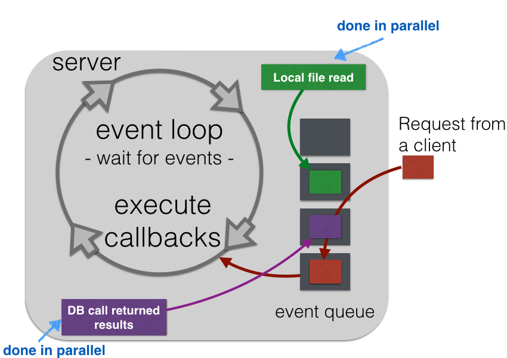
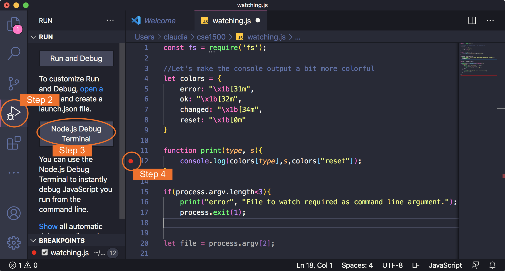
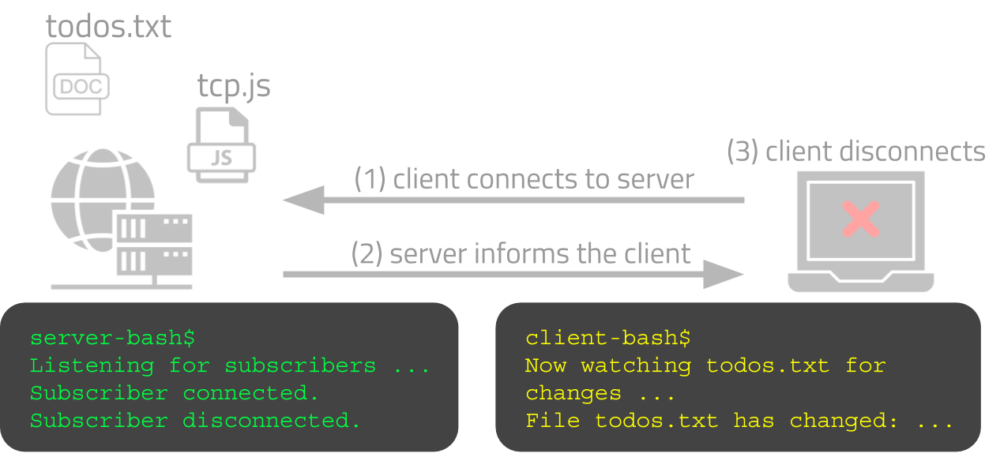
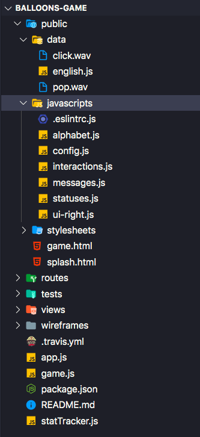
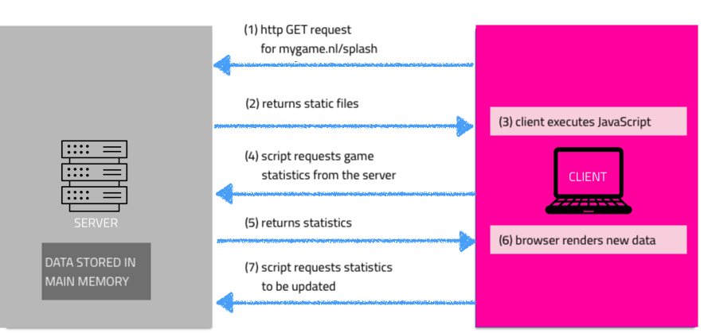
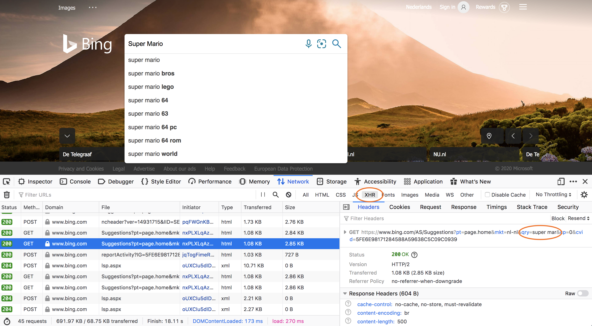
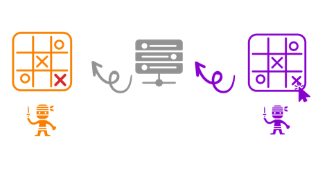

# Node.js: JavaScript on the server <!-- omit in toc -->



## Table of Contents <!-- omit in toc -->

- [Required & recommended readings and activities](#required--recommended-readings-and-activities)
- [:scroll: Learning goals](#scroll-learning-goals)
- [Introduction to Node.js](#introduction-to-nodejs)
  - [Node.js vs. client-side JavaScript](#nodejs-vs-client-side-javascript)
  - [Event-driven and non-blocking](#event-driven-and-non-blocking)
- [Low-level Node.js in examples](#low-level-nodejs-in-examples)
  - [:bangbang: Watching a file for changes :eyes:](#bangbang-watching-a-file-for-changes-eyes)
  - [:bangbang: Low-level networking with Node.js](#bangbang-low-level-networking-with-nodejs)
  - [:bangbang: Creating a Hello World! web server with Node.js](#bangbang-creating-a-hello-world-web-server-with-nodejs)
- [Express](#express)
  - [Setting up a project](#setting-up-a-project)
  - [:bangbang: Greetings Express](#bangbang-greetings-express)
  - [:bangbang: A complete web application](#bangbang-a-complete-web-application)
- [Adding interactivity between client and server via Ajax](#adding-interactivity-between-client-and-server-via-ajax)
  - [JSON: exchanging data between the client and server](#json-exchanging-data-between-the-client-and-server)
  - [Ajax](#ajax)
  - [WebSockets](#websockets)
    - [:bangbang: A first WebSocket example](#bangbang-a-first-websocket-example)
    - [WebSockets for multi-player games](#websockets-for-multi-player-games)
- [To conclude ....](#to-conclude-)
- [Self-check](#self-check)

## Required & recommended readings and activities

- Required readings:
  - None.
- Recommended activities:
  - [Microsoft's beginner-friendly tutorial on building JavaScript applications with Node.js](https://docs.microsoft.com/en-us/learn/paths/build-javascript-applications-nodejs/)
- Recommended readings:
  - Chapters 1, 2, 3 and 6 of the [Web Development with Node & Express book](https://www.oreilly.com/library/view/web-development-with/9781492053507/).
  - The [MDN documentation on Asynchronous JavaScript](https://developer.mozilla.org/en-US/docs/Learn/JavaScript/Asynchronous) is an excellent source to learn about the topic in more detail.
  - [The world runs on Node.js (Twitter thread)](https://twitter.com/bitandbang/status/1037306199522328577).
  - If you are interested in learning how best to get involved in the Node community, [read this blog post](https://dev.to/azure/start-contributing-to-nodejs-in-the-new-year-3dlh) on how to go about it.
- Relevant scientific publications:
  - Chaniotis, Ioannis K., Kyriakos-Ioannis D. Kyriakou, and Nikolaos D. Tselikas. [Is Node.js a viable option for building modern web applications? A performance evaluation study](https://link.springer.com/article/10.1007/s00607-014-0394-9). Computing 97.10 (2015): 1023-1044.
  - Sun, Haiyang, et al. [Efficient dynamic analysis for Node.js](https://doi.org/10.1145/3178372.3179527). Proceedings of the 27th International Conference on Compiler Construction. 2018.
  - Nielsen, Benjamin Barslev, Behnaz Hassanshahi, and François Gauthier. [Nodest: feedback-driven static analysis of Node.js applications](https://doi.org/10.1145/3338906.3338933). Proceedings of the 2019 27th ACM Joint Meeting on European Software Engineering Conference and Symposium on the Foundations of Software Engineering. 2019.

## :scroll: Learning goals

- Explain the main ideas behind Node.js.
- Implement basic network functionality with Node.js.
- Explain the difference between Node.js, npm & Express.
- Create a fully working web application that has client- and server-side interactivity.
- Implement client/server bidirectional communication through WebSockets.

## Introduction to Node.js

Node.js in [its own words](https://web.archive.org/web/20180306073316/https://nodejs.org/en/):

```
"Node.js is a JavaScript runtime built on Chrome's V8 JavaScript engine. 
Node.js uses an event-driven, non-blocking I/O model that makes it 
lightweight and efficient. Node.js' package ecosystem, npm, is the largest 
ecosystem of open source libraries in the world."
```

The most important keywords in this description are **efficient**, **event-driven** and **non-blocking**. While we are not concerned with scalability/efficiency in this course, we will return to the other two keywords shortly.

Node.js is by now a well-established platform; important milestones between 2008 and 2018 are:

- 2008: Google's JavaScript execution engine (**V8**) is open-sourced (if you are interested what happened in the 10 years since then, [check out this blog post from the V8 team](https://v8project.blogspot.com/2018/09/10-years.html)).
- 2009: Node.js is released. It builds on V8.
- 2011: Node.js' package manager (npm) is released.
- December 2014: Node.js developers are unhappy with the stewardship of the project and fork io.js.
- May 2015: io.js merges back with Node.js. The Node.js Foundation is set up. It later merged into the OpenJS Foundation.
- 2017: Node becomes a **first-class citizen of V8**. This means that no V8 code change is allowed to break Node.
- August 2018: [Node.js has been downloaded more than one billion times.](https://medium.com/@nodejs/more-than-a-billion-downloads-of-node-js-952a8a98eb42)
- May 2018: [Deno](https://github.com/denoland/deno) was first introduced by the creator of Node.js (Ryan Dahl) as an improved alternative to Node.js. Though it has gained traction, Node.js remains the leading JavaScript-based server-side runtime.

Node.js is widely used today, in [Stack Overflow's 2020 developer survey](https://insights.stackoverflow.com/survey/2020#technology-other-frameworks-libraries-and-tools) Node.js was the most popular framework in the _Other Frameworks, Libraries, and Tools_ section&mdash;in the same survey, Visual Studio Code came out as most popular IDE. If you want to know more about how the V8 engine and Node.js fit together, watch [this 2017 talk by Franziska Hinkelmann](https://www.youtube.com/watch?v=PsDqH_RKvyc), a prominent Googler who worked on the V8 engine.

### Node.js vs. client-side JavaScript

[Mariko Kosaka](https://twitter.com/kosamari) shared this tweet to compare client-side JavaScript and Node.js, which captures the essence of Node.js very well:

<blockquote class="twitter-tweet"><p lang="en" dir="ltr">What IS Node.js 🤔❓❓<br><br>(Proposal to stop calling server side JavaScript✨) <a href="https://t.co/IhPt8UHnPN">pic.twitter.com/IhPt8UHnPN</a></p>&mdash; Mariko Kosaka (@kosamari) <a href="https://twitter.com/kosamari/status/837650274672082944?ref_src=twsrc%5Etfw">March 3, 2017</a></blockquote> <script async src="https://platform.twitter.com/widgets.js" charset="utf-8"></script>

:point_up: Shown on the left is Google Chrome and its JavaScript runtime engine V8 (other browsers may make use of other JavaScript runtime engines). V8 is also the core of Node.js. The main difference between the browser and Node.js are the **available APIs**. As an example, while JavaScript code deployed in the browser cannot access the local file system for security reasons, Node.js can. It is also important to realize that Node.js runs on many different types of hardware.

### Event-driven and non-blocking

One of the core concepts of Node is the **event loop**. Node.js is a single-threaded application that executes **callbacks** in response to an occurring event. Developers write those callbacks&mdash;this should be a familiar concept by now; you have also seen it in the previous lecture where we discussed writing functions that are executed in response to events captured by the browser. In Node.js, the event loop waits for events to enter the **event queue** and once they have, the events are processed in their order of arrival, i.e. their respective callbacks are executed.

Take a look at this event loop example:



:point_up: Here, despite the **single-threaded nature** of Node.js, several things are seemingly going on in parallel: a file is read from disk, a database is queried while at the same time an HTTP request from a client comes in. The reason for this is the **asynchronous** nature of file reads, network requests and so on (basically: I/O requests). While the event loop is executed in a single thread, Node maintains a *pool of threads* in order to process I/O requests in parallel. So, it is more correct to say that **Node's event loop is single-threaded**. 

To make this concept more concrete, let's look at how local files are read in Node. Here is an example taken from the [Node documentation](https://nodejs.org/api/fs.html#fs_fs_readfile_path_options_callback):

```javascript
const fs = require("fs");

//we assume there is a file course-info.txt in the current directory
fs.readFile("./course-info.md", "utf8", function (err, data) {
  if (err) throw err;
  //write file content out to console
  console.log(data);
});
```

<sup>In the documentation it does not actually say `function(err, data)` but `(err, data) =>` instead; this is just a syntactic shortcut called an [arrow function](https://developer.mozilla.org/en-US/docs/Web/JavaScript/Reference/Functions/Arrow_functions) introduced in ES6.</sup>

:point_up: The method `readFile` takes three parameters: the path of the file to read, the file encoding type, and a **callback function**: the function to execute when the file reading operation has completed. The callback function has two parameters: an error object and a data object. If the file reading operation failed for some reason, we throw the error, otherwise we print out the data to the console. Once the Node runtime encounters this code snippet, it will execute `fs.readFile(....)` and return immediately to execute the next line of code (this is called **non-blocking**). What happens to the file read operation? The Node runtime has access to a pool of I/O threads and once a thread has completed the file reading operation, an event is entered into the event loop to then execute the callback (in our case printing out the contents to the console).

Having described what happens in our little script, let's look at the actual terminal session: 

<asciinema-player src="../cast/node-file-reading.cast"  cols="80" rows="18"></asciinema-player>

<sup>In this terminal session, we first list the files in the current directory with `ls`, then show the file content of both files with `more` and finally start the execution of the script with the command `node app.js`. Before the second execution, we delete the file to read with the `rm` command.</sup>

The Node runtime can also read file contents from disk in a **blocking** manner. Note how this time we do not use the callback principle :point_down::

```javascript
const fs = require("fs");

try {
  //we assume there is a file course-info.txt in the current directory
  const data = fs.readFileSync("./course-info.md", "utf8");
  console.log(data);
}
catch(err) {
  //an error is thrown if the file could not be read/found
  throw err;
}
```

:point_up: The Node runtime will wait until the file read is complete, return the file content in the `data` variable and then continue with the next line of code. If the file to read is large, this operation will take time and nothing else is executed in the meantime because the code is **blocking**. As can be seen here, errors can be caught with a try/catch block.

Here is one more comparison of the blocking vs. non-blocking nature of code execution. Imagine your application needs to make a database query:

| Blocking I/O                                               | Non-blocking                                                      |
| :--------------------------------------------------------- | :---------------------------------------------------------------- |
| 1. read request                                            | 1. read request                                                   |
| 2. process request and access the database                 | 2. process request and make a **callback** to access the database |
| 3. **wait** for the database to return data and process it | 3. **do other things**                                            |
| 4. process the next request                                | 4. when the callback returns process it                           |

I/O requests usually require a waiting time&mdash;waiting for a database to return results, waiting for a third-party web service or waiting for a connection request. By using callbacks, the Node runtime does not have to wait for slow I/O operations to complete. 

Node's focus on making so-called **I/O bound programs** (that is, programs constrained by data access where adding more CPU power will not lead to speedups) efficient comes at a price: programs that require heavy CPU usage and contain few I/O requests may be better served on other platforms.

As the typical web application is indeed I/O bound, Node.js has become a popular choice of server-side framework. Another positive side effect of Node is the _reuse_ of the language: instead of learning JavaScript for the client-side and PHP (or another language) for the server-side part of an application, we restrict ourselves to a single language and can even _share code_ between client and server efficiently.

<optional-info markdown="block">
Our explanation of the event loop is by necessity a simplified version of the real process, as one could spend a lecture alone on the inner workings of the event loop. If you are interested in this topic, [watch this excellent talk](http://latentflip.com/loupe/) by Philip Roberts.

If you want to check your understanding of the event loop (which is not just making an appearance in JavaScript but also Python among others), you may want to take a look [at this quiz by Julia Evans](https://questions.wizardzines.com/event-loops.html).
</optional-info>

## Low-level Node.js in examples

Let's now walk through a number of Node code examples that increase in complexity and lead us towards server-side scripting for web applications. Along the way, we introduce important Node runtime concepts. As always, we recommend that you try out all code examples yourself. We assume you have Node.js already installed on your machine.

### :bangbang: Watching a file for changes :eyes:

Here is our first task: write a script that watches a given file for changes and alerts us to any changes by printing out a message on the terminal. You should know how to do this in Java already.

Let's look at how we can solve this with Node.js. To be clear: this task has nothing to do with web applications, Node.js can be used for all kinds of purposes, not just web engineering. The Node script looks as follows :point_down::

```javascript
const fs = require("fs");

/*
 * Let's make the console output a bit more colorful.
 * These oddly looking strings are ANSI escape codes, they
 * allow us to signal a change of color to the terminal.
 * This is not Node-specific.
 */
let colors = {
  error: "\x1b[31m",
  ok: "\x1b[32m",
  changed: "\x1b[34m",
  reset: "\x1b[0m",
};

//beautifying the console output
function print(type, s) {
  console.log(colors[type], s, colors["reset"]);
}

if (process.argv.length < 3) {
  print("error", "File to watch required as command line argument.");
  process.exit(1);
}

let file = process.argv[2];

fs.access(file, fs.constants.F_OK, function (err) {
  if (!err) {
    print("ok", "Now watching " + file);
    fs.watch(file, function () {
      print("changed", "File changed");
    });
  } else {
    print("error", "File to watch does not exist!");
    process.exit(1);
  }
});
```

:point_up: That's all. Store this code in a file of your choosing, e.g. `watching.js`, open the terminal and then start the script execution with `node watching.js /path/to/file/to/watch`. The command line argument here is the path to the file to watch. If it is a file in the same directory as your script, you simply add the filename. Now change the file and see what happens. Depending on the operating system, when you make a change to the watched file (e.g. add a line of text) this may or may not require saving the file before your Node script reports a file change. If a command line argument is missing or the file does not exist, the script ends. Trying this script yourself should lead to something like this :point_down::

<asciinema-player src="../cast/node-file-watching.cast"  cols="80" rows="18"></asciinema-player>

<sup>Side note: If you are looking for a well-styled terminal, take a look at the [bash-it framework](https://github.com/Bash-it/bash-it).</sup>

Although the piece of code :point_up: is small, it has a few interesting components:

- Line 1 provides us with access to the filesystem object. The corresponding **Node module** is `fs`. A module is a **self-contained** piece of code that provides **reusable functionality**. The function `require()` usually returns a JavaScript object. In this case, `fs` is our entry point to the file system.
- You should have recognized that [`fs.watch`](https://nodejs.org/docs/latest/api/fs.html#fs_fs_watch_filename_options_listener) is used with two arguments: the path to the file to watch and a **callback** function that is executed when a file change has occurred. The callback function is anonymous (though nothing prevents us from giving the function a name) and executed asynchronously. [`fs.access`](https://nodejs.org/api/fs.html#fs_fs_access_path_mode_callback) (used to determine whether the file exists) takes three arguments in our example.
- As the filesystem access requires operating system specific code, the behavior can vary across file systems; the underlying operating system calls are outlined in the [`fs.watch`](https://nodejs.org/docs/latest/api/fs.html#fs_fs_watch_filename_options_listener) documentation.

<optional-info markdown="block">
The color styling of the console output above is **not** Node-specific. Providing these [ANSI escape codes](https://en.wikipedia.org/wiki/ANSI_escape_code) to the terminal let's us change the terminal look and feel. In our case, we only use escape codes to change the font color. This may not work in all terminals, and there are (of course) libraries that do this in a more platform-independent manner but for a quick prototype those escape codes are usually sufficient.
</optional-info>

A note on Node terminology: you will often find references to **Node modules** and **Node packages**. They differ slightly in meaning:

- A **module** is any file or directory that can be loaded by `require()`.
- A **package** is any file or directory that is described by a `package.json` file.

Although not very useful, our `watching.js` script above can be considered a module, but not a package, as so far we have not seen the need for a `package.json` file.

<debug-info markdown="block">
Finally, let's quickly walk through the steps to run this script from within VSC's debug environment. Execute the following steps:

1. Open VSC and head to _File » Open_ and select the file containing the script. If you see a dialog asking _Do you trust the authors of these files?_, click _Open_.
2. On the left-most panel, click on the little triangle with the bug on top of it (it should be the fourth icon from the top in a default VSC installation).
3. Then, click on _JavaScript Debug Terminal_; this will open VSC's terminal with the debugger attached to it.
4. You can set a _breakpoint_ within the script (the code halts at this point and you can inspect the variables, etc.) by clicking to the left of the line numbers.
5. In the terminal, start your program `node watching.js my-file`. That's it, you can now debug your code.


</debug-info>

### :bangbang: Low-level networking with Node.js

Node.js was originally designed for I/O bound programs, in particular programs requiring **networking** functionalities. For this reason, Node.js has built-in support for **low-level** socket connections (TCP sockets in particular). Sockets are defined by IP address and port number as discussed in the [lecture on HTTP](http).

TCP socket connections have **two endpoints**:

1. One endpoint **binds** to a numbered port.
2. The other endpoint **connects** to a port.

An analogous example of TCP socket connections are phone lines: One phone _binds_ to a phone number. Another phone tries to call that phone. If the call is answered, a connection is established.

Let's now move our file watching example into the networked world. The new task is to inform interested clients about changes to the watched file. Here is a visual depiction of the process:



This is our corresponding script :point_down::

```javascript
const fs = require("fs");
const net = require("net");

//Let's make the console output a bit more colorful
let colors = {
  error: "\x1b[31m",
  ok: "\x1b[32m",
  changed: "\x1b[34m",
  reset: "\x1b[0m",
};

function print(type, s) {
  console.log(colors[type], s, colors["reset"]);
}

if (process.argv.length < 4) {
  print("error", "Two command line arguments required: [file to watch] [port]");
  process.exit(1);
}

let file = process.argv[2];
let port = process.argv[3];

let server = net.createServer(function (connection) {
  //what to do on connect
  print("ok", "Subscriber connected!");

  connection.write(
    colors["ok"] + "Now watching " + file + " for changes.\n" + colors["reset"]
  );

  var watcher = fs.watch(file, function () {
    connection.write(
      colors["changed"] +
        "File " +
        file +
        " has changed: " +
        Date.now() +
        ".\n" +
        colors["reset"]
    );
  });

  //what to do on disconnect
  connection.on("close", function () {
    print("ok", "Subscriber disconnected!");
    watcher.close();
  });
});

server.listen(port, function () {
  print("ok", "Listening to subscribers ...");
});
```

To start this script (let's assume it is saved as `tcp.js`), we now require two command line arguments: the file to watch and the port number we want the `server` object to listen to: `node tcp.js todos.txt 3000`.

Any port number between 1024 and 65536 is a good one (ports 1 to 1023 are _system ports_ you should avoid them), as long as no other program has already bound to it. If you try to use the same port as another program, Node will throw an `EADDRINUSE` error (which means _Error: address is in use_). A typical port number you find in code examples is `3000`, though once more, the concrete port number chosen does not matter.

Ok, we just started the server (you should see `Listening to subscribers ...` as the only output on the terminal so far). It is now waiting for clients/subscribers on port `3000`. The next question is how to start up clients. For this exercise, we will use telnet. Open **another** terminal (keep the server running in the terminal you originally opened server) and type: `telnet localhost 3000`. Take a look at the server terminal, it should now also show `Subscriber connected!`.

Note that `localhost` is the hostname, you can also replace it by IP address `127.0.0.1`, which is typically assigned to `localhost`. It basically means *this computer*, as we start our server in the same machine as our client.

When you make changes to the watched file, you will find that those are now reported to our telnet client. You can end the telnet session by first pressing <kbd>Ctrl</kbd>+<kbd>]</kbd> (which brings you to the telnet prompt) and then type `quit` followed by <kbd>Enter</kbd>.

Let's take a closer look at the source code :point_up::

- We here make use of the [`net` module](https://nodejs.org/api/net.html) which provides an asynchronous network API. It is one of the core modules and comes prepackaged in Node&mdash;we will later see how to install non-core modules.
- The method `net.createServer` returns a server object and takes as argument a callback function, which is invoked when another endpoint connects.
- With `server.listen(port)` we **bind** our server to a specific port.
- The callback function contains both client-side and server-side output. All client-side output is "written" to the connection object (which takes care of all the low-level details of actually sending the data), while as we already know the server-side messages are written out to our `console` object.

### :bangbang: Creating a Hello World! web server with Node.js

By now you will have realized, **Node.js is not a web server**. Node.js provides the **functionality** to implement one!

Let's do that. We start off with another minimal task: whenever our server receives an HTTP request, it should reply with a _Hello World!_ string in the HTTP response. Here is the script that does exactly that:

```javascript
const http = require("http");

let port = process.argv[2];

let server = http.createServer(function (req, res) {
  res.writeHead(200, { "Content-Type": "text/plain" });
  res.end("Hello World!");
  console.log("HTTP response sent");
});

server.listen(port, function () {
  console.log("Listening on port " + port);
});
```

:point_up: Let's assume that script is stored in `web.js`. This means we can start the script by typing `node web.js 3000` into the terminal. Now that we are moving up in the network stack and work with HTTP, we can use the browser as our client. Open your browser and use the following URLs in the browser's address bar: `localhost:3000`, or `localhost:3000/hello` or any other path. The port number in the URL should match the port your server binds to. Each time, you should see a *Hello World!* displayed in the browser window.

A few remarks on the code piece above :point_up::

- We here utilize Node's core [HTTP module](https://nodejs.org/api/http.html) which provides us with all necessary functionalities related to HTTP.
- We create a **web server** with the call `http.createServer`.
- The **callback** function we define has two parameters: an **HTTP request object** and an **HTTP response object**. The callback is executed when an HTTP request comes in.
- Within the callback function we create an HTTP response (making use of the response object, which provides us with the necessary methods such as `writeHead` to write HTTP header information in JSON format) and sending it with the call to `res.end`.
- You may have noticed that every time you refresh the URL, our script prints out twice `HTTP response sent` (this will not happen in all browsers, but for instance in Firefox and Chrome). What is going on? Open the network tab of the web console and then reload the URL once more&mdash; you will see that the browser does make two HTTP requests: one for the resource located at `/` (if we use `localhost:3000` as our URL) and one for the `favicon.ico` resource. The latter is requested by the browser by default: it is an [icon](https://developer.mozilla.org/en-US/docs/Glossary/Favicon) that browsers can display for this particular URL in the address bar.

To make the code more modular, we can apply some refactoring, which shows off the function-as-parameter paradigm once more :point_down::

```javascript
const http = require("http");

let port = process.argv[2];

function simpleHTTPResponder(req, res) {
  res.writeHead(200, { "Content-Type": "text/plain" });
  res.end("Hello World!");
  console.log("HTTP response sent");
}

let server = http.createServer(simpleHTTPResponder);

server.listen(port, function () {
  console.log("Listening on port " + port);
});
```

To make this example more interesting, let's return different responses depending on the URL path. The task is now to return a greeting for the `/greetme` path and a `404 Not Found` error otherwise. If the URL query (i.e. the part of the URL that assigns values to parameters) contains a parameter named `name`, we greet by name, and otherwise use `Anonymous`. Our script now looks as follows :point_down::

```javascript
const http = require("http");
const url = require("url");

let port = process.argv[2];

function simpleHTTPResponder(req, res) {
  //parse the URL
  var uParts = url.parse(req.url, true);

  //implemented path
  if (uParts.pathname == "/greetme") {
    res.writeHead(200, { "Content-Type": "text/plain" });

    //parse the query
    var query = uParts.query;
    var name = "Anonymous";

    if (query["name"] != undefined) {
      name = query["name"];
    }

    res.end(" Greetings " + name);
  }
  //all other paths
  else {
    res.writeHead(404, { "Content-Type": "text/plain" });
    res.end("Only /greetme is implemented.");
  }
}

let server = http.createServer(simpleHTTPResponder);

server.listen(port, function () {
  console.log("Listening on port " + port);
});
```

:point_up: The code showcases how to make use of another core Node module, the [url module](https://nodejs.org/docs/latest/api/url.html); it provides support for URL resolution and parsing. Start the server (by now you know how) and try different URLs in the browser (adapt the port number if necessary):

- `localhost:3000`
- `localhost:3000/greetme`
- `localhost:3000/greetme?name=Claudia`
- `localhost:3000/hello`
- `localhost:3001` (try out what happens if you change the port!)

By this time you may ask yourself how tedious server-side programming really is, considering that we have just implemented a separate logic for each URL route. Clearly, there must be more to Node.js then the few modules we introduced so far. And indeed there is. Note though that this exercise in low-level Node.js capabilities were not in vain, there are many network programming use cases that do not require a web server.

When we do implement a web server, in the Node.js community that most often means making use of the [Express](https://expressjs.com/) framework.

## Express

[Express](https://expressjs.com/) "_is a minimal and flexible Node.js web application framework that provides a robust set of features for web and mobile applications. Express provides a thin layer of fundamental web application features, without obscuring Node.js features ..._"

Node.js has a small core code base; it comes with a number of core modules included such as `http` and `url`. Express is not one of the core modules (though it is certainly among the most popular non-core modules with more than [17 million downloads per week](https://www.npmjs.com/package/express)) (as of November 2021) and needs to be installed separately. In the Node ecosystem, the Node package manager ([npm](https://www.npmjs.com/)) provides us with an efficient manner to install additional packages.

### Setting up a project

How do we go about setting up our own project and installing  modules? We follow two steps:

1. **Project initialization**. To create a project, we first create a folder, e.g. `node-express-ex` and then `cd` into the folder (which is still empty). Now execute the following command: `npm init -y`. There should now be a `package.json` file in the folder which contains basic information about the project, all filled with defaults. If you do not want the defaults, run `npm init` instead, the `-y` option ensures that you are not asked any questions. 
2. **Installation of dependences**. We are ready to install the packages we need for our project. To install the Express package, execute the command `npm install express --save`. If the installation was successful, we should now have a folder `node_modules`. As Express itself is dependent on many other packages, you will find more than just Express in there. The `--save` option ensures that the `package.json` file is altered: in it we now find the `dependencies` entry. It means, that the project is now dependent on Express. Without the `--save` option, the installation of Express would have occurred as well, however, the `package.json` file would remain unaltered and it would not have been saved as dependency. When `package.json` is properly maintained, the application can be installed by anyone with `npm install`. There is one more file in your folder, `package-lock.json`, that we are skipping over. If you look into it, you will find it much more detailed than `package.json`, it provides step by step instructions of how the `node_modules` tree was generated. More information [can be found here](https://docs.npmjs.com/configuring-npm/package-lock-json.html) but for the purposes of this course you can ignore it.

The execution of both steps is shown here in the terminal:
<asciinema-player src="../cast/node-install-express.cast"  cols="80" rows="18"></asciinema-player>

Finally, we note that on [npmjs](https://www.npmjs.com/) you can find and search for nearly 2 million packages that have been created by the Node.js community.

### :bangbang: Greetings Express

Let's look at how to implement our greetings example with Express :point_down::

```javascript
const express = require("express");
const url = require("url");
const http = require("http");

let port = process.argv[2];
const app = express();
http.createServer(app).listen(port);

let htmlPrefix = "<!DOCTYPE html><html><head></head><body><h1>";
let htmlSuffix = "</h1></body></html>";

app.get("/greetme", function (req, res) {
  var query = url.parse(req.url, true).query;

  var name = query["name"] != undefined ? query["name"] : "Anonymous";

  res.send(htmlPrefix + "Greetings " + name + htmlSuffix);
});

app.get("/goodbye", function (req, res) {
  res.send(htmlPrefix + "Goodbye to you too!" + htmlSuffix);
});

app.get("/*", function (req, res) {
  res.send("Not a valid route ...");
});
```

Save the file (e.g. as `app.js`) inside the project folder (i.e. `node-express-ex` if you followed the previous instructions) and start the server: `node app.js 3000`. Open the browser and try a few URLs for yourself.

A few remarks :point_up::

- The call `express()` returns an object (usually named `app` for application) which is our way of making use of Express' functionalities.
- We define three so-called **URL routes**: `/greetme`, `/goodbye` and `/*`, with the latter representing all possible routes. When an HTTP request comes in, the Express framework determines which route to execute&mdash;the routes are evaluated **in order of appearance** and the way we set up the code, it is only possible for a single route to be activated per request. Since `/greetme` appears before `/*` in our list of routes, we see the intended greeting. If we would move the `/*` route to be the first in the file, the only response we would ever see, no matter the URL path, would be _Not a valid route ..._.
- Lastly, it is no longer necessary to create HTTP headers. Express manages this tedious task for us, all we have to do is call the `send()` method of the HTTP response object.

This code though is still not maintainable, writing HTML code within a Node.js script is poor form and error-prone. For **static files**, i.e. files that are _not_ created or changed on the fly, e.g. CSS, client-side JavaScript, HTML, images and audio files, Express offers us a simple solution. A single line of code is sufficient inside our Node.js script to serve static files: `app.use(express.static(__dirname + "/static"));`. For this code snippet to work, all static files need to be contained in the directory `static` (you can of course decide to name that directory differently); [`__dirname`](https://nodejs.org/docs/latest/api/globals.html) is a globally available string in Node that contains the directory name of the current module. In response to an HTTP request, Express first checks the static files for a given route&mdash;if a static file is found, this is served, otherwise the **dynamic routes** are checked until a matching route is found.

### :bangbang: A complete web application

Having all the pieces in place (knowledge of HTML, client-side JavaScript, Node.js scripting), we can now write a complete web application. A good development strategy is the following:

1. Develop the client-side code (HTML, JavaScript and CSS&mdash;the latter we will cover in one of the next lectures).
2. Place all client-side files into a directory (e.g. `/static` or `/public`) **on the server**.
3. Write the **server-side code** using Express.
4. Set Express' static file path to the directory created in step ii.
5. Add interactivity between client and server.

Small web applications (such as your own board game project) are often structured as shown here on the example of our [demo game](https://github.com/chauff/balloons-game) :point_down::



<sup>The client-side code of the web application resides within the `/public` folder. Within it, three subfolders exist: one for any data for the client, one for all JavaScript files and one for the stylesheets. Here, as we have only two HTML files (the splash screen and the game screen) we opted to not create a separate subfolder for them. All other `.js` files (i.e. anything not in `/public`) refer to server-side code.</sup>

In the [JS+Node assignment](assignmentII) you will learn how to create such a folder structure **automatically**, according to accepted best practices.

## Adding interactivity between client and server via Ajax

Among the five steps of web application development, step v, the interactivity between client and server is the most time-consuming part, as it can be based on different technologies, depending on the application's needs.

The client-server interaction can be implemented with [**Ajax**](https://developer.mozilla.org/en-US/docs/Web/Guide/AJAX)&mdash; this is a sensible choice for many application settings. We will introduce it shortly. In the board game project we ask you to implement the three web technology assignments, the client-server interaction is largely based on **WebSockets**&mdash;which is a good choice due to the bidirectional communication needs of our app.

Ajax _is_ useful for the splash screen of our board game project, in particular when it comes to updating the game statistics (e.g. games played, games aborted, games ongoing). The application flow showcases a possible client-server interaction to do just that :point_down::



:point_up: The game statistics are stored in the server's main memory; in any large-scale application they would be stored in a database that the server makes read/write requests to. Important to realize is that initially (step 2) the server only returns static files that do not contain the actual game statistics; in step 3 the client executes a few lines of JavaScript (Ajax!) to request the statistics from the server (step 4); the server sends in step 5 the requested data.

When designing your own application, it is important to have a good understanding of the request/response flow in different stages of the application.

Before describing Ajax in more detail, we make a short detour into data exchange formats: how does the data typically look like that is exchanged between client and server?

### JSON: exchanging data between the client and server

JSON stands for _JavaScript Object Notation_ and is a format that transmits data in human-readable text. It consists of attribute value pairs and array data types.

Here is an example of a Twitter message in JSON format (taken from [Twitter's documentation](https://developer.twitter.com/en/docs/tweets/data-dictionary/overview/intro-to-tweet-json.html)):

```javascript
{
  "created_at": "Thu Apr 06 15:24:15 +0000 2017",
  "id_str": "850006245121695744",
  "text": "1\/ Today we\u2019re sharing our vision for the future of the Twitter API platform!\nhttps:\/\/t.co\/XweGngmxlP",
  "user": {
    "id": 2244994945,
    "name": "Twitter Dev",
    "screen_name": "TwitterDev",
    "location": "Internet",
    "url": "https:\/\/dev.twitter.com\/",
    "description": "Your official source for Twitter Platform news, updates & events. Need technical help? Visit https:\/\/twittercommunity.com\/ \u2328\ufe0f #TapIntoTwitter"
  },
  "place": {
  },
  "entities": {
    "hashtags": [
    ],
    "urls": [
      {
        "url": "https:\/\/t.co\/XweGngmxlP",
        "unwound": {
          "url": "https:\/\/cards.twitter.com\/cards\/18ce53wgo4h\/3xo1c",
          "title": "Building the Future of the Twitter API Platform"
        }
      }
    ],
    "user_mentions": [
    ]
  }
}
```

Years ago, XML was used as data exchange format on the web. XML is well defined but not easy to handle. To get an idea of XML, take a look at [this Twitter output in XMl format](https://gist.github.com/jonm/3080489).

XML is often too bulky in practice; JSON has a much smaller footprint than XML. Importantly, JSON can be parsed with built-in JavaScript functionality ([`JSON.parse`](https://developer.mozilla.org/en-US/docs/Web/JavaScript/Reference/Global_Objects/JSON/parse)), which turns a JSON string into an object. JavaScript objects can be turned into JSON with the [`JSON.stringify`](https://developer.mozilla.org/en-US/docs/Web/JavaScript/Reference/Global_Objects/JSON/stringify) method:

```javascript
var gameStats = {
  gamesPlayed: 0,
  gamesAbolished: 0,
  gamesOngoing: 0,
  incrGamesPlayed: function () {
    this.gamesPlayed++;
  },
};
gameStats.incrGamesPlayed();

var jsonString = JSON.stringify(gameStats);
//"{\"gamesPlayed\":1,\"gamesAbolished\":0,\"gamesOngoing\":0}"

var jsonObject = JSON.parse(jsonString);
//jsonObject is equivalent to gameStats minus the properties that are functions
```

Two major differences between JSON and JavaScript objects are:

- In JSON, all property names must be enclosed in quotes.
- Objects created from JSON **do not have functions** as properties. If an object contains functions as properties, a call to `JSON.stringify` will strip them out.

With JSON being a de facto data exchange standard, Express has a dedicated response object method to send a JSON response: [`res.json(param)`](http://expressjs.com/en/api.html#res.json). The method's parameter is converted to a JSON string using `JSON.stringify()`. You will see a working example of this method in the next section.

With the data exchange format out of the way, we can now turn to Ajax.

### Ajax

Ajax stands for **Asynchronous JavaScript and XML**. XML is in the name, and in the name only. XML is not commonly used as Ajax data exchange format anymore (JSON is!).

**Asynchronous Javascript:** In synchronous programming, things happen one at a time. When a function needs information from another function, it has to wait for it to finish and this delays the whole program. This is a bad use of your computer's resources, there's no point waiting for a process to finish especially in an era where computer processors are equipped with multiple cores. This is where asynchronous programming steps up. A function that takes too long to finish is separated from the main application and when it is done, it notifies the main program if it was successful or not.

Ajax is a **JavaScript mechanism** that enables the dynamic loading of content **without having to refetch/reload the page manually**. Ajax is a technology that **injects** new data into an existing web document. Ajax is not a language. Ajax is also not a product. Let's take the Bing search engine as an example: once you start typing a query, with each letter typed a new set of query suggestions will become available :point_down:. If we keep the browser's web dev tools open (in particular the [Network Monitor](https://developer.mozilla.org/en-US/docs/Tools/Network_Monitor)), we observe that each keystroke will lead to a new request/response message pair (and the request contains the currently typed query as visible on the Headers pane):


<sup>Screenshot taken September 4, 2020. Firefox. After each keystroke, an Ajax request is made to receive updated query suggestions from the server.</sup>

:point_up: We can select the type of content or type of request (_All_, _HTML_, _CSS_ and so on) at the top of the Network pane. This allow us to filter for specific HTTP requests. Selecting `XHR` shows only requests made via Ajax. `XHR` is short for `XMLHttpRequest`, which is an object offered by all major browsers that is at the heart of Ajax and allows us to:

- make requests to the server without a full page reload;
- receive data from the server.

The [`axios`](https://github.com/axios/axios) library hides low-level `XMLHttpRequest` details and is one of the more popular choices for making Ajax calls. We will use it here. A working toy example can be found [here](https://github.com/chauff/demo-code/tree/master/node-ajax-ex): in this example, the client-side code consists of a rather empty HTML page and a piece of JavaScript that retrieves information from the server about which PlayStation VR Games are available. In our example code, you will note that the server-side code does not do anything special because Ajax is involved; **to the server, the requests look like any other HTTP request**. This leaves us to look at the client-side. Here, we first consider `index.html`:

```html
<!doctype html>

<head>
  <title>Available PlayStation VR Games</title>
</head>

<body>
  <main>
    <section class="available">
      <p>Available PlayStation VR Games</p>
      <ul class="available">
      </ul>
    </section>
  </main>
  <script src="https://unpkg.com/axios/dist/axios.min.js" type="text/javascript"></script>
  <script src="js/client-app.js"></script>
</body>

</html>
```

:point_up: On the client-side, we load the axios library and then our application-specific JavaScript code. The domain `https://unpkg.com/` is a large content delivery network. We could have also opted to store the current axios version locally, but then we would be responsible for keeping up with maintaining it. Note here, that the games list is **empty**. We have an empty unordered list element (`<ul>`) that will be filled with the available PlayStation VR games (which those are, we learn from the server) via an Ajax call. Let's find out how to make Ajax requests with the help of axios by looking at `js/client-app.js` :point_down::

```javascript
"use strict";

function addGamesToList(games) {
  console.log("Loading games from server.");

  let gamesList = document.querySelector("ul");
  for (let key in games) {
    let game = games[key];
    let li = document.createElement("li");
    li.innerHTML = game.title + " (" + game.price + ")";
    gamesList.appendChild(li);
  }
}

/*
 * retrieve the games from the server once;
 * use setInterval to do this regularly
 */
axios
  .get("/psvrGames")
  .then(function (res) {
    //success
    console.log(res.status);
    console.log(res.data);
    addGamesToList(res.data);
  })
  .catch(function (err) {
    //error
    console.log(err);
  });
```

:point_up: Let's start at the bottom of this code snippet. In order to retrieve the list of games from the server, we use `axios.get(url).then(function(res)).catch(function(err))`. This is axios' shorthand for making an HTTP GET request to `url`. If the request is successful the function specified within `then()` is executed, and if not, the function within `catch()` is executed. When the request is successful, `res.data` will contain the data retrieved from the server. What do we do with that data then? To answer this question, we need to take a look at our function `addGamesToList`: we first locate in the DOM tree the unordered list placeholder (and since we know there is only one, we can use `"ul"` as the input to `document.querySelector()`); for every game we received, we create a list element (`<li>`) with the corresponding text and append it to our `<ul>` element.

<optional-info markdown="block">
In the `axios` code snippet above, we see a rather recent feature of the JavaScript language: **promises**. For our course, it is sufficient to understand the use of `.then().catch()` without digging deeper. For those that want to dig deeper, promises are a way out of the callback hell (as you can already glimpse in our `axios` code example), and simplify asynchronous programming considerably. In large (production-level) projects promises are the way forward. The [You Don't Know JS book series](https://github.com/getify/You-Dont-Know-JS/blob/1st-ed/async%20&%20performance/README.md#you-dont-know-js-async--performance) covers [promises in depth](https://github.com/getify/You-Dont-Know-JS/blob/1st-ed/async%20%26%20performance/ch3.md).
</optional-info>

Without the use of axios, the `XMLHttpRequest` object leads to more clunky looking code, as this [MDN example](https://developer.mozilla.org/en-US/docs/Web/Guide/AJAX/Getting_Started) shows.

Importantly, with Ajax, the number of complete page reloads is vastly reduced. **Only the newly available** (e.g. a new set of query suggestions based on the current query) or **changed data** needs to be retrieved from the server, instead of the complete document. Ajax was and remains an important technology to move from web pages to web applications&mdash;imagine every time you type a character into your favorite search engine you would have to wait for the page to reload in order to get the latest query suggestions. We would quickly abolish query suggestions.

<debug-info markdown="block">
In practice, implementing Ajax calls correctly can be tricky, due to Ajax's security model. In our game list code example, we have conveniently requested data from _our_ web server. In fact, a security restriction of Ajax (at least by default) is that it can only fetch files or request routes from the same web server as the calling page&mdash;this is called **same-origin policy**.

The same-origin policy is fulfilled when the **protocol, port and host** are the same for two pages. Important for debugging: Ajax **cannot** be executed from a web page opened locally from disk (e.g. if you head to your browser and open `file:///path/to/my/files/client/index.html`). There are (as always) ways around this policy, but this it outside the scope of this class.
</debug-info>

### WebSockets

While Ajax is a mainstay of today's web, it has issues:

- Under HTTP/1.1 the server cannot **push** data to the client, it can only respond to HTTP requests, thus requiring a form of **polling** to simulate the desired push-based behavior&mdash;for example, a user's Twitter timeline is updated by making requests to Twitter's servers every few seconds. This is resource-intensive on both the client and the server-side.
- Every time data is requested and sent, an entire HTTP message is required&mdash;this has a considerable amount of overhead if the data to send is only a few bytes (as an example, in a chess game, we may just send a single move such as `b2b4` at a time&mdash;that's four characters in total).
- The client-side script has to track the mapping from outgoing connections to the incoming connection in cases where a client makes requests to multiple servers.

The WebSocket protocol (defined in [RFC 6455](https://tools.ietf.org/html/rfc6455)) was designed to overcome those issues, as stated in its RFC abstract:

```
The WebSocket Protocol enables two-way communication between a client
[...] to a remote host [...]. The protocol consists of an opening 
handshake followed by basic message framing, layered over TCP.
The goal of this technology is to provide a mechanism for browser-based
applications that need two-way communication with servers that does not 
rely on opening multiple HTTP connections (e.g., using XMLHttpRequest 
or iframes and long polling).
```

In other words, the WebSocket protocol enables **bidirectional** communication between client and server over (initially) HTTP. The WebSocket protocol itself is a TCP-based protocol, the handshake is interpreted by HTTP servers as an upgrade request. Once a connection between a client and server is established (this requires a _handshake_ as the client requests an upgrade to the connection and the server responds to that upgrade before data transfer is possible), data (called _messages_ in this protocol) can be send back and forth. Both the client and the server can now send messages and we thus no longer need to _simulate_ a single connection, we actually _have_ a single connection that can be reused again and again. This is especially useful for web applications that require constant bidirectional communication such as instant messaging (a client sends its own messages to the server, the server pushes messages of the client's chat partners) or gaming applications (a client/player sends its own move to the server, the server pushes the other players' moves to the client).

Important to note, the WebSocket protocol is **not** a protocol that allows peer-to-peer connections between two browsers (i.e. a connection between two browsers without a server in the middle), **the communication is always established between a browser and a server/host**. And thus, in our gaming project each move made by player A is send to the server which in turn sends it to the player B.

In order to close an established WebSocket connection, a _closing handshake_ is required: both the client and the server can initiate the closing of the connection (unlike the initiation of the connection which is **always started by the client**). Once a connection is closed, no more data can be sent over it. Also important to know is that WebSocket servers can share a port with HTTP servers due to the HTTP upgrade request ability. The WebSocket protocol was created to be relatively simple and to co-exist with HTTP and the already established HTTP infrastructure.

#### :bangbang: A first WebSocket example

We use the popular [Node.js WebSocket library](https://www.npmjs.com/package/ws), which hides some of the low-level details (similar to `axios` hiding some of Ajax's low-level details).

Let's start with a `Hello World!` example for WebSockets: our client initiates a WebSocket connection with the server and sends a first message, the server uses the established connection to send a reply and then closes the connection. The example code can be found [here](https://github.com/chauff/demo-code/tree/master/node-websocket-ex) and can be started by first running `npm install` and then `node app.js 3000` (or any other port number, just make sure that the port number on the client-side **matches**).

Let's look at the client-side :point_down::

```html
<!DOCTYPE html>
<html>
  <head>
    <title>WebSocket test</title>
  </head>
  <body>
    <main>Status: <span id="hello"></span></main>

    <!-- Poor coding standard, only for demonstration purposes.
             JavaScript code should not be part of HTML documents.
    -->
    <script>
      const target = document.getElementById("hello");
      const socket = new WebSocket("ws://localhost:3000");
      socket.onmessage = function (event) {
        target.innerHTML = event.data;
      };

      socket.onopen = function () {
        socket.send("Hello from the client!");
        target.innerHTML = "Sending a first message to the server ...";
      };
    </script>
  </body>
</html>
```

:point_up: We initiate a connection to a WebSocket server running on port `3000` on `localhost` with in line 14. Due to the event-based nature of the WebSocket API, we write functions to be executed when particular events occur. In this case, for the `open` event (line 19), we send a message from client to server, while once we receive a message (event `message` in line 15), we grab the message from the `event.data` field and change the `innerHTML` property of our `<span>` element.

The corresponding server-side script looks as follows :point_down::

```javascript
const express = require("express");
const http = require("http");
const websocket = require("ws");

const port = process.argv[2];
const app = express();

app.use("/", function (req, res) {
  res.sendFile("client/index.html", { root: "./" });
});

const server = http.createServer(app);

const wss = new websocket.Server({ server });

wss.on("connection", function (ws) {
  /*
   * let's slow down the server response time a bit to
   * make the change visible on the client side
   */
  setTimeout(function () {
    console.log("Connection state: " + ws.readyState);
    ws.send("Thanks for the message. --Your server.");
    ws.close();
    console.log("Connection state: " + ws.readyState);
  }, 2000);

  ws.on("message", function incoming(message) {
    console.log("[LOG] " + message);
  });
});

server.listen(port);
```

:point_up: Here, we instantiate a WebSocket server object (`wss`) in line 14 and define what is to happen in case of a `connection` event (line 16): as connections are always initiated by clients our server simply sends a reply message and closes the connection; we also add a callback for the `message` event (line 28) that is defined on the WebSocket object (`ws`): whenever a message arrives, the message is logged to the console.

This code snippet :point_up: also shows that we can gather additional information about the *state* of a WebSocket via the `readyState` read-only property (line 22). There are four states available:

| `readyState` | Description                                            |
| ------------ | ------------------------------------------------------ |
| 0            | The connection is not yet open.                        |
| 1            | The connection is open; messages can be send/received. |
| 2            | The connection is currently being closed.              |
| 3            | The connection is closed.                              |

The WebSocket protocol as described in [RFC 6455](https://tools.ietf.org/html/rfc6455) has four event types:

- `open`: this event fires once a connection request has been made and the handshake was successful; messages can be exchanged now;
- `message`: this event fires when a message is received;
- `error`: something failed;
- `close`: this event fires when the connection closes; it also fires after an `onerror` event;

In our client-side code example :point_up: we saw how simple it is to send data once a connection is established: `socket.send()`.

<debug-info markdown="block">
The [WebSocket Inspector](https://hacks.mozilla.org/2019/10/firefoxs-new-websocket-inspector/) can help you to debug your code!
</debug-info>

#### WebSockets for multi-player games

In a multi-player game (such as the board games application implemented throughout the assignments), every player (client) establishes a WebSocket connection to the server. **The server has to keep track of which game each player is assigned to**. When a player in a game with multiple players sends a message to the server (e.g. to _broadcast_ her latest move in the game), **the server has to send this message to all other players in the game** - and only to those players. Players active in other games should not receive those messages :point_down::



<sup>The communication via WebSockets is always between client and server. Two clients cannot communicate directly with each other, they have to go through the server.</sup>

Thus, **the coordination effort lies with the server**: the client needs to maintain only a single WebSocket connection to the server; whenever the client receives a message, this message means an update to the game status (another player's move, another player dropped out of the game, the game has ended, etc.).

The main question then is, _how does the server-side keep track of games and players and their respective WebSocket connections?_ One way is showcased in the [demo game](https://github.com/chauff/balloons-game). Let's walk through the relevant pieces of `app.js` and `game.js`.

We keep track of which client is assigned to which game by mapping a WebSocket connection (the _property_) to a game (the _value_) :point_down::

```javascript
var websockets = {}; //property: websocket, value: game
```

We here make use of object properties, but of course could also use JavaScript's [Map](https://developer.mozilla.org/en-US/docs/Web/JavaScript/Reference/Global_Objects/Map) object.

Our `game` data structure looks as follows :point_down::

```javascript
var game = function (gameID) {
  this.playerA = null;
  this.playerB = null;
  this.id = gameID;
  this.wordToGuess = null;
  this.gameState = "0 JOINT";
};
```

:point_up: The demo game is a word guesser game, so our game data structure holds the WebSocket connections of the two players in a game as well as a numeric game identifier, the word to guess (provided by whoever joined the game first) and the current game state (a set of states we defined based on the game mechanics).

When a client establishes a new WebSocket connection with the server, the server-side script has several tasks:

1. determine whether a new game should be started or whether the current game still requires additional players (and thus our newly connected player should join that game);
2. inform the player about the current game status;
3. request information from the player if necessary (e.g. in the word guessing game, the first player who joins a game is asked for the word to guess).

The relevant code snippet looks as follows :point_down::

```javascript
var currentGame = new Game(gameStatus.gamesInitialized++);
var connectionID = 0;//each websocket receives a unique ID

wss.on("connection", function connection(ws) {

    /*
     * two-player game: every two players are added to the same game
     */
    let con = ws;
    con.id = connectionID++;
    let playerType = currentGame.addPlayer(con);
    websockets[con.id] = currentGame;

    /*
     * inform the client about its assigned player type
     */
    con.send((playerType == "A") ? messages.S_PLAYER_A : messages.S_PLAYER_B);

    ...
}
```

:point_up: We assign every WebSocket connection object a **unique identifier**, add the player to the game currently missing a player and then inform the player about the player type (word guesser or word provider).

Another interesting aspect to mention is the choice of messages to pass back and forth: of course, what messages to pass depends entirely on the game to implement. As a concrete example, in the word guesser game, we have a number of messages which are defined in [messages.js](https://github.com/chauff/balloons-game/blob/master/public/javascripts/messages.js):

- `GAME-WON-BY`
- `GAME-ABORTED`
- `CHOOSE-WORD`
- `PLAYER-TYPE`
- `SET-TARGET-WORD`
- `MAKE-A-GUESS`
- `GAME-OVER`

If you look at the path of `messages.js` you will find that this JavaScript file is part of the **client-side JavaScript code**. This makes sense, as both client and server need to be able to interpret the messages, so ideally we only create the message types once. While for now the first and last line of code in `messages.js` may not make sense :point_down::

```javascript
(function(exports){
    ...
}(typeof exports === "undefined" ? this.Messages = {} : exports));
```

you will learn more about this construct in the next lecture. For now, it is sufficient to know that these two lines of code :point_up: enable us to **share** JavaScript code between our server-side and client-side JavaScript runtime. In our server-side `app.js` file, we can import this piece of code as via `const messages = require("./public/javascripts/messages");`.

## To conclude ....

In this lecture you have started out your Node.js journey. You have seen server-side scripts can be designed at low level (where you are responsible for creating individual HTTP requests) or at high level, where libraries such as Express take care of a lot of standard web server functionalities. Once again, this is a lot to take in. We have another lecture that covers some of the finer details of Node.js.

## Self-check

Here are a few questions you should be able to answer after having followed the lecture and having worked through the required readings:

<details> 
  <summary>True or False? Node's event loop is single-threaded. In addition, it maintains a pool of threads in order to process I/O requests.</summary>
  True.
</details>

<details> 
  <summary>True or False? In contrast to Ajax, WebSockets do not require entire HTTP messages to be sent between client and server (thus reducing the overhead).</summary>
  True.
</details>

<details> 
  <summary>True or False? WebSockets require the use of the XMLHttpRequest object to request a protocol upgrade.</summary>
  False.
</details>

<details> 
  <summary>True or False? Node's event loop is multi-threaded. In addition, it maintains a single thread in order to process I/O requests.</summary>
  False.
</details>

<details> 
  <summary>True or False? Ajax requires the use of XML as data exchange format.</summary>
  False.
</details>

<details> 
  <summary>True or False? The WebSocket protocol relies on long polling to enable bidirectional communication between client and server.</summary>
  False.
</details>

<details> 
  <summary>Imagine building a chat application using Ajax (under HTTP/1.1). How is the browser notified of new messages to display?</summary>
The browser polls the server for message updates in short time intervals.
</details>
