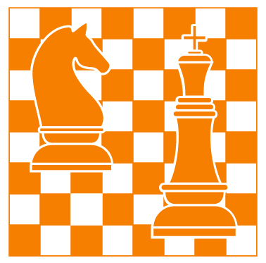
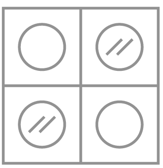
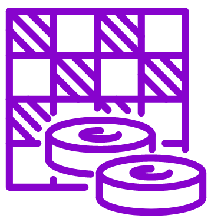

# Assignment HTTP+Design

The first part of this assignment gives you hands-on experience with **HTTP**. In the second part you will make a head start with the design of your **board game web application** (which you will further develop the next two assignments).

## 0. Preliminaries

Remember that this is a group assignment! Work efficiently as a team! If you have not programmed as a team before, read up on our introduction to [Visual Studio Code](https://chauff.github.io/Web-Teaching/vsc/). Use this assignment to set up a collaborative coding environment within your team. The next assignment will require extensive JavaScript programming that both team members need to contribute to.

### Overview of deliverables and upload procedure

If you get lost within the assignment, use this overview of deliverables to get back on track!

| **Task** | **Deliverables**                               |
|:-----|:---------------------------------------------------|
| 1.1  | HTTP requests                                      |
| 1.2  | Answer Q1.2                                        |
| 1.3  | Answer Q1.3                                        |
| 1.4  | Answer Q1.4                                        |
| 2.1  | Answer Q2.1                                        |
| 2.2  | Answer Q2.2                                        |
| 3.1  | Answer Q3.1                                        |
| 3.2  | Answer Q3.2                                        |
| 4.1  | Chosen game type                                   |
| 4.2  | Three game screens (include the game URL) |
| 4.3  | Description of six (three pos., three neg.) game features                   |
| 5.1  | Splash screen design (wireframe)                   |
| 5.2  | Game screen design (wireframe)                     |
| 5.3  | →→→ upload 5.1/5.2 to 💡 Brightspace              |
| 6  | Two html files                                     |

All deliverable text/imagery (apart from 6. which are two html files) must be included in a single PDF file. The first page of this PDF must contain the names and student numbers of the two team members as well as the team id (the group you signed up for on Brightspace).

The PDF and code have to be uploaded by one of the team members to 💡 Brightspace under **CSE Web assessment** (find the category your group belongs too) before the assessment session with the teaching assistants and before the ultimate assessment deadline. This means that the outcomes of all web assignments are **all** uploaded to the same directory!

**To pass this assignment, you must have completed all tasks and be able to answer the questions of the TAs.** The [rubric](https://chauff.github.io/Web-Teaching/rubric/) contains example questions for each assignment. During the assessment you can make use of your notes.

## 1. HTTP request messages: GET/HEAD

<debug-info markdown="block">
👉 Let us start with a few hints:

- This assignment requires you to work on the shell. If you are not familiar with this type of command line interface, take a look at this [MIT class](https://missing.csail.mit.edu/); it covers the *missing semester of computer science education* and introduces a range of practical tools, including in lesson 1 [the shell](https://missing.csail.mit.edu/2020/course-shell/).
- To store `telnet`'s or `openssl`'s output to file (in addition to printing it on the console), you can use the command `tee`, e.g. `telnet www.tudelft.nl 80|tee out` will save all output to a file called `out`.
- To exit a telnet session, first press <kbd>CTRL</kbd>+<kbd>]</kbd>. This brings you to a `telnet>` prompt and you can type `close` to end the session.
- Be aware that `some-domain.com` is not the same as `www.some-domain.com`.
- A [carriage return](https://developer.mozilla.org/en-US/docs/Glossary/CRLF) in the code snippets below indicates when an empty line is expected. Press `<Enter>` to add it.
- Be aware of the **backspace key** when working in the terminal: while on a normal command line a backspace deletes the last character typed, within the `telnet`/`openssl` environment this key may be forwarded to the server instead. Be aware!
- If you are a Windows user, use the Windows Subsystem for Linux. 
</debug-info>
  
With these hints out of the way, here is **your task**: Use `telnet` and `openssl` (where appropriate) to request the `/r/TUDelft` resource from Reddit. Start your *conversation* with the web server by typing the following into the terminal :point_down:, and then perform HTTP requests to ultimately fetch the `/r/TUDelft` resource:

```
telnet redit.com 80
```

### 1.1)

Write down the HTTP requests you made, the returned responses (e.g. a page has temporarily/permanently moved or is faulty) until you receive the desired contents with status code `200 OK`. Always use `HEAD` first to retrieve meta-­data about the resource.

### 1.2)

Does the content you received correspond to what you see when accessing the resource with your browser?

### 1.3)

Open your browser's developer tools and head to `https://www.reddit.com/r/TUDelft/`. Take a look at the response header of the first resource retrieved with status code `200 OK`: what does its `Cache-Control` header field mean?

### 1.4)

If we stick to the resource considered in 1.3), what do we learn about the type of encodings your browser supports?

## 2. HTTP request messages: PUT

While `GET` and `HEAD` are request methods accepted by virtually all web servers, `PUT`, `POST` and `DELETE` are less often available, due to the implications these methods have on the server.

To test your skills in uploading data, we will make use of [http://httpbin.org/](http://httpbin.org/), a popular site designed to test HTTP messages. As this is an `http`-based site (instead of `https`), we will continue our use of `telnet`.

Below is an example of how to upload data to the server with `PUT` (before you type it out, please read the explanations below) :point_down::

```
telnet httpbin.org 80

PUT /put HTTP/1.1
host:httpbin.org
Content-type:text/plain
Content-length:12
<carriage return>
Hello World!
<carriage return>
```

<sup>[Carriage return](https://developer.mozilla.org/en-US/docs/Glossary/CRLF) in the code snippets indicates when an empty line is expected. Press `<Enter>` to add it.</sup>

With this code :point_up:, we have modified the resource accessible at `/put` to now hold the string `Hello World!`. **The httpbin server sends back in the response the data just uploaded**&mdash;the response is of content-­type JSON. We are interested in the `data` field, which should contain `Hello World!` if everything worked correctly. Try it for yourself!

`PUT` though is not only able to modify an existing resource, it can also **create** a resource on the server. The status code in the response tells us whether a resource was modified (`200 OK`) or created (`201 Create`). More information can be found on [MDN](https://developer.mozilla.org/en-US/docs/Web/HTTP/Methods/PUT). 

### 2.1) 

What happens if you try to replace `/put` in this exercise with another resource (e.g. `/myfile`)? Does the httpbin.org server allow the creation of a new resource?

### 2.2)

The `Content-­length` is exactly the number of characters (12 - we count the whitespace as well!) of `Hello World!`. What happens if the `Content-length` field is smaller or larger than the exact number of characters in the content?


## 3. Basic authentication

Let us now try to request a page that is set up with HTTP basic authentication.

### 3.1)

First, open [http://httpbin.org/basic-auth/user/passwd](http://httpbin.org/basic-auth/user/passwd) in your browser. You should see a dialogue, requesting username and password. Use `user` as username and `passwd` as password (*it is just a coincidence that the actual username and password is the same as the URL path*). Reload the web page&mdash;do you have to fill in the login details again? Why or why not?

### 3.2)

Now let's see how this works with actual HTTP messages. Go back to telnet and start off with a `HEAD` method to inspect the web page; document all following steps (requests and responses) :point_down::

```
telnet httpbin.org 80

HEAD /basic-auth/user/passwd HTTP/1.1
host:httpbin.org
<carriage return>
```

Which status code do you receive now? 

Next, use the `Authorization: Basic [base-64 encoded username/password string]` header field (you can type it out right after the `host:httpbin.org` line above) to provide username and password to the server. To encode the username and password, you can use any of the freely available base-­64 en/decoders online.
Remember that username and password need to be combined as `username:password` **before** they are encoded in base-64.

Now close the TCP connection and start a new one, using again :point_down::

````
telnet httpbin.org 80
````

Request the same page without the `Authorization` header field&mdash;what happens? Is the behavior the same as reloading the page in the browser? Explain why / why not.

## 4. Web programming project: board game app







In this, and the upcoming two assignments, you will complete a web programming project: you will implement a classic **board game with a design that is related to Delft**.

You can choose from six games:

1. [Connect Four](https://en.wikipedia.org/wiki/Connect_Four): 2 players.
2. [Ludo](https://en.wikipedia.org/wiki/Ludo_(board_game)): 2-4 players. **It is sufficient if you implement a working game for two players.**
3. [Draughts](https://en.wikipedia.org/wiki/Draughts): 2 players
4. Chess - there are many variants available besides the default, [pick one](https://en.wikipedia.org/wiki/List_of_chess_variants): 2-4 players depending on the variant
5. [Mastermind](https://en.wikipedia.org/wiki/Mastermind_(board_game)): 2 players
6. [Memory](https://en.wikipedia.org/wiki/Concentration_(card_game)): 2 players

At the end of the three web assignments, your board game application should have the following functionalities :point_down::

- The game is for 2+ players and in 2D.
- The game works in 2+ modern browsers (e.g. Firefox and Chrome).
- It works well on a laptop/desktop device. We are considering screen resolutions of ~1366x768 or higher. In this project, we are **not** concerned about apps for mobile devices or apps with a responsive design.
- Upon entering your web application's URL, a **splash screen** is shown that allows a user to see some statistics of the game (how many games are currently ongoing, how many users have started a game, etc.). **Pick three statistics you want to report**. Add a brief description of how-to-play and a *Play* button.
- Upon pressing *Play*, the user enters the **game screen** and waits for a sufficient number of other gamers to start playing. It is clear for the player that s/he is waiting for more players to enter the game.
- Once there are sufficiently many players, the game automatically starts and the players play against each other. 
- The server supports multiple games to take place at the same time.
- Once a player makes a move, the validity of the move is checked and invalid moves are rejected. Once a player wins the game, this information is announced to all players participating in the game.
- Once a player drops out of a game, the game is aborted; this is announced to all players currently active in the game.
- Players see **two basic pieces of information** about the ongoing game, e.g. the time passed since starting the game and the number of lost/won pieces.
- Players play the game with the mouse&mdash;this means that you can focus mostly on the `click` event.
- The splash and game screens need to have a common design. **The theme of your design should be DELFT.** This is of course very abstract: you can think of using a naming scheme for your game/players that has to do with the city of Delft, a [color scheme that relates to Delft](https://color.adobe.com/search?q=delft) or to [TU Delft](https://www.tudelft.nl/en/tu-delft-corporate-design/colours), a background image of Delft (abstract or otherwise&mdash;a walk around campus may bring about the perfect picture), board game elements in the form of a (stylized) flame of Prometheus, etc. *To be clear: we do not expect you to do all of these things (though if you do, great!), it is enough if your design contains at least one of these ideas or some other idea related to Delft*.

The list above should tell you that you have considerable (artistic) freedom.

In this course you learn how to program in *plain* JavaScript. In principle, we **do not allow external libraries or frameworks** beyond those specified in the assignments and introduced in the lectures. There is one exception to this rule: we **do allow** the use of a JavaScript library of your choice to determine whether a player makes a valid move as for a game like chess this is considerably more difficult task than for others!

We also allow small simplifications to the chosen games, e.g. for Ludo an implementation for 2 players is sufficient, for chess you can ignore the [pawn promotion rule](https://en.wikipedia.org/wiki/Promotion_(chess)). Be upfront about the simplifications made.

### 4.1)

**First of all, settle on the game you will implement in your team.**

### 4.2)

Find **three** examples of your chosen board game (in 2D) that can be played online in a modern browser (laptop or desktop, not a mobile device). Consider the web application's design (focus on the game screen) based on the **web design principles** covered in class: to what extent do they fulfill them? Record the game URLs. 

### 4.3)

Which *game features* in the game examples of 4.2) stand out positively and which stand out negatively (e.g. particular animations, sounds, information conveyed about the game to the players ...)? Why? Discuss **three** positive and **three** negative features.

## 5. Design your own board game app

Having looked at at least three existing implementations of your chosen board game (Exercise 4.2), you are now in a position to design your own game interface. 

Similar to the [splash](https://github.com/chauff/balloons-game/blob/master/wireframes/splash.png) and [game](https://github.com/chauff/balloons-game/blob/master/wireframes/game.png) screen wireframes of the demo game, start designing your own application. Create one **splash screen** and one **game screen**. Your web application should be designed for the standard Desktop interface. Use the software of your choice to create those wireframes. You can use pen-and-paper to create mockups, you can make use of a presentation program (like Powerpoint or Google Slides) or head to online platforms specifically for wireframe design, such as [wireframe.cc](https://wireframe.cc/) or [excalidraw](https://excalidraw.com/).

### 5.1)

Create a design for the splash screen (also known as *entry page*): think of a name for your application, a short description & a logo. Feel free to use media (images, sound) with a Creative Commons license. The [noun project](https://thenounproject.com/) can be a useful resource for game pieces.

If you are looking for a color scheme for your design, take a look at [Google's Material palette generator](https://material.io/design/color/the-color-system.html#tools-for-picking-colors), [colorhunt](https://colorhunt.co/), [maketintsandshades](https://maketintsandshades.com/) or [Adobe's Color theme explorer](https://color.adobe.com/explore). **Remember this year's design theme: Delft.**

### 5.2)

Create a design for the game screen, keeping the requirements listed above in mind as well as your findings in Exercise 4.3).
You have a lot of artistic freedom in designing the board and game information.

### 5.3)

Once you have completed the design of your app, head over to Brightspace and post your design as new thread in the [Game design topic](https://brightspace.tudelft.nl/d2l/le/399713/discussions/topics/60230/View). Include images of the splash and game screens and add a paragraph describing your choices; how is the theme of Delft reflected in your design? Feel free to comment on the designs of your fellow study colleagues.

## 6. Your own board game app: HTML

Similar to the demo game, take your design as a starting point and create the respective **two HTML documents**. These documents should **only** contain HTML, no CSS or JavaScript. To get an idea of the expected amount of content (it is not a lot!), take a look at our demo game's [`game.html`](https://github.com/chauff/balloons-game/blob/master/public/game.html) and [`splash.html`](https://github.com/chauff/balloons-game/blob/master/public/splash.html). Ignore the few lines of code loading JavaScript and CSS files, these will be covered in the two later assignments. You can of course later always make changes to these HTML files.
