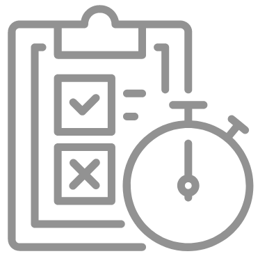

# Sample exams

**Exam topics are all topics covered in the lectures and the required readings.** The content of the recommended activities/readings that goes beyond what is covered in the lectures/course book is not exam material.

The web technology exam usually contains about 40 multiple-choice questions; the resit is shorter with about 30 questions (due to the time constraints of the resit week).

- [2018/19](../exams/midterm-cse1500-201819-solutions.pdf) ([no solutions](../exams/midterm-cse1500-201819.pdf))
- [2018/19 resit](../exams/midterm-resit-cse1500-201819-solutions.pdf) ([no solutions](../exams/midterm-resit-cse1500-201819.pdf))
- [2019/20](../exams/final-cse1500-201920-solutions.pdf)
- [2021/22](../exams/final-cse1500-202122-solutions.pdf)
- [2021/22 resit](../exams/midterm-resit-cse1500-202122.pdf)
