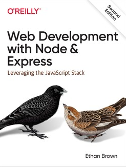

Web technology course information <!-- omit in toc -->
==

CSE1500 is the **Web and Database Technology course**, that first-year students of the Bachelor Computer Science and Engineering take at [TU Delft](https://www.tudelft.nl/). 

The responsible instructor of the web technology part is Associate Prof. [Claudia Hauff](https://chauff.github.io/). Inquiries about the course content, exams and so on should be emailed to `cse1500-ewi["at"]tudelft.nl`; this email reaches all responsible course instructors.

This website contains all materials of the course's web technology part. With a modern browser, you can use highlighting and note-taking in the browser. All data is stored in your browser's [localStorage](https://developer.mozilla.org/en-US/docs/Web/API/Window/localStorage): this means that no data (highlights/notes) leaves your machine. Be aware though that all this data is deleted when you clear your browser's storage.

We cover the following languages: HTTP, HTML, CSS as well as JavaScript on the client and server-side. Our *web application stack* is rather minimalistic: it consists of [Node.js](https://nodejs.org/en/), [express](http://expressjs.com/), [axios](https://github.com/axios/axios) and [ws](https://github.com/websockets/ws). 

In the five weeks of the web technology lectures we can only cover the web programming fundamentals and thus chose a small application stack. If you want to get a comprehensive overview of the set of languages, technologies and frameworks a frontend or backend web engineer should be familiar with, take a look at the [web developer roadmap - 2020](https://github.com/kamranahmedse/developer-roadmap).

## Table of contents <!-- omit in toc -->
- [Book](#book)
- [Tooling](#tooling)
  - [Recommended](#recommended)
  - [Required](#required)
- [Web technology topics](#web-technology-topics)
- [Web technology assignments](#web-technology-assignments)
- [Web development resources](#web-development-resources)
- [Lecture material types](#lecture-material-types)
- [University courses with a web focus elsewhere](#university-courses-with-a-web-focus-elsewhere)
- [Courses elsewhere](#courses-elsewhere)

## Book

The book we recommend is [Web Development with Node and Express, 2nd Edition](https://www.oreilly.com/library/view/web-development-with/9781492053507/). 

It is not required though&mdash;we do not come close to covering the majority of the book's content. To give you an idea, the book contains 22 content chapters and we include nine of them in our recommended readings list.

The book shows where and how Node.js/Express (two key frameworks we introduce in this course) can be employed in **production settings**. It goes well beyond what you need to know for this class and includes chapters on code maintenance, quality assurance and how to deploy an application in production. The book already assumes familiarity with basic web programming.

**There is no recommended book to introduce HTML, CSS and JavaScript.** Instead, we point you to a number of introductory resources that cover the basics of each of these technologies. The lecture materials go beyond those basics.

## Tooling

### Recommended

[Visual Studio Code](https://code.visualstudio.com/) (VSC) is our recommended development environment for the assignments. It is a free and open-source Integrated Development Environment (IDE). It is also [the most popular IDE](https://insights.stackoverflow.com/survey/2021#section-most-popular-technologies-integrated-development-environment) for developers today. 

VSC offers **many extensions**. You can find a guide on how to browse and install them [here](https://code.visualstudio.com/docs/editor/extension-gallery). A list with all kinds of "delightful" extensions can be found [here](https://github.com/viatsko/awesome-vscode); we recommend at least the following: 

- [ESLint](https://marketplace.visualstudio.com/items?itemName=dbaeumer.vscode-eslint), a popular *linting utility* for JavaScript (a linter is a tool that analyzes source code to flag potentially poor code such as unused variables) - use it to improve your code.
- [Bracket Pair Colorizer](https://marketplace.visualstudio.com/items?itemName=CoenraadS.bracket-pair-colorizer) does what the name suggests.
- [Material Icon Theme](https://marketplace.visualstudio.com/items?itemName=PKief.material-icon-theme) to make finding the file you are after in your app directory a bit easier.
- If you like to add TODOs to your code, try [Todo Tree](https://marketplace.visualstudio.com/items?itemName=Gruntfuggly.todo-tree), it makes sure you do not overlook any of your TODOs!
- Finally, install a good [theme](https://code.visualstudio.com/docs/getstarted/themes) for your IDE to make coding more enjoyable. [Dracula](https://marketplace.visualstudio.com/items?itemName=dracula-theme.theme-dracula) is a popular one. [Cobalt2](https://marketplace.visualstudio.com/items?itemName=wesbos.theme-cobalt2) is also nice. If you want to pick based on visuals, head to [https://vscodethemes.com/](https://vscodethemes.com/).

If you are new to team programming, and want to use VSC's features efficiently, [read our VSC guide](_practicals/vsc-usage.md).

**Browser developer tools** are integrated in all modern browsers; familiarize yourself with the developer tools of your favorite browser. In our transcripts, we showcase [Firefox's](https://developer.mozilla.org/en-US/docs/Tools) and from time to [Chrome's](https://developers.google.com/web/tools/chrome-devtools) developer tools.

### Required 

The latest stable version of [Node.js](https://nodejs.org/en/). 

Two modern web browsers such as Chrome, Firefox, Edge, etc. to test your project code across browser implementations.

Telnet (for your first web technology assignment).

OpenSSL (for your first web technology assignment).

## Web technology topics

The web technology topics we cover  are the following:

- HTTP
- HTML and web design
- JavaScript
- Node.js
- CSS
- Node.js (advanced)
- Cookies and sessions
- Web security

The order may strike you as odd, especially if you are already familiar with the basics of web programming, as often CSS is introduced before JavaScript. We introduce JavaScript as early as possible, to give you the chance to practice it a longer period of time before the exam moment.

## Web technology assignments

There are three web technology assignments, each one covering the contents of two to three lectures:

- [The first web technology assignment covers HTTP and web design](_practicals/assignment-http-design.md).
- [The second web technology assignment asks you to write client-side and server-side JavaScript code](_practicals/assignment-js-node.md).
- [The last web technology assignment focuses on server-side JavaScript and CSS](_practicals/assignment-css-node.md).

The three assignments build on each other&mdash;over the course of them you are tasked with implementing a **multi-player board game**. FYI, in previous years, roughly 90% of teams passed the first web assignment, 60% passed the first two and 30% of teams passed all three web assignments.

**In order to help you get started, we have created a [demo game application](https://github.com/chauff/cse1500-balloons-game).** If you get stuck, take a look at the demo application, it may help you.
## Web development resources

The practical assignments may require looking up web development specifics. Two good resources for web engineering are [Mozilla's MDN portal](https://developer.mozilla.org/en-US/) and [Google's Web Fundamentals](https://developers.google.com/web/fundamentals/).

If you want to hear the latest and greatest about the web stack, Twitter is a good source of information.
Here is a list of useful Twitter accounts to follow:

- [Franziska Hinkelmann](https://twitter.com/fhinkel) works on Node.js at Google.
- [Lea Verou](https://twitter.com/LeaVerou) tweets about all things CSS and the wider web UI world.
- [Lin Clark](https://twitter.com/linclark) makes (among others) technical challenges accessible to the wider public.
- [V8](https://twitter.com/v8js) is Google's JavaScript engine.
- [JavaScript Daily](https://twitter.com/JavaScriptDaily) does exactly what the name suggests.
- [Node.js](https://twitter.com/nodejs).
- [Axel Rauschmeyer](https://twitter.com/rauschma) is the author of a number of popular JavaScript books.
- [Addy Osmani](https://twitter.com/addyosmani) works on Google Chrome and is well-known for his JavaScript design patterns book.
- [Wes Bos](https://twitter.com/wesbos) is the author of popular web stack tutorials.
- [Mozilla Hacks](https://twitter.com/mozhacks) is Mozilla's account for web developers.
- [Visual Studio Code](https://twitter.com/code).
- [Chrome DevTools](https://twitter.com/ChromeDevTools) offers tips and tricks of the dev tool trade for Chrome.
- [Firefox DevTools](https://twitter.com/FirefoxDevTools) offers the same as Chrome DevTools but this time for Firefox.
- [Syntax](https://twitter.com/syntaxfm) offers [podcasts](https://syntax.fm/) for web developers, hosted by Wes Bos and Scott Tolinski.

## Lecture material types

For each lecture we provide the following:

- **Required readings**: to be read **before** the respective lecture. These are typically introductions to the different languages we cover. The lecture materials go beyond the contents of the required readings.
- **Recommended activities**: activities that we think may help you get a better grasp of the different web technologies. Activities are either programming exercises or podcasts.
- **Recommended readings**: these may be tweets, blog posts or book chapters that may help you understand some of the introduced concepts better.
- **Relevant scientific publications**: to showcase how web technologies are researched, we offer examples of scientific publications that contribute to our understanding and use of web technologies.

## University courses with a web focus elsewhere

Naturally, what we present here is only one way of introducing the fundamentals of the web to undergraduate students. A number of other universities also offer publicly accessible teaching materials:

- [Deep Dive Into Modern Web Development /U Helsinki](https://fullstackopen.com/en)
- [Design and Implementation of Software for the Web /GMU](https://cs.gmu.edu/~tlatoza/teaching/swe432f17/home.html)
- [Web Applications /Stanford](http://web.stanford.edu/class/cs142/)
- [Web Security /Stanford](https://web.stanford.edu/class/cs253/)
- [Creating Modern Web Applications /Brown](https://cs.brown.edu/courses/csci1320/index.html)
- [Web Security /NUS](http://www.comp.nus.edu.sg/~prateeks/teaching/sp15/cs5331-sp15.html)
- [Programming Languages for Web Applications /Virginia](http://www.cs.virginia.edu/~up3f/cs4640/schedule.html)
- [Web Development /MIT](http://webdevelopment.mit.edu/)
- [Cutting-edge Web Technologies /Berkeley (2015)](https://inst.eecs.berkeley.edu/~cs294-101/sp15/)
- [Web Programming /U Washington](https://courses.cs.washington.edu/courses/cse154/20su/)
- [Web and Mobile Systems /U Virginia](http://cs4720.cs.virginia.edu/f14/)
- [JavaScript /UPenn](http://www.seas.upenn.edu/~cis197/)

## Courses elsewhere

- [Microsoft's Web Development for Beginners Curriculum](https://microsoft.github.io/Web-Dev-For-Beginners/#/)
