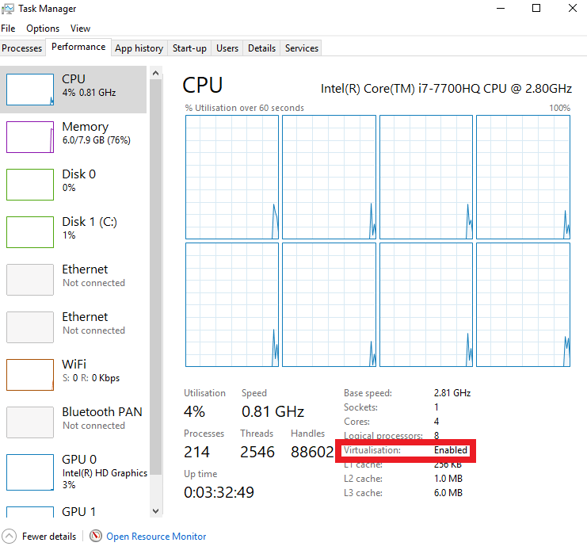

# Virtual machine installation for new pc's
This page shows you how to download and install the virtual machine on your pc. This is meant for windows users who want to use the virtual machine to work on web and database in linux.

## Step 1: enabling virtualisation
virtualisation is a feature of processors that enables the splitting of resources within your pc. With virtualisation we can simulate an operating system inside an operating system. This way we can even the playing ground and give everyone an operating system which will support most features that we ask you to use.

Most laptops don't have virtualisation enabled by default. So check whether or not virtualisation is enabled by pressing `Ctrl + shift + esc`. Go to the tab `performance` and look at the virtualisation label under CPU.

If virtualisation is disabled you will have to enable it. Go to settings > update & security > Recovery > Advanced start-up. From there restart your pc, go to Troubleshoot > Advanced options > UEFI Firmware Settings. For images explaining every step go here : https://www.laptopmag.com/articles/access-bios-windows-10.

## Step 2: Downloading virtualBox
You can download virtualBox for windows here: [Virtualbox download here](https://download.virtualbox.org/virtualbox/5.2.22/VirtualBox-5.2.22-126460-Win.exe)

## Step 3: Downloading the virtual machine file
The virtual machine file is downloadable with a torrent client. Do you not have one we recommend you download [uTorrent download here](https://www.utorrent.com/downloads/complete/track/stable/os/win). This link will download it for you. Try to dodge the ads!

After installing input this in your webbrowsers address bar: `magnet:?xt=urn:btih:83a92d258af74cb6b22d3e64ce26c38f6ca57416&dn=TUD-CSE-2018-2019.ova&tr=udp%3A%2F%2Ftracker.open-internet.nl%3A6969%2Fannounce` to download the magnet link!

## Step 4: Running the virtual machine
Start `Oracle VM virtualbox` by entering the name in your search bar. Go to file > import appliance and select the downloaded `Virtual machine file`.
Congratulations! You have now installed the vm!

## Step 5: running the vm
Now that you've started the vm you'll probably want to login:
Select student and enter the password: `pwd`. Now open the terminal by going to Activities and start using telnet!
